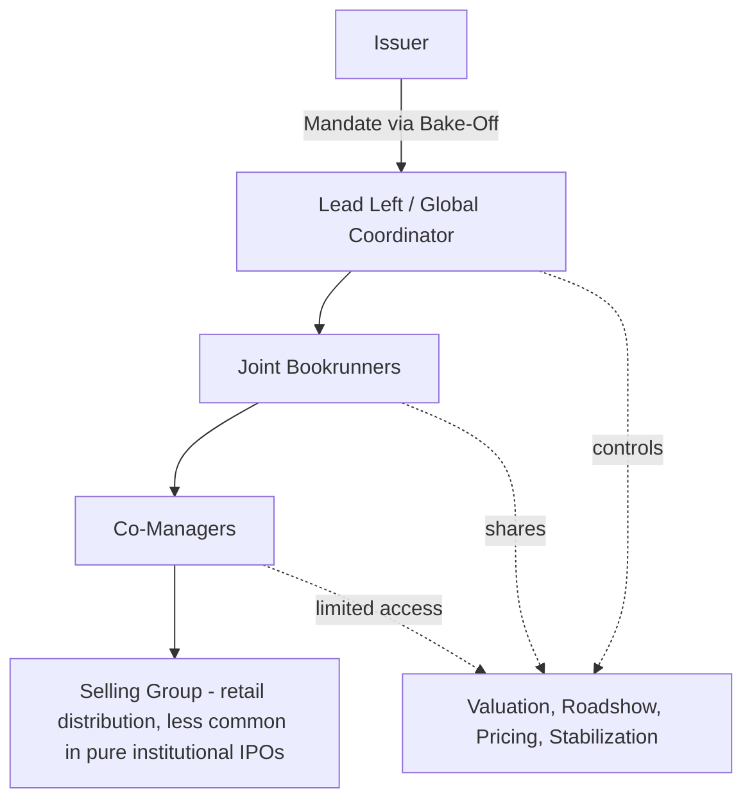

## Lead Left, Joint Bookrunners, and Co-Manager Roles

### Overview

Equity offering syndicates — most prominently in IPOs but equally applicable to follow-on offerings and convertible issuances — are organized around the same three-tier hierarchy found in debt syndication: Lead Left, Joint Bookrunners, and Co-Managers. While the tier names and general logic parallel the debt market structure, the equity context introduces distinct emphases: valuation authority (rather than spread-setting), stabilization agent responsibilities tied to the greenshoe mechanism, and heightened sensitivity to research analyst independence given the ongoing coverage relationship post-IPO.

### Syndicate Hierarchy

**Key Points**

- Roles are negotiated during the mandate/bake-off process and formalized in the underwriting agreement and Agreement Among Underwriters (AAU)
- Tier placement determines: (1) share of the underwriting discount, (2) authority over valuation and allocation decisions, (3) tombstone/league table positioning, and (4) post-IPO obligations (stabilization, research coverage)

### Lead Left (Lead Manager / Global Coordinator)

**Definition**

The Lead Left, so named for its leftmost position on the underwriter tombstone, is the bank holding primary structural, administrative, and execution authority over the offering. On larger or cross-border deals, this role may be formally titled "Global Coordinator," particularly when coordinating simultaneous offerings across multiple jurisdictions or exchanges.

**Core Responsibilities**

- Leads valuation analysis and negotiates the indicative price range with the issuer's board
- Directs drafting of the registration statement (S-1/F-1) and prospectus content
- Structures and sequences the roadshow (city selection, one-on-one scheduling, management time allocation)
- Owns and operates the primary order book, consolidating demand from all syndicate members
- Makes the final pricing recommendation to the issuer's board on pricing night
- Typically serves as the **stabilization agent**, executing greenshoe-related open market purchases or share repurchases from the issuer post-pricing
- Coordinates post-IPO research initiation timing across syndicate analysts (subject to information barrier rules)

**Economic Position**

$$\text{Lead Left Fee Share} = \text{Praecipuum (structuring premium)} + \text{Pro-Rata Underwriting Share}$$

As in debt syndication, the Lead Left typically retains a disproportionate share of the underwriting discount beyond its pro-rata underwriting commitment, compensating for the additional structuring, drafting oversight, and stabilization responsibilities it uniquely bears.

[Inference] The exact praecipuum allocation in equity deals is a negotiated, deal-specific term, and its magnitude relative to debt market praecipuum conventions has not been established here as following any fixed comparative ratio.

### Joint Bookrunners

**Definition**

Joint Bookrunners share top-tier standing with the Lead Left in running the institutional order book, though one bank (the Lead Left) typically retains administrative primacy for documentation and final pricing authority.

**Why Multiple Bookrunners Are Used in Equity Deals**

- **Distribution breadth across investor types**: different banks cultivate different institutional relationships (growth-oriented long-only funds, value investors, sector specialists, sovereign wealth funds)
- **Geographic reach**: particularly relevant for cross-border listings requiring simultaneous marketing in the US, Europe, and Asia
- **Research coverage diversity**: having multiple bookrunners typically ensures multiple independent analyst notes initiate coverage post-IPO, broadening the newly public company's visibility
- **Risk-sharing on a binding commitment**: in a firm-commitment underwriting, spreading the underwriting risk across multiple well-capitalized banks

**Operational Mechanics**

- Joint Bookrunners generally have consolidated visibility into the order book (via the syndicate desk's book-running system), though the degree of real-time access can vary by negotiated arrangement
- Participate in setting and revising the indicative price range based on roadshow feedback
- Share in underwriting fee allocation according to a pre-negotiated (often unequal) split reflecting relative distribution contribution and relationship seniority

**Active vs. Passive Bookrunner Designations**

[Unverified] As in debt markets, some equity deals designate certain banks as bookrunners primarily for relationship or league-table purposes with reduced substantive involvement in active book management ("passive bookrunners"), though the prevalence and specific criteria for such designations are deal-specific and not governed by a standardized industry definition.

### Co-Managers

**Definition**

Co-Managers occupy the tier below Joint Bookrunners, participating in distribution and typically holding a (usually smaller) underwriting commitment, but without book-running authority or pricing input.

**Core Characteristics**

- Receive allocated shares to distribute to their own investor networks
- Earn a selling concession and a reduced share of the management and underwriting fee
- Generally have limited visibility into the consolidated order book, seeing primarily their own client orders
- Positioned to the right of bookrunners on the tombstone

**Rationale for Inclusion**

- **Retail distribution capacity**: co-managers with strong retail brokerage networks extend the offering's reach beyond institutional investors
- **Research coverage expansion**: adding a co-manager can secure an additional post-IPO research analyst covering the stock, which some issuers value for long-term visibility even without significant book-running responsibility
- **Relationship and diversity considerations**: similar to debt syndication, banks providing ancillary services (lending relationships) or firms meeting supplier diversity criteria (e.g., minority- or women-owned business enterprises) are frequently included as co-managers
- **Emerging or specialist banks**: boutique or sector-specialist banks may be added as co-managers to signal credibility with a specific investor niche without diluting bookrunner economics

### Comparative Role Summary

| Role | Book Visibility | Pricing/Valuation Authority | Stabilization Duty | Fee Share | Typical Research Coverage Obligation |
| --- | --- | --- | --- | --- | --- |
| Lead Left / Global Coordinator | Full (owns it) | Primary/final recommendation | Yes (stabilization agent) | Highest (praecipuum + pro-rata) | Yes, typically initiates promptly post-quiet period |
| Joint Bookrunner | Full or near-full | Shared input | Sometimes shared, deal-dependent | High (pro-rata, often skewed) | Yes |
| Co-Manager | Limited/none | None | No | Low (selling concession + reduced mgmt fee) | Often yes, though sometimes delayed or reduced priority |

### Underwriting Agreement and Liability Allocation

**Key Points**

- The formal underwriting agreement, executed at pricing, binds each syndicate member to purchase its allocated share of shares from the issuer on a firm-commitment basis
- The Agreement Among Underwriters (AAU) governs inter-syndicate matters: fee splits, indemnification among syndicate members, stabilization authority delegation to the Lead Left, and default/step-up provisions if a syndicate member fails to fulfill its commitment
- Under US securities law, each underwriter in the syndicate — including co-managers — generally faces potential Securities Act Section 11 liability exposure for material misstatements or omissions in the registration statement, subject to a due diligence defense

[Inference] The practical scope of due diligence expected of a co-manager (with limited operational involvement) relative to the Lead Left (with deep structural involvement) is a nuanced area of securities litigation practice; while statutory liability exposure is not automatically reduced merely by holding a lesser syndicate role, the due diligence defense analysis may in practice differ based on each underwriter's actual level of involvement and access to information, and this is a matter appropriately addressed by securities counsel on a case-by-case basis rather than a fixed rule.

### Worked Example

**Example**

A $600 million IPO structured as follows:

- **Lead Left / Global Coordinator**: Bank A (runs the book, leads valuation, serves as stabilization agent, retains 20% praecipuum)
- **Joint Bookrunners**: Bank B, Bank C (share consolidated book visibility, contribute to price range setting)
- **Co-Managers**: Bank D, Bank E (allocated smaller distribution tranches, limited book visibility)

At a 7% gross spread ($42 million total underwriting discount):

- Praecipuum (20% off top) = $8.4 million → allocated to Bank A
- Remaining $33.6 million split: majority to Bookrunners A, B, C by negotiated ratio (e.g., 50/25/25), with Co-Managers D and E receiving a smaller pool reflecting their selling concession and limited underwriting commitment

$$\text{Co-Manager Fee} = (\text{Selling Concession Rate}) \times (\text{Shares Allocated to Co-Manager's Investor Base})$$

### Related Topics

- Bake-off/beauty parade process and mandate award criteria
- Greenshoe option mechanics and stabilization agent responsibilities
- Agreement Among Underwriters (AAU) structuring in equity offerings
- Research analyst independence and information barrier requirements (FINRA Rule 2241)
- Firm commitment versus best efforts underwriting structures
- Cornerstone and anchor investor allocation strategies
- Securities Act Section 11 liability and underwriter due diligence standards
- League table methodology and credit allocation among syndicate members