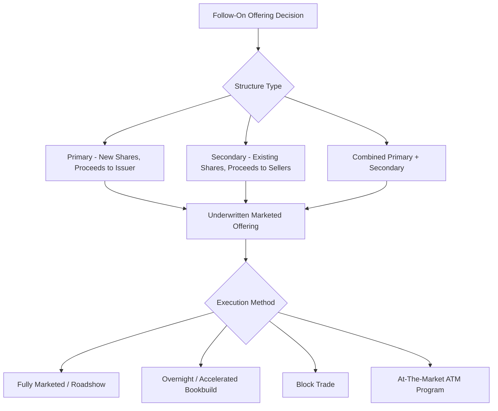
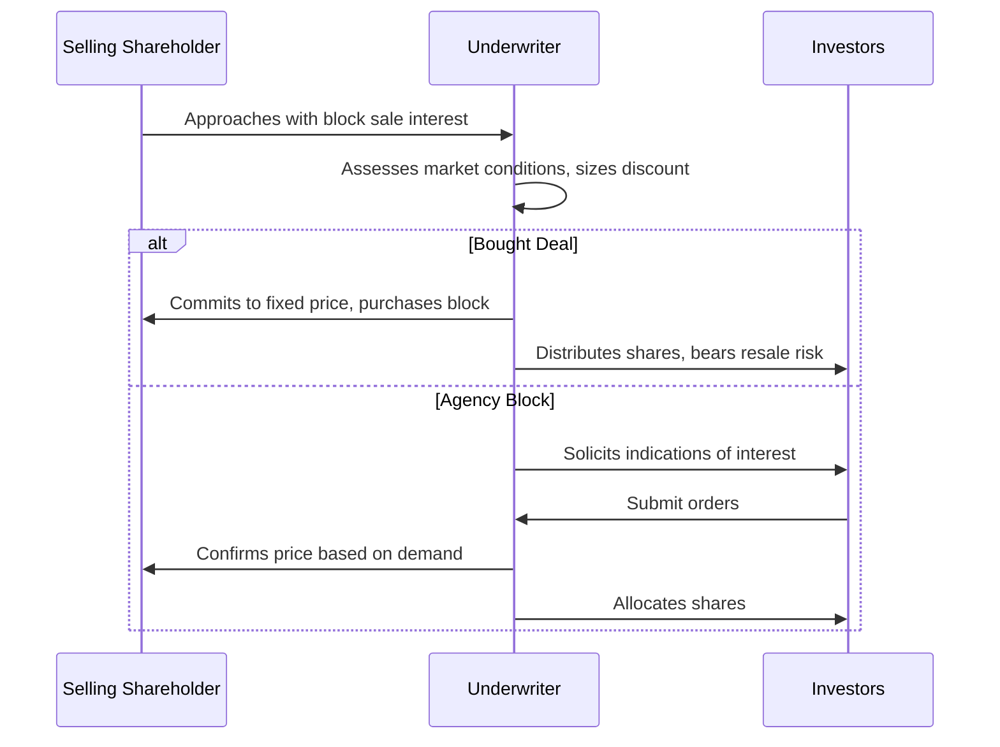

## Follow-On and Secondary Equity Offerings

### Overview

Follow-on offerings involve the issuance of additional equity by an already-public company, distinguishing them from IPOs by the existence of an established secondary market price, an active analyst coverage base, and typically a compressed execution timeline. This category spans several distinct structures — primary follow-ons, secondary (selling shareholder) offerings, at-the-market (ATM) programs, and block trades — each with different underwriting mechanics, risk profiles, and syndicate roles.

### Primary vs. Secondary Offerings

**Definition**

- **Primary offering**: the company issues new shares, receiving proceeds directly; dilutive to existing shareholders but raises fresh capital for the issuer
- **Secondary offering**: existing shareholders (founders, private equity/venture capital sponsors, or other large holders) sell their already-outstanding shares; the company receives no proceeds, and total shares outstanding are unchanged
- **Combined primary/secondary offering**: a single transaction structured with both a primary (company-issued) and secondary (selling shareholder) component, common in sponsor-backed IPO follow-ons

$$\text{Total Offering Proceeds} = \text{Primary Proceeds (to Issuer)} + \text{Secondary Proceeds (to Selling Shareholders)}$$

### Fully Marketed Follow-On Offerings

**Key Points**

- Resembles a compressed version of the IPO process, but benefits from an existing public market price, established research coverage, and often an existing shelf registration
- Typically involves a short (1-3 day) roadshow or series of investor calls, given that the market already has substantial information about the company

**Execution Timeline (Illustrative)**

| Stage | Activity | Typical Duration |
| --- | --- | --- |
| Announcement | Deal announced (often after market close) | Day 0 |
| Investor Marketing | Abbreviated roadshow/investor calls | 1-3 days |
| Bookbuilding | Institutional order book construction | Concurrent with marketing |
| Pricing | Final price set, typically at a discount to prevailing market price | End of marketing period |
| Settlement | Shares delivered, proceeds paid | T+2 (typical settlement cycle) |

[Inference] Actual timelines vary considerably based on issuer size, market conditions, and shelf registration status; a well-known seasoned issuer (WKSI) with an effective shelf can compress this further, while a more complex or less-followed issuer may require a longer marketing period.

### Accelerated Bookbuild Offerings (Overnight Deals)

**Definition**

An accelerated bookbuild (also called an "overnight deal") is a follow-on offering marketed and priced within a single evening or very short window (often after market close and before the next trading open), without an extended roadshow.

**Mechanics**

- Deal is announced after market close
- Underwriters immediately begin soliciting institutional orders via phone/electronic communication, typically referencing the last closing price as the pricing anchor
- Price is typically set at a discount to the prior closing price (the "overnight discount"), compensating investors for taking on the position without extensive diligence time

$$\text{Overnight Discount (\%)} = \frac{\text{Prior Close} - \text{Offer Price}}{\text{Prior Close}} \times 100$$

[Inference] Overnight discount magnitudes vary by market conditions, deal size relative to trading volume/float, and issuer volatility; no fixed percentage range can be stated as universally applicable across all overnight deals.

**Advantages**

- Minimizes market risk exposure window (reduced time for adverse market movements between announcement and pricing)
- Reduces execution/leak risk associated with an extended marketing period
- Preferred for issuers seeking to capitalize on favorable market windows opportunistically

**Trade-offs**

- Less investor education time, potentially resulting in a wider discount to secure sufficient demand
- Limited ability to build a broad, diversified new investor base compared to a fully marketed deal

### Block Trades

**Definition**

A block trade is the sale of a large, single block of already-outstanding shares (typically by a major shareholder) to one or more underwriters, who then either hold the position or immediately re-distribute it to investors, executed with minimal or no public marketing period.

**Structural Variants**

1. **Bought Deal (Principal Block Trade)**
   - The underwriter(s) purchase the entire block directly from the selling shareholder at a negotiated fixed price, assuming full market risk on resale
   - Selling shareholder receives certainty of price and proceeds immediately, transferring resale risk to the underwriter
2. **Agency Block Trade**
   - The underwriter acts as agent, seeking to place the block with investors before committing capital, reducing the bank's principal risk exposure
   - Pricing is typically determined through a rapid, informal bookbuilding process among a targeted set of institutional investors

**Pricing Considerations**

$$\text{Block Trade Discount} = f(\text{Block Size} / \text{Average Daily Trading Volume (ADTV)}, \text{Volatility}, \text{Market Conditions})$$

[Inference] Larger blocks relative to a stock's average daily trading volume generally command wider discounts to compensate the underwriter for greater resale/inventory risk, but the precise relationship is not governed by a fixed formula and depends on real-time market liquidity conditions, investor demand at the time, and the specific stock's volatility profile.

### At-The-Market (ATM) Offering Programs

**Definition**

An ATM program allows an issuer to sell newly issued shares incrementally, over time, directly into the existing trading market at prevailing market prices, through a designated sales agent, rather than through a single discrete underwritten transaction.

**Key Mechanics**

- Established via an ATM sales agreement with one or more banks acting as sales agents (not underwriters in the traditional firm-commitment sense)
- Shares are sold in small increments over an extended period, guided by issuer instructions on timing, size, and minimum price parameters
- Executed under an effective shelf registration statement, with periodic prospectus supplements as required
- Sales agent receives a commission (typically a percentage of gross proceeds) rather than a traditional underwriting spread

**Advantages**

- Minimizes market impact by spreading sales over time rather than a single large block
- Provides capital-raising flexibility, allowing the issuer to opportunistically sell into favorable price/volume conditions
- Generally lower cost structure than a traditional underwritten follow-on (lower commission vs. gross spread)
- No formal roadshow or extended marketing process required

**Typical Use Cases**

- REITs and other issuers with continuous, programmatic capital needs
- Issuers seeking to fund ongoing growth capital expenditure without a large, dilutive single offering
- Companies wanting to maintain capital-raising optionality without signaling a specific large capital need

### Registered Direct Offerings

**Definition**

A registered direct offering (RDO) involves the sale of newly registered shares directly to a select group of institutional investors, typically negotiated with limited or no public marketing, often used by smaller-cap issuers seeking a faster, more discreet capital raise than a fully marketed follow-on.

[Unverified] RDO structuring, investor eligibility, and disclosure requirements vary based on the specific shelf registration and market context; practitioners should verify the specific mechanics against current securities counsel guidance for the applicable issuer size and market (RDOs are more commonly associated with smaller-cap issuers, though usage patterns can shift with market conditions).

### Underwriting Structure in Follow-On Deals

**Key Points**

- Follow-on offerings generally use the same tiered syndicate structure (Lead Left/Bookrunners/Co-Managers) as IPOs, though often with a smaller syndicate given the reduced marketing/education burden
- **Firm commitment underwriting** remains standard for marketed follow-ons and block trades, with underwriters purchasing shares from the issuer/seller and reselling to investors
- Gross spreads on follow-on offerings are typically lower than IPO spreads, reflecting reduced marketing effort and lower execution risk given the existing public market and price discovery mechanism

$$\text{Follow-On Gross Spread} < \text{IPO Gross Spread (typical pattern)}$$

[Inference] While follow-on spreads are generally observed to be lower than IPO spreads due to reduced marketing burden and established secondary pricing, exact spread levels remain deal-specific and negotiated based on deal size, issuer credit/equity quality, and execution complexity.

### Dilution and Shareholder Impact Considerations

**Key Points**

- Primary follow-on offerings dilute existing shareholders' proportional ownership and, absent offsetting factors, EPS (unless proceeds are deployed accretively)
- Secondary offerings do not dilute ownership or share count but can create market perception effects (e.g., signaling concerns if large insider/sponsor selling is perceived as a negative signal about future prospects)

$$\text{Dilution (\%)} = \frac{\text{New Primary Shares Issued}}{\text{Pre-Offering Shares Outstanding} + \text{New Primary Shares Issued}} \times 100$$

[Speculation] Market reaction to a secondary (selling shareholder) offering announcement is sometimes discussed as more negative than to a primary offering of similar size, on the theory that it may signal insider views about valuation; however, actual market reaction is highly issuer- and context-specific and this should not be treated as a reliable predictive rule.

### Comparative Summary

| Structure | Marketing Period | Underwriter Risk | Typical Use Case |
| --- | --- | --- | --- |
| Fully Marketed Follow-On | 1-3 days | Firm commitment | Larger capital raises, new investor base building |
| Accelerated Bookbuild | Overnight | Firm commitment | Opportunistic, market-window-driven raises |
| Block Trade (Bought Deal) | None/minimal | Principal risk on underwriter | Large shareholder exits, sponsor sell-downs |
| Block Trade (Agency) | Minimal/informal | Reduced (agency basis) | Shareholder exits with price sensitivity |
| ATM Program | Ongoing/continuous | Agency (sales agent) | Programmatic, incremental capital needs |
| Registered Direct Offering | Minimal/targeted | Varies | Smaller-cap, discreet capital raises |

### Related Topics

- Shelf registration and Well-Known Seasoned Issuer (WKSI) mechanics for follow-ons
- Overnight discount pricing dynamics and market impact modeling
- Sponsor/private equity sell-down strategies post-IPO lock-up expiration
- ATM program sales agency agreement structuring
- Rule 415 shelf takedown mechanics for equity offerings
- Dilution analysis and EPS accretion/dilution modeling
- Underwriter risk management in principal block trade positions
- Secondary offering market signaling and event study literature