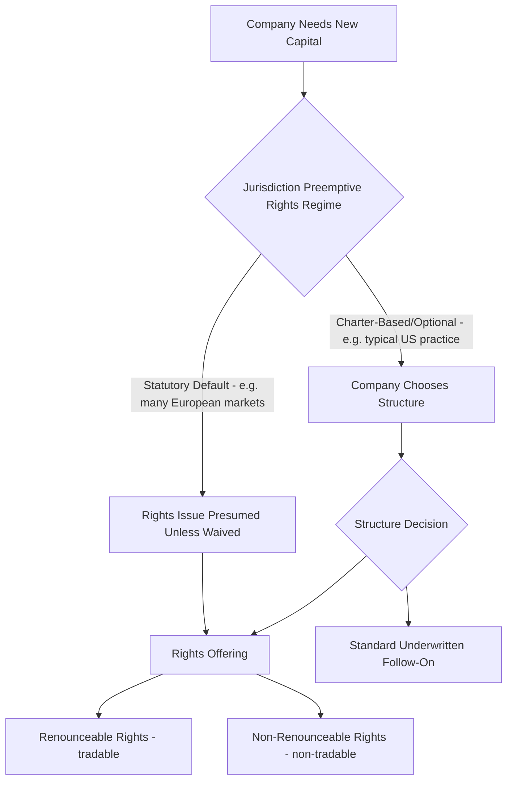
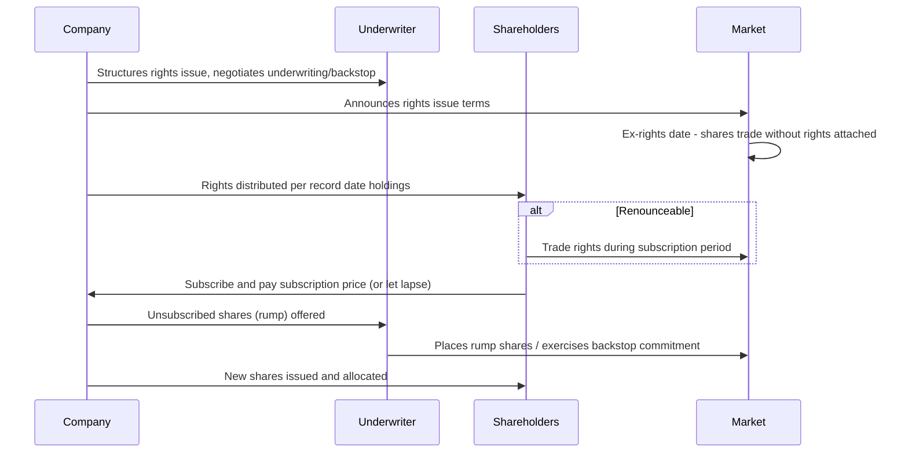

## Rights Issues and Preemptive Offerings

### Overview

Rights issues and preemptive offerings provide existing shareholders the opportunity to purchase newly issued shares in proportion to their current holdings, before the shares are offered to new investors. This structure protects shareholders from involuntary economic and voting dilution and is either a statutory/regulatory default right (common in many non-US jurisdictions) or a contractually granted right (via charter provisions or specific agreements) depending on the governing legal regime. Rights offerings involve distinct mechanics, syndicate roles, and investor decision points compared to standard underwritten follow-on offerings.

### Preemptive Rights: Legal Foundation

**Definition**

A preemptive right is the entitlement of an existing shareholder to subscribe for a pro-rata share of any new issuance of shares (or securities convertible into shares) before the company offers them to outside investors, preserving the shareholder's proportional ownership and voting power.

**Jurisdictional Variation**

[Inference] The default legal treatment of preemptive rights varies substantially by jurisdiction: many European and other non-US markets impose statutory preemptive rights as a default protection (often waivable only by supermajority shareholder vote for specified purposes), while US corporate law (particularly under Delaware General Corporation Law) generally does not impose preemptive rights by default, leaving the matter to be governed by a company's specific charter provisions. This is a significant driver of why rights issues are considerably more common in European, UK, and various Asian and Latin American equity markets than in the US.

### Rights Issue Structure and Mechanics

**Key Terms**

- **Subscription ratio**: the number of new shares a shareholder may purchase per existing share held (e.g., "1-for-4 rights issue" entitles holders to buy 1 new share for every 4 held)
- **Subscription price**: the price at which new shares may be purchased, typically set at a significant discount to the current market price to incentivize participation and provide a margin of safety against price volatility during the offering period
- **Record date**: the date determining which shareholders are entitled to receive rights
- **Ex-rights date**: the date on which shares begin trading without the attached right to participate in the offering

**Theoretical Ex-Rights Price (TERP)**

$$\text{TERP} = \frac{(N \times P_0) + (M \times P_S)}{N + M}$$

where $N$ is the number of existing shares, $P_0$ is the cum-rights market price, $M$ is the number of new shares issued, and $P_S$ is the subscription price.

**Example**

A company with 100 million shares trading at $20.00 conducts a 1-for-5 rights issue (20 million new shares) at a subscription price of $16.00:

$$\text{TERP} = \frac{(100\text{m} \times \$20.00) + (20\text{m} \times \$16.00)}{100\text{m} + 20\text{m}} = \frac{\$2{,}000\text{m} + \$320\text{m}}{120\text{m}} = \$19.33$$

The theoretical value of each right is the difference between the cum-rights price and TERP, adjusted for the subscription ratio:

$$\text{Value per Right} = \frac{P_0 - \text{TERP}}{\text{Subscription Ratio}} = \frac{\$20.00 - \$19.33}{5} = \$0.134$$

### Renounceable vs. Non-Renounceable Rights

**Definition**

- **Renounceable rights**: the right itself is a tradable security (often listed and traded on the exchange for a specified subscription period), allowing shareholders who do not wish to subscribe to sell their rights to other investors, capturing the rights' theoretical value rather than losing it entirely
- **Non-renounceable rights**: rights cannot be sold or transferred; a shareholder who does not exercise the right simply forgoes the associated value (subject to any "rump" placement mechanics described below)

[Inference] The choice between renounceable and non-renounceable structures is influenced by market convention, regulatory requirements in the relevant jurisdiction, and the issuer's preference for administrative simplicity (non-renounceable) versus shareholder value protection (renounceable); different markets have differing typical practices for which structure predominates.

### Rights Issue Timeline

**Illustrative Process Flow**

**Subscription Period**

[Unverified] The typical duration of the subscription period (during which shareholders may exercise or trade their rights) varies by jurisdiction and specific regulatory framework; practitioners should verify applicable minimum/maximum subscription windows under the specific exchange and securities regulator rules governing the transaction.

### Underwriting and Backstop Arrangements

**Definition**

Because rights issues carry the risk that shareholders will not fully subscribe (leaving the company short of its target proceeds), rights issues are typically underwritten or backstopped by one or more investment banks, or in some cases by a major existing shareholder.

**Backstop Mechanics**

- The underwriter(s) commit to purchase any shares not subscribed for by existing shareholders (the "rump"), ensuring the company receives its full target proceeds regardless of shareholder take-up
- Underwriters typically charge a **underwriting commission** (a percentage of the underwritten amount) for this risk-bearing commitment, separate from any placement/distribution fee for actually selling the rump shares
- **Sub-underwriting**: the lead underwriter may lay off (syndicate) portions of its backstop risk to sub-underwriters, spreading the exposure across multiple institutions

$$\text{Underwriting Fee} = \text{Underwritten Amount} \times \text{Commission Rate}$$

[Inference] Underwriting commission rates for rights issues are negotiated based on perceived shortfall risk (influenced by market volatility, subscription price discount magnitude, and shareholder base composition) and are not governed by a fixed universal rate.

### Rump Placement

**Definition**

Following the close of the subscription period, any shares not taken up by eligible shareholders (the "rump") are typically placed by the underwriter(s) with institutional investors via an accelerated bookbuild, often conducted immediately after the subscription period closes.

**Mechanics**

- Rump shares are typically offered at or above the subscription price, with any premium received over the subscription price often shared with (or entirely passed through to) the shareholders who did not subscribe, depending on the specific structure and jurisdiction's rules
- [Unverified] The specific allocation of rump placement premium between non-subscribing shareholders and the company/underwriters varies by jurisdiction and deal structure and should be confirmed against the specific offering terms and applicable regulatory framework

### Dilution Mechanics in Rights Issues

**Key Points**

- Rights issues are structured to allow existing shareholders to avoid economic dilution by exercising their full entitlement (since they can maintain proportional ownership at the discounted subscription price)
- Shareholders who do not exercise their rights (and who hold non-renounceable rights, or fail to sell renounceable rights) experience genuine economic dilution, as their proportional ownership decreases while the value transferred to new/participating shareholders is not compensated

$$\text{Dilution for Non-Participating Shareholder} = 1 - \frac{N}{N+M}$$

using the same notation as the TERP calculation above.

### Deeply Discounted and Accelerated Rights Structures

**Deeply Discounted Rights Issues**

[Inference] In periods of financial distress or urgent capital need, issuers sometimes structure rights issues at unusually large discounts to the prevailing market price to strongly incentivize full subscription and minimize shortfall/backstop risk; the specific discount magnitude considered "deep" is relative to prevailing market norms for a given market and time period rather than a fixed threshold.

**Accelerated Rights Offerings / Compressed Timetables**

Some markets and issuers utilize compressed rights issue structures (sometimes combined with an accelerated bookbuild for any rump) to reduce the market risk exposure window inherent in a longer traditional rights subscription period, trading off shareholder decision time against execution/market risk.

### Comparative Summary: Rights Issue vs. Standard Follow-On

| Dimension | Rights Issue | Standard Underwritten Follow-On |
| --- | --- | --- |
| Investor Eligibility | Existing shareholders (pro-rata) | New and existing investors, institutional-focused |
| Dilution Protection | Yes (if exercised) | No (existing holders diluted regardless) |
| Pricing | Fixed subscription price, set at discount | Market-clearing price via bookbuilding |
| Underwriting Role | Backstop/rump placement | Full distribution underwriting |
| Typical Jurisdictional Prevalence | More common in Europe/UK/certain Asian markets | More common in US markets |
| Shareholder Approval | Often required (especially if waiving preemptive rights) | Typically governed by existing shelf authorization |

### Related Topics

- Theoretical Ex-Rights Price (TERP) and rights valuation methodology
- Sub-underwriting syndication and backstop risk distribution
- Statutory preemptive rights regimes across major jurisdictions
- Rump placement mechanics and accelerated bookbuild integration
- Shareholder approval requirements and general meeting mechanics for capital increases
- Deeply discounted rights issues in financial distress/recapitalization contexts
- Open offers and compensatory arrangements for non-transferable rights structures
- Convertible bond rights issues and hybrid preemptive structures