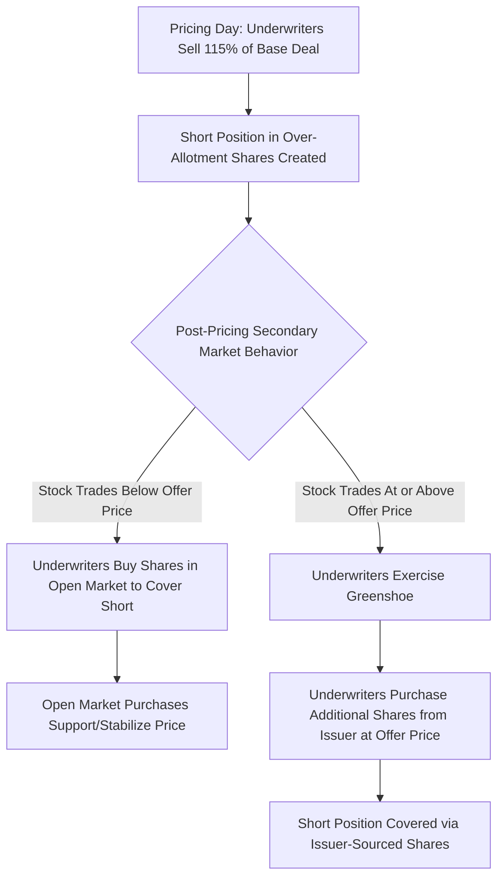

## Greenshoe Option and Over-Allotment Mechanics

### Overview

The greenshoe option, formally termed the over-allotment option, is a contractual provision in an underwriting agreement that grants the underwriting syndicate the right to sell additional shares beyond the base offering size and, correspondingly, to purchase those additional shares from the issuer at the original offer price. Named after the Green Shoe Manufacturing Company (the first issuer to use this mechanism), it serves as both a demand-absorption tool and, more importantly, a mechanism enabling underwriters to stabilize the aftermarket trading price of a newly issued security.

### Basic Structure

**Definition**

The over-allotment option permits underwriters to sell up to a specified percentage — conventionally up to 15% — of additional shares beyond the base deal size, exercisable within a defined post-pricing window, typically 30 days.

$$\text{Total Potential Offering Size} = \text{Base Offering} \times (1 + \text{Greenshoe \%})$$

**Example**

A base IPO of 20 million shares with a 15% greenshoe:

$$\text{Maximum Shares Sellable} = 20\text{m} \times 1.15 = 23\text{m shares}$$

$$\text{Over-Allotment Shares} = 23\text{m} - 20\text{m} = 3\text{m shares}$$

[Inference] The 15% figure is a long-standing US market convention (also widely adopted internationally) rather than a fixed statutory maximum in all jurisdictions; specific transactions may negotiate different percentages, and the applicable regulatory ceiling, if any, should be confirmed for the specific exchange/jurisdiction and offering type.

### The Short Position Mechanism

**Key Points**

- At pricing, underwriters typically allocate and sell more shares than the base deal size (up to 115% in the standard structure), creating a **naked short position** in the additional shares (the "over-allotment shares") which they do not yet own
- This short position is the mechanism that enables subsequent stabilization activity

### Stabilization Function

**Definition**

Stabilization refers to underwriter activity, typically conducted by the syndicate's designated **stabilization agent** (usually the Lead Left/Global Coordinator), intended to prevent or moderate a decline in the market price of a newly issued security during the initial trading period.

**How the Short Position Enables Stabilization**

If the stock trades below the offer price shortly after listing, the stabilization agent can execute open-market purchases to cover the short position created by the over-allotment. These purchases:

1. Absorb selling pressure in the market
2. Support (or "stabilize") the trading price
3. Simultaneously close out the underwriters' short position at a price below the original offer price, generating a modest profit for the syndicate on those covered shares

$$\text{Stabilization Profit (per share)} = \text{Offer Price} - \text{Open Market Buy-Back Price}$$

**If the Stock Trades Above the Offer Price**

The stabilization agent instead exercises the greenshoe option, purchasing the additional shares directly from the issuer at the original offer price to cover the short position, avoiding the need to buy shares in the open market at a higher prevailing price.

$$\text{Underwriter Outcome} = \begin{cases} \text{Exercise Greenshoe (buy from issuer at offer price)} & \text{if Market Price} \geq \text{Offer Price} \\ \text{Buy Back in Open Market (stabilizing purchases)} & \text{if Market Price} < \text{Offer Price} \end{cases}$$

### Partial Exercise and Hybrid Outcomes

**Key Points**

- The greenshoe option need not be exercised in full or not at all; underwriters may exercise it partially, covering part of the short position via issuer-sourced shares and part via open-market stabilizing purchases, depending on how the stock trades during the exercise window
- This flexibility allows the stabilization agent to respond dynamically to actual trading conditions rather than committing to a single outcome at pricing

**Example**

A 3 million share over-allotment where the stock initially trades below the offer price (prompting some stabilizing purchases) before recovering above the offer price:

| Scenario Segment | Shares Covered | Method |
| --- | --- | --- |
| Early trading dip below offer price | 1.2 million | Open market stabilizing purchases |
| Subsequent recovery above offer price | 1.8 million | Greenshoe exercised (purchased from issuer) |
| **Total** | **3.0 million** | **Mixed** |

### Regulatory Framework: Regulation M (US)

**Key Points**

- In the United States, stabilization activities are governed by **SEC Regulation M**, specifically Rule 104, which permits underwriters to engage in specified stabilizing bids and syndicate covering transactions subject to conditions
- Regulation M requires disclosure that stabilization may occur (typically noted in the prospectus) and imposes restrictions on the manner, timing, and pricing of stabilizing bids to prevent manipulative price support beyond legitimate market-stabilization purposes

[Unverified] The detailed procedural requirements of Regulation M — including permissible stabilizing bid pricing relative to the offer price, timing restrictions, and required regulatory notices (e.g., Form filing requirements with FINRA/SEC) — are technical and specific; practitioners should consult current Regulation M text and FINRA guidance for the precise mechanics applicable to a given offering rather than relying on generalized summaries.

**International Equivalents**

[Unverified] Other major jurisdictions maintain broadly analogous but distinct stabilization safe-harbor frameworks (for example, provisions under EU/UK Market Abuse Regulation addressing stabilization safe harbors), with differing specific conditions, disclosure requirements, and permissible time windows; the applicable regime depends on the listing venue and should be verified against current rules for that jurisdiction.

### Naked Short vs. Traditional Greenshoe Structuring

**Definition**

- **Traditional/"true" greenshoe**: the underwriters' over-allotment short position is sized such that it can be fully covered either by the greenshoe option or open-market purchases — the option itself caps the underwriters' aggregate exposure
- **"Naked short" over-allotment**: in some structures, underwriters may initially sell short more shares than even the maximum greenshoe would cover, intending to close the excess purely through open-market purchases regardless of price direction

[Speculation] The use of naked short positions beyond the greenshoe-covered amount is a more aggressive stabilization posture that increases the underwriters' market risk exposure if the stock does not trade favorably; the prevalence and regulatory treatment of such structures can vary and any specific application should be assessed against current applicable rules and the specific underwriting agreement terms.

### Underwriter Economics of the Greenshoe

**Key Points**

- If the greenshoe is exercised (fully or partially), the issuer receives additional primary proceeds (in a primary/IPO context) equal to the exercised shares times the offer price, less the corresponding underwriting discount
- If the underwriters instead cover their short via open-market stabilizing purchases at a price below the offer price, the underwriting syndicate itself captures the price differential as additional compensation, effectively supplementing the underwriting discount

$$\text{Issuer Additional Proceeds (if Greenshoe Exercised)} = \text{Shares Exercised} \times \text{Offer Price} \times (1 - \text{Underwriting Discount \%})$$

[Inference] This structure creates an alignment (though not a perfect one) between underwriter incentives and successful aftermarket price performance: because the syndicate profits from covering the short at a lower price via stabilization, and because sustained aftermarket weakness reflects poorly on the underwriters' pricing judgment and future mandate prospects, underwriters generally have some incentive to support an orderly aftermarket, though this should not be characterized as guaranteeing any specific price outcome for investors.

### Secondary Offering Context

**Key Points**

- Greenshoe/over-allotment mechanics apply not only to IPOs but also to follow-on and secondary offerings, though the source of the additional shares differs: in a secondary offering, the over-allotment shares may be sourced from the selling shareholder(s) rather than newly issued by the company
- The stabilization rationale (supporting an orderly aftermarket) remains conceptually consistent across IPO and follow-on contexts

### Disclosure Requirements

**Key Points**

- The existence and maximum size of the over-allotment option must be disclosed in the offering document (prospectus/offering memorandum), typically on the cover page and in the "Plan of Distribution"/"Underwriting" section
- Disclosure typically notes that the underwriters may engage in stabilizing transactions, syndicate covering transactions, and penalty bids in accordance with applicable regulations, without guaranteeing that any such transactions will occur or specifying their exact timing or magnitude in advance

### Related Topics

- Regulation M stabilization rules and permissible stabilizing bid mechanics
- Penalty bids and syndicate short covering transaction disclosure
- IPO underwriting syndicate structure and stabilization agent designation
- Lock-up agreement interaction with post-IPO price support dynamics
- Aftermarket trading performance analysis for newly issued securities
- Secondary/follow-on offering greenshoe sourcing (company vs. selling shareholder)
- Market Abuse Regulation stabilization safe harbors (EU/UK comparative framework)
- Underwriting agreement drafting for over-allotment option terms