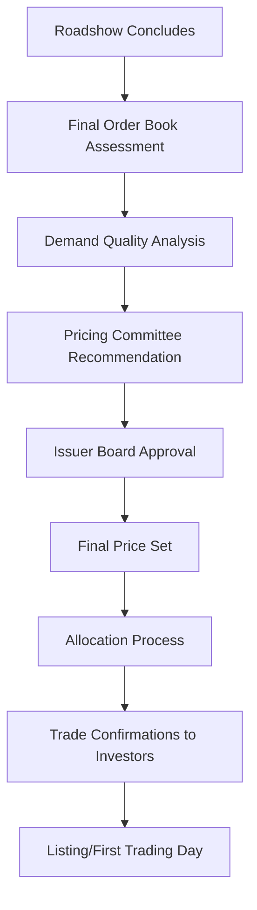

## Equity Pricing and Allocation Dynamics

### Overview

Equity pricing and allocation represent the culmination of the syndication process — the point at which accumulated investor demand, valuation analysis, and issuer objectives converge into a final offer price and a distribution of shares across the order book. Unlike debt pricing, which anchors to an observable benchmark and existing curve, equity pricing (particularly in an IPO) must establish value largely from comparable analysis and demand signals, making the interplay between pricing decisions and allocation strategy especially consequential for aftermarket outcomes and the issuer's ongoing relationship with the public market.

### The Pricing Decision Framework

**Key Points**

- Final pricing is a negotiated outcome between the issuer's board/management and the underwriting syndicate, typically finalized at a "pricing meeting" or "pricing call" on the evening the roadshow concludes
- Pricing balances several often-competing objectives: maximizing issuer proceeds, ensuring sufficient demand to fully place the deal, and calibrating for a stable-to-positive aftermarket trading trajectory

### Demand Curve Construction

**Definition**

Underwriters aggregate individual investor orders, each specifying a price sensitivity (the price or price range at which the order is valid), into a composite demand curve showing cumulative demand at each potential price point across the indicative range.

$$D(P) = \sum_{i} q_i \cdot \mathbb{1}[P_i^{\text{limit}} \geq P]$$

where $D(P)$ is cumulative demand at price $P$, $q_i$ is the quantity of order $i$, and $P_i^{\text{limit}}$ is that order's price limit (the maximum price at which the investor is willing to participate).

**Example Demand Curve**

| Price | Cumulative Demand (shares) | Coverage of Deal Size (20m shares) |
| --- | --- | --- |
| $18.00 (top of range) | 15 million | 0.75x |
| $17.00 | 28 million | 1.4x |
| $16.00 (bottom of range) | 45 million | 2.25x |

In this illustrative example, pricing at the top of the range ($18.00) would leave the deal undersubscribed based on orders placed strictly at that price limit, while pricing lower captures materially more demand — illustrating the trade-off between price maximization and full subscription/order quality.

[Inference] Real-world demand curves are more complex than this simplified illustration, since many orders are "market" or "at final terms" orders without a strict limit, and demand at a given price is influenced by expectations about final allocation size, not just willingness to pay; the underwriters' interpretation of a demand curve therefore involves considerable judgment beyond a mechanical tally.

### Pricing Below Market-Clearing Levels

**Key Points**

- Underwriters and issuers frequently price below the level that would theoretically fully clear all demand at the top of the range, intentionally leaving the deal oversubscribed at the final price
- This practice reflects several considerations:
  - **Aftermarket support**: unsatisfied demand at pricing tends to translate into buying interest in the immediate secondary market, supporting a stable or rising initial trading price
  - **Investor relationship management**: consistently pricing "too aggressively" (at full market-clearing levels) can generate investor resentment if the stock subsequently trades down, damaging relationships for future transactions
  - **Information asymmetry mitigation**: some deliberate underpricing is theorized in academic literature as compensating investors for the risk and cost of participating in the price discovery process itself

$$\text{IPO Underpricing (\%)} = \frac{P_{\text{Close, Day 1}} - P_{\text{Offer}}}{P_{\text{Offer}}} \times 100$$

[Inference] The academic literature on IPO underpricing (e.g., theories involving asymmetric information, the "winner's curse," and signaling models) offers multiple, sometimes competing explanations for why IPOs are, on average, observed to price below their eventual first-day closing price; this remains an area of ongoing empirical and theoretical debate rather than a settled, singular causal explanation, and the degree of underpricing varies enormously across deals, sectors, and time periods.

### Allocation Philosophy and Objectives

**Key Points**

- Allocation decisions determine which investors receive shares and in what quantity, and are generally viewed as at least as consequential to long-term aftermarket performance as the pricing decision itself
- The issuer typically retains final allocation approval authority, though the lead bookrunner(s) drive the allocation recommendation based on the order book

**Common Allocation Objectives**

- **Building a stable, long-term shareholder base**: prioritizing long-only institutional investors with a demonstrated buy-and-hold orientation over shorter-horizon or momentum-driven accounts
- **Rewarding high-quality demand signals**: investors who placed early orders, attended management meetings, or provided constructive feedback during the roadshow may receive allocation priority
- **Managing "flipper" risk**: underwriters attempt to identify and limit allocations to investors perceived likely to sell shares immediately upon listing ("flipping"), since concentrated early selling can pressure the aftermarket price
- **Sector and geographic diversification**: spreading allocations across different investor types and regions to reduce concentration risk in the post-IPO shareholder register

### Allocation Methodologies

**Pro-Rata Scaling**

$$\text{Allocation}_i = \text{Order}_i \times \text{Scale-back Factor}$$

Applied uniformly or with adjustments reflecting investor quality tiers, as discussed in prior syndicate structure coverage.

**Bookbuilding (Discretionary) Method**

- The predominant method in most major equity markets: underwriters and issuers exercise discretion in allocation, informed by but not strictly bound to a mechanical pro-rata formula
- Allows qualitative judgment about investor quality, likely holding period, and strategic value to override a purely size-proportional allocation

**Fixed-Price/Public Tranche Methods**

- Certain markets and offering structures (particularly retail-oriented tranches in some jurisdictions) use more formulaic allocation methods, such as lottery-based or strictly pro-rata allocation for smaller retail orders, to ensure fairness among a large number of small investors
- [Unverified] The specific retail allocation methodologies and any regulatory requirements governing fairness in retail tranche allocation vary considerably by jurisdiction and exchange, and should be verified against the applicable market's specific rules for any given offering

### Anchor and Cornerstone Investor Pricing Influence

**Key Points**

- Pre-committed anchor or cornerstone investors (discussed in IPO syndicate structure) can materially influence the pricing process by establishing a demand floor and a credible reference price point before the broader roadshow begins
- Their participation is often publicly disclosed during marketing to signal credibility to the broader investor base, potentially influencing subsequent demand at the disclosed or higher price levels

[Speculation] The presence of prominent anchor investors is commonly believed by market participants to create a positive signaling effect that can support tighter pricing (i.e., pricing closer to or at the top of the range); however, quantifying the precise causal effect of anchor participation on final pricing outcomes for any specific deal is difficult, and this should be understood as a market practitioner heuristic rather than an empirically precise relationship.

### Price Range Revision During Marketing

**Key Points**

- Based on roadshow feedback, the indicative price range itself may be revised (upward or downward) before the book formally closes, similar in spirit to price guidance revisions in debt bookbuilding but generally less frequent and more consequential given the higher stakes of equity valuation
- An upward revision in the price range during marketing is often interpreted (though not guaranteed) as a signal of strong demand, while a downward revision can signal valuation concerns identified during investor meetings

$$\text{Revised Range} = \text{Initial Range} \pm \text{Adjustment (based on roadshow demand signal)}$$

### Post-Allocation Trade Confirmation and Settlement

**Key Points**

- Once allocations are finalized, underwriters send trade confirmations to allocated investors, specifying the number of shares and the offer price
- Settlement typically follows standard market conventions (e.g., T+2 in many major markets for equity trades), with shares delivered against payment through the relevant clearing system (e.g., DTC in the US)

### Comparative Note: Equity vs. Debt Pricing/Allocation Dynamics

| Dimension | Equity (IPO/Follow-On) | Debt (Bond) |
| --- | --- | --- |
| Price Reference | Comparable multiples, no pre-existing market price (IPO) | Existing secondary curve, spread to benchmark |
| Post-Pricing Support Mechanism | Greenshoe/stabilization | Aftermarket spread performance monitoring (no formal stabilization) |
| Allocation Philosophy | Long-term shareholder base quality, flipper risk management | Order quality, relationship value, price sensitivity |
| Underpricing Convention | Deliberate, aftermarket-support motivated | Less pronounced; NIC serves analogous but distinct function |
| Price Discovery Timeframe | Multi-day/week roadshow | Single day to a few days (bond context) |

### Related Topics

- IPO underpricing theories and empirical literature (winner's curse, signaling models)
- Anchor and cornerstone investor structuring and disclosure practices
- Flipper identification and allocation risk management techniques
- Comparable company valuation methodology for equity price range setting
- Retail tranche allocation regulatory frameworks across jurisdictions
- Aftermarket trading performance and first-day "pop" analysis
- Greenshoe option and stabilization mechanics (post-pricing price support)
- Book quality metrics and investor tiering frameworks in equity syndication