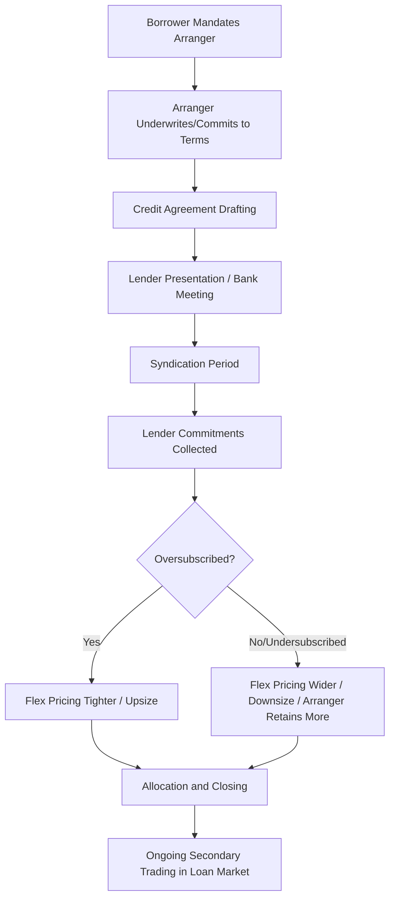
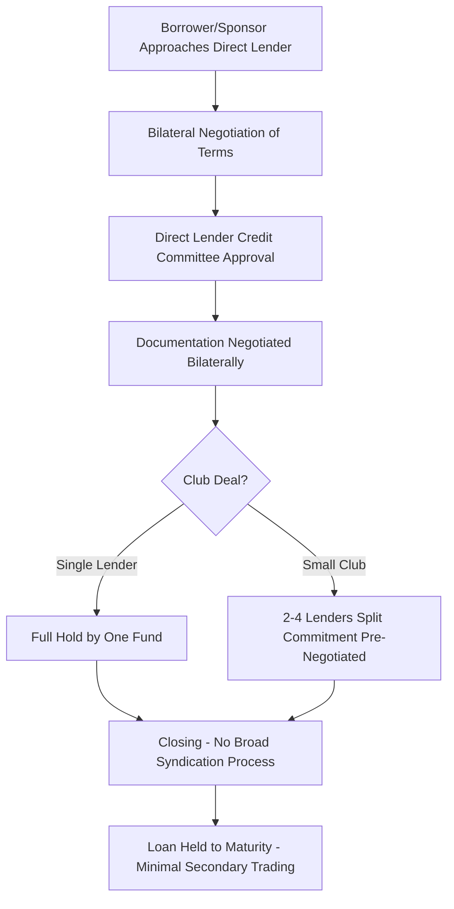

## Direct Lending versus Broadly Syndicated Loan Execution

### Overview

Corporate borrowers seeking leveraged debt financing generally choose between two distinct execution channels: the **broadly syndicated loan (BSL) market**, where a bank arranger distributes a loan across a wide syndicate of institutional investors (predominantly CLOs and loan mutual funds) via a public-style syndication process, and **direct lending**, where a private credit fund (or small club of funds) negotiates and holds the entire loan bilaterally, without broad syndication. These channels differ fundamentally in process, speed, certainty, pricing, and post-closing flexibility, and the choice between them has become a defining strategic decision in leveraged finance.

### Broadly Syndicated Loan (BSL) Execution

**Definition**

A broadly syndicated loan is originated and arranged by one or more investment/commercial banks (the "arranger(s)"), which then distribute the loan in tranches to a wide base of institutional investors — primarily Collateralized Loan Obligations (CLOs), which represent the dominant buyer base in this market, along with loan mutual funds, business development companies (BDCs), and other institutional accounts.

**Process Flow**

**Key Characteristics**

- **Wide distribution**: often dozens of lenders in the final syndicate, particularly for large-cap transactions
- **Underwritten commitment**: the arranging bank(s) typically commit to the full loan amount at signing, bearing "flex" risk (the risk that market conditions require adjusting pricing or terms during syndication) and market/distribution risk if syndication proves difficult
- **Ratings-driven**: BSL tranches, particularly Term Loan B facilities, are generally rated by credit rating agencies to facilitate CLO purchase (CLOs have specific ratings-based eligibility and concentration criteria)
- **Secondary market liquidity**: BSL tranches trade actively in an established secondary loan trading market, with standardized documentation (often referencing LSTA - Loan Syndications and Trading Association - or LMA - Loan Market Association - conventions) facilitating trading

**Market Flex Mechanics**

$$\text{Final Terms} = \text{Original Commitment Terms} + \text{Flex Adjustment (based on syndication demand)}$$

Market flex provisions in the commitment letter allow the arranger to adjust pricing (spread, OID), and in some cases structure (covenant terms, tranche sizing), within pre-agreed parameters based on actual investor demand encountered during syndication, without requiring the borrower's separate consent for changes within the flex range.

[Inference] The specific flex parameters (how much spread/OID adjustment is permitted, and whether structural flex is included) are heavily negotiated in the commitment letter and vary by deal, market conditions, and relative negotiating leverage between the borrower/sponsor and the arranging banks.

### Direct Lending Execution

**Definition**

Direct lending involves a private credit fund (or a small "club" of typically fewer than five funds) originating, underwriting, and holding a loan directly on a bilateral or small-group basis, without a broad public-style syndication process.

**Process Flow**

**Key Characteristics**

- **Certainty of execution**: because the direct lender commits its own capital (or that of a small, pre-coordinated club) without needing to syndicate to a broad, uncertain investor base, the borrower gains greater certainty that terms agreed at signing will hold through closing
- **Speed**: direct lending processes generally avoid the extended syndication/bank meeting timeline of BSL execution, often enabling faster closing
- **Confidentiality**: bilateral negotiation avoids the broader information distribution inherent in a syndicated bank meeting and lender presentation process
- **Buy-and-hold orientation**: direct lenders typically intend to hold the loan to maturity, resulting in minimal secondary trading activity compared to the actively traded BSL market
- **Flexible/bespoke structuring**: direct lenders can tailor structure (e.g., payment-in-kind (PIK) toggle features, delayed draw term loans, unitranche structures) more readily to the specific borrower's needs, given the absence of a need to appeal to a broad, ratings-sensitive investor base

### Unitranche Structuring

**Definition**

A unitranche facility combines what would traditionally be separate senior and subordinated/junior debt tranches into a single loan facility with a blended interest rate, commonly used in direct lending transactions to simplify capital structure and documentation relative to a traditional first lien/second lien split structure.

**Mechanics**

$$\text{Blended Unitranche Rate} = \left(\frac{\text{Senior Tranche Amount}}{\text{Total Amount}} \times \text{Senior Rate}\right) + \left(\frac{\text{Junior Tranche Amount}}{\text{Total Amount}} \times \text{Junior Rate}\right)$$

**Agreement Among Lenders (AAL)**

- In a unitranche structure involving multiple direct lenders with different risk/return expectations for different notional slices, an **Agreement Among Lenders (AAL)** is typically executed among the participating lenders, allocating payment priority (a "first out/last out" or "FOLO" structure) even though the borrower faces a single blended facility and a single set of loan documentation
- [Inference] The specific waterfall and voting mechanics within an AAL are privately negotiated among the participating lenders and are not disclosed to or directly negotiated with the borrower, making AAL terms an area of significant variability across different unitranche transactions

### Pricing Comparison

**Key Points**

- Direct lending has historically priced at a premium to comparable BSL execution, reflecting the illiquidity premium demanded by direct lenders (who generally hold to maturity rather than benefiting from secondary market liquidity) and the greater certainty/speed/flexibility value provided to the borrower

$$\text{Direct Lending Spread} = \text{Comparable BSL Spread} + \text{Illiquidity/Certainty Premium}$$

[Inference] While a pricing premium for direct lending relative to BSL execution has been a widely observed historical pattern, the magnitude of this premium fluctuates with relative capital availability in each market (BSL/CLO formation activity vs. direct lending fundraising), and in certain market conditions or for certain borrower profiles, the premium can compress significantly or reportedly invert; citing a specific fixed premium level would overstate the precision of what is fundamentally a dynamic, market-condition-dependent relationship.

### Covenant and Structural Differences

**Key Points**

| Feature | Broadly Syndicated Loan (Typical) | Direct Lending (Typical) |
| --- | --- | --- |
| Maintenance Financial Covenants | Rare (covenant-lite predominant in recent years) | More common, particularly a leverage-based maintenance covenant |
| Documentation Standardization | High (LSTA/LMA-influenced conventions) | Lower, more bespoke per-deal negotiation |
| Amendment/Waiver Flexibility | Requires coordinating a broad, dispersed lender group | Simpler given concentrated, often single-lender or small-club holder base |
| EBITDA Addback Flexibility | Often extensive, negotiated with syndication market appetite in mind | Negotiated bilaterally, potentially more borrower-specific scrutiny |
| Reporting Requirements | Standardized periodic reporting | Often more frequent/detailed given direct ongoing lender relationship |

[Inference] The general pattern of direct lending retaining maintenance covenants more consistently than the BSL market (which has seen substantial "covenant-lite" migration) reflects direct lenders' typically more concentrated, buy-and-hold risk position and closer ongoing monitoring relationship with the borrower; however, individual deal terms vary, and covenant practices in both markets continue to evolve with competitive dynamics.

### Execution Speed and Certainty Trade-offs

**Comparative Timeline (Illustrative)**

| Stage | Broadly Syndicated Loan | Direct Lending |
| --- | --- | --- |
| Initial Mandate to Commitment Letter | 1-3 weeks | 2-6 weeks (often longer diligence upfront) |
| Documentation to Bank Meeting/Signing | 2-4 weeks | Concurrent with negotiation, no separate "bank meeting" |
| Syndication Period | 2-4 weeks (subject to market conditions) | N/A (no broad syndication) |
| Total Time to Close | 4-8+ weeks, subject to market risk during syndication | Often faster once terms agreed, due to no syndication period |

[Inference] These illustrative timelines represent general patterns rather than fixed rules; specific deal timelines vary substantially based on transaction complexity, market conditions, and the specific parties involved, and either execution channel can, in specific circumstances, prove faster or slower than the other.

### Investor Base and Regulatory Distinctions

**Key Points**

- **BSL investor base**: dominated by CLOs (which face specific risk-retention, diversification, and ratings-based eligibility requirements under their own governing documents), supplemented by loan mutual funds and other institutional accounts
- **Direct lending investor base**: predominantly private credit funds, often structured as Business Development Companies (BDCs) in the US (subject to the Investment Company Act's BDC regulatory framework), private debt funds, insurance company general accounts, and increasingly, "private credit" vehicles offered to institutional and, in some evolving structures, accredited/qualified investors

[Unverified] The regulatory framework governing BDCs (including leverage limits and asset coverage requirements under the Investment Company Act of 1940, as amended) and its practical impact on direct lending fund structuring is a detailed, evolving area; current specific leverage and eligibility rules should be verified against current SEC/Investment Company Act provisions applicable to the relevant fund structure at the time of any analysis.

### Choosing Between Execution Channels

**Factors Favoring Broadly Syndicated Execution**

- Large deal size where CLO/institutional distribution capacity provides deeper aggregate demand
- Borrower/sponsor preference for potentially lower pricing if favorable syndication conditions prevail
- Willingness to accept market/flex risk in exchange for potentially better terms
- Desire for an actively traded, liquid loan facility post-closing

**Factors Favoring Direct Lending**

- Premium placed on speed and closing certainty (e.g., competitive M&A processes with tight timelines)
- Preference for confidentiality during the process
- Smaller or middle-market deal sizes where BSL distribution may be less efficient or available
- Desire for bespoke structuring flexibility (unitranche, delayed draw features, PIK toggles) not easily accommodated in standardized BSL documentation
- Borrower/sponsor relationship value with a direct lending platform for future add-on financing needs

### Related Topics

- Collateralized Loan Obligation (CLO) structuring and reinvestment criteria
- Unitranche structuring and Agreement Among Lenders (AAL) mechanics
- Business Development Company (BDC) regulatory framework and leverage limits
- Term Loan B market conventions and secondary loan trading (LSTA/LMA documentation)
- Market flex provisions and commitment letter risk allocation
- Covenant-lite loan structuring trends in the broadly syndicated market
- Middle market versus large-cap leveraged finance execution dynamics
- Private credit fund fundraising and dry powder deployment dynamics