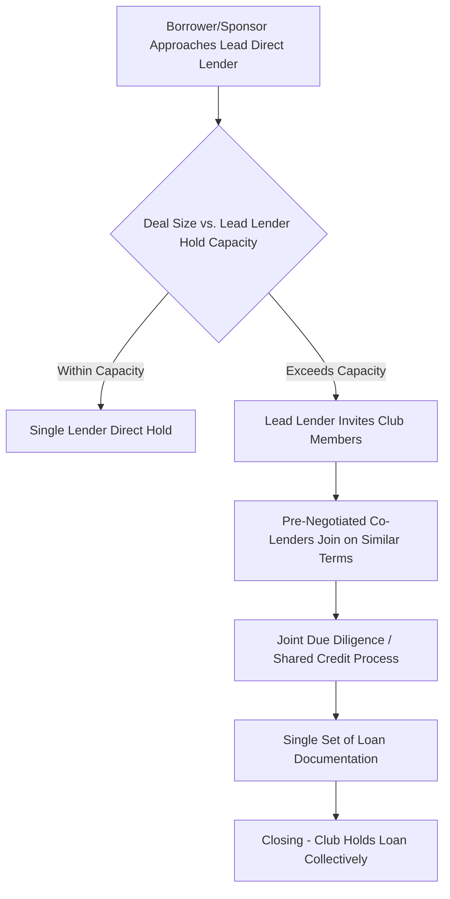
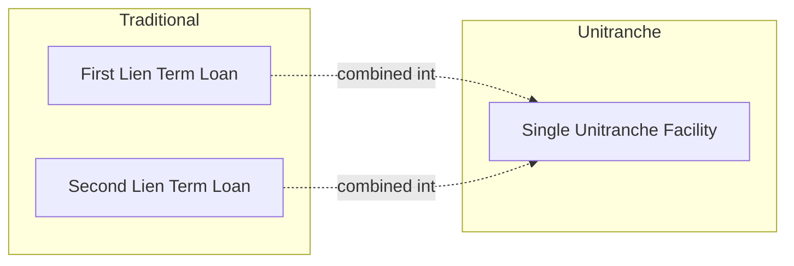
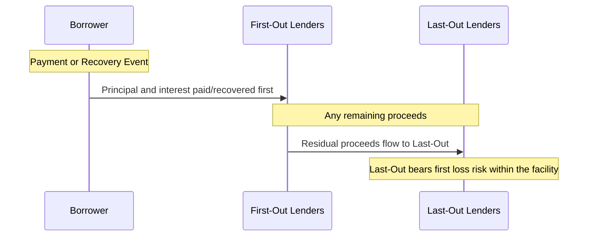

## Club Deals and Unitranche Financing Structures

### Overview

Club deals and unitranche financing represent two related but distinct structural approaches within private credit that address a common challenge: how to assemble sufficient lending capacity for a transaction while preserving the speed, confidentiality, and flexibility advantages of direct lending relative to broad syndication. A club deal describes the lender-side coordination mechanism (a small group of lenders sharing a commitment), while unitranche describes a capital structure innovation (collapsing multiple debt tranches into one blended facility). The two frequently, though not always, appear together in the same transaction.

### Club Deals: Definition and Mechanics

**Definition**

A club deal is a lending arrangement in which a small, pre-coordinated group of lenders — typically two to five direct lending funds — jointly commit to and fund a loan, sharing the transaction on substantially similar economic terms, as opposed to either a single-lender bilateral hold or a broad public-style syndication involving dozens of participants.

**Rationale for Club Formation**

- **Hold size limitations**: individual direct lending funds often have internal single-name concentration limits or "hold size" constraints, making it necessary to bring in co-lenders for larger transactions that exceed any single fund's capacity or risk appetite
- **Risk diversification**: spreading exposure to a single borrower across multiple funds reduces single-name concentration risk for each participant
- **Relationship-driven coordination**: club members are frequently funds with pre-existing co-investment relationships, allowing rapid coordination without the extended process of a broad syndication

**Structural Characteristics**

- Unlike a broadly syndicated loan, club deal participants are typically identified and engaged before or very early in the process, rather than through an open, competitive syndication/bank meeting process
- Documentation is generally negotiated once, with club members typically taking pro-rata shares of a single facility (in a "straight" club structure) or differentiated tranches (when combined with unitranche/first-out-last-out structuring, discussed below)
- Club members generally intend to hold their positions to maturity, consistent with the buy-and-hold orientation typical of direct lending broadly

### Unitranche Financing: Definition and Structure

**Definition**

A unitranche facility combines what would traditionally be structured as separate senior secured (first lien) and subordinated or second lien debt tranches into a single loan facility, governed by one credit agreement, with a single blended interest rate charged to the borrower.

**Traditional Structure vs. Unitranche**

**Blended Pricing Mechanics**

$$\text{Blended Unitranche Rate} = \left(\frac{\text{First-Out Amount}}{\text{Total Facility}} \times \text{First-Out Rate}\right) + \left(\frac{\text{Last-Out Amount}}{\text{Total Facility}} \times \text{Last-Out Rate}\right)$$

**Example**

A $200 million unitranche facility split into a $120 million "first-out" tranche priced at SOFR+400 and an $80 million "last-out" tranche priced at SOFR+750:

$$\text{Blended Rate} = \left(\frac{120}{200} \times 400\right) + \left(\frac{80}{200} \times 750\right) = 240 + 300 = \text{SOFR}+540$$

The borrower sees and pays this single blended rate under one credit agreement, simplifying the borrower's compliance and administrative burden relative to managing two separate facilities with different lender groups, covenant packages, and intercreditor arrangements.

### First-Out / Last-Out (FOLO) Tranching

**Definition**

Within a unitranche facility syndicated to multiple lenders (a club-based unitranche), participating lenders often split their exposure into "first-out" and "last-out" pieces, allocating payment priority among themselves without altering the borrower's single blended obligation.

**Payment Waterfall Priority**

- **First-out lenders**: receive priority in payment and in any recovery/liquidation waterfall, generally accepting a lower interest rate in exchange for this seniority within the unitranche structure
- **Last-out lenders**: are subordinated to first-out lenders in payment priority, bearing greater risk and correspondingly receiving a higher interest rate, effectively occupying an economic position similar to a second-lien or mezzanine lender despite being part of the same nominal facility

$$\text{Recovery}_{\text{First-Out}} = \min(\text{Total Recovery}, \text{First-Out Claim})$$

$$\text{Recovery}_{\text{Last-Out}} = \max(0, \text{Total Recovery} - \text{First-Out Claim})$$

### Agreement Among Lenders (AAL)

**Definition**

The Agreement Among Lenders (AAL) is a private contract executed solely among the participating lenders in a unitranche/FOLO structure, governing the relative rights, payment priorities, voting mechanics, and buy-out/turnover provisions between first-out and last-out tranches. Critically, the borrower is typically not a party to the AAL and, in many structures, is not even provided a copy.

**Key AAL Provisions**

- **Payment waterfall mechanics**: detailed rules governing how scheduled payments, prepayments, and default-scenario recoveries are allocated between first-out and last-out lenders
- **Voting and amendment rights**: allocation of consent rights for amendments, waivers, and enforcement decisions, often weighted differently than a simple pro-rata vote given the differing risk positions
- **Buy-out/turnover rights**: provisions allowing first-out lenders to be bought out by last-out lenders (or vice versa) under specified trigger events (e.g., a payment default), providing an exit mechanism for lenders in a distressed scenario
- **Standstill provisions**: restrictions on independent enforcement action by one tranche without coordination, analogous in spirit to intercreditor agreement standstill provisions in traditional first lien/second lien structures

[Inference] Because AAL terms are privately negotiated among lenders and not typically disclosed to or negotiated with the borrower, there is considerable variability in AAL structuring across different unitranche transactions, and market-standard terms (to the extent they exist) continue to evolve; specific AAL provisions for any given transaction should be evaluated on their own terms rather than assumed to follow a single universal template.

### Comparative Summary: Structural Variants

| Structure | Number of Lenders | Documentation | Borrower Sees | Lender-Side Complexity |
| --- | --- | --- | --- | --- |
| Single-Lender Direct Hold | 1 | Single credit agreement | Single lender, single rate | None (no AAL needed) |
| Club Deal (Pro-Rata) | 2-5 (typical) | Single credit agreement, pro-rata shares | Multiple lenders, single rate | Low (straightforward pro-rata sharing) |
| Unitranche (Single Lender) | 1 | Single credit agreement | Single lender, blended rate | Internal to lender (no AAL with third parties) |
| Unitranche Club (FOLO) | Multiple, tranched | Single credit agreement + separate AAL | Multiple lenders, single blended rate | High (AAL governs complex waterfall/voting) |

### Advantages of Club/Unitranche Structures for Borrowers

**Key Points**

- **Simplified documentation**: a single credit agreement, single set of covenants, and single lender relationship (from the borrower's perspective) compared to managing separate first lien and second lien facilities with different lender groups
- **Streamlined amendment process**: amendments and waivers are negotiated with a single documented facility, even though internally the AAL governs how the club/tranche lenders reach consensus, reducing the borrower's coordination burden
- **Certainty and speed**: consistent with broader direct lending advantages, club/unitranche execution avoids the extended syndication timeline of a broadly syndicated leveraged loan
- **Structural flexibility**: unitranche structures can be more readily tailored with features such as delayed draw term loans, payment-in-kind (PIK) interest components, and covenant packages suited to the specific borrower's growth or acquisition strategy

### Considerations and Risks

**For Borrowers**

- [Inference] Blended unitranche pricing may result in an all-in cost of capital that is comparable to or, in some market conditions, higher than a traditional first lien/second lien structure priced separately, depending on relative market conditions in the leveraged loan and direct lending markets at the time; the "simplification premium," if any, is not a fixed, quantifiable figure and varies by transaction and prevailing market dynamics

**For Lenders**

- Club deal participants must conduct their own independent credit assessment even when relying substantially on a lead lender's due diligence work, since each fund typically retains independent fiduciary/investment committee responsibilities
- Last-out tranche lenders in a FOLO structure bear meaningfully elevated risk relative to first-out lenders and must be compensated accordingly through the AAL's negotiated economic terms

### Related Topics

- Agreement Among Lenders (AAL) drafting and first-out/last-out waterfall negotiation
- Direct lending versus broadly syndicated loan execution trade-offs
- Business Development Company (BDC) hold size and concentration limit considerations
- Intercreditor agreements in traditional first lien/second lien structures (comparative framework)
- Delayed draw term loan and PIK toggle structuring in direct lending
- Middle market sponsor-backed leveraged buyout financing structures
- Private credit fund co-investment relationship formation and club lender networks
- Covenant negotiation dynamics in single-lender versus multi-lender direct credit facilities