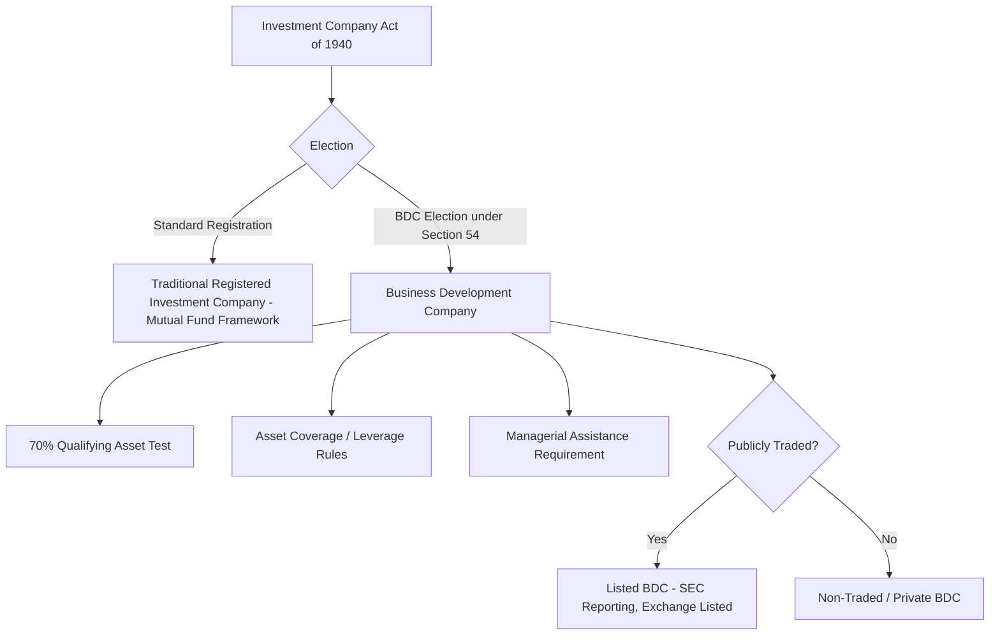
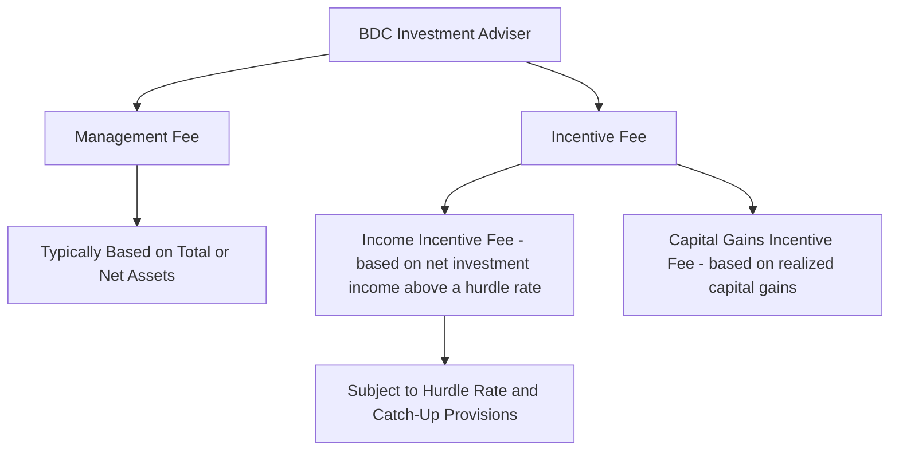

## Business Development Company Fund Structures

### Overview

The Business Development Company (BDC) is a specialized closed-end investment fund vehicle, created under a 1980 amendment to the US Investment Company Act of 1940, purpose-built to channel capital to private and smaller public companies. BDCs have become the dominant regulatory and organizational wrapper for direct lending capital in the United States, offering a combination of favorable tax treatment, permitted leverage, and (for publicly traded BDCs) access to public capital markets, subject to a distinct and detailed regulatory framework.

### Statutory Foundation

**Definition**

A BDC is a closed-end investment company that elects to be regulated as a BDC under Section 54 of the Investment Company Act of 1940, subjecting it to a specialized subset of the Act's provisions (Sections 55-65) rather than the full registered investment company framework applicable to mutual funds.

**Purpose and Eligibility Requirements**

[Inference] BDCs were created by Congress to encourage capital flows to small and developing US businesses and companies in financial distress that may have difficulty accessing public capital markets; the statute imposes specific eligibility and asset composition requirements to ensure BDCs remain focused on this segment, though the precise definitions and thresholds involved (e.g., what constitutes an "eligible portfolio company") are detailed statutory and regulatory provisions that should be verified against current SEC rules for any specific structuring analysis.

### The 70% Qualifying Asset Test

**Key Points**

- BDCs are generally required to invest at least 70% of their total assets in "qualifying assets," which principally consist of securities of "eligible portfolio companies" — generally private companies or certain smaller public companies that meet specified criteria
- The remaining up to 30% of assets may be invested more broadly, including in larger or more liquid securities, providing some flexibility for portfolio construction and liquidity management

$$\text{Qualifying Assets} \geq 0.70 \times \text{Total Assets}$$

[Unverified] The precise definition of "eligible portfolio company" and the specific categories of qualifying assets are detailed in the Investment Company Act and related SEC guidance/no-action letters, and have been subject to periodic regulatory interpretation and legislative amendment; current specific thresholds and definitions should be verified against the current statute and SEC rules rather than relied upon as a fixed, unchanging standard.

### Managerial Assistance Requirement

**Definition**

BDCs are required to offer, and make available upon request, "significant managerial assistance" to their eligible portfolio companies — a requirement distinguishing BDCs from purely passive investment vehicles and reflecting the statute's developmental finance orientation.

[Inference] In practice, for many private credit-focused BDCs, this requirement is satisfied through board observer rights, monitoring and advisory services, and access to portfolio company management, though the precise scope of activity needed to satisfy the "significant managerial assistance" standard is a matter of ongoing regulatory interpretation rather than a strictly quantified test.

### Leverage and Asset Coverage Rules

**Definition**

BDCs are subject to statutory leverage limits expressed as an "asset coverage ratio" requirement, historically requiring total assets to cover total senior securities (debt plus any preferred stock) at a specified minimum ratio.

$$\text{Asset Coverage Ratio} = \frac{\text{Total Assets}}{\text{Total Senior Securities (Debt + Preferred)}}$$

**Historical and Modernized Leverage Limits**

[Inference] The Investment Company Act historically imposed a 200% asset coverage requirement on BDCs (equivalent to a maximum debt-to-equity ratio of approximately 1:1), but the Small Business Credit Availability Act of 2018 introduced a mechanism allowing BDCs to reduce this requirement to 150% asset coverage (equivalent to a maximum debt-to-equity ratio of approximately 2:1), subject to specified approval processes (board approval with a waiting period, or shareholder/unitholder approval). Given the evolving nature of BDC leverage regulation and potential for further legislative or regulatory change, current specific leverage limits applicable to any given BDC should be verified against its specific governing documents and current applicable law.

$$\text{Maximum Debt-to-Equity (at 150\% Asset Coverage)} \approx 2:1$$

### Publicly Traded vs. Non-Traded/Private BDCs

**Comparative Structure**

| Feature | Publicly Traded BDC | Non-Traded/Private BDC |
| --- | --- | --- |
| Listing | Listed on a national securities exchange | Not exchange-listed |
| Liquidity | Continuous secondary market trading | Periodic tender offers or limited liquidity windows, typically |
| SEC Reporting | Full Exchange Act reporting (10-K, 10-Q, 8-K) | SEC-registered but with differing disclosure/liquidity profile |
| Investor Base | Retail and institutional, via exchange trading | Often institutional and high-net-worth via direct/private placement, or interval fund structures |
| NAV Trading Relationship | May trade at a premium or discount to NAV | Generally transacted at or near NAV given periodic valuation and tender mechanics |

[Unverified] The specific structuring, distribution channels, and regulatory nuances of non-traded/private BDCs (including "perpetual-life" non-traded BDC structures that have grown substantially in the private credit market) involve detailed SEC exemptive relief and structuring considerations that continue to evolve; current market practice should be verified against recent SEC guidance and offering documents for any specific vehicle under analysis.

### Tax Treatment: Regulated Investment Company (RIC) Election

**Definition**

Most BDCs elect to be treated as a Regulated Investment Company (RIC) under Subchapter M of the Internal Revenue Code, allowing the BDC to avoid entity-level federal income tax on income distributed to shareholders, provided specified distribution, income, and diversification requirements are satisfied.

**Key RIC Requirements**

[Inference] RIC qualification generally requires the BDC to distribute at least 90% of its investment company taxable income to shareholders annually, satisfy specific gross income tests (generally requiring a substantial majority of income to be derived from qualifying sources such as interest, dividends, and gains from securities), and meet asset diversification requirements at the end of each quarter; the precise thresholds and testing mechanics are detailed tax provisions that should be verified against current Internal Revenue Code Subchapter M provisions and any specific BDC's tax counsel analysis, as exact compliance mechanics can be complex, particularly regarding income character and timing.

$$\text{Minimum Distribution (RIC)} \approx 90\% \times \text{Investment Company Taxable Income}$$

**Excise Tax Considerations**

[Unverified] BDCs electing RIC status may also be subject to a separate excise tax framework incentivizing even higher distribution levels (historically referenced around 98% of ordinary income and a specified percentage of capital gains) to avoid a 4% excise tax on undistributed amounts; specific current excise tax thresholds and calculation mechanics should be verified against current Internal Revenue Code provisions, as these rules involve technical timing and computation details.

### BDC Fund Structure and Fee Arrangements

**Typical Fee Structure**

- **Management fee**: an annual fee, typically calculated as a percentage of the BDC's total assets or net assets, paid to the external investment adviser managing the portfolio
- **Income incentive fee**: typically calculated as a percentage of net investment income exceeding a specified "hurdle rate," often subject to a "catch-up" provision once the hurdle is cleared
- **Capital gains incentive fee**: typically calculated as a percentage of realized (and in some structures, unrealized) capital gains net of capital losses

$$\text{Income Incentive Fee} = \text{Incentive Fee Rate} \times \max(0, \text{Net Investment Income} - \text{Hurdle Rate} \times \text{Net Assets})$$

[Inference] Specific incentive fee rates, hurdle rate levels, and catch-up mechanics vary significantly across individual BDC fund structures and are negotiated/disclosed in each BDC's specific governing documents (investment advisory agreement); no universal standard fee structure applies across all BDCs, though certain fee patterns have historically been common in the industry.

### Portfolio Composition and Diversification

**Key Points**

- Many private credit-focused BDCs concentrate their portfolios in senior secured direct lending positions (first lien, unitranche, and second lien loans) to middle-market companies, often sponsor-backed (private equity-owned) borrowers
- BDCs are subject to RIC diversification requirements (limiting concentration in any single issuer as a percentage of total assets, subject to specified exceptions) in addition to any internal risk management concentration limits set by the investment adviser

### Affiliated Transaction Restrictions

**Key Points**

- The Investment Company Act imposes restrictions on transactions between a BDC and its affiliates (including other funds managed by the same adviser), intended to prevent conflicts of interest, such as favoring one fund over another in allocating investment opportunities
- [Unverified] BDCs commonly seek and obtain SEC exemptive relief (co-investment orders) permitting affiliated BDCs and other funds managed by the same adviser to co-invest in the same portfolio companies under specified conditions designed to protect against preferential treatment; the specific conditions of such exemptive relief are detailed and fund-specific, and should be verified against the applicable exemptive order for any given adviser's fund complex

### Related Topics

- Regulated Investment Company (RIC) tax election and distribution requirements
- Asset coverage ratio calculation and the 2018 leverage modernization framework
- Co-investment exemptive relief orders and affiliated transaction restrictions
- Non-traded/perpetual-life BDC structuring and periodic liquidity mechanics
- Direct lending versus broadly syndicated loan execution (portfolio construction context)
- Incentive fee hurdle rate and catch-up provision structuring
- Net Asset Value (NAV) calculation and fair value methodology for illiquid loan portfolios
- SEC reporting obligations for publicly traded BDCs (10-K, 10-Q, 8-K requirements)