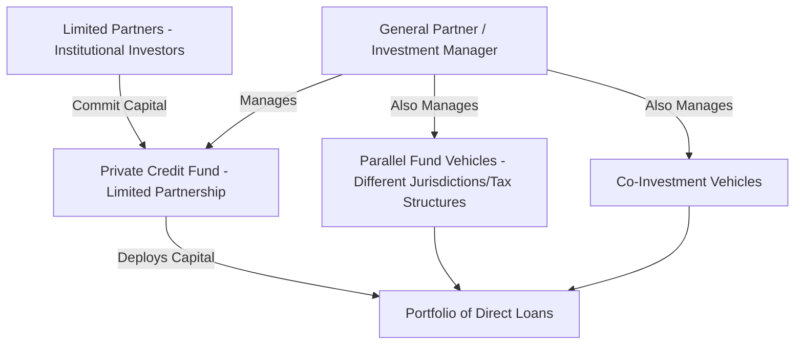
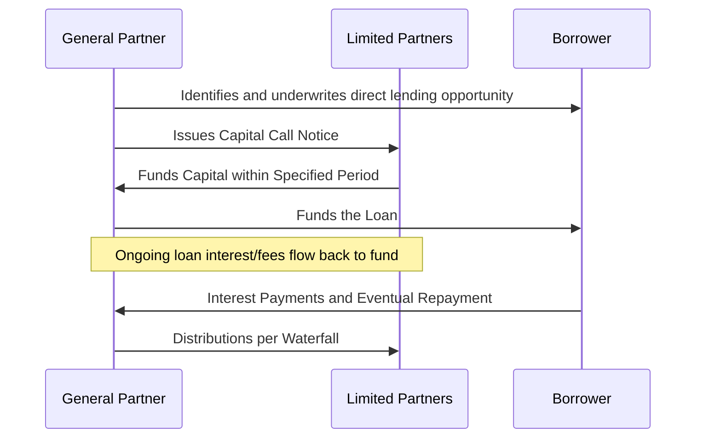
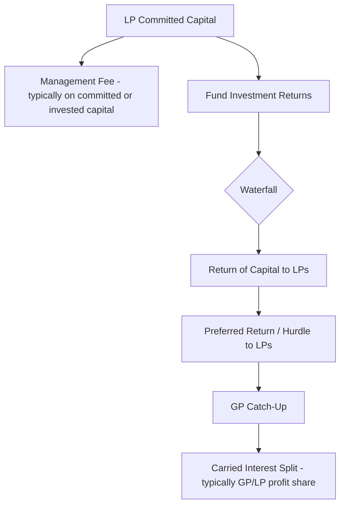

## Private Credit Fund Formation and Capital Deployment

### Overview

Beyond the BDC vehicle specifically, private credit fund formation encompasses the broader universe of legal structures, fundraising mechanics, and capital deployment processes through which asset managers raise and invest institutional capital in direct lending, mezzanine, distressed, and other private credit strategies. Understanding fund formation architecture — from limited partnership structuring through capital call mechanics to deployment pacing — is essential to understanding how private credit capital actually reaches borrowers.

### Fund Structure Architecture

**Definition**

Most private credit funds (distinct from publicly traded or non-traded BDCs) are organized as closed-end limited partnerships (or, in non-US jurisdictions, analogous vehicles such as limited partnerships under Cayman, Luxembourg, or other fund-friendly jurisdictions), with a General Partner (GP) managing the fund and Limited Partners (LPs) providing capital.

**Common Structural Components**

- **Master fund / feeder fund structures**: separate feeder vehicles (often differentiated by investor tax status or jurisdiction — e.g., a US taxable feeder, a US tax-exempt feeder, and a non-US feeder) invest into a common master fund, allowing the manager to accommodate different investor tax and regulatory needs while pooling capital for deployment
- **Parallel funds**: separate fund vehicles formed to accommodate investors in different jurisdictions or with different regulatory requirements, typically investing alongside the main fund on a pro-rata basis
- **Alternative investment vehicles (AIVs)**: special-purpose entities formed to hold specific investments where direct fund-level holding would create adverse tax, regulatory, or structuring consequences

[Inference] The specific choice of fund domicile (e.g., Delaware, Cayman Islands, Luxembourg) and feeder structure is driven by a combination of investor tax considerations (particularly for US tax-exempt and non-US investors seeking to avoid unrelated business taxable income (UBTI) or effectively connected income (ECI) concerns), regulatory considerations, and manager/investor familiarity with specific jurisdictions; this represents a specialized area of fund structuring best addressed with current tax and fund formation counsel for any specific fund.

### Capital Commitment and Drawdown Mechanics

**Definition**

Unlike an open-end mutual fund where investors' capital is invested immediately upon subscription, closed-end private credit funds operate on a **capital commitment** model: LPs commit a specified total capital amount at the fund's formation/closing, which the GP then calls (draws down) incrementally over the fund's investment period as investment opportunities are identified.

**Capital Call Mechanics**

$$\text{Called Capital (Cumulative)} = \sum_{t} \text{Capital Call}_t \leq \text{Total LP Commitment}$$

- The GP issues a capital call notice to LPs, typically specifying the amount due, the purpose (a specific investment or a general working capital/fee purpose), and a payment deadline (commonly 10 business days)
- LPs are contractually obligated under the fund's limited partnership agreement (LPA) to fund capital calls up to their committed amount, with specified default remedies (e.g., dilution of the defaulting LP's interest, forfeiture provisions) for failure to fund

### Investment Period and Fund Lifecycle

**Key Points**

- Private credit funds typically operate with a defined **investment period** (commonly several years) during which the GP may call capital for new investments, followed by a **harvest/wind-down period** during which the focus shifts to managing existing positions, collecting repayments, and returning capital to LPs
- Total fund life (investment period plus harvest period, potentially with extension options) is specified in the LPA, commonly spanning several years to a decade or more depending on strategy

**Illustrative Fund Lifecycle**

| Phase | Typical Activity | Approximate Duration (Illustrative) |
| --- | --- | --- |
| Fundraising/Closing | Marketing to LPs, closing on commitments | Varies by manager/strategy |
| Investment Period | Active capital deployment into new loans | Multi-year, per LPA terms |
| Harvest Period | Managing existing portfolio, collecting repayments | Multi-year, per LPA terms |
| Wind-Down/Extension | Final realizations, potential LPA-permitted extensions | Per LPA terms |

[Inference] Specific durations for each phase vary considerably by fund strategy (e.g., senior direct lending funds with shorter-duration loans versus mezzanine/distressed strategies with longer holding periods) and are negotiated and disclosed in each fund's specific LPA; no universal standard duration applies across all private credit fund structures.

### Deployment Pacing and the J-Curve

**Definition**

Deployment pacing refers to the rate at which a fund calls and invests committed capital over its investment period, directly influencing the fund's early-stage return profile, often characterized by an initial "J-curve" effect where early fees and expenses precede meaningful income generation from a still-developing portfolio.

$$\text{Net Asset Value Trajectory (Early Period)} \approx -\text{Fees and Expenses} + \text{Gradually Increasing Portfolio Income}$$

[Inference] The J-curve effect (an initial dip in reported fund performance before returns accelerate as the portfolio matures and generates income) is a widely observed general pattern across many closed-end private fund structures, including private credit; however, the magnitude and duration of any specific fund's J-curve depends on its specific fee structure, deployment speed, and the income characteristics of its underlying investments, and should not be assumed to follow an identical trajectory across different funds or strategies.

### Deal Sourcing and the Deployment Process

**Key Points**

- Private credit managers source direct lending opportunities through multiple channels: relationships with private equity sponsors (the dominant origination channel for sponsor-backed middle-market direct lending), direct company relationships (non-sponsored lending), investment bank/advisor referrals, and, for larger platforms, in-house origination teams
- Deployment involves the same fundamental underwriting process as any direct lending transaction: credit analysis, structuring, documentation negotiation, and closing — but must additionally account for fund-level portfolio construction considerations (diversification limits, remaining dry powder, investment period timing)

**Dry Powder Considerations**

$$\text{Dry Powder} = \text{Total Committed Capital} - \text{Cumulative Called Capital} - \text{Recallable Distributions (if applicable)}$$

- **Recallable capital**: some LPAs permit the GP to "recall" previously distributed capital (typically limited to return of capital, not profit) to fund new investments or follow-on investments in existing portfolio companies, effectively extending the fund's deployable capital beyond its initial commitment total
- [Unverified] The specific mechanics and limitations on recallable capital provisions vary by fund and are negotiated in the LPA; not all funds include such provisions, and where included, specific caps and time limitations apply that should be verified against the specific fund's governing documents

### Fee and Carried Interest Structure

**Typical Economic Terms**

- **Management fee**: typically calculated as a percentage of committed capital during the investment period, often stepping down to a percentage of invested/remaining capital during the harvest period
- **Preferred return (hurdle rate)**: a minimum annualized return LPs must receive before the GP participates in profit-sharing via carried interest
- **GP catch-up**: after LPs receive their preferred return, a catch-up mechanism allows the GP to receive a disproportionate share of subsequent profits until the overall GP/LP split reaches the target carried interest ratio
- **Carried interest**: the GP's profit share (a percentage of fund profits above the return of capital and preferred return), representing the primary performance-based compensation mechanism for the manager

[Inference] Specific management fee percentages, hurdle rates, and carried interest splits vary considerably across managers, strategies, and fund vintages, and are subject to ongoing negotiation between GPs and anchor/large LPs (sometimes resulting in fee discounts via side letters); no single fee structure can be characterized as a fixed industry standard applicable to all private credit funds.

### Side Letters and LP-Specific Terms

**Key Points**

- Large or strategically important LPs frequently negotiate **side letters** — supplemental agreements modifying specific terms of the LPA as applied to that particular investor, such as fee discounts, enhanced reporting rights, co-investment priority rights, or most-favored-nation (MFN) provisions ensuring the LP receives terms at least as favorable as those given to other similarly-situated investors
- [Unverified] The prevalence, negotiation dynamics, and specific typical content of side letters vary by manager and fundraising environment; specific terms available to any given investor depend on negotiating leverage (often correlated with commitment size) and should be assessed on a case-by-case basis rather than assumed to follow a standard pattern

### Co-Investment Structures

**Definition**

Co-investment arrangements allow select LPs to invest directly alongside the main fund in specific transactions, typically without additional management fees or carried interest (or at reduced rates), providing the LP with increased exposure to specific deals of interest while allowing the GP to accommodate larger transactions than the main fund alone could support.

$$\text{Total Transaction Size} = \text{Main Fund Allocation} + \text{Co-Investment Allocation}$$

### Related Topics

- Limited Partnership Agreement (LPA) drafting and key economic term negotiation
- Business Development Company (BDC) fund structures (comparative regulated vehicle)
- Carried interest waterfall mechanics and GP catch-up structuring
- Master-feeder fund structures and cross-border tax considerations (UBTI/ECI)
- Deal sourcing channels: sponsor-backed versus non-sponsored direct lending origination
- Fund-level portfolio construction and diversification limit management
- Recallable capital and follow-on investment funding mechanics
- Secondary market transactions in private credit fund LP interests