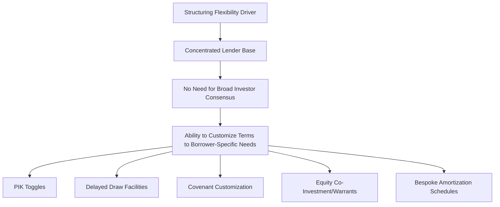
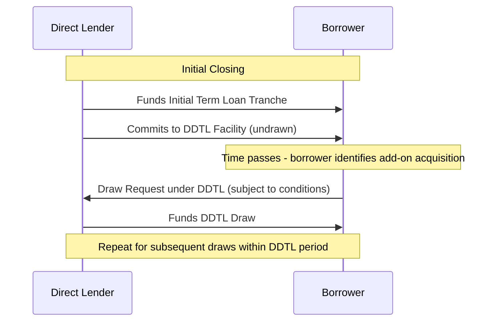
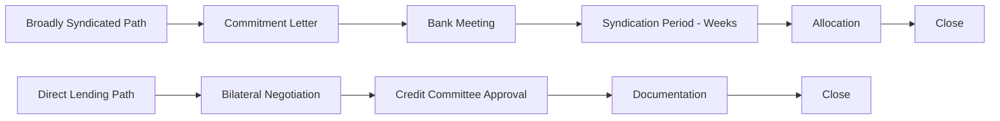

## Bespoke Structuring and Speed-to-Close Advantages

### Overview

Two of private credit's most consistently cited competitive advantages over broadly syndicated and traditional bank financing are its capacity for bespoke, borrower-specific structuring and its ability to close transactions rapidly with a high degree of certainty. These advantages stem directly from the concentrated, bilateral (or small-club) nature of the direct lender relationship, which eliminates the coordination and consensus-building burden inherent in syndicating a transaction across a broad, dispersed group of institutional investors.

### The Structural Basis for Flexibility

**Key Points**

- A single direct lender (or small club) can agree to bespoke terms without needing those terms to be palatable to a broad, heterogeneous investor base with varying risk appetites, ratings sensitivities, and portfolio construction constraints
- In contrast, broadly syndicated loan terms must generally conform to conventions acceptable to the dominant CLO buyer base, whose own governing documents impose specific eligibility, diversification, and structural requirements on the loans they can purchase

### Payment-in-Kind (PIK) Toggle Structures

**Definition**

A PIK toggle feature allows the borrower to elect, at specified intervals, to pay a portion (or all) of interest due "in kind" — by accruing and adding the unpaid interest to the principal balance — rather than in cash, typically in exchange for a higher overall interest rate to compensate the lender for deferred cash receipt.

$$\text{Principal Balance}_{t+1} = \text{Principal Balance}_t \times (1 + r_{\text{PIK}})^{\Delta t} \quad \text{(if PIK elected)}$$

versus

$$\text{Cash Interest Paid}_t = \text{Principal Balance}_t \times r_{\text{cash}} \times \Delta t \quad \text{(if cash elected)}$$

**Use Cases**

- Borrowers anticipating temporary cash flow constraints (e.g., during a growth investment phase or seasonal working capital cycle) can preserve liquidity by electing PIK
- Direct lenders can accommodate this flexibility more readily than a broadly syndicated structure, since the concentrated lender base can directly assess and price the specific borrower's cash flow profile rather than needing a standardized feature palatable to a diverse CLO investor base

[Inference] PIK toggle features, while more commonly associated with direct lending's structural flexibility, are not exclusive to private credit and have appeared in various broadly syndicated and high-yield bond contexts historically as well; the relative prevalence of PIK features in direct lending versus other markets reflects general market pattern observations rather than an absolute exclusivity claim.

### Delayed Draw Term Loans (DDTLs)

**Definition**

A delayed draw term loan is a committed facility under which the lender agrees to fund additional term loan amounts at future dates (subject to conditions), typically to support a borrower's acquisition strategy (funding future add-on acquisitions) or capital expenditure program, without requiring a fresh financing negotiation each time capital is needed.

**Mechanics**

**Typical Conditions to Drawing**

- Pro forma covenant compliance (e.g., leverage ratio tests) at the time of the draw
- No existing default or event of default
- Satisfaction of specified use-of-proceeds requirements (e.g., funding a permitted acquisition)
- Commitment fee accrual on the undrawn DDTL commitment during the availability period

$$\text{Commitment Fee} = \text{Undrawn DDTL Amount} \times \text{Commitment Fee Rate} \times \frac{\text{Days Outstanding}}{365}$$

**Advantages of DDTL Structuring in Direct Lending**

- Direct lenders, holding the full facility themselves (or within a small club), can commit to future funding obligations with greater confidence than would be practical in a broadly syndicated context, where committing dozens of dispersed lenders to fund future, as-yet-unidentified acquisitions would be considerably more complex to negotiate and administer

### Covenant Customization

**Key Points**

- Direct lenders can tailor covenant packages — financial maintenance covenant levels, EBITDA addback definitions, permitted debt/investment/restricted payment baskets — to the specific borrower's business model, growth trajectory, and sponsor relationship, rather than conforming to the more standardized conventions that facilitate broad syndication and secondary trading in the BSL market
- This customization can run in either direction: some direct lending structures include tighter, more borrower-specific maintenance covenants (reflecting the direct lender's closer monitoring relationship) while others may offer more accommodative terms for a strong credit in exchange for relationship value or pricing considerations

[Speculation] The degree of covenant customization achievable in a specific direct lending transaction is influenced by relative negotiating leverage between the borrower/sponsor and the direct lender, which itself fluctuates with the competitive dynamics of the private credit market (i.e., the amount of "dry powder" competing for a given transaction); this dynamic quality means covenant terms should not be assumed static or predictable without reference to prevailing market conditions at the time of a specific transaction.

### Speed-to-Close Mechanics

**Key Points**

- Direct lending's speed advantage derives primarily from the elimination of the broad syndication period inherent in BSL execution — there is no bank meeting, no lender presentation roadshow, and no extended period awaiting commitment accumulation from a dispersed investor base
- A single lender (or small, pre-coordinated club) can complete its own credit committee approval process and move directly to documentation negotiation and closing

### Speed as a Competitive Advantage in M&A Processes

**Key Points**

- In competitive sell-side M&A processes (particularly private equity sponsor auctions), a financing source's ability to provide committed, certain financing on a compressed timeline can be a meaningful differentiator in a bidder's overall proposal
- Direct lenders frequently emphasize "certainty of execution" as a core value proposition: unlike an underwritten BSL commitment (which carries market flex risk during the post-signing syndication period), a direct lending commitment from a fund that intends to hold the full amount itself is not subject to the same syndication-driven renegotiation risk between signing and closing

[Inference] While direct lending is generally understood to offer greater closing certainty relative to the syndication-dependent BSL market, this does not mean direct lending commitments carry zero execution risk; direct lenders still typically include customary conditions precedent (satisfactory completion of diligence, no material adverse change provisions, etc.) in their commitment documentation, and the degree of "certainty" should be evaluated against the specific commitment letter terms for any given transaction rather than assumed to be absolute.

### Confidentiality Advantages

**Key Points**

- Bilateral or small-club negotiation avoids the wider information distribution inherent in a broadly syndicated bank meeting, where confidential business information is shared with a large number of prospective lenders (even under NDA), some of whom may not ultimately participate in the final syndicate
- This confidentiality advantage can be particularly valued by borrowers in competitively sensitive situations (e.g., active M&A processes, or businesses concerned about competitor intelligence-gathering through the syndication process)

### Trade-offs Accompanying Flexibility and Speed

**Key Points**

- **Pricing premium**: as discussed in the direct lending versus BSL comparison, the flexibility and speed advantages of direct lending have historically been associated with a pricing premium relative to comparable BSL execution, reflecting the illiquidity and certainty value provided
- **Concentration risk for the lender**: bespoke, complex structures negotiated for a single relationship may be harder to exit or syndicate down the line if the direct lender's own portfolio construction needs change
- **Less standardized documentation**: bespoke terms, by definition, deviate from market-standard conventions, which can create complexity in future refinancing, amendment, or restructuring scenarios where precedent-based negotiation (common in the more standardized BSL market) is less available as a reference point

### Illustrative Comparison: Structuring Flexibility by Execution Channel

| Feature | Broadly Syndicated Loan | Direct Lending (Bilateral/Club) |
| --- | --- | --- |
| PIK Toggle Availability | Uncommon, requires broad investor acceptance | More readily negotiable |
| Delayed Draw Term Loan Complexity | Possible but administratively complex across dispersed lenders | More straightforward with concentrated lender base |
| Covenant Customization | Constrained by CLO/institutional investor conventions | Highly customizable to borrower-specific needs |
| Typical Time to Close | Weeks (subject to syndication) | Often faster, subject to diligence completion |
| Confidentiality During Process | Lower (wide information distribution to prospective lenders) | Higher (limited to bilateral/small club) |

### Related Topics

- Direct lending versus broadly syndicated loan execution (comparative framework)
- Club deals and unitranche financing structures
- Delayed draw term loan conditions precedent and commitment fee structuring
- Payment-in-kind (PIK) interest mechanics and accrual accounting treatment
- Certainty of execution in competitive M&A financing processes
- Covenant negotiation dynamics between sponsors and concentrated lender groups
- Business Development Company (BDC) fund structures (capital source context)
- Private credit fund formation and dry powder deployment dynamics