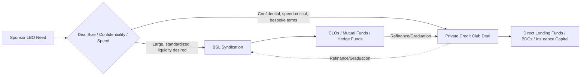

## Convergence and Complementarity Between Private Credit and Broadly Syndicated Loan Markets

### Definition and Scope

Convergence refers to the structural, pricing, and participant overlap developing between the private credit market (directly negotiated, privately held loans, typically unitranche or first-lien/second-lien) and the broadly syndicated loan (BSL) market (widely distributed, rated, liquid leveraged loans traded among institutional investors). Complementarity refers to the ways these two markets serve different but interlocking functions within the same capital structure ecosystem, allowing issuers, sponsors, and capital providers to move between them depending on deal size, market conditions, and speed requirements.

These markets were historically distinct: BSL served large-cap, rated issuers via banks and CLOs; private credit served middle-market borrowers unable to access syndicated markets. That separation has substantially eroded.

### Historical Divergence Point

**Key Points**

- Post-2008: Bank retrenchment from leveraged lending (Volcker Rule, leveraged lending guidance) opened space for non-bank direct lenders.
- 2009–2015: Private credit largely confined to sub-$50M EBITDA borrowers, filling a genuine market gap.
- 2015–2020: Direct lending funds scaled AUM significantly (dry powder growth), enabling larger unitranche checks.
- 2020–present: Private credit funds began competing directly for issuers historically financed exclusively via BSL/high-yield, including take-private LBOs exceeding $1B in enterprise value.

### Drivers of Convergence

**Key Points**

1. **Capital scale** — Direct lending platforms (Ares, Blackstone Credit, Blue Owl, HPS, Apollo) now manage fund sizes rivaling large syndicated deal tranches, enabling single-lender or club-based financing of transactions once requiring 20+ syndicate participants.
2. **Speed and certainty of execution** — Private credit offers committed financing without syndication/market-flex risk, attractive to sponsors during volatile BSL windows.
3. **Confidentiality** — No public ratings process or broad information distribution required; useful for competitively sensitive carve-outs or take-privates.
4. **Insurance capital inflows** — Life insurers seeking long-duration, illiquid credit exposure have funded private credit vehicles at scale, structurally growing available capital.
5. **BSL investors entering private credit** — CLO managers, credit hedge funds, and even some BDCs have launched private credit strategies, blurring institutional lines.
6. **Sponsors' preference flexibility** — PE sponsors increasingly run dual-track processes (BSL vs. private credit) simultaneously to maximize leverage on pricing and terms.

### Complementary Functions Retained

Despite convergence, structural differentiation persists:

| Dimension | Broadly Syndicated Loans | Private Credit |
| --- | --- | --- |
| Typical issuer size | Large-cap (>$50M EBITDA generally) | Middle-market to large-cap increasingly |
| Rating requirement | Usually rated (public or private) | Often unrated |
| Documentation | Standardized (LSTA-based) | Bespoke, heavily negotiated |
| Liquidity | Secondary market tradable | Buy-and-hold, illiquid |
| Pricing basis | SOFR + spread, market-clearing via book-building | Negotiated spread, often wider for illiquidity premium |
| Covenant structure | Covenant-lite common | Maintenance covenants more common |
| Execution timeline | Weeks (syndication process) | Days to weeks (bilateral negotiation) |
| Investor base | CLOs, mutual funds, hedge funds, banks | BDCs, direct lending funds, insurance capital |

### The Dual-Track Process

**Example**

A sponsor pursuing a $700M LBO financing may run parallel processes:

1. Solicit a unitranche quote from 2–3 direct lending club members.
2. Simultaneously launch a BSL syndication via arranging banks.
3. Compare all-in cost of capital (OID, spread, fees, call protection), certainty of close, and flex risk.
4. Select private credit if BSL demand is soft or timeline is compressed; select BSL if pricing is meaningfully tighter and market conditions are stable.

This dual-track dynamic itself is a convergence mechanism: it forces BSL pricing to remain competitive against private credit alternatives and vice versa, creating cross-market price discovery.

### Migration and Refinancing Flows

**Key Points**

- **Private credit to BSL**: As borrowers scale and generate ratings-eligible track records, sponsors often refinance unitranche private credit into cheaper syndicated term loans ("graduation").
- **BSL to private credit**: Issuers facing distress, covenant breach, or unfavorable syndicated market windows sometimes refinance into private credit for flexibility (amend-and-extend alternatives, delayed-draw facilities).
- **Take-private financing**: A significant convergence vector — private credit has financed large take-private LBOs that a decade ago would have been exclusively BSL/high-yield bond territory.

### Pricing Convergence Dynamics

Historically, private credit commanded a meaningful illiquidity/complexity premium over BSL (commonly cited as 100–200 bps historically, though this varies by vintage and credit quality [Inference — premium magnitude fluctuates with market conditions and is not a fixed constant]). As direct lending AUM has grown and competition among lenders has intensified, this spread compression has been observed for larger, higher-quality borrowers, while smaller or more complex credits continue to command a wider premium.

The general relationship can be expressed as:

$$\text{PC Spread} = \text{BSL Spread} + \text{Illiquidity Premium} + \text{Complexity Premium} - \text{Speed/Certainty Discount}$$

Where the "Speed/Certainty Discount" term reflects value sponsors assign to execution certainty, which can partially or fully offset the illiquidity premium in competitive processes.

### Structural Overlap in Vehicle Design

**Key Points**

- **BDCs (Business Development Companies)**: Publicly registered or private vehicles that hold private credit assets but are increasingly co-investing alongside CLOs in the same underlying credits.
- **CLOs holding private-credit-like assets**: Some middle-market CLOs now warehouse loans originated via direct lending processes.
- **Hybrid/opportunistic credit funds**: Many large managers run platforms that allocate across both BSL and private credit within a single strategy mandate, selecting whichever market offers better risk-adjusted return at underwriting.

### Syndicated Private Credit ("Club Deals")

A convergence-specific structure: private credit transactions large enough to require multiple direct lenders form clubs, replicating syndication mechanics without public rating agency involvement or open market distribution.

### Documentation and Covenant Convergence

**Key Points**

- Private credit documentation has increasingly adopted BSL-style covenant-lite features for larger, sponsor-backed borrowers to remain competitive, though maintenance covenants remain more prevalent than in BSL.
- Conversely, some BSL documentation has adopted private-credit-style lender protections (tighter EBITDA add-back definitions, portability restrictions) in response to lender pushback after high-profile liability management exercises.
- Cross-pollination of legal terms is an observable trend, though the degree varies significantly by deal and manager [Inference — extent of convergence differs across market segments and is not uniform].

### Risk and Systemic Considerations

**Key Points**

- **Interconnectedness risk**: As the same sponsors and underlying issuers access both markets, stress in one market (e.g., BSL repricing wave) can propagate borrower refinancing decisions into private credit, and vice versa.
- **Mark-to-market vs. mark-to-model**: BSL assets are marked using observable secondary trading levels; private credit is typically marked to model or third-party valuation, creating potential valuation lag during stress — a divergence point regulators and rating agencies actively monitor [Unverified — regulatory treatment continues to evolve].
- **Concentration risk**: Large direct lending funds financing single large borrowers face concentration exposure that syndication would normally have distributed across many BSL holders.

### Illustrative Convergence Timeline (SVG)

<svg xmlns="http://www.w3.org/2000/svg" viewBox="0 0 900 320">
<text x="450" y="25" text-anchor="middle" font-size="16" font-weight="bold" fill="#1a1a2e">Private Credit / BSL Convergence Timeline (svg_diagram)</text>
<line x1="60" y1="160" x2="850" y2="160" stroke="#333" stroke-width="2" />
<circle cx="120" cy="160" r="6" fill="#2563eb" />
<text x="120" y="185" text-anchor="middle" font-size="11">2009</text>
<text x="120" y="130" text-anchor="middle" font-size="10" width="100">Bank retrenchment begins</text>
<circle cx="290" cy="160" r="6" fill="#2563eb" />
<text x="290" y="185" text-anchor="middle" font-size="11">2015</text>
<text x="290" y="130" text-anchor="middle" font-size="10">Direct lending AUM scales</text>
<circle cx="460" cy="160" r="6" fill="#16a34a" />
<text x="460" y="185" text-anchor="middle" font-size="11">2020</text>
<text x="460" y="130" text-anchor="middle" font-size="10">Large-cap unitranche deals emerge</text>
<circle cx="630" cy="160" r="6" fill="#16a34a" />
<text x="630" y="185" text-anchor="middle" font-size="11">2023</text>
<text x="630" y="130" text-anchor="middle" font-size="10">Take-private financing via PC</text>
<circle cx="800" cy="160" r="6" fill="#dc2626" />
<text x="800" y="185" text-anchor="middle" font-size="11">2026</text>
<text x="800" y="130" text-anchor="middle" font-size="10">Dual-track pricing convergence</text>
<text x="450" y="230" text-anchor="middle" font-size="11" fill="#555">Markets diverge in function but converge in scale, participants, and pricing</text>
</svg>

### Implications for Deal Structuring Practitioners

**Key Points**

- Structuring teams must underwrite both BSL and private credit execution paths concurrently for mid-to-large LBOs to preserve pricing leverage.
- Term sheets increasingly include "flex to alternative market" language, allowing sponsors to pivot financing sources without restarting the process.
- Relative value analysis (all-in cost of capital, not just headline spread) is essential given differing fee structures (OID, upfront fees, unused commitment fees on delayed-draw term loans).

### Conclusion

The private credit and BSL markets have moved from parallel, largely non-competing channels to substantially overlapping, competitively interacting markets. While core structural differences in liquidity, documentation standardization, and investor base persist, the two markets now function as complementary financing rails within the same sponsor-driven leveraged finance ecosystem, with capital flowing between them based on relative pricing, speed, confidentiality needs, and issuer scale.

**Related Topics**

- Unitranche Structuring and Last-Out/First-Out Mechanics
- CLO Warehouse Facilities and Ramp-Up Risk
- Covenant-Lite vs. Maintenance Covenant Structures
- Business Development Company (BDC) Regulatory Framework
- Liability Management Exercises (LMEs) and Creditor-on-Creditor Violence
- Direct Lending Fund Structures (BDC vs. Interval Fund vs. Private Fund)
- Take-Private LBO Financing Structures
- All-in Cost of Capital Analysis Across Financing Sources