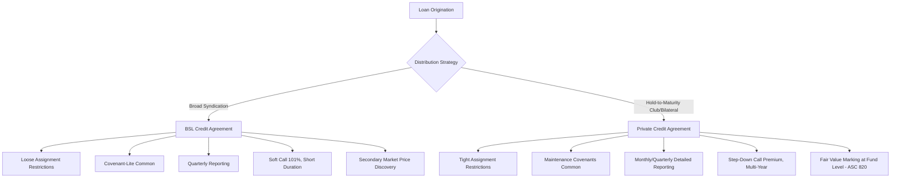

## Held-to-Maturity Provisions and Private Credit Documentation Norms

### Definition and Scope

Held-to-maturity (HTM) provisions in private credit refer to the contractual, structural, and accounting-related features embedded in direct lending documentation that reflect the buy-and-hold investment model of private credit lenders, as opposed to the trade-oriented, mark-to-market model of broadly syndicated loans (BSL). These provisions govern transferability, amendment mechanics, information rights, valuation treatment, and lender concentration — all shaped by the expectation that the lender(s) will hold the position to maturity rather than trade it in a secondary market.

This topic sits at the intersection of loan documentation drafting, fund accounting classification, and regulatory capital treatment for the lending vehicle.

### Why Buy-and-Hold Status Matters Structurally

**Key Points**

1. **No secondary market pricing discipline** — Without active trading, private credit assets lack observable market clearing prices, shifting valuation to internal models or third-party marks.
2. **Lender identity is fixed at close** — Unlike BSL, where lender rosters shift via assignments/participations, private credit lender groups are typically small (1–5 lenders) and stable through the life of the loan.
3. **Documentation can be more bespoke** — Because there is no need to standardize terms for a broad, anonymous secondary buyer base, private credit docs are negotiated loan-by-loan.
4. **Amendment mechanics differ** — Fewer lenders means amendments requiring "Required Lender" consent (typically >50% or >66⅔% of commitments) are easier to obtain and less prone to holdout behavior than in widely syndicated deals.

### Accounting Classification Context

**Key Points**

- Under US GAAP, "held-to-maturity" is technically a securities classification (ASC 320) for debt securities the holder has both the intent and ability to hold until maturity, recorded at amortized cost rather than fair value.
- Direct loans originated by private credit funds are more commonly held at fair value under ASC 820 (particularly for BDCs, which are required to mark portfolio investments to fair value each reporting period regardless of hold intent) [Fact — BDC fair value requirement is a regulatory mandate under the Investment Company Act framework].
- The colloquial industry usage of "held-to-maturity" in private credit context typically refers to the economic/operational hold-to-maturity investment strategy, not strict ASC 320 accounting classification. Practitioners should distinguish the accounting term of art from the market convention usage. [Inference — terminology usage varies by speaker and context; not all users apply the term with technical precision]
- Insurance company balance sheets financing private credit (via rated note feeders or asset-based structures) often do pursue formal HTM accounting treatment to reduce income statement volatility, consistent with long-duration liability matching.

### Transferability and Assignment Restrictions

Private credit documentation typically imposes materially tighter transfer restrictions than BSL credit agreements:

| Feature | BSL Credit Agreement | Private Credit Agreement |
| --- | --- | --- |
| Assignment consent | Borrower consent often deemed given after notice period (absent Event of Default) | Borrower consent typically required, non-perfunctory |
| Eligible assignee pool | Broad (any "Eligible Assignee" — funds, banks, etc.) | Narrow, often limited to affiliates or pre-approved lender list |
| Minimum assignment size | Often $1M–$5M | Often full commitment or pro-rata only |
| Participation rights | Freely permitted with voting limitations | May require lender consent even for participations |
| Purpose | Facilitate secondary liquidity | Preserve relationship-based, stable lender group |

**Example**

A unitranche credit agreement might state that no lender may assign any portion of its commitment without prior written consent of the borrower and administrative agent, except to an affiliate or approved fund of the same lender — effectively locking the syndicate in place absent borrower cooperation, reinforcing the hold-to-maturity posture of the capital structure.

### Information Rights and Reporting Covenants

**Key Points**

- Private credit agreements typically require more frequent and granular financial reporting than BSL (monthly or quarterly financials with covenant compliance certificates, versus quarterly/annual in many covenant-lite BSL deals).
- Direct lenders often negotiate board observer rights or enhanced access to management, reflecting the closer, longer-duration relationship implied by a hold-to-maturity strategy.
- Financial covenant testing (maintenance covenants) is far more prevalent in private credit, providing early-warning triggers that matter more when the lender cannot simply sell out of a deteriorating credit.

### Prepayment and Call Protection Norms

Because private credit lenders cannot easily replace yield by trading into a new position (unlike BSL investors who can rotate capital via the secondary market), prepayment economics are structured to compensate for the buy-and-hold commitment:

$$\text{Make-Whole/Call Premium} = \max\left(0, \sum_{t=1}^{T} \frac{C_t}{(1+r)^t} - P_0\right)$$

Where $C_t$ represents remaining scheduled interest/principal cash flows, $r$ is the discount rate, and $P_0$ is outstanding principal — though in practice, most private credit deals use simpler step-down call schedules rather than full make-whole calculations.

**Example — Typical Call Protection Schedule**

- Year 1: Non-call (NC1) or 102% premium
- Year 2: 101% premium
- Year 3+: Par (no premium)

This is generally more punitive than typical BSL first-lien term loans (often 101% soft call for 6–12 months only), compensating the direct lender for the illiquidity and yield-replacement risk inherent in a hold-to-maturity structure.

### Amendment and Voting Mechanics

**Key Points**

- **Sacred rights** (requiring unanimous or affected-lender consent): maturity extension, principal/interest rate reduction, collateral release — consistent across both markets.
- **Required Lender threshold**: In private credit club deals with few lenders, thresholds are often set higher in percentage terms (e.g., 100% for certain amendments) because the small lender count makes unanimous consent operationally feasible, whereas BSL deals with dozens of lenders rely on majority/supermajority mechanics to avoid holdout paralysis.
- **No "yank-a-bank" typically needed** — this BSL mechanic (forcing out a non-consenting lender) is less relevant in private credit given the small, relationship-driven lender base, though similar buy-out provisions can still appear.

### Valuation and Mark-to-Model Documentation Interplay

**Key Points**

- Loan documentation itself does not typically prescribe valuation methodology — that occurs at the fund level (ASC 820 fair value hierarchy, Level 3 inputs for private credit).
- However, certain documentation provisions indirectly affect valuation inputs: financial covenant cushions, prepayment premiums, and PIK (payment-in-kind) toggle features all feed into discounted cash flow models used by BDC valuation committees and third-party valuation firms.
- PIK toggle provisions (allowing interest to accrue rather than be paid in cash) are common in private credit and directly impact both credit risk assessment and reported yield, and are a frequent area of valuation and disclosure scrutiny [Unverified — degree of regulatory/investor scrutiny varies by period and is not static].

### Comparative Documentation Structure Diagram

### Regulatory and Fund-Level Considerations

**Key Points**

- BDCs are subject to asset coverage requirements (typically 150% under the Investment Company Act as amended, following the 2018 Small Business Credit Availability Act reduction from 200%) which interact with how much leverage the fund itself can apply on top of held-to-maturity loan assets.
- Insurance-affiliated private credit platforms face NAIC risk-based capital treatment considerations that favor structured, rated feeder note formats over direct loan holdings, influencing how origination platforms structure the ultimate holding vehicle.
- Because private credit loans are illiquid and often unrated, fund-level liquidity management (redemption gates in interval funds, non-traded BDC structures) is a necessary complement to the hold-to-maturity nature of the underlying assets.

### Practical Drafting Distinctions Checklist

**Key Points**

- Confirm assignment/participation consent thresholds align with intended lender group stability.
- Verify call protection schedule compensates adequately for illiquidity versus BSL comparables.
- Confirm financial covenant package (leverage, interest coverage, fixed charge coverage) reflects direct lender's inability to exit via secondary sale.
- Confirm PIK toggle mechanics and any PIK-to-cash flip triggers are clearly defined.
- Confirm reporting covenant frequency matches the fund's fair value marking cadence (monthly reporting supports timely NAV marks).

### Conclusion

Held-to-maturity dynamics in private credit are not primarily an accounting label but a structural philosophy that permeates documentation: restrictive transferability, enhanced information rights, maintenance covenants, and multi-year call protection all exist because the lender cannot rely on a secondary market to exit or reprice the position. This stands in direct contrast to BSL documentation norms, which are built around facilitating a liquid, tradable asset class.

**Related Topics**

- Fair Value Measurement (ASC 820) for Private Credit Portfolios
- BDC Asset Coverage Ratios and Leverage Regulation
- PIK Toggle Notes and Yield Recognition
- Required Lender Voting Thresholds and Sacred Rights
- Unitranche Structuring and Last-Out/First-Out Mechanics
- Insurance-Affiliated Private Credit Platforms and NAIC Capital Treatment
- Financial Covenant Design in Direct Lending Agreements