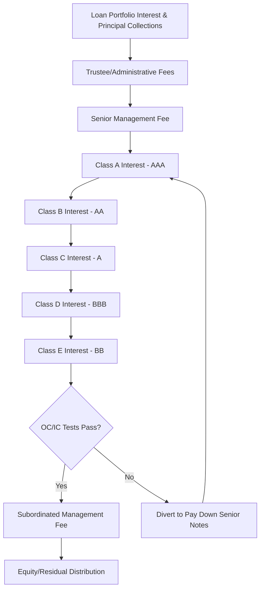

## CLO Structure and Mechanics

### Definition and Scope

A Collateralized Loan Obligation (CLO) is a special purpose vehicle (SPV) that pools a diversified portfolio of primarily senior secured leveraged loans and finances that portfolio by issuing multiple tranches of rated debt and equity, each with distinct risk/return profiles derived from a contractual payment priority (the "waterfall"). CLOs are the dominant institutional buyer of broadly syndicated leveraged loans and a core structured credit financing technology.

### Core Structural Components

**Key Points**

1. **SPV/Issuer** — A bankruptcy-remote entity (typically Cayman Islands or Ireland-domiciled) that holds legal title to the loan portfolio.
2. **Collateral Manager** — An asset management firm responsible for selecting, purchasing, trading (during the reinvestment period), and monitoring the loan collateral pool, earning senior and subordinated management fees.
3. **Trustee** — Administers cash flows, calculates compliance tests, and enforces the indenture on behalf of noteholders.
4. **Rated Debt Tranches** — Multiple classes (typically AAA down to BB/B) issued to fund the purchase of collateral.
5. **Equity/Subordinated Notes** — The first-loss, unrated residual tranche that receives excess spread after all debt tranches and expenses are paid.
6. **Collateral Pool** — Typically 150–300+ individual broadly syndicated first-lien (and sometimes second-lien) leveraged loans, providing granular diversification.

### Typical Capital Structure

| Tranche | Rating (typical) | % of Capital Stack (approx.) | Spread over SOFR (illustrative) |
| --- | --- | --- | --- |
| Class A | AAA | ~60-65% | SOFR + 130-160 bps |
| Class B | AA | ~10-12% | SOFR + 180-210 bps |
| Class C | A | ~6-8% | SOFR + 230-260 bps |
| Class D | BBB | ~5-7% | SOFR + 330-370 bps |
| Class E | BB | ~5-6% | SOFR + 600-700 bps |
| Equity | Unrated | ~8-10% | Residual cash flow |

[Inference — exact percentages and spreads vary by vintage, manager, and market conditions; figures above are illustrative of typical structures, not fixed norms]

### Capital Structure Waterfall Diagram

### The Waterfall Mechanism

**Key Points**

CLO cash flows are distributed through two parallel waterfalls:

1. **Interest Waterfall** — Distributes interest collections from the loan portfolio sequentially: fees, senior tranche interest, junior tranche interest, then residual to equity — subject to passing coverage tests.
2. **Principal Waterfall** — During the reinvestment period, principal proceeds are generally reinvested into new collateral (subject to reinvestment criteria); after the reinvestment period ends, principal is used to amortize debt tranches sequentially from the top of the capital structure down.

Payment priority is strictly sequential ("waterfall") — a junior tranche receives no interest or principal until all senior obligations and required tests are satisfied for that period.

### Coverage Tests (The Structural Safety Mechanism)

**Key Points**

- **Overcollateralization (OC) Test**: Compares the par value of collateral (net of defaults/haircuts) against the outstanding principal balance of a given tranche and all tranches senior to it.

$$\text{OC Ratio} = \frac{\text{Collateral Par Balance (adjusted)}}{\text{Outstanding Debt Balance (tranche + senior tranches)}}$$

- **Interest Coverage (IC) Test**: Compares collateral interest income to interest due on a tranche and senior tranches.

$$\text{IC Ratio} = \frac{\text{Collateral Interest Income}}{\text{Interest Due (tranche + senior tranches)}}$$

- If a test fails (ratio falls below the required trigger level defined in the indenture), cash flow is diverted from junior tranches and equity to pay down senior notes until the test is cured — this is the primary credit enhancement mechanism protecting senior noteholders.

**Example**

If the Class D (BBB) OC test requires a minimum ratio of 108% and actual collateral coverage falls to 105% due to loan defaults, the waterfall automatically redirects cash that would have gone to Class E and equity toward paying down Class A/B/C principal until the Class D OC ratio is restored above 108%.

### CLO Lifecycle Phases

**Key Points**

1. **Ramp-Up Period** — Initial period (often 3–9 months) post-closing during which the manager acquires the full target collateral portfolio, often using a warehouse facility pre-closing to accumulate assets.
2. **Reinvestment Period** — Typically 4–5 years; principal proceeds from repaid/sold loans can be reinvested into new collateral, subject to eligibility criteria and concentration limits.
3. **Amortization Period** — After reinvestment period ends, principal proceeds are used to pay down debt tranches sequentially rather than being reinvested.
4. **Legal Final Maturity / Call/Reset** — CLOs are typically callable by equity holders after a non-call period (often 1–2 years), allowing refinancing of debt tranches at tighter spreads or a full reset extending the reinvestment period.

### Collateral Quality and Concentration Tests

**Key Points**

- **Weighted Average Spread (WAS) Test** — Minimum required average spread across the portfolio.
- **Weighted Average Rating Factor (WARF) Test** — Caps average portfolio credit risk using a numeric rating-to-factor conversion scale.
- **Weighted Average Life (WAL) Test** — Limits average portfolio maturity profile.
- **Diversity Score** — Measures effective diversification accounting for industry concentration and issuer correlation.
- **Concentration Limits** — Caps on single obligor exposure (often 2%), industry exposure (often 12-15% per industry), CCC-rated assets (often capped at 7.5%), and second-lien/covenant-lite exposure.

These tests operate independently from the OC/IC coverage tests and constrain the manager's trading activity during the reinvestment period rather than triggering cash diversion directly.

### Equity Tranche Economics

**Key Points**

- Equity holders receive the "excess spread" — the difference between weighted average loan yield and weighted average cost of debt tranches, after fees.
- Equity returns are levered and volatile: strong performance in benign credit environments (historically double-digit IRRs cited by market participants), but first-loss exposure to defaults.
- Equity is typically held by the collateral manager (alignment of interest, often required by risk retention rules in various jurisdictions), specialized CLO equity funds, and some hedge funds/family offices.

$$\text{Equity Cash Flow} = \text{Total Collateral Interest} - \text{Total Debt Tranche Interest} - \text{Fees} - \text{OC/IC Diversions}$$

### Static vs. Managed CLOs

**Key Points**

- **Managed CLOs** (the dominant structure): Active collateral manager trades the portfolio within indenture constraints throughout the reinvestment period.
- **Static CLOs**: Portfolio is fixed at closing with minimal or no active trading discretion — less common, sometimes used for specific investor mandates requiring transparency/simplicity.

### Risk Retention and Regulatory Framework

**Key Points**

- US risk retention rules under Dodd-Frank previously required CLO managers to retain 5% of credit risk; this requirement was vacated for open-market CLO managers by a 2018 D.C. Circuit Court of Appeals decision (LSTA v. SEC and Federal Reserve), though many managers continue voluntary retention practices for investor alignment and marketing purposes. [Fact — court decision; current voluntary practice extent varies by manager]
- EU/UK risk retention rules (under the Securitisation Regulation) continue to require a minimum 5% retention for CLOs marketed to EU/UK investors, creating structural differences between US-only and EU-compliant CLO issuances.

### CLO vs. Direct Loan Portfolio Comparison

| Feature | Direct Loan Holding | CLO Structure |
| --- | --- | --- |
| Diversification | Single credit exposure | 150-300+ obligor pool |
| Leverage | None (unlevered) | Structurally levered via debt tranches |
| Risk tranching | N/A | AAA to equity risk segmentation |
| Liquidity | Loan-specific | Tranche-specific (AAA highly liquid; equity illiquid) |
| Active management | N/A | Ongoing trading during reinvestment period |
| Credit enhancement | None | OC/IC tests, subordination, excess spread |

### Conclusion

CLOs transform a diversified pool of leveraged loans into a tranched capital structure that redistributes credit risk according to investor risk appetite, using overcollateralization and interest coverage tests as automatic, rules-based credit enhancement mechanisms rather than discretionary intervention. Understanding the waterfall priority, coverage test triggers, and lifecycle phases is foundational to analyzing CLO debt and equity investments and to understanding CLOs' role as the largest institutional buyer base for broadly syndicated loans.

**Related Topics**

- CLO Warehouse Facilities and Ramp-Up Risk
- Weighted Average Rating Factor (WARF) Methodology
- CLO Reset, Refinancing, and Call Mechanics
- Risk Retention Rules (US vs. EU/UK Securitisation Regulation)
- CLO Equity Return Analysis and IRR Modeling
- Middle-Market CLOs vs. Broadly Syndicated CLOs
- Covenant-Lite Loan Concentration and CLO Portfolio Construction