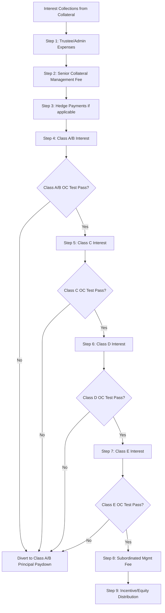

## CLO Tranching and the Payment Waterfall

### Definition and Scope

CLO tranching is the process of segmenting the capital structure of a Collateralized Loan Obligation into multiple classes of securities with differentiated seniority, credit ratings, and cash flow entitlements. The payment waterfall is the contractually defined, sequential distribution mechanism through which collections from the underlying loan collateral are allocated across those tranches. Together, tranching and the waterfall constitute the primary credit risk redistribution technology of the CLO structure.

### Purpose of Tranching

**Key Points**

1. **Risk segmentation** — Converts a pool of similarly-rated (typically single-B to BB) leveraged loans into securities spanning AAA to unrated equity, matching different investor risk appetites and regulatory capital constraints.
2. **Subordination as credit enhancement** — Each tranche is protected by the tranches below it absorbing losses first; this subordination, not diversification alone, is what allows senior tranches to achieve ratings well above the average collateral rating.
3. **Arbitrage capture** — The CLO manager and equity holders capture the spread between the (higher) yield on collateral loans and the (lower) weighted average cost of the rated debt tranches — the core economic rationale for forming a CLO.

### Tranche Seniority Structure

| Tranche | Typical Rating | Loss Absorption Order | Subordination Level (approx.) |
| --- | --- | --- | --- |
| Class A (Senior) | AAA | Last to absorb losses | ~35-40% |
| Class B | AA | 6th | ~25-28% |
| Class C | A | 5th | ~18-20% |
| Class D | BBB | 4th | ~12-14% |
| Class E | BB | 3rd | ~6-8% |
| Class F (if present) | B | 2nd | ~2-4% |
| Subordinated/Equity Notes | Unrated | First to absorb losses | 0% (base) |

[Inference — subordination levels and tranche naming conventions vary by transaction and manager; figures are illustrative]

Subordination level for a given tranche represents the percentage of the capital structure junior to it, which must be fully eroded by losses before that tranche experiences principal impairment.

### Two Parallel Waterfalls

CLO indentures define two distinct, separately calculated cash flow waterfalls:

**Interest Proceeds Waterfall**

**Principal Proceeds Waterfall**

These operate on separately tracked "buckets" of cash — interest collections and principal collections are not commingled in the waterfall calculation, though certain provisions allow recharacterization between the two under specific conditions (e.g., using principal proceeds to cover an interest shortfall on senior notes, or "principal proceeds used to pay interest" provisions).

### Interest Waterfall — Sequential Steps

**Key Points**

- Each step must be fully satisfied before proceeds flow to the next step ("sequential pay").
- Coverage test checkpoints are interspersed within the waterfall — a tranche's interest is only paid to that tranche (rather than diverted) if the relevant OC/IC tests for that tranche and all senior tranches are satisfied.
- The subordinated (equity) tranche is always last, receiving only residual/excess spread.

### Principal Waterfall — Reinvestment vs. Amortization Periods

**During the Reinvestment Period:**

**Key Points**

1. Principal proceeds from loan repayments, prepayments, or sales are generally directed to purchase substitute collateral (reinvestment), subject to eligibility criteria and reinvestment overcollateralization requirements.
2. If coverage tests are failing, principal proceeds are redirected to pay down senior notes rather than reinvesting, even during the reinvestment period.
3. Unused principal proceeds (if reinvestment targets cannot be met) may be used to pay down debt or held in a principal collection account.

**After the Reinvestment Period (Amortization):**

**Key Points**

1. Principal proceeds are no longer reinvested; they are applied sequentially to redeem debt tranches starting with the most senior (Class A) until fully repaid.
2. Only after a senior tranche is retired does principal begin repaying the next tranche down.
3. Equity holders receive no principal distribution until all rated debt tranches are fully redeemed.

### The Sequential Pay Concept — Worked Example

**Example**

Assume a CLO with the following simplified structure and a period where the Class D OC test fails:

| Step | Action | Outcome |
| --- | --- | --- |
| 1 | Pay trustee/admin fees ($50K) | Balance remaining after fees |
| 2 | Pay senior management fee (0.15% of collateral) | Balance remaining |
| 3 | Pay Class A/B interest | Fully paid (tests pass) |
| 4 | Pay Class C interest | Fully paid (tests pass) |
| 5 | Test Class D OC ratio | **Fails** (below trigger) |
| 6 | Divert remaining interest cash | Redirected to pay down Class A principal instead of paying Class D/E interest or equity distributions |

In this scenario, Class D and Class E noteholders — despite being current on their stated coupon — receive no interest payment for the period, and equity receives nothing, because the diversion mechanism prioritizes deleveraging the senior structure to restore the failed test.

### Overcollateralization Test Mechanics in the Waterfall

$$\text{OC Ratio}_{\text{Class X}} = \frac{\text{Adjusted Collateral Par Value}}{\text{Class X and Senior Notes Outstanding}}$$

**Key Points**

- "Adjusted Collateral Par Value" typically excludes or haircuts defaulted assets, excess CCC-rated exposure above concentration limits, and certain discount obligations.
- Each tranche has its own OC trigger level defined in the indenture (senior tranches have lower required ratios since more collateral supports them; junior tranches require higher ratios since less collateral cushion remains below them).
- Failing a junior tranche's OC test does not necessarily mean senior tranches are at risk — it means cash flow is being defensively redirected to protect the overall structure before senior impairment could occur.

### Interest Coverage Test Mechanics

$$\text{IC Ratio}_{\text{Class X}} = \frac{\text{Collateral Interest Collections}}{\text{Interest Due on Class X and Senior Notes}}$$

**Key Points**

- IC tests measure whether the portfolio generates sufficient interest income to service tranche coupons, independent of principal value.
- IC test failures are less common than OC test failures in most credit environments, since interest shortfalls typically require significant payment defaults rather than just price/value deterioration. [Inference — relative frequency varies significantly by credit cycle and vintage]

### Reset and Refinancing Impact on Tranching

**Key Points**

- A CLO **reset** effectively re-issues the debt tranches (often at tighter spreads if market conditions improved) and can extend the reinvestment period, while generally preserving the equity tranche's position.
- A CLO **refinancing** typically repriced or replaces specific tranches (often just the AAA/senior tranches) without resetting the full structure or extending the reinvestment period.
- Both mechanisms require satisfying the existing waterfall's redemption provisions and often require majority equity holder consent.

### Manager and Fee Placement in the Waterfall

**Key Points**

- **Senior management fee** (e.g., 0.15%–0.20% of collateral balance) is paid ahead of all rated debt tranches — considered a "cost of doing business" for the structure.
- **Subordinated management fee** (e.g., additional 0.15%–0.35%) is paid after all rated debt tranche interest, aligning manager incentive with successful portfolio performance.
- **Incentive fee** (if present) — Paid to the manager only after equity holders receive a specified hurdle return, similar in concept to private equity carried interest structures.

### Waterfall Failure Consequences Summary Table

| Test Failure | Immediate Waterfall Consequence |
| --- | --- |
| Senior OC test fails | Divert principal and/or interest to pay down most senior notes first |
| Junior tranche OC test fails | Divert cash from junior tranches/equity to pay down notes senior to the failing test level |
| IC test fails | Similar diversion mechanic applied to interest proceeds specifically |
| Both OC and IC tests pass | Waterfall proceeds normally through all steps including equity distribution |

### Conclusion

CLO tranching and the payment waterfall together operationalize the core structured credit principle of subordination: cash flows are distributed strictly in order of seniority, with automatic, formulaic diversion triggers (OC/IC tests) acting as the structural circuit-breaker that protects senior noteholders when collateral performance deteriorates. Mastery of the waterfall's sequential logic — and the distinction between the interest and principal waterfalls, and between reinvestment-period and amortization-period principal treatment — is essential to analyzing CLO tranche risk and cash flow timing.

**Related Topics**

- Overcollateralization (OC) and Interest Coverage (IC) Test Trigger Design
- CLO Reset vs. Refinancing Mechanics
- Manager Incentive Fee Structures and Equity Hurdle Rates
- Defaulted and CCC-Rated Asset Treatment in Collateral Par Calculations
- CLO Equity Cash Flow Modeling and IRR Analysis
- Principal Proceeds Recharacterization Provisions
- Sequential Pay vs. Pro Rata Pay Structures in Structured Finance