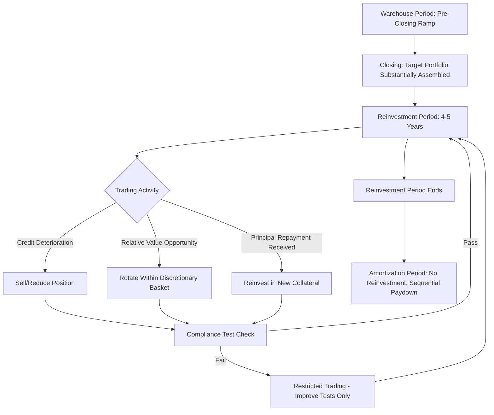

## CLO Manager Role and Portfolio Construction

### Definition and Scope

The CLO manager (collateral manager) is the asset management firm contractually responsible for selecting, acquiring, monitoring, trading, and eventually liquidating or amortizing the loan portfolio underlying a Collateralized Loan Obligation. Portfolio construction refers to the disciplined process of assembling and maintaining that collateral pool within indenture-defined constraints while pursuing the manager's credit selection strategy and fee-generation objectives.

### Role and Responsibilities of the CLO Manager

**Key Points**

1. **Credit selection** — Sourcing and underwriting individual leveraged loans for inclusion in the portfolio, applying independent fundamental credit analysis beyond the arranging bank's marketing materials.
2. **Portfolio compliance monitoring** — Ensuring the portfolio continuously satisfies all indenture-defined collateral quality tests, concentration limits, and coverage tests.
3. **Trading during the reinvestment period** — Actively buying and selling loans (subject to trading restrictions) to manage credit risk, capture relative value, and reinvest principal proceeds.
4. **Workout and restructuring management** — Handling distressed credits within the portfolio, including amend-and-extend negotiations, debt-for-equity exchanges, and bankruptcy claims administration.
5. **Reporting** — Providing periodic (monthly/quarterly) trustee reports, compliance certificates, and investor communications.
6. **Structuring input** — Working with arrangers/underwriters at CLO formation to negotiate indenture terms (test levels, concentration limits, basket sizes) that balance investor protection with manager flexibility.

### Manager Compensation Structure

| Fee Type | Typical Level | Payment Priority | Alignment Mechanism |
| --- | --- | --- | --- |
| Senior Management Fee | ~0.15-0.20% of collateral balance | Paid ahead of all debt tranches | Compensates baseline administration regardless of performance |
| Subordinated Management Fee | ~0.15-0.35% of collateral balance | Paid after all rated debt tranche interest | Aligns manager with successful debt service |
| Incentive Fee | ~20% of excess equity returns above hurdle | Paid only after equity hurdle return achieved | Aligns manager with equity holder outcomes |

[Inference — fee levels vary by manager reputation, deal vintage, and negotiating leverage; figures are illustrative of common market ranges]

### Portfolio Construction Objectives

**Key Points**

The manager must simultaneously optimize across competing constraints:

- **Yield maximization** — Selecting loans with attractive spread to maximize the interest arbitrage captured for equity holders.
- **Diversification** — Satisfying diversity score and concentration limit requirements (single obligor, industry, geography).
- **Credit quality management** — Maintaining weighted average rating factor (WARF) within required thresholds while avoiding excessive CCC-rated exposure.
- **Liquidity/tradability** — Favoring loans with reasonable secondary market liquidity to facilitate portfolio adjustments and potential need to sell credit-impaired positions.
- **Documentation quality** — Assessing covenant packages, EBITDA add-back aggressiveness, and structural protections (or lack thereof) in each prospective loan.

### Collateral Quality Test Framework Governing Construction

**Key Points**

1. **Weighted Average Rating Factor (WARF)** — Numeric conversion of portfolio credit ratings to a factor scale (lower factor = higher quality); must remain below indenture-specified maximum.
2. **Weighted Average Spread (WAS)** — Minimum required average spread across floating-rate collateral to ensure sufficient arbitrage to cover debt tranche costs.
3. **Weighted Average Life (WAL)** — Caps average remaining portfolio maturity to manage duration/reinvestment risk.
4. **Weighted Average Recovery Rate (WARR)** — Minimum required average expected recovery rate, often tied to Moody's or S&P recovery assumptions by loan seniority/collateral type.
5. **Diversity Score** — A statistical measure (originally developed by Moody's) approximating the number of independent, equally-sized, uncorrelated credits the portfolio's actual (correlated, industry-concentrated) exposures are equivalent to.

$$\text{WARF} = \frac{\sum_{i=1}^{n} (\text{Par}_i \times \text{RatingFactor}_i)}{\sum_{i=1}^{n} \text{Par}_i}$$

### Concentration Limitation Categories

| Category | Typical Limit | Purpose |
| --- | --- | --- |
| Single obligor | ~2% of portfolio | Prevent idiosyncratic default from causing outsized loss |
| Single industry (Moody's/S&P classification) | ~12-15% per industry | Manage sector correlation risk |
| CCC-rated assets | ~7.5% (excess often haircut in OC calc) | Limit deep credit risk concentration |
| Second-lien loans | Often capped or excluded entirely | Manage subordination risk within collateral |
| Covenant-lite loans | Sometimes capped, though widely permitted in modern CLOs | Manage documentation quality risk |
| Fixed-rate assets | Often capped (e.g., 5-10%) | Preserve floating-rate/floating-rate liability matching |
| Non-US obligors | Often capped | Manage jurisdictional/legal risk and rating agency treatment |

[Inference — specific limit percentages vary meaningfully by transaction, vintage, and rating agency criteria in effect at closing]

### Trading Restrictions During Reinvestment Period

**Key Points**

- **Discretionary trading basket** — A defined percentage of the portfolio (often 20-25% annually) the manager may trade for credit improvement or relative value reasons without additional restriction.
- **Credit risk/credit improved sales** — Generally unrestricted ability to sell assets the manager reasonably believes have deteriorated or improved in credit quality.
- **Maturity/amortization sales** — Sales tied to natural loan maturity or scheduled amortization are typically unrestricted.
- **Rating agency confirmation requirements** — Certain trades (particularly those affecting collateral quality tests materially) may require rating agency confirmation that ratings on outstanding notes will not be downgraded.

### Portfolio Construction Lifecycle

### Warehouse Period and Ramp-Up Risk

**Key Points**

- Before a CLO formally closes and issues rated notes, the manager typically uses a warehouse facility (financed by an investment bank or the eventual arranger) to begin accumulating loans.
- **Ramp-up risk** refers to the risk that the manager cannot assemble a sufficiently diversified, high-quality portfolio within the target timeframe and pricing assumptions, potentially due to primary loan market supply shortages or adverse market movements between warehouse funding and CLO pricing.
- Warehouse agreements typically include market value triggers and equity investor approval rights over specific collateral purchases, since the eventual CLO equity holders bear first-loss risk on warehouse-period decisions.

### Manager Track Record and Vintage Considerations

**Key Points**

- Manager selection by investors (particularly equity and junior debt buyers) heavily weighs historical default rates, recovery experience, and CCC bucket management across prior vintages.
- "Vintage risk" refers to the fact that CLOs formed just before a credit downturn (e.g., late-cycle vintages) tend to underperform regardless of manager skill, since they must fully ramp a portfolio in a richly-priced, tight-spread environment.
- Manager tiering (Tier 1 large, established managers vs. smaller/newer managers) affects both loan allocation access (larger managers often get better allocations from arrangers) and the pricing/spread investors demand on rated tranches. [Inference — tiering effects on pricing are a widely cited market pattern but not a precisely quantifiable constant]

### Manager Discretion vs. Rules-Based Constraints

**Key Points**

- Unlike a static/passive vehicle, CLO managers retain meaningful discretion in credit selection and trading — the CLO structure is fundamentally an actively managed vehicle wrapped in rules-based compliance guardrails.
- This dual nature (active management within rigid quantitative constraints) distinguishes CLOs from simpler securitizations (e.g., static RMBS/ABS pools) and is central to the manager's value proposition to equity investors.
- Poor portfolio construction decisions (excessive CCC concentration, industry concentration, aggressive covenant-lite/weak documentation selection) manifest over the life of the deal through OC test pressure and equity distribution volatility, even if not immediately visible.

### Conclusion

The CLO manager functions as both credit underwriter and structural compliance officer, constructing and maintaining a diversified leveraged loan portfolio that must simultaneously maximize the interest rate arbitrage available to equity holders and satisfy the quantitative collateral quality and concentration tests that protect rated noteholders. Manager skill is expressed primarily through credit selection discipline, defensive trading during stress, and CCC/distressed asset management — factors that differentiate CLO performance across managers and vintages far more than the mechanical waterfall structure itself, which is largely standardized across the market.

**Related Topics**

- Weighted Average Rating Factor (WARF) and Diversity Score Methodology
- CLO Warehouse Facilities and Ramp-Up Risk
- Manager Tiering and Its Effect on CLO Tranche Pricing
- CCC Bucket Management and Excess CCC Haircut Mechanics
- Amend-and-Extend Negotiations and Distressed Loan Workouts
- CLO Reset and Refinancing Transactions
- Covenant-Lite Loan Prevalence and Portfolio Documentation Risk