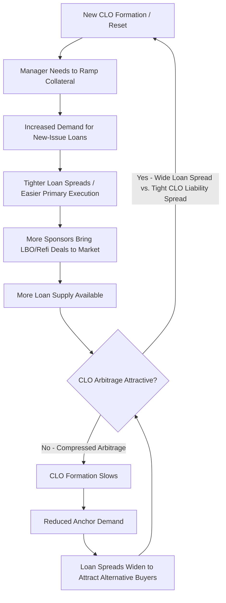

## CLOs as Anchor Demand in the Syndicated Loan Market

### Definition and Scope

CLOs function as the largest and most structurally persistent institutional buyer base for broadly syndicated leveraged loans, commonly described as "anchor demand" because their purchasing behavior — driven by structural reinvestment mandates rather than discretionary asset allocation — provides a baseline level of loan market liquidity and pricing support that other investor types (mutual funds, hedge funds, retail loan funds) do not reliably supply.

### Why CLOs Constitute Anchor Demand

**Key Points**

1. **Scale of ownership** — CLOs have historically held a majority share of the outstanding broadly syndicated leveraged loan market, commonly cited in market commentary as roughly 60-70% of the U.S. leveraged loan market in recent years [Unverified — precise share fluctuates with issuance and CLO formation cycles and should be confirmed against current market data for any specific period].
2. **Structural, non-discretionary demand** — During the reinvestment period, CLO managers are contractually required (subject to eligibility criteria) to redeploy principal proceeds into new collateral, creating recurring buy-side demand independent of the manager's short-term market view.
3. **Locked-in capital** — Unlike open-end mutual funds or ETFs, CLO liabilities are not subject to investor redemption risk; the CLO cannot be forced to sell collateral into a falling market to meet redemptions, making CLO demand more stable through volatility than retail-oriented loan fund demand.
4. **New issuance formation** — New CLO creation itself generates primary market demand, as newly formed vehicles must ramp a full portfolio (often $400M-$600M+ per CLO) shortly after or before pricing.

### Comparison of Loan Market Investor Types by Demand Stability

| Investor Type | Redemption Risk | Demand Behavior | Typical Holding Period |
| --- | --- | --- | --- |
| CLOs | None (locked structure) | Structural, reinvestment-driven | 4-5 year reinvestment period, often longer hold |
| Open-end loan mutual funds | High | Pro-cyclical (buy in inflows, sell in outflows) | Variable, can be short |
| Retail loan ETFs | High | Highly pro-cyclical | Often short |
| Insurance companies (direct) | Low | Long-duration, stable | Long-term, often buy-and-hold |
| Hedge funds/CLO arbitrage funds | Variable | Opportunistic, relative value driven | Variable |
| Separately managed accounts (SMAs) | Low-Moderate | Institutional, less liquidity-driven | Medium to long-term |

### Feedback Loop Between CLO Formation and Loan Issuance

### The CLO Arbitrage and Its Effect on Loan Market Conditions

**Key Points**

- CLO equity/manager economics depend on the "arbitrage" between the weighted average yield earned on the loan portfolio and the weighted average cost of the CLO's own rated debt liabilities.
- When loan spreads widen relative to CLO liability spreads (debt tranche pricing), the arbitrage improves, incentivizing new CLO formation — increasing loan demand and typically causing loan spreads to subsequently tighten.
- When loan spreads compress or CLO liability spreads widen (e.g., during risk-off periods when AAA CLO tranche investors demand more yield), the arbitrage deteriorates, CLO formation slows, and one of the loan market's primary demand sources contracts, which can itself pressure loan prices/spreads wider — a self-correcting but sometimes lagged feedback mechanism.

$$\text{CLO Arbitrage} \approx \text{Weighted Avg. Loan Yield} - \text{Weighted Avg. Cost of Debt Tranches} - \text{Fees}$$

### Impact on New-Issue Loan Terms and Documentation

**Key Points**

- Because CLOs are the dominant repeat buyer, their collateral eligibility criteria and concentration limits materially shape what loan features are marketable: loans that fail common CLO eligibility tests (e.g., certain second-lien structures, non-U.S. domiciled issuers without proper documentation, loans lacking a public or private rating) face a structurally smaller buyer pool.
- CLO documentation preferences (e.g., need for a public/private rating to be CLO-eligible, restrictions on certain payment-in-kind features) have historically influenced how arrangers structure new leveraged loans to maximize CLO placement capacity.
- The prevalence of covenant-lite loans in the broadly syndicated market is partly attributable to CLO investor tolerance (and even preference in competitive placement dynamics) for looser covenant packages relative to what a traditional bank-held loan structure historically required. [Inference — covenant-lite prevalence has multiple contributing causes beyond CLO demand alone, including sponsor negotiating leverage and general credit market conditions]

### CLO Demand Cyclicality and Loan Market Stress Periods

**Key Points**

- During periods of loan market stress (e.g., 2008-2009, March 2020), new CLO issuance typically slows sharply due to widened CLO liability spreads and rating agency/investor caution, temporarily removing a major demand pillar from the loan market.
- However, existing CLOs (already formed, within reinvestment periods) generally continue reinvesting principal proceeds even during stress, providing a partial demand floor that is structurally more resilient than open-end fund flows, which can reverse sharply amid retail redemptions.
- This divergence — new CLO formation being cyclical while existing CLO reinvestment demand is comparatively sticky — is a key distinction market participants use when assessing loan market technical conditions during volatility. [Inference — degree of "stickiness" can vary by the severity and duration of the specific stress episode]

### Interaction with Direct Lending/Private Credit Growth

**Key Points**

- As private credit has grown (see convergence discussion), some loans that would historically have been broadly syndicated and CLO-eligible are instead financed via direct lending, arguably reducing the pool of CLO-eligible primary supply for certain deal sizes.
- Conversely, middle-market CLOs have emerged as a structure that securitizes direct lending assets, effectively extending CLO-style anchor demand mechanics into the private credit space rather than being confined to broadly syndicated collateral.
- Some large managers have adapted by running platforms that source loans for both BSL CLOs and private credit vehicles, allocating based on relative execution economics rather than treating the two as fully separate origination channels.

### Loan Market Technical Indicators Tied to CLO Activity

**Key Points**

Market participants commonly monitor:

- **New CLO issuance volume** (quarterly/annual) as a proxy for incremental loan demand capacity.
- **CLO AAA spread levels** as an indicator of CLO formation economics and, by extension, likely loan demand intensity.
- **CLO reinvestment period expiration schedules** across the existing CLO universe, since vehicles exiting reinvestment periods shift from active buyers to amortizing (non-reinvesting) holders, gradually reducing aggregate structural demand from that cohort.

### Conclusion

CLOs provide the leveraged loan market with a demand base that is larger in scale and structurally more stable through market cycles than alternative institutional or retail buyer channels, because CLO liabilities are locked and reinvestment behavior is contractually driven rather than subject to redemption pressure. This anchor role means that CLO formation economics (the arbitrage between loan yields and CLO liability costs) function as a leading indicator of loan market liquidity conditions, and shifts in CLO-eligible collateral demand have historically shaped both loan pricing dynamics and documentation/covenant norms across the broadly syndicated market.

**Related Topics**

- CLO Arbitrage Economics and New Issuance Cyclicality
- Middle-Market CLOs and Direct Lending Securitization
- Covenant-Lite Loan Prevalence and Buyer Base Influence
- Loan Market Technical Conditions and Retail Fund Flow Volatility
- CLO AAA Tranche Spread as a Market Indicator
- Convergence and Complementarity Between Private Credit and BSL Markets
- CLO Reinvestment Period Expiration Wall Analysis