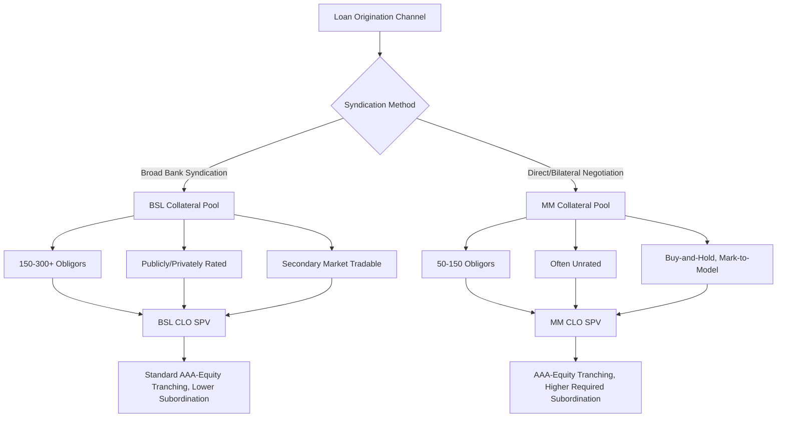

## Middle-Market CLOs versus Broadly Syndicated CLOs

### Definition and Scope

Middle-Market CLOs (MM CLOs) and Broadly Syndicated CLOs (BSL CLOs) are both securitization vehicles that tranche a pooled loan portfolio into rated debt and equity, but they differ fundamentally in the origination channel, credit characteristics, liquidity profile, and structural protections of their underlying collateral. MM CLOs securitize privately originated, directly negotiated middle-market and direct lending loans, while BSL CLOs securitize widely syndicated, broadly distributed leveraged loans.

### Core Comparative Framework

| Dimension | Broadly Syndicated CLO (BSL CLO) | Middle-Market CLO (MM CLO) |
| --- | --- | --- |
| Collateral origination | Widely syndicated loans (bank-arranged, broadly distributed) | Directly originated/negotiated loans (private credit/direct lending) |
| Typical issuer EBITDA | Often >$50M | Often $10M-$75M, though large-cap direct lending overlap is growing |
| Collateral liquidity | Actively traded secondary market | Illiquid, buy-and-hold |
| Loan ratings | Often publicly or privately rated | Frequently unrated |
| Number of underlying obligors | 150-300+ (highly granular) | Often 50-150 (less granular) |
| Documentation | Standardized (LSTA-influenced) | Bespoke, lender-negotiated |
| Manager sourcing model | Purchases loans in primary/secondary syndication | Originates loans directly or via direct lending platform affiliate |
| Valuation basis | Mark-to-market feasible (observable prices) | Mark-to-model (limited observable pricing) |
| Typical deal size | $400M-$600M+ | $300M-$500M (varies, smaller historically, growing) |

### Structural Similarities Retained

**Key Points**

Despite collateral differences, MM CLOs and BSL CLOs share the same fundamental architecture:

1. Both use a bankruptcy-remote SPV issuer structure.
2. Both tranche debt from AAA (or high investment grade equivalent) down to unrated equity.
3. Both employ OC/IC coverage tests as the primary structural credit enhancement mechanism.
4. Both have reinvestment periods (though MM CLO reinvestment periods can differ in length) followed by amortization periods.
5. Both compensate the manager via senior/subordinated management fees plus potential incentive fees.

### Rating Agency Treatment Differences

**Key Points**

- Because MM CLO collateral is frequently unrated (or rated only via private/shadow ratings), rating agencies apply distinct, more conservative default and recovery assumptions when assigning ratings to MM CLO debt tranches compared to BSL CLOs with observable public ratings on collateral.
- MM CLO transactions often require higher subordination levels (more credit enhancement) at each rating category than comparably rated BSL CLO tranches, reflecting the additional uncertainty embedded in unrated, less granular, less liquid collateral. [Inference — exact subordination differential varies by rating agency methodology and specific transaction, but the general direction — MM CLOs requiring more enhancement — is a well-established market pattern]
- Rating agencies typically require a demonstrated manager track record in direct/middle-market lending before assigning ratings to a new MM CLO manager's transactions, given the greater reliance on manager underwriting judgment absent public market price discovery.

### Diversification and Concentration Limit Differences

**Key Points**

- MM CLOs typically hold fewer, larger individual loan positions relative to portfolio size, resulting in lower diversity scores than BSL CLOs of similar total collateral size.
- Single-obligor concentration limits in MM CLOs are often set higher in percentage terms than BSL CLO norms (reflecting the practical reality of a smaller eligible obligor universe), which rating agencies compensate for via higher required subordination.
- Industry concentration can be more pronounced in MM CLOs depending on the sponsor/manager's origination focus (e.g., a direct lending platform concentrated in healthcare or software middle-market credits).

### Structural Comparison Diagram

### Manager Model Differences

**Key Points**

- **BSL CLO managers** typically operate as pure asset managers/portfolio traders — they purchase existing loans from the syndicated market and rarely originate loans themselves.
- **MM CLO managers** are frequently affiliated with, or are the same entity as, a direct lending platform — meaning the "manager" role often overlaps with the loan origination function itself (the manager may have led or co-led the original loan negotiation with the borrower).
- This origination-manager overlap in MM CLOs creates closer alignment between underwriting quality and CLO performance, but also introduces potential conflicts of interest (e.g., allocation decisions between a manager's direct lending fund and its MM CLO vehicle for the same origination opportunity) that require robust allocation policies.

### Liquidity and Trading Constraints

**Key Points**

- BSL CLO managers can actively trade the portfolio, exiting deteriorating credits via secondary market sales — a risk management tool largely unavailable to MM CLO managers.
- MM CLO managers manage credit deterioration primarily through workout negotiation, covenant enforcement, and potential follow-on capital provision rather than portfolio sales, since a liquid market for most middle-market loans does not exist.
- This liquidity constraint is a key reason rating agencies and investors demand additional structural protections (higher subordination, sometimes more conservative advance rates on financing facilities) for MM CLOs.

### Growth of Large-Cap Direct Lending and the Blurring Boundary

**Key Points**

- As discussed in the broader private credit/BSL convergence context, some MM CLO managers now originate loans for borrowers of a scale that would historically have accessed the BSL market directly, narrowing the traditional size-based distinction between the two CLO types.
- Some "broadly syndicated" CLO managers have launched middle-market or private credit-focused CLO strategies as separate vehicles, reflecting platform diversification rather than a change in the fundamental structural distinction between the two CLO types.
- Despite this borrower-size convergence, the origination model distinction (widely syndicated purchase vs. direct negotiation) and the resulting liquidity/documentation differences remain the defining structural differentiators between MM CLOs and BSL CLOs. [Inference — the pace and extent of continued convergence is subject to ongoing market evolution and is not a settled endpoint]

### Investor Base Differences

**Key Points**

- BSL CLO debt tranches attract a broad institutional investor base including banks (for AAA tranches, subject to regulatory capital treatment), insurance companies, asset managers, and CLO-focused funds.
- MM CLO debt tranches, reflecting the additional complexity and reduced transparency, tend to attract a narrower, more specialized investor base — often insurance companies seeking incremental yield with a demonstrated tolerance for less liquid, less transparent structured credit, and specialized structured credit funds.
- Equity tranches in both structures are often retained partially or wholly by the manager or its affiliates, though this is particularly common and sometimes structurally required in MM CLOs given the closer origination-manager relationship.

### Warehouse and Ramp Considerations

**Key Points**

- Ramp-up risk (discussed in CLO manager/portfolio construction content) is generally more pronounced for MM CLOs, since assembling a diversified pool of directly originated loans takes longer than purchasing existing loans in an active secondary/primary syndicated market.
- MM CLO warehouse periods are therefore often longer, and warehouse facility providers apply more conservative advance rates given the illiquid, harder-to-value nature of the accumulating collateral.

### Conclusion

Middle-Market CLOs and Broadly Syndicated CLOs share an identical structural chassis — tranched debt, OC/IC coverage tests, reinvestment/amortization phases — but diverge sharply in collateral liquidity, rating transparency, diversification, and the origination-manager relationship. These differences translate directly into higher required subordination levels, narrower investor bases, and more limited active trading capability for MM CLOs, while also reflecting a genuine, growing overlap in borrower scale as private credit and direct lending platforms increasingly finance larger transactions historically reserved for the broadly syndicated market.

**Related Topics**

- Rating Agency Methodology for Unrated Collateral in Structured Credit
- Direct Lending Platform Conflicts of Interest and Allocation Policies
- Diversity Score Calculation and Its Impact on Required Subordination
- CLO Warehouse Facilities and Ramp-Up Risk
- Convergence and Complementarity Between Private Credit and BSL Markets
- Insurance Company Demand for Structured Credit Yield
- Manager Equity Retention Practices in CLO Structures