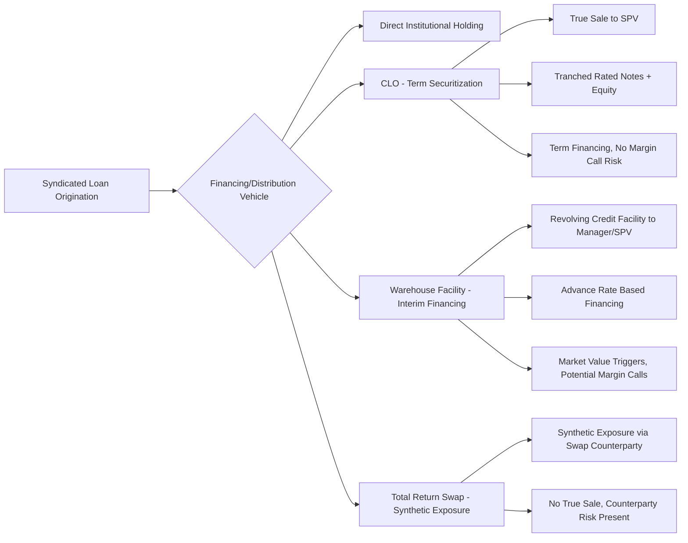

## Securitization Concepts Relevant to Loan Syndication

### Definition and Scope

This topic covers the foundational securitization concepts that underpin how syndicated loans are pooled, tranched, and financed through structured vehicles — primarily CLOs, but also related structures such as loan warehouse facilities and total return swap financing. Understanding these concepts is essential to grasping how loan syndication and structured credit markets interact, since a substantial share of demand for syndicated loans originates from securitization vehicles rather than direct institutional buyers.

### Core Securitization Principles

**Key Points**

1. **True sale and bankruptcy remoteness** — Assets are legally transferred to a special purpose vehicle (SPV) in a manner intended to survive the bankruptcy of the originator/seller, isolating the collateral pool from the credit risk of the entity that assembled it.
2. **Tranching/subordination** — Cash flows from a pool of assets are redirected to create securities with different risk-return profiles, with subordinate tranches absorbing losses before senior tranches.
3. **Credit enhancement** — Mechanisms (overcollateralization, excess spread, reserve accounts) that provide a buffer protecting senior securities from underlying asset losses.
4. **Cash flow waterfall** — The contractually defined sequential distribution of collections to fees, expenses, and tranches in priority order.
5. **Diversification/granularity** — Pooling many individual obligations reduces idiosyncratic risk concentration relative to holding any single loan directly.

### Bankruptcy Remoteness Mechanics

**Key Points**

- The SPV is typically structured as a limited-purpose entity with restricted activities (it can only hold the specified collateral and issue the specified securities), independent directors for certain approval matters, and non-petition/non-consolidation language in transaction documents.
- Legal opinions (true sale opinions, non-consolidation opinions) are typically obtained at closing to support the conclusion that the transferred assets would not be treated as property of the originator's bankruptcy estate.
- This isolation is what allows a CLO's rated debt to be assessed primarily on the credit quality of the collateral pool and structure, rather than on the credit quality of the collateral manager or loan originators. [Fact — standard securitization legal architecture; specific opinion requirements vary by jurisdiction and transaction]

### Credit Enhancement Techniques Relevant to Loan Securitization

| Technique | Mechanism | Application in CLOs |
| --- | --- | --- |
| Subordination | Junior tranches absorb losses first | Core CLO structural feature (equity/mezzanine below senior debt) |
| Overcollateralization | Collateral par value exceeds debt tranche par value | OC tests divert cash to delever senior notes if breached |
| Excess spread | Collateral yield exceeds liability cost | Captured by equity holders as residual cash flow |
| Reserve accounts | Cash reserve funded to cover shortfalls | Less common in CLOs than in consumer ABS; more common in some private credit securitizations |
| Third-party guarantees/wraps | External credit support | Largely absent in modern CLOs (more common pre-2008 in other ABS sectors) |

### Diversity and Correlation Concepts

**Key Points**

- **Diversity Score** (originating from Moody's rating methodology) statistically approximates how many independent, equally-weighted, uncorrelated obligors a portfolio's actual (correlated, industry-concentrated) holdings are equivalent to for default risk purposes.
- Higher diversity scores generally support higher achievable ratings on senior tranches for a given portfolio credit quality, because idiosyncratic single-name defaults are diluted across more independent exposures.
- Industry correlation matters as much as raw obligor count — a portfolio of 200 loans concentrated in a single cyclical industry offers less true diversification benefit than 200 loans spread across many uncorrelated sectors.

$$\text{Diversity Score} \approx \sum_{\text{industries}} f(\text{number of obligors, industry correlation assumptions})$$

[Note: exact diversity score calculation methodologies are proprietary to each rating agency and involve specific correlation matrices; the formula above is illustrative of the concept, not a literal calculation.]

### Tranching Mathematics — Expected Loss Allocation

**Key Points**

Rating agencies size tranches by modeling portfolio loss distributions (often via Monte Carlo simulation incorporating default probability, correlation, and recovery assumptions) and determining what level of subordination is required for each tranche to achieve a target expected loss or probability of default consistent with its desired rating.

$$P(\text{Tranche Loss} > 0) = P(\text{Portfolio Loss} > \text{Subordination Below Tranche})$$

A simplified conceptual illustration: if a tranche has 30% subordination beneath it, that tranche experiences no principal loss unless cumulative portfolio losses (net of recoveries) exceed 30% of original collateral par — an extreme scenario for a diversified, primarily first-lien senior secured loan portfolio under most economic conditions.

### Cash Flow Modeling Concepts

**Key Points**

- **Static pool analysis** — Modeling how a fixed collateral pool's cash flows would default, prepay, and recover over time absent reinvestment, often used as a stress-testing baseline even for actively managed CLOs.
- **Prepayment/reinvestment risk** — Uncertainty regarding how quickly collateral repays and whether the manager can reinvest proceeds at comparable yields, directly affecting excess spread generation for equity holders.
- **Interest rate risk/basis risk** — Both CLO assets (floating-rate loans, typically SOFR-indexed) and liabilities (floating-rate rated notes, also SOFR-indexed) are generally floating rate, substantially reducing interest rate mismatch risk relative to fixed-rate securitizations, though basis risk can arise from differing reset frequencies or floor mismatches between assets and liabilities.

### Securitization Structural Comparison: CLO vs. Other Loan-Related Structures

### Warehouse Facilities as Pre-Securitization Financing

**Key Points**

- Before a CLO closes, managers typically use a warehouse facility (a revolving credit line from an investment bank or arranger) to begin acquiring loans, financed at an advance rate against collateral value.
- Warehouse facilities often include market value triggers (requiring additional equity contribution or facility paydown if collateral value declines) — a margin call-like feature absent from the term CLO structure itself once closed.
- Successfully "terming out" a warehouse into a closed CLO transfers financing from a facility with mark-to-market/margin call risk into a structure with locked-in, non-callable term financing — a key risk transition point in the CLO formation lifecycle.

### Total Return Swaps and Synthetic Loan Exposure

**Key Points**

- A total return swap (TRS) allows an investor to gain economic exposure to a loan or loan portfolio's total return (interest plus price appreciation/depreciation) without directly owning or financing the underlying asset, with a bank/dealer counterparty holding legal title.
- TRS structures introduce counterparty credit risk (exposure to the swap dealer) that does not exist in a true-sale CLO structure, and are generally used for shorter-duration, more tactical exposure rather than as a substitute for term CLO financing.
- These structures are conceptually related to securitization in that they replicate tranched/leveraged loan exposure economics but do not involve an actual asset transfer or rated note issuance.

### Regulatory Capital Treatment Relevance

**Key Points**

- Securitization tranching directly affects regulatory capital treatment for bank investors: senior CLO tranches (AAA) generally receive favorable risk-weighting treatment under bank capital rules relative to holding an equivalent amount of the unsecuritized underlying loans directly, reflecting the credit enhancement embedded in the structure.
- This regulatory capital efficiency is a meaningful driver of bank demand for senior CLO tranches specifically, separate from the pure yield/risk economics of the underlying loan portfolio. [Inference — the precise capital efficiency benefit depends on the specific regulatory capital framework applicable to a given bank and jurisdiction, which is subject to ongoing regulatory revision]

### Why These Concepts Matter for Loan Syndication Practitioners

**Key Points**

- Loan arrangers must understand CLO eligibility criteria (documentation standards, rating requirements, structural features) when structuring new leveraged loans, since CLO demand absorption capacity directly affects primary syndication execution.
- Understanding tranching and subordination logic helps practitioners interpret how loan market technical conditions (CLO formation pace, AAA spread levels) translate into loan pricing and demand dynamics.
- Familiarity with warehouse and ramp-up mechanics is relevant when advising or analyzing new CLO manager entrants or platform expansions, since ramp risk directly affects near-term loan demand from that specific vehicle.

### Conclusion

Securitization concepts — true sale, tranching, subordination, credit enhancement, and diversity-adjusted portfolio risk assessment — provide the structural logic underlying CLOs, the dominant institutional buyer of syndicated loans. Understanding how these mechanisms convert a pool of similarly-rated leveraged loans into a differentiated capital structure, and how pre-securitization financing (warehouses) and synthetic alternatives (total return swaps) fit around the term CLO structure, is foundational to analyzing the interaction between loan syndication markets and structured credit demand.

**Related Topics**

- True Sale and Bankruptcy Remoteness Legal Opinions in Securitization
- Diversity Score and Correlation Assumptions in Rating Agency Methodology
- CLO Warehouse Facilities and Market Value Trigger Mechanics
- Total Return Swap Financing for Leveraged Loan Exposure
- Bank Regulatory Capital Treatment of Securitization Tranches
- Static Pool Cash Flow Modeling and Stress Testing
- CLOs as Anchor Demand in the Syndicated Loan Market