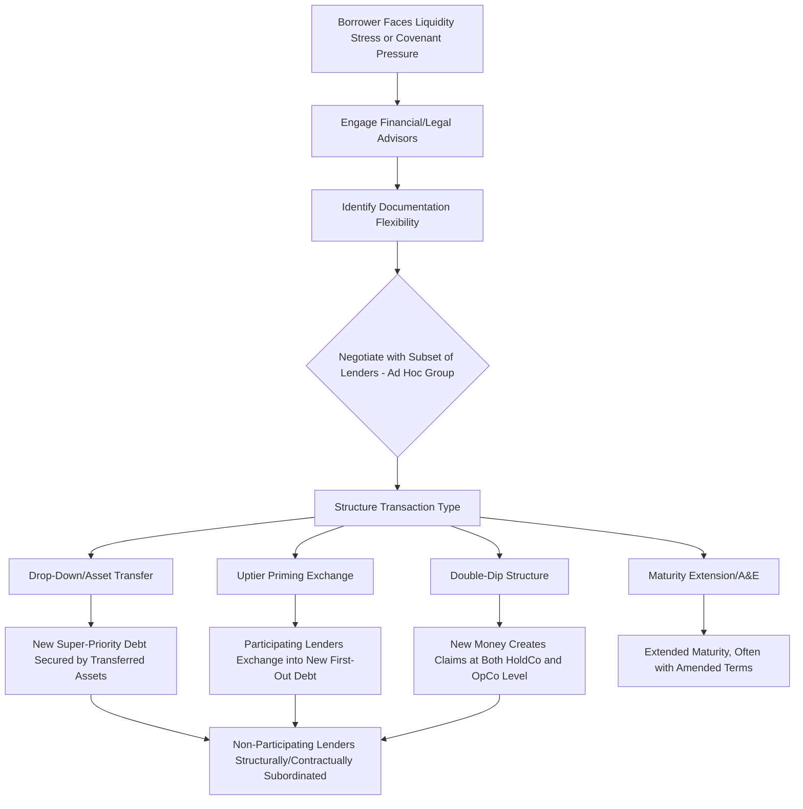

## Liability Management Exercises: Objectives and Triggers

### Definition and Scope

Liability Management Exercises (LMEs) are transactions undertaken by a financially stressed borrower — typically in coordination with a subset of its existing lenders — to restructure, refinance, subordinate, or otherwise alter the terms of its debt obligations outside of a formal bankruptcy or judicial restructuring process. LMEs exploit flexibility embedded in existing credit agreement provisions (often provisions not originally intended to enable such transactions) to improve the borrower's liquidity position, extend maturities, or raise new capital, frequently at the expense of non-participating creditors.

### Primary Objectives of an LME

**Key Points**

1. **Liquidity extension** — Raising new money (often structured as super-priority debt) to fund near-term operating needs or upcoming maturities without a full bankruptcy filing.
2. **Maturity extension** — Pushing out near-term debt maturities to avoid a refinancing cliff, particularly when capital markets access is impaired or prohibitively expensive.
3. **Debt reduction/deleveraging** — Exchanging existing debt for new debt and/or equity at a discount to par, reducing overall leverage.
4. **Priority improvement for participating lenders** — Allowing a subset of lenders (often an "ad hoc group") to exchange into new debt with superior collateral priority relative to non-participating lenders in the same original tranche.
5. **Covenant relief** — Amending financial or negative covenants to provide operational flexibility without a formal waiver process involving the full lender group.
6. **Avoiding formal bankruptcy costs and stigma** — LMEs are generally faster, less publicly disclosed, and less costly than Chapter 11, preserving customer/supplier/employee confidence.

### Common Triggering Conditions

**Key Points**

- **Covenant breach or imminent breach** — Approaching or breaching a maintenance covenant (leverage ratio, interest coverage) under a credit agreement, creating default risk absent lender accommodation.
- **Near-term maturity wall** — Debt maturing within 12-24 months that cannot be refinanced on acceptable terms in the open market given the borrower's credit deterioration.
- **Liquidity shortfall** — Insufficient cash flow or revolver availability to fund operations, capital expenditures, or interest payments over the forecast horizon.
- **Credit rating downgrade cascade** — Downgrades triggering collateral posting requirements, cross-default provisions, or loss of market access.
- **Sponsor unwillingness to inject equity** — Private equity sponsors often prefer creditor-funded solutions (LMEs) over injecting new equity capital, especially where the existing equity position is already significantly impaired.
- **Permissive documentation ("weak covenants")** — The presence of loose restricted payment baskets, unrestricted subsidiary designation flexibility, or ambiguous pro rata sharing provisions in the credit agreement is often a necessary precondition — LMEs exploit specific documentary gaps rather than being generically available in all credit agreements.

### The Documentation Loopholes That Enable LMEs

| Provision | Original Intent | LME Exploitation |
| --- | --- | --- |
| Unrestricted subsidiary designation | Allow flexibility for non-core investments/JVs | Transfer valuable collateral (IP, key assets) out of the credit group's security package into an unrestricted subsidiary, then raise new debt secured against it |
| Restricted payments/investment baskets | Allow ordinary course dividends/investments | Use available basket capacity to transfer assets or make investments benefiting only a subset of lenders |
| Pro rata sharing/"sacred rights" provisions | Ensure equal treatment among lenders in the same tranche | Ambiguous drafting sometimes allows amendments with less-than-unanimous consent to subordinate non-participating lenders |
| Open market purchase provisions | Allow borrower to buy back its own debt at a discount | Combined with new money priming debt to effectuate below-par exchanges |
| Amendment/majority lender consent thresholds | Facilitate ordinary amendments without unanimous consent | Used to approve transactions that effectively subordinate or prime non-consenting minority lenders |

### LME Transaction Flow — Conceptual Overview

### Key Transaction Archetypes (Overview — Detailed in Subsequent Topics)

**Key Points**

- **Uptier exchanges/priming transactions** — Participating lenders exchange existing debt for new debt with superior priority, effectively subordinating non-participating holders of the same original tranche.
- **Drop-down/asset transfer transactions** — Valuable collateral or subsidiaries are transferred to unrestricted subsidiaries, then used to secure new financing that existing lenders' liens do not reach.
- **Double-dip structures** — New money is structured to create claims at multiple levels of the corporate structure (e.g., both a HoldCo guarantee and an OpCo loan), effectively multiplying the new lender's claim relative to existing creditors.
- **Amend-and-extend (A&E)** — A comparatively cooperative, less contentious LME variant where maturities are pushed out, often with modestly improved economics for consenting lenders, without necessarily subordinating non-participants.

### Objectives from the Sponsor's Perspective

**Key Points**

- Preserve equity value optionality by avoiding a bankruptcy filing that could result in equity being wiped out or heavily diluted.
- Maintain operational control and avoid the disruption, cost, and public disclosure associated with Chapter 11.
- Use creditor-on-creditor dynamics (offering select lenders improved terms in exchange for providing new capital or consent) to extract value transfer from non-participating creditors without requiring sponsor equity contribution.

### Objectives from the Participating Lender's Perspective

**Key Points**

- Improve position relative to other lenders in the same tranche by obtaining superior priority, better collateral, or more favorable economics on the new debt received.
- Provide new money at attractive pricing/terms (often at a significant premium yield with strong structural protection) given the borrower's need for liquidity.
- Gain influence over the borrower's future restructuring path by aligning with the sponsor early, potentially positioning for a larger recovery or control position in a subsequent restructuring or bankruptcy.

### Consequences for Non-Participating Lenders

**Key Points**

- **Structural subordination** — Non-participating lenders may find their claims are now junior to newly issued debt or transferred collateral no longer securing their original loan.
- **Reduced recovery expectations** — Value that would have been available to all pro rata lenders is redirected to participating lenders/new money providers.
- **Litigation as primary recourse** — Non-participating lenders often challenge LMEs in court, alleging breach of pro rata sharing provisions, implied covenant of good faith and fair dealing violations, or fraudulent transfer, since contractual remedies are often limited by the documentation flexibility that enabled the transaction in the first place.

### Market and Documentation Response to LME Prevalence

**Key Points**

- The frequency of high-profile LMEs (several notable transactions across 2020-2024 involving priming, drop-down, and double-dip structures) has prompted lenders to negotiate tighter "LME protection" provisions in new credit agreements: stricter unrestricted subsidiary designation limits, tighter pro rata sharing "sacred rights" language, and "J.Crew blockers" and "Serta blockers" named after prominent early LME cases. [Fact — these named protective provisions are a well-documented market response, though adoption is not universal across all new issuance]
- This has created a bifurcation in the market between "LME-protected" documentation (increasingly common in new issuance, particularly post-2022) and legacy documentation that remains vulnerable to these techniques.

### Why LMEs Have Proliferated

**Key Points**

1. Growth of covenant-lite and generally permissive documentation during the extended low-rate, borrower-friendly market environment preceding rate increases.
2. Increased participation of distressed debt and special situations investors who specialize in identifying and exploiting documentary flexibility.
3. Sponsors' strong preference for creditor-funded solutions over equity dilution or contribution.
4. Precedent effect — successful early LMEs (both from a borrower/participating-lender economic perspective and in surviving initial legal challenges) encouraged replication across subsequent stressed credits.

### Conclusion

Liability Management Exercises represent a distinct restructuring pathway that operates through the exploitation of documentary flexibility in existing credit agreements rather than through formal insolvency proceedings, driven by borrower liquidity needs, covenant pressure, and sponsor preference to avoid equity dilution. Understanding the objectives (liquidity, maturity extension, deleveraging, priority improvement) and the triggering conditions (covenant stress, maturity walls, permissive documentation) provides the foundation for analyzing the specific transaction archetypes — uptier exchanges, drop-downs, and double-dips — and the creditor-on-creditor conflict dynamics they generate.

**Related Topics**

- Uptier Priming Transactions and Creditor-on-Creditor Litigation
- Drop-Down Financing and Unrestricted Subsidiary Transfers
- Double-Dip Structures and Multi-Level Claim Creation
- J.Crew and Serta Blocker Provisions in Modern Credit Documentation
- Pro Rata Sharing Provisions and Sacred Rights Erosion
- Amend-and-Extend Transactions as a Cooperative LME Alternative
- Fraudulent Transfer and Implied Covenant Litigation in LME Disputes