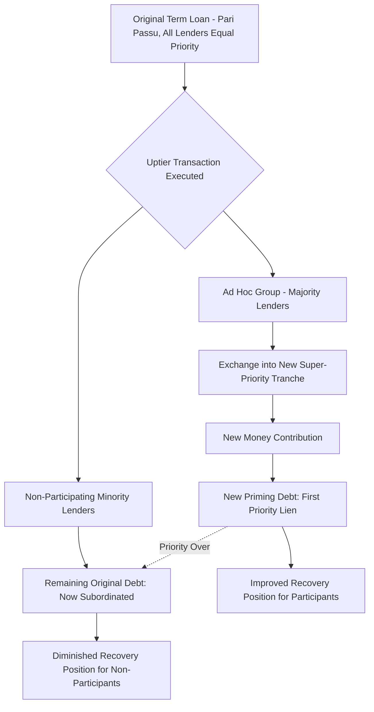

## Uptiering Transactions and Priming Debt

### Definition and Scope

An uptiering transaction (also called an uptier exchange) is a liability management transaction in which a subset of a borrower's existing lenders exchange their current debt for new debt that is structurally or contractually senior — "primed" — to the debt held by non-participating lenders in the same original tranche. The new debt is typically accompanied by new money and secured by a superior claim on collateral, effectively subordinating non-participants without their consent, often achieved through majority-lender amendment mechanics rather than unanimous approval.

### Core Mechanics

**Key Points**

1. **Majority lender solicitation** — The borrower, in coordination with a sponsor and an ad hoc group of lenders holding a majority (or the contractually required threshold) of the affected tranche, negotiates an exchange transaction.
2. **New super-priority tranche creation** — An amendment (often relying on provisions requiring only majority/Required Lender consent rather than unanimous consent) creates a new tranche of debt with priority senior to the existing tranche.
3. **Exchange offer** — Participating lenders exchange their existing (now-subordinated) debt for the new senior/priming debt, often at attractive terms (higher coupon, tighter covenants benefiting them, potential fees).
4. **New money infusion** — Participating lenders frequently provide additional new capital as part of the transaction, which also receives priming status, addressing the borrower's liquidity needs.
5. **Non-participant subordination** — Lenders who do not participate remain holders of the original tranche, which is now contractually subordinated to the new priming debt — despite having originally held pari passu (equal ranking) claims.

### Legal Basis for Priming Without Unanimous Consent

**Key Points**

- Most credit agreements designate certain terms as "sacred rights" requiring unanimous or affected-lender consent (e.g., reducing principal, extending maturity, releasing all collateral).
- However, many agreements do not explicitly designate "priority of payment" or "lien priority ranking amongst same-tranche lenders" as a sacred right, or contain ambiguous language regarding pro rata sharing that courts have, in some cases, interpreted as permitting non-pro-rata payment waterfall amendments with only majority consent.
- Uptier proponents rely on provisions permitting the incurrence of additional priority debt (e.g., permitted debt/lien baskets, "open market purchase" provisions, or amendment provisions allowing majority lenders to reallocate payment priority) that were not necessarily drafted with this application in mind.
- This reliance on documentary ambiguity — rather than an explicit contractual right to prime — is the central legal vulnerability that has driven extensive litigation. [Fact — this describes the general legal mechanism relied upon; specific enforceability outcomes are fact-and-jurisdiction-specific and contested]

### Uptiering Transaction Structure Diagram

### Illustrative Priority Waterfall Before and After

| Priority Rank | Before Uptier | After Uptier |
| --- | --- | --- |
| 1st (Highest) | Original Term Loan (all lenders, pari passu) | New Super-Priority Tranche (participating lenders + new money) |
| 2nd | Unsecured/Subordinated Debt | Original Term Loan (non-participating lenders only — now subordinated) |
| 3rd | Equity | Unsecured/Subordinated Debt |
| 4th | — | Equity |

### Economic Rationale for Participating Lenders

**Key Points**

- Participating lenders improve their expected recovery by moving from a pari passu position (shared equally with all original lenders) to a senior, often over-collateralized position ahead of non-participants.
- New money provided as part of the transaction often carries attractive pricing (high coupon, OID, or fees) reflecting the borrower's distressed state, compensating for the incremental risk of providing fresh capital.
- Participating in the ad hoc group provides influence over the borrower's restructuring trajectory, positioning participants favorably for any subsequent transaction or bankruptcy process.

### Notable Litigation Themes (General Patterns, Not Case-Specific Predictions)

**Key Points**

Non-participating lenders challenging uptier transactions have generally advanced several recurring legal theories:

1. **Breach of pro rata sharing provisions** — Arguing the transaction violates express or implied requirements that payments and collateral proceeds be shared ratably among same-tranche lenders.
2. **Breach of the implied covenant of good faith and fair dealing** — Arguing that even if the literal contract language permits the technique, exercising that discretion specifically to injure non-participants violates an implied duty.
3. **Sacred rights violation** — Arguing that priority subordination constitutes an effective reduction in the value of non-participants' claims requiring unanimous consent under the credit agreement's sacred rights provisions.
4. **Tortious interference** — Claims against the arranging/lead parties for interfering with the non-participants' contractual rights.

Outcomes across various disputed uptier transactions have been mixed and fact-specific, turning heavily on the precise documentary language of each credit agreement; this remains an actively litigated and evolving area of law rather than one with a single settled precedent. [Unverified — legal outcomes are jurisdiction- and document-specific and continue to develop; readers should consult current case law for any specific situation]

### Distinguishing Uptiering from Simple Priming (New Money Only)

**Key Points**

- Not all priming transactions are contentious "uptiers" in the litigated sense — a borrower can raise new super-priority debt with unanimous existing lender consent (a cooperative priming transaction), which raises no creditor-on-creditor conflict.
- The controversial element specifically arises when: (a) the transaction is approved by less than all affected lenders, and (b) non-consenting lenders are subordinated as a structural side effect, often without having been offered a genuine opportunity to participate on equivalent terms — sometimes referred to as an "open" versus "closed" process, with closed processes (where only a pre-selected ad hoc group may participate) generating the most significant conflict and litigation.

### Impact on Non-Participating Lenders' Recovery Analysis

$$\text{Non-Participant Recovery} = \max\left(0, \text{Enterprise Value} - \text{Priming Debt Claim} - \text{Other Senior Claims}\right) \times \frac{\text{Non-Participant Claim}}{\text{Total Subordinated Tranche Claim}}$$

**Key Points**

This illustrates the mechanical effect: as the priming debt claim grows (through both the exchanged principal and new money), the residual enterprise value available to satisfy non-participant claims shrinks correspondingly, independent of any change in the underlying business's actual value.

### Documentation Responses: LME Protection Provisions

**Key Points**

- **"Serta blockers"** — Provisions requiring that any new priority debt be offered pro rata to all existing lenders in the affected tranche (an "open participation" requirement), directly targeting the closed-process uptier structure.
- **Strengthened pro rata sharing "sacred rights"** — Explicitly designating priority/waterfall ranking changes as requiring unanimous or affected-lender consent, closing the ambiguity uptier transactions have historically exploited.
- **Tighter definitions of "Required Lenders" and voting mechanics** — Reducing the ability of a bare majority to bind the full lender group on priority-altering amendments.

### Practical Considerations for Deal Structuring Practitioners

**Key Points**

- When drafting new credit agreements, counsel for lenders increasingly negotiate explicit sacred rights protection against non-pro-rata priming as standard practice in more protective documentation regimes.
- When advising a stressed borrower or sponsor, understanding whether existing documentation contains genuine flexibility (versus documentation with modern LME-protective language) is a threshold analysis before pursuing an uptier strategy.
- When representing potential non-participating lenders, promptly reviewing pro rata sharing, sacred rights, and permitted debt/lien basket provisions is critical to assessing litigation posture and negotiating leverage before a transaction closes.

### Conclusion

Uptiering transactions leverage majority-lender amendment mechanics and documentary ambiguity to reallocate priority among originally pari passu lenders, benefiting participating lenders and the sponsor at the direct expense of non-participants. The technique's proliferation has driven a bifurcation in credit documentation between legacy agreements vulnerable to these structures and modern agreements incorporating explicit protective provisions, while the underlying legal enforceability of specific uptier transactions remains a fact-intensive, actively litigated question rather than a settled area of law.

**Related Topics**

- Drop-Down Financing and Unrestricted Subsidiary Transfers
- Double-Dip Structures and Multi-Level Claim Creation
- Serta and J.Crew Blocker Provisions in Modern Credit Documentation
- Pro Rata Sharing Provisions and Sacred Rights Drafting
- Implied Covenant of Good Faith and Fair Dealing in Credit Agreements
- Ad Hoc Lender Group Formation and Coordination Dynamics
- Fraudulent Transfer Claims in Liability Management Litigation