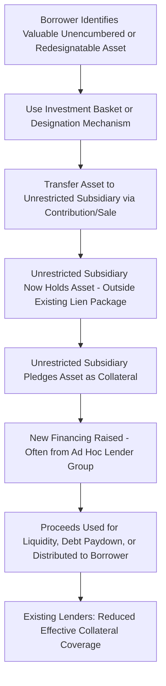

## Drop-Down Financings and Unrestricted Subsidiaries

### Definition and Scope

A drop-down financing is a liability management transaction in which a borrower transfers valuable assets or subsidiaries — typically ones not currently pledged as collateral or capable of being redesignated as unrestricted — out of the credit group that secures existing lenders' claims, into an unrestricted subsidiary or other entity outside the existing lien package. That entity then pledges the transferred assets to secure new financing, raising liquidity for the borrower while leaving existing lenders' claims effectively unsecured against those assets going forward.

### The Restricted/Unrestricted Subsidiary Framework

**Key Points**

1. **Restricted subsidiaries** — Entities subject to the full covenant package of the credit agreement (negative covenants, financial covenants, reporting requirements) and typically part of the collateral/guarantee structure securing existing lenders.
2. **Unrestricted subsidiaries** — Entities the borrower has designated (usually via a covenant-permitted "designation" mechanism) as outside the credit agreement's covenant package; they are not bound by negative covenants and are not guarantors or collateral providers for the existing facility.
3. **Designation flexibility** — Most credit agreements permit the borrower to designate restricted subsidiaries as unrestricted (and sometimes vice versa) subject to conditions such as investment basket capacity, pro forma covenant compliance, and designation notice requirements — a provision originally intended to facilitate joint ventures, non-core investments, or project financings without subjecting them to the full covenant package.
4. **The LME exploitation** — Drop-down transactions use this designation flexibility (or investment/asset transfer baskets) to move a core, valuable asset (often intellectual property, a key operating subsidiary, or a valuable brand) out of the restricted group, then use it to secure new financing that existing lenders' collateral package does not reach.

### Mechanical Steps in a Drop-Down Transaction

### Sources of Capacity for the Asset Transfer

**Key Points**

- **Restricted payment baskets** — Available capacity under dividend/investment covenants (often including a "starter basket," a builder basket tied to cumulative net income, and general/available amount baskets) can be used to fund a transfer or investment into an unrestricted subsidiary.
- **Investment covenant baskets** — Similar mechanism, specifically permitting investments in non-guarantor or unrestricted entities up to a specified dollar or percentage-of-EBITDA threshold.
- **Unrestricted subsidiary designation conditions** — Typically require no default/event of default at the time of designation and pro forma compliance with financial covenants, but often do not require lender consent beyond satisfying these conditions.
- **Ratio-based (incurrence) covenant flexibility** — In documentation using incurrence-based rather than maintenance covenants, the borrower may have substantial unused capacity to effect these transfers without triggering a default, particularly in stronger-performing periods before the stress that later prompts the LME.

### Illustrative Example — Structural Mechanics

**Example**

A retail borrower with a valuable trademark portfolio (previously pledged as collateral under its existing term loan) uses available investment basket capacity to contribute the trademark portfolio to a newly formed unrestricted subsidiary in exchange for equity in that subsidiary. Because the equity interests in unrestricted subsidiaries are often excluded from the collateral package (a common "excluded asset" carve-out), and because the trademark itself now sits in an entity outside the restricted group, the existing term loan lenders' lien no longer covers the trademark. The unrestricted subsidiary then pledges the trademark to secure a new priming loan, with proceeds upstreamed to the borrower to fund near-term liquidity needs — leaving original lenders secured only by the borrower's remaining, less valuable collateral.

### Collateral Coverage Impact Analysis

| Metric | Before Drop-Down | After Drop-Down |
| --- | --- | --- |
| Collateral pool value (illustrative) | $500M (includes key IP asset valued at $150M) | $350M (key IP asset removed) |
| Existing term loan outstanding | $400M | $400M |
| Implied collateral coverage ratio | 1.25x | 0.875x |
| New priming debt secured by transferred asset | $0 | $100M (secured by transferred IP) |

[Inference — figures are illustrative only to demonstrate the mechanical effect on coverage ratios; actual asset values and transaction structures vary significantly by transaction]

### Legal Theories Available to Challenged Lenders

**Key Points**

1. **Breach of covenant** — Arguing the designation or transfer exceeded actual basket capacity or failed to satisfy stated conditions precedent (a fact-intensive contractual compliance question, sometimes the strongest available claim if basket capacity was genuinely insufficient).
2. **Fraudulent transfer** — Arguing the transfer was made for less than reasonably equivalent value while the borrower was insolvent or rendered insolvent by the transfer, potentially unwindable under state fraudulent transfer statutes or the Bankruptcy Code (if a subsequent bankruptcy filing occurs).
3. **Breach of implied covenant of good faith and fair dealing** — Similar to uptier litigation theories, arguing the designation mechanism was exercised in a manner inconsistent with the parties' reasonable expectations at contract formation, even if literally permitted.
4. **Tortious interference/aiding and abetting breach of fiduciary duty** — Potential claims against new lenders or advisors who structured or financed the transaction with knowledge of its effect on existing lenders.

Outcomes turn heavily on the specific documentary language governing basket capacity, designation conditions, and valuation methodology used for the transferred assets — this remains a fact-intensive and jurisdiction-specific area. [Unverified — legal outcomes vary significantly by the specific facts and governing law of each transaction]

### Valuation Disputes as a Central Battleground

**Key Points**

- Because "reasonably equivalent value" is central to fraudulent transfer analysis, and because basket capacity calculations often depend on the value assigned to the transferred asset, valuation methodology disputes are frequently the central battleground in drop-down litigation.
- Borrowers and participating lenders typically use valuation methodologies supporting a finding that adequate consideration was received (e.g., borrower receiving equity in the unrestricted subsidiary of ostensibly equivalent value) and that basket capacity was sufficient.
- Non-participating lenders typically challenge these valuations, arguing the transferred asset's true value substantially exceeded what basket capacity or consideration analysis assumed.

### Documentation Responses: "J.Crew Blockers"

**Key Points**

- Named after an early, prominent transaction involving trademark assets transferred to an unrestricted subsidiary, "J.Crew blockers" are protective provisions now common in more protective new credit agreements that directly restrict the ability to designate subsidiaries holding material intellectual property or other specified valuable assets as unrestricted, or that cap the value of assets that can be transferred to unrestricted subsidiaries regardless of technical basket availability.
- Additional protective drafting includes tightening the definition of "Investments" to explicitly capture asset contributions (not just cash investments), and requiring enhanced disclosure/notice before any material designation.
- As with uptier-protective drafting, adoption of J.Crew blockers is a market response concentrated in more recently negotiated, lender-protective documentation, while a substantial body of legacy debt remains without these protections. [Fact — describes a well-documented market drafting trend; the specific extent of adoption across the broader market at any given time should be verified against current market surveys]

### Interaction with Double-Dip and Uptier Structures

**Key Points**

- Drop-down transactions are frequently combined with uptier or double-dip elements: the transferred asset may secure new debt that is itself structured to also create a claim against the original restricted group (a double-dip), or the transaction may be paired with an exchange offer for existing lenders to move into the new priming structure.
- This combination — asset transfer plus priming plus multi-level claims — represents the most aggressive and most heavily litigated category of liability management transactions, as it compounds several distinct sources of value transfer away from non-participating creditors simultaneously.

### Practical Due Diligence Considerations

**Key Points**

- Lenders negotiating new credit agreements should carefully review unrestricted subsidiary designation conditions, investment/restricted payment basket sizing and definitions, and any carve-outs for intellectual property or other strategically valuable assets.
- Existing lenders monitoring a stressed credit should track available basket capacity (often disclosed in compliance certificates or calculable from public financial statements) as an early warning indicator of drop-down transaction feasibility.
- Distressed debt investors evaluating a credit for potential LME exposure typically conduct detailed "documentation diligence" specifically focused on basket capacity and designation mechanics as part of their investment thesis.

### Conclusion

Drop-down financings exploit the flexibility credit agreements typically provide for subsidiary designation and investment/restricted payment baskets — provisions generally drafted for legitimate corporate flexibility purposes — to relocate valuable assets outside the reach of existing lenders' collateral package, then leverage those assets to raise new, often priming, financing. The technique's legal vulnerability centers on covenant compliance and fraudulent transfer analysis, both of which turn heavily on asset valuation and basket capacity calculations, and has driven the widespread adoption of "J.Crew blocker" provisions in more protective modern credit documentation.

**Related Topics**

- Uptiering Transactions and Priming Debt
- Double-Dip Structures and Multi-Level Claim Creation
- Fraudulent Transfer Analysis in Liability Management Litigation
- Restricted Payment and Investment Basket Mechanics
- J.Crew and Serta Blocker Provisions in Modern Credit Documentation
- Unrestricted Subsidiary Designation Conditions and Covenant Drafting
- Valuation Disputes in Distressed Debt Litigation