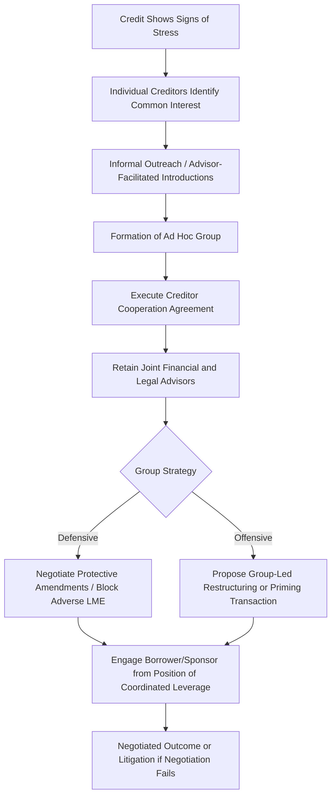

## Creditor Cooperation Agreements and Group Formation

### Definition and Scope

A creditor cooperation agreement (CCA) is a contractual arrangement among a subset of a borrower's creditors that governs how they will act collectively in response to a stressed credit situation, liability management exercise, or restructuring. Group formation refers to the broader process by which unaffiliated creditors — often holding fragmented positions across a syndicate or bond issuance — organize into a coordinated bloc to increase negotiating leverage, defend against adverse liability management transactions, or pursue an affirmative restructuring strategy.

### Why Creditors Form Groups

**Key Points**

1. **Negotiating leverage** — A fragmented creditor base has limited ability to influence borrower or sponsor behavior; a coordinated group holding a blocking or majority position can demand a seat at the negotiating table.
2. **Defensive response to LME threats** — Following the proliferation of uptiering and drop-down transactions, creditors increasingly organize proactively to prevent being left as non-participants subject to subordination.
3. **Information sharing** — Group formation allows creditors to pool diligence resources, share legal analysis of credit agreement flexibility, and develop a common view of enterprise value and recovery scenarios.
4. **Economies of scale in advisory costs** — Engaging financial and legal advisors is expensive; a cooperating group shares these costs across members rather than each creditor separately retaining counsel.
5. **Achieving voting thresholds** — Many credit agreement amendments, waivers, and liability management transactions require majority or supermajority lender consent; a coordinated group can achieve (or block) these thresholds where individual creditors could not.

### Core Provisions of a Creditor Cooperation Agreement

**Key Points**

- **Standstill/lock-up commitments** — Members agree not to take unilateral action (e.g., accelerating debt, exercising remedies, or independently negotiating with the borrower) for a specified period, preserving group cohesion.
- **Information sharing protocols** — Provisions governing how diligence materials, financial models, and legal analysis are shared among members, including confidentiality and trading restrictions (see below).
- **Voting/decision-making mechanics** — Thresholds required for the group to take collective action (e.g., 66⅔% of group holdings to approve a group response to a borrower proposal).
- **Exclusivity/non-circumvention provisions** — Restrictions on individual members separately negotiating side deals with the borrower or sponsor that would undermine the group's collective position.
- **Fee and expense sharing** — Allocation of advisor costs across group members, often pro rata to position size.
- **Trading restrictions/wall-crossing provisions** — Rules governing whether and how members can trade the underlying debt while possessing shared confidential information (addressed in detail below).
- **Withdrawal/termination mechanics** — Conditions under which a member may exit the group and the consequences of doing so (e.g., forfeiture of shared work product, "most favored nations" fee clawback).

### Group Formation Process — Conceptual Flow

### Types of Creditor Groups by Objective

| Group Type | Primary Objective | Typical Composition |
| --- | --- | --- |
| Defensive ad hoc group | Prevent being primed/subordinated by an uptier or drop-down transaction | Broad cross-section of non-insider lenders |
| Offensive/proactive ad hoc group | Position to participate in and benefit from an LME (new money, priming debt) | Often distressed debt specialists, sometimes with pre-existing relationships to the sponsor |
| Steering committee (formal restructuring context) | Represent creditor class in formal Chapter 11 negotiations | Often court-recognized or borrower-negotiated representative group |
| Crossover group | Represent creditors holding positions across multiple tranches (e.g., both term loan and bonds) | Investors with multi-tranche exposure seeking coordinated cross-capital-structure leverage |

### Antitrust and Securities Law Considerations

**Key Points**

- **Antitrust scrutiny** — Creditor group coordination, particularly standstill and non-circumvention provisions, can raise antitrust concerns if the group's conduct is viewed as anticompetitive collective action rather than legitimate creditor coordination; most CCAs include provisions and legal analysis intended to structure the agreement within recognized safe harbors for creditor cooperation.
- **Securities law and material non-public information (MNPI)** — Group formation frequently involves sharing confidential financial information from the borrower, which can constitute MNPI, particularly relevant for members who also hold or trade the borrower's publicly traded securities (bonds, and especially equity if the borrower is public).
- **"Big boy" letters and wall-crossing** — Members receiving confidential information are often required to become "restricted" (unable to trade the affected securities) or to execute "big boy" letters acknowledging the information asymmetry if trading continues on a claims-only (non-security) basis where applicable.
- **Public vs. private side arrangements** — Larger, more sophisticated participants sometimes maintain both a "public side" (unrestricted, able to trade) and "private side" (restricted, MNPI-exposed) team internally, with information barriers between them.

### Ad Hoc Group vs. Official Committee (Formal Bankruptcy Context)

**Key Points**

- **Ad hoc groups** are self-organized, contractually bound creditor coalitions that exist independent of any formal bankruptcy process — they can form pre-petition and often continue to act as a cohesive negotiating bloc if a Chapter 11 filing follows.
- **Official committees** (e.g., an Official Committee of Unsecured Creditors) are appointed by the U.S. Trustee in a Chapter 11 case, owe fiduciary duties to the entire represented creditor class (not just their own economic interest), and operate under bankruptcy court oversight — a materially different legal posture than an ad hoc group, which owes no such fiduciary duty to non-members.
- Ad hoc groups often retain greater strategic flexibility (since they represent only their own members' interests) but lack the official committee's standing, court-appointed professional fee reimbursement rights, and broader creditor class legitimacy.

### Cooperation Agreements as a Response to LME Proliferation

**Key Points**

- The rise of uptiering and drop-down transactions has directly increased the prevalence and sophistication of pre-emptive creditor cooperation agreements, since creditors have learned that fragmented, uncoordinated lender bases are structurally vulnerable to being primed or subordinated by a coordinated sponsor-aligned minority.
- Modern CCAs increasingly include explicit provisions addressing potential LME scenarios: commitments to jointly evaluate and respond to any priming or drop-down proposal, and sometimes pre-negotiated "most favored nations" provisions ensuring that if any subset of the group is later offered improved terms by the borrower, all group members receive equivalent treatment.
- This defensive evolution reflects a broader "arms race" dynamic in the leveraged finance market between sponsor/borrower liability management strategies and lender coordination countermeasures. [Inference — characterizing this as an "arms race" is a common market description rather than a precisely measurable phenomenon]

### Practical Formation Challenges

**Key Points**

- **Free-rider problem** — Creditors who do not join the group may still benefit from the negotiating leverage and outcomes the group achieves, without sharing advisory costs, creating an incentive misalignment that can complicate group formation.
- **Divergent economic interests** — Even among nominally similarly situated creditors, differences in cost basis, hedging positions, or exposure to other tranches of the capital structure can create friction in agreeing on group strategy and priorities.
- **Confidentiality and reputational risk** — Some potential participants may be reluctant to become "restricted" (MNPI-walled) given their trading operations' need for flexibility, limiting group size or requiring careful structuring of information tiers.
- **Sponsor/borrower counter-strategies** — Borrowers and sponsors sometimes attempt to fragment emerging creditor coordination through selective early outreach or by offering favorable terms to specific large holders to prevent unified group formation.

### Role of Financial and Legal Advisors

**Key Points**

- Investment banks and restructuring advisory firms frequently facilitate ad hoc group formation, identifying creditors with aligned interests and coordinating initial organizational outreach.
- Legal counsel drafts the CCA itself, structures information-sharing and trading wall protocols, and provides the antitrust and securities law analysis supporting the group's cooperative structure.
- Financial advisors typically develop the group's independent view of enterprise value, recovery analysis, and alternative transaction structures to support negotiating positions against the borrower/sponsor's proposals.

### Conclusion

Creditor cooperation agreements and group formation have become a central defensive and offensive tool in modern leveraged finance, enabling fragmented creditors to achieve the coordinated leverage necessary to negotiate effectively with sponsors and borrowers — particularly in response to the proliferation of uptiering and drop-down liability management transactions. Effective group formation requires careful navigation of antitrust considerations, MNPI/trading wall management, and the inherent coordination challenges of aligning creditors with potentially divergent economic interests, typically facilitated by specialized financial and legal advisors.

**Related Topics**

- Uptiering Transactions and Priming Debt
- Drop-Down Financings and Unrestricted Subsidiaries
- Material Non-Public Information (MNPI) and Trading Wall Protocols in Distressed Debt
- Official Committees vs. Ad Hoc Groups in Chapter 11 Proceedings
- Antitrust Considerations in Creditor Coordination
- Most Favored Nations Provisions in Liability Management Transactions
- Steering Committee Formation in Cross-Border Restructurings