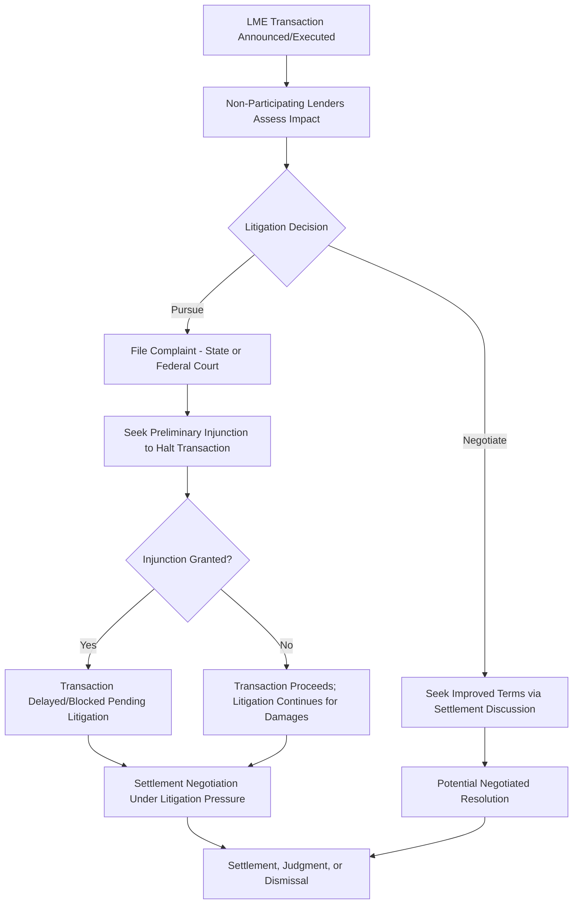

## Creditor-on-Creditor Conflict and Non-Pro-Rata Litigation

### Definition and Scope

Creditor-on-creditor conflict refers to disputes arising when a subset of lenders within an originally pari passu credit facility obtains improved treatment — through priming, asset transfers, or exclusive new financing opportunities — at the direct expense of non-participating lenders holding the same class of debt. Non-pro-rata litigation encompasses the legal actions brought by disadvantaged creditors challenging these transactions, typically alleging breach of contractual sharing provisions, breach of implied duties, or fraudulent conveyance.

### The Shift from Debtor-Creditor to Creditor-Creditor Conflict

**Key Points**

- Traditional restructuring and bankruptcy analysis has historically centered on debtor-creditor conflict: the tension between a distressed borrower/sponsor's interests (preserving equity value, operational control) and creditors' collective interest in maximizing recovery.
- Liability management exercises have introduced a distinct and increasingly dominant conflict axis: creditor-on-creditor conflict, where the borrower/sponsor effectively acts as a facilitator enabling one subset of creditors to gain advantage over another subset, rather than the borrower bearing the primary adversarial role.
- This shift has been described by market participants and commentators as fundamentally changing the strategic calculus for lenders, who must now assess not only the borrower's credit quality but also the risk of being structurally disadvantaged by fellow lenders within the same instrument. [Inference — this characterization reflects a widely observed market commentary trend rather than a single quantifiable metric]

### Core Legal Theories in Non-Pro-Rata Litigation

**Key Points**

1. **Breach of express pro rata sharing provisions** — Most credit agreements contain provisions requiring that payments received by any lender (including through setoff) be shared ratably among all lenders in the same class; litigation often centers on whether the challenged transaction technically violates this provision or merely restructures priority in a manner the provision does not address.
2. **Breach of implied covenant of good faith and fair dealing** — Even where literal contract language may permit a transaction, courts in some jurisdictions have recognized that discretion granted under a contract must be exercised in good faith, and that using majority-lender amendment mechanics specifically to injure minority lenders may breach this implied duty.
3. **Sacred rights violations** — Arguing that priority subordination or payment waterfall alteration constitutes an amendment requiring unanimous or affected-lender consent under provisions the agreement designates as "sacred," even if not literally captured by the sacred rights list's specific enumerated items.
4. **Fraudulent transfer** — Where assets are moved (drop-down transactions) for allegedly less than reasonably equivalent value while the borrower is insolvent or rendered insolvent, potentially unwindable under state law or the Bankruptcy Code.
5. **Tortious interference with contract** — Claims against the arranging lenders, new money providers, or advisors who structured the transaction, alleging they knowingly interfered with non-participants' contractual rights.
6. **Aiding and abetting breach of fiduciary duty** — In some cases, claims against sponsors or directors alleging breach of fiduciary duties owed to the company (and derivatively to creditors in the zone of insolvency in certain jurisdictions), with participating lenders or advisors named as aiders and abettors.

### Litigation Process Flow

### Key Contractual Provisions at the Center of Disputes

| Provision | Function | Litigation Relevance |
| --- | --- | --- |
| Pro rata sharing clause | Requires ratable distribution of payments among same-class lenders | Central textual basis for breach claims |
| Sacred rights/unanimous consent list | Enumerates amendments requiring full or affected-lender consent | Disputed whether priority changes are implicitly included |
| Required Lenders definition | Sets voting threshold for non-sacred-right amendments | Determines whether majority truly had authority to approve the transaction |
| Permitted debt/lien baskets | Allows incurrence of additional debt/liens up to specified capacity | Determines whether new priming debt was validly authorized |
| Open market purchase provisions | Allows borrower to repurchase its own debt | Sometimes combined with exchange mechanics to effect below-par transactions |

### Damages and Remedies Sought

**Key Points**

- **Injunctive relief** — Non-participating lenders often seek a preliminary injunction to halt a pending transaction before it closes, since post-closing remedies (unwinding a completed exchange or asset transfer) are typically far more difficult to obtain.
- **Rescission** — Seeking to unwind the challenged transaction entirely, restoring the original pari passu priority structure.
- **Monetary damages** — Seeking compensation for the diminished value of claims resulting from subordination, often requiring expert valuation testimony regarding enterprise value and hypothetical recovery absent the transaction.
- **Declaratory judgment** — Seeking a court ruling on the proper interpretation of disputed contractual provisions, which can have precedential value for the specific credit agreement's construction even absent a fully litigated damages outcome.

### Settlement as the Common Resolution Path

**Key Points**

- A substantial proportion of creditor-on-creditor disputes are resolved through negotiated settlement rather than final judgment, reflecting both parties' interest in avoiding prolonged litigation costs and uncertainty, and the borrower's ongoing need for a stable capital structure and creditor relationships. [Inference — the general prevalence of settlement over litigated judgment is a common pattern in complex commercial litigation broadly, though specific settlement rates for this transaction category specifically are not comprehensively tracked in public data]
- Settlements often involve improved terms for previously non-participating lenders (partial participation rights in the new priming structure, cash payments, or amended terms on their remaining claims) rather than full reversal of the underlying transaction.
- The threat of litigation and reputational risk associated with contested LME transactions has itself become a negotiating factor sponsors and arranging lenders weigh when structuring transactions, sometimes leading to more inclusive "open" participation processes designed to reduce litigation exposure even before a transaction closes.

### Jurisdictional and Governing Law Considerations

**Key Points**

- Most large syndicated credit agreements designate New York law as governing law, and New York courts (state and federal) have handled the majority of prominent creditor-on-creditor disputes, developing an evolving body of interpretation regarding pro rata sharing and implied covenant claims in this context.
- Outcomes are highly fact-specific and turn on the precise drafting of the individual credit agreement at issue; practitioners generally caution against assuming a single "rule" governs all uptier or drop-down disputes given the meaningful variation in credit agreement language across transactions. [Unverified — case law in this area continues to develop and specific precedential weight should be assessed against current legal research for any specific situation]

### Market and Behavioral Consequences

**Key Points**

- **Repricing of documentation risk** — Lenders now more explicitly price in the risk of documentary flexibility being exploited against them, factoring "LME risk" into pricing and covenant negotiation for new issuance.
- **Bifurcated market for legacy vs. protected documentation** — Debt governed by older, more permissive credit agreements may trade at a discount reflecting perceived vulnerability to future LME transactions, all else equal, compared to debt with modern protective provisions. [Inference — this pricing effect is a commonly cited market dynamic but is difficult to isolate and quantify precisely given the many factors affecting loan/bond trading levels]
- **Increased due diligence costs** — Distressed debt investors and even performing credit investors increasingly conduct detailed "LME vulnerability" documentation review as a standard part of investment diligence, adding to transaction costs across the market.

### Distinguishing Legitimate Majority Action from Actionable Conflict

**Key Points**

- Not all majority-lender action that disadvantages a minority is legally actionable — credit agreements are generally designed to permit majority governance on most non-sacred-right matters, and courts have generally been reluctant to second-guess legitimate business decisions made within the bounds of contractual authority.
- The dividing line in litigation typically centers on whether the transaction (a) exceeded the actual scope of authority granted by the relevant provisions, (b) was structured with the specific intent to exploit ambiguity to injure the minority rather than serve a legitimate independent business purpose, or (c) involved self-dealing or bad faith beyond ordinary majority governance.
- This fact-intensive line-drawing is precisely why so much of this area remains contested and unsettled across jurisdictions and specific transactions. [Unverified — the precise legal boundary continues to be shaped by ongoing litigation and varies by jurisdiction]

### Conclusion

Creditor-on-creditor conflict has emerged as a defining feature of modern leveraged finance distress, shifting a meaningful portion of restructuring-related legal and strategic activity away from the traditional debtor-creditor axis toward disputes among lenders who originally held equal-ranking claims. Non-pro-rata litigation — grounded in breach of contract, implied covenant, and fraudulent transfer theories — remains a fact-intensive and jurisdictionally variable area of law, with outcomes turning heavily on the precise drafting of the credit agreement at issue, and has materially influenced both new-issuance documentation practices and the broader market's approach to pricing and diligencing liability management risk.

**Related Topics**

- Uptiering Transactions and Priming Debt
- Drop-Down Financings and Unrestricted Subsidiaries
- Implied Covenant of Good Faith and Fair Dealing in Credit Agreements
- Fraudulent Transfer Analysis in Liability Management Litigation
- J.Crew and Serta Blocker Provisions in Modern Credit Documentation
- Creditor Cooperation Agreements and Group Formation
- Documentation Risk Pricing in Leveraged Loan and Bond Markets