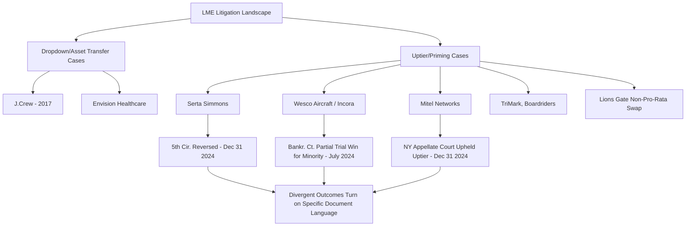

## Landmark Case Precedents in Liability Management Litigation

### Definition and Scope

This topic surveys the specific judicial and bankruptcy court decisions that have shaped the enforceability, interpretation, and litigation risk profile of liability management exercises (LMEs). Unlike the conceptual/mechanical treatment of uptiering and drop-down transactions covered elsewhere, this content focuses on named case precedents, their procedural postures, holdings, and the doctrinal patterns emerging across a still-developing and jurisdictionally fragmented body of law.

**Note on currency**: This area of law has moved rapidly through 2023–2026. The summary below reflects search-verified information current as of this response; practitioners should confirm citation status and any subsequent appeals before relying on specific holdings.

### Case Precedent Landscape Overview

### J.Crew (2016–2017) — The Origin Transaction

**Key Points**

- J.Crew transferred valuable intellectual property assets to an unrestricted subsidiary structure, then used that IP as collateral to secure new financing — the transaction that gave rise to the "drop-down"/"unrestricted subsidiary" (unsub) transaction category and the term "J. Crew" as commonly known shorthand in leveraged finance for this transaction type. [Quinn Emanuel](https://www.quinnemanuel.com/the-firm/publications/client-alert-liability-management-exercises-managing-litigation-risks-in-financing-for-distressed-borrowers/)
- The transaction became the namesake for "J.Crew blockers" — now-common credit agreement provisions restricting a borrower's ability to transfer material intellectual property to unrestricted subsidiaries, discussed in the Drop-Down Financings topic.
- Subsequent transactions of this type (including Envision Healthcare, discussed below) prompted further-refined protective drafting, since J.Crew blockers focused narrowly on intellectual property but left other assets unprotected, prompting creditors to request additional broader asset-transfer limitations designed to prevent transfers of "crown jewel" assets more generally. [Norton Rose Fulbright](https://www.nortonrosefulbright.com/en/knowledge/publications/e245aa48/liability-management-transactions)

### Serta Simmons Bedding — The Central Uptier Precedent

**Key Points**

- **Background**: Serta faced economic challenges beginning in 2019 tied to the restructuring of its largest retail partner and increased direct-to-consumer competition; in 2020 it needed new capital to weather the COVID-19 pandemic and pursued an uptiering transaction supported by its majority lenders rather than the drop-down alternative some lenders had favored. [Norton Rose Fulbright](https://www.nortonrosefulbright.com/en/knowledge/publications/e245aa48/liability-management-transactions)
- **Bankruptcy court decision (2023)**: The Southern District of Texas Bankruptcy Court initially held in favor of Serta and its participating lenders, finding the transaction did not violate the credit agreement because the company used "open market purchases" — an undefined term — to facilitate the non-pro-rata debt exchange, in *In re Serta Simmons Bedding, LLC*, 2023 WL 3855820 (Bankr. S.D. Tex. June 6, 2023). The court also rejected the excluded lenders' implied covenant of good faith and fair dealing argument, reasoning the lenders were aware the credit agreement was a deliberately "loose document". [Quinn Emanuel](https://www.quinnemanuel.com/the-firm/publications/lead-article-liability-management-exercises-what-they-are-and-what-they-mean-for-market-participants/)[Quinn Emanuel](https://www.quinnemanuel.com/the-firm/publications/lead-article-liability-management-exercises-what-they-are-and-what-they-mean-for-market-participants/)
- **Fifth Circuit reversal (2024)**: On appeal, the Fifth Circuit reversed, holding the 2016 uptier transaction was not an "open market purchase" given the plain meaning of "market" and the surrounding contractual context, meaning Serta and the participating lenders could not rely on that exception to bypass the pro-rata sharing and unanimous consent requirements otherwise applicable. This decision, *In re Serta Simmons Bedding, L.L.C.*, 125 F.4th 555 (5th Cir. Dec. 31, 2024), is widely regarded as the landmark uptier appellate ruling. [Quinn Emanuel](https://www.quinnemanuel.com/the-firm/publications/lead-article-liability-management-exercises-what-they-are-and-what-they-mean-for-market-participants/)
- **Significance**: The reversal transformed Serta from a template for successful uptier execution into a cautionary precedent, and directly drove the market-wide adoption of "Serta blockers" in new documentation.

### Wesco Aircraft / Incora — Bankruptcy Trial on the Merits

**Key Points**

- **Transaction structure**: A majority noteholder group holding 51% of certain notes, lacking the required two-thirds vote to release collateral liens under the 2024 and 2026 Note indentures, executed a multi-step transaction in which the majority group issued new notes to itself to push its effective ownership above the two-thirds threshold, then proceeded with the non-pro-rata exchange. [FindLaw](https://caselaw.findlaw.com/court/us-ban-crt-s-d-tex-hou-div/116894404.html)
- **Summary judgment (2024)**: The court found certain uptier claims survived summary judgment and proceeded to a fact-finding trial beginning January 25, 2024, with the key disputed issues being whether the exchange was properly characterized as a permitted "open market purchase" versus a "redemption" that would have required pro-rata treatment under the indentures, and whether the multi-step transaction constituted a "single, integrated transaction" requiring a two-thirds vote from pre-transaction noteholders. [Ropes & Gray LLP](https://www.ropesgray.com/en/insights/alerts/2024/02/can-reasonable-minds-disagree-wesco-sends-uptier-claims-to-fact-finding)[Harvard](https://bankruptcyroundtable.law.harvard.edu/2024/05/21/can-reasonable-minds-disagree-wesco-sends-uptier-claims-to-fact-finding/)
- **Trial ruling (July 2024)**: After a six-month trial, Bankruptcy Judge Marvin Isgur issued a preliminary oral ruling holding that the non-pro-rata March 2022 exchange of some but not all of the company's unsecured notes was not permitted under the unsecured notes' indenture — a partial win for the minority/non-participating noteholders. [Jones Day](https://www.jonesday.com/en/practices/experience/2024/07/jones-day-obtains-favorable-preliminary-oral-ruling-in-wescoincora-adversary-proceeding-on-behalf-of-client)
- **Tortious interference claims allowed**: Notably, Judge Isgur allowed tortious interference claims brought by non-participating noteholders against both the debtor and the participating noteholders to proceed to trial, raising the novel possibility that participating creditors themselves — not just the borrower — could bear liability for an unwound LME. [Harvard](https://bankruptcyroundtable.law.harvard.edu/2024/05/21/can-reasonable-minds-disagree-wesco-sends-uptier-claims-to-fact-finding/)
- **District court review**: A subsequent district court review held that Wesco's 2022 financing transaction complied with the indentures governing the 2024 and 2026 Notes, construing the debtholders' "sacred rights" provisions narrowly — illustrating that even within a single case, different courts and stages of review reached differing conclusions on similar facts. [Chapman and Cutler LLP](https://www.chapman.com/publication-wesco-incora-district-court-construes-debtholder-sacred-rights-narrowly-and-raises-questions-for-participant-lenders)
- **Chapter 11 resolution**: Incora's Chapter 11 process ultimately cut approximately $2 billion of debt following the uptier dispute, with a plan effective date of January 31, 2025; DIP note principal and exit premiums of approximately $324 million converted into new exit notes, 1L and 2026 noteholders received $420 million in new takeback notes plus the bulk of new common equity, while general unsecured claims of roughly $650-690 million shared approximately 1.60% of new common equity. [ElevenFlo](https://elevenflo.com/blog/incora-wesco-aircraft-bankruptcy-uptier-litigation)

### Mitel Networks — The Contrasting Outcome

**Key Points**

- On the **same day** as the Fifth Circuit's Serta reversal, a New York appellate court upheld Mitel's uptier transaction, basing its decision on distinct credit agreement language that expressly authorized loan assignments — a materially different documentary basis than the "open market purchase" ambiguity at issue in Serta. [ElevenFlo](https://elevenflo.com/blog/incora-wesco-aircraft-bankruptcy-uptier-litigation)
- This same-day divergence is frequently cited by practitioners as the clearest illustration that the Incora, Serta Simmons, and Mitel Networks cases produced divergent outcomes on the enforceability of uptier transactions specifically because of differences in the underlying governing document language, not because of a single overarching rule about uptier transactions generally. [ElevenFlo](https://elevenflo.com/blog/incora-wesco-aircraft-bankruptcy-uptier-litigation)

### Other Notable Litigated Transactions

**Key Points**

- **TriMark, Boardriders**: Cited alongside Wesco as examples where non-bankruptcy (state) courts took a similar skeptical approach to non-pro-rata transactions, suggesting bankruptcy courts should no longer be assumed to be a uniformly "friendly forum" for liability management transactions predicated on non-pro-rata exchanges. [Ropes & Gray LLP](https://www.ropesgray.com/en/insights/alerts/2024/02/can-reasonable-minds-disagree-wesco-sends-uptier-claims-to-fact-finding)
- **TPC Group, Robertshaw**: Additional companies where uptier transactions featured prominently in litigated recapitalizations, with several later filing for bankruptcy and differing litigation outcomes, some subject to ongoing appeals — underscoring that this remains an active, unsettled area rather than one with fully resolved precedent. [Quinn Emanuel](https://www.quinnemanuel.com/the-firm/publications/client-alert-liability-management-exercises-managing-litigation-risks-in-financing-for-distressed-borrowers/)
- **Envision Healthcare**: A drop-down transaction in which the company transferred its valuable ambulatory business outside the credit group, becoming a namesake for "Envision blockers" — investment basket restriction provisions distinct from but complementary to J.Crew blockers. [Quinn Emanuel](https://www.quinnemanuel.com/the-firm/publications/creditor-on-creditor-violence-how-liability-management-exercises-became-the-new-bankruptcy/)
- **Empire Today**: Cited as a test case for a "friendlier" uptier structure with reduced lender opposition, though it has been alleged the transaction may have effectively "coerced" excluded lenders into participating on less favorable terms than backstop group members received — a structure the market is still evaluating for its litigation resilience. [Quinn Emanuel](https://www.quinnemanuel.com/media/f1hgh01s/qe-january-2025-newsletter-1-14-2025-v1.pdf)
- **Lions Gate Entertainment**: A non-pro-rata note exchange that drew litigation alleging the transaction, combined with a related SPAC/studio spinoff transaction, constituted a conspiracy against non-participating noteholders, illustrating how LME litigation increasingly intersects with corporate M&A and spinoff structuring. [Quinn Emanuel](https://www.quinnemanuel.com/media/f1hgh01s/qe-january-2025-newsletter-1-14-2025-v1.pdf)
- **AMC Entertainment, Del Monte**: More recent examples where companies pursued transactions combining drop-down and uptier elements that created sufficiently disparate outcomes among creditors to prompt litigation, reflecting the continued evolution toward hybrid, multi-technique LME structures. [GARP](https://www.garp.org/risk-intelligence/credit/liability-management-exercises-250523)

### Doctrinal Patterns Emerging Across the Cases

| Pattern | Illustrative Case(s) | Implication |
| --- | --- | --- |
| "Open market purchase" exception construed narrowly | Serta (5th Cir.), Wesco | Courts increasingly skeptical of using ambiguous exception language to justify non-pro-rata exchanges |
| Outcome turns on precise document language, not transaction type generally | Serta vs. Mitel (same-day divergence) | No categorical rule that all uptiers succeed or fail; case-by-case document analysis controls |
| Bankruptcy courts not uniformly favorable to LME proponents | Wesco, TriMark, Boardriders, Mitel (state court) | The forum-shopping assumption that bankruptcy courts favor debtors/LME proponents is no longer reliable |
| Participating lenders/creditors face potential direct liability | Wesco (tortious interference claims allowed to proceed) | Litigation risk extends beyond the borrower to participating creditors themselves |
| Implied covenant claims can survive motions to dismiss | Referenced NY state court ruling (Kirkland) | A New York state court denied a motion to dismiss, finding plaintiffs adequately pleaded breach of the implied covenant of good faith and fair dealing where the company and participating lenders consummated the transaction without notifying non-participating lenders |

### Market Response: Blocker Provision Adoption Rates

**Key Points**

- A November 2024 Moody's Investors Service report found that after two years of elevated defaults punctuated by aggressive LMEs, lenders had succeeded in incorporating some version of "blocker" protections named after their precedent cases — including Serta, J.Crew, and Chewy blockers — with Moody's finding 89% of sampled credit agreements contained some form of "Serta protection". [GARP](https://www.garp.org/risk-intelligence/credit/liability-management-exercises-250523)
- However, Moody's cautioned that such blocker language may give lenders a false sense of security, since the protections are limited in scope and "rife with loopholes" — meaning documentary protection has not eliminated LME litigation risk, only shifted its contours. [GARP](https://www.garp.org/risk-intelligence/credit/liability-management-exercises-250523)
- Separately, Kirkland's proprietary deal data indicated that the number and proportion of lender-initiated litigations resulting from LMEs have decreased over time, attributed in part to companies learning from prior litigation outcomes and adjusting transaction structure — for example, offering non-backstop lenders the right to participate in a transaction after a prior court ruling penalized failure to notify non-participating lenders. [Kirkland & Ellis LLP](https://www.kirkland.com/-/media/content/bring-down/kirkland1/lmedec23.pdf)[Kirkland & Ellis LLP](https://www.kirkland.com/-/media/content/bring-down/kirkland1/lmedec23.pdf)

### Creditor Cooperation Agreements as a Litigation-Adjacent Development

**Key Points**

- Partly in response to this case history, creditor cooperation agreements increasingly provide for pro rata treatment among participating lenders/noteholders during an "effective period" in which parties agree not to independently pursue a transaction the majority group has not approved. [Chapman and Cutler LLP](https://www.chapman.com/publication-wesco-incora-district-court-construes-debtholder-sacred-rights-narrowly-and-raises-questions-for-participant-lenders)
- However, recent borrower antitrust challenges to these cooperation agreements have emerged, meaning lenders must weigh the coordination benefits of such agreements against emerging antitrust risk — an evolving countercurrent to the defensive group-formation trend described in the Creditor Cooperation Agreements topic. [Chapman and Cutler LLP](https://www.chapman.com/publication-wesco-incora-district-court-construes-debtholder-sacred-rights-narrowly-and-raises-questions-for-participant-lenders)

### Practical Implications for Practitioners

**Key Points**

1. **No single controlling precedent** — The Serta/Mitel same-day divergence definitively establishes that outcomes are contract-specific; practitioners cannot rely on any single case as dispositive market-wide precedent.
2. **"Open market purchase" and "single integrated transaction" language deserve close scrutiny** — Both concepts have proven to be the central battlegrounds in the highest-profile cases (Serta, Wesco) and warrant particular drafting attention on both sides.
3. **Participating lender liability is a live risk** — Wesco's allowance of tortious interference claims against participating noteholders signals that LME participation itself carries litigation exposure, not merely borrower-side risk.
4. **Blockers reduce but do not eliminate risk** — The high (89% per Moody's) adoption rate of Serta-style blockers has not been treated by the market as a complete solution, given documented loopholes.
5. **Ongoing appeals mean the law continues to develop** — Several cited cases remain subject to appeal, and this survey should be treated as a snapshot rather than a final statement of settled law. [Unverified — appellate status of several referenced matters may have changed after this response's search date; confirm current status before relying on any specific holding]

### Conclusion

The case law governing liability management exercises has evolved rapidly and remains doctrinally fragmented, with the Fifth Circuit's Serta reversal and the same-day, contrasting Mitel decision together establishing that enforceability turns tightly on specific indenture and credit agreement language rather than on the general legitimacy of uptiering as a technique. The Wesco/Incora litigation further demonstrates that both bankruptcy and non-bankruptcy courts are willing to scrutinize these transactions closely, that participating creditors themselves may face liability exposure, and that the resulting protective "blocker" provisions — while now widely adopted — are understood by rating agencies and practitioners alike to offer incomplete protection against future, more creatively structured transactions.

**Related Topics**

- Uptiering Transactions and Priming Debt
- Drop-Down Financings and Unrestricted Subsidiaries
- Creditor-on-Creditor Conflict and Non-Pro-Rata Litigation
- J.Crew, Serta, Envision, and Chewy Blocker Provision Drafting
- Creditor Cooperation Agreements and Antitrust Risk
- Open Market Purchase Exceptions and Their Judicial Construction
- Chapter 11 Plan Outcomes Following Contested LME Transactions