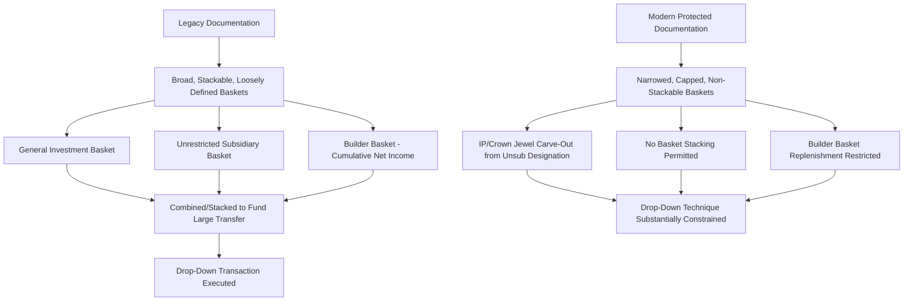

## Lender Documentation Responses: Tightened Baskets and MFN Provisions

### Definition and Scope

This topic covers the specific drafting responses lenders and their counsel have developed in reaction to the proliferation of liability management exercises (LMEs), focusing on two major categories: tightened basket capacity provisions (restricting the investment, restricted payment, and debt/lien baskets that enable drop-down and uptier transactions) and Most Favored Nations (MFN) provisions (ensuring pricing and structural parity across future debt incurrence). Together, these represent the market's negotiated countermeasures to the documentary flexibility LME sponsors have historically exploited.

### The Underlying Problem These Provisions Address

**Key Points**

- Legacy credit agreements, drafted during a borrower-friendly market environment, often contained broad, cumulative, and loosely defined basket capacity (investment baskets, restricted payment baskets, debt/lien incurrence baskets) intended to provide operational flexibility rather than to enable adversarial creditor-on-creditor transactions.
- LME sponsors exploited this flexibility by stacking multiple baskets, using ambiguous "open market purchase" exceptions, and relying on majority-lender amendment mechanics to execute transactions that materially disadvantaged non-participating lenders.
- Documentation responses aim to close these specific gaps without eliminating the legitimate operational flexibility the baskets were originally designed to provide — a genuine drafting tension that shapes the specific form these provisions take.

### Category One: Tightened Basket Provisions

**Key Points**

1. **Unrestricted subsidiary designation limits** — Restricting the categories or value of assets (particularly intellectual property and other "crown jewel" assets) that can be contributed to or held by an unrestricted subsidiary, directly targeting the J.Crew-style drop-down technique.
2. **Basket stacking restrictions** — Limiting the ability to combine multiple separate baskets (general investment basket, unrestricted subsidiary basket, builder basket) to fund a single large asset transfer, closing the "basket stacking" technique used in some prominent drop-down transactions.
3. **Builder basket replenishment restrictions** — Preventing returns on investments in unrestricted subsidiaries from replenishing basket capacity, limiting the compounding effect that allowed cumulative basket growth over time.
4. **Enhanced designation conditions** — Requiring more robust conditions precedent (stricter pro forma covenant compliance, additional notice periods, board certifications) before a restricted subsidiary can be redesignated as unrestricted.
5. **Sacred rights expansion covering priority/subordination** — Explicitly designating any amendment that would subordinate a lender's claim, alter payment priority, or release material collateral as requiring unanimous or affected-lender consent, closing the ambiguity uptier transactions have historically relied upon.

### Named Blocker Provisions and Their Specific Focus

| Blocker Name | Origin Case | Primary Focus |
| --- | --- | --- |
| J.Crew blocker | J.Crew (2016-2017) | Restricts transfer of material intellectual property to unrestricted subsidiaries |
| Envision blocker | Envision Healthcare | Limits investments in unrestricted subsidiaries by confining them to a dedicated basket and restricting basket replenishment from investment returns |
| Serta blocker | Serta Simmons | Requires that any new priority debt be offered pro rata to all existing lenders in the affected tranche (an "open participation" requirement) |
| Chewy blocker | Chewy-related transaction | Addresses dividend/distribution mechanics used to extract value ahead of a stressed period |

[Fact — these named provisions and their general focus areas are well-documented market conventions; the precise scope and drafting of any specific blocker varies by transaction and law firm drafting approach]

### Basket Tightening — Structural Comparison

### Moody's Findings on Blocker Adoption and Limitations

**Key Points**

- A November 2024 Moody's Investors Service report found that after two years of elevated defaults punctuated by aggressive LMEs, lenders had succeeded in incorporating some version of "Serta protection" into a substantial majority of sampled credit agreements — Moody's specifically found approximately 89% of sampled agreements contained some form of this protection.
- However, Moody's cautioned that such blocker language may give lenders a false sense of security, describing the protections as "limited in scope and rife with loopholes" — meaning documentary adoption has not eliminated LME structuring risk, only shifted the specific techniques sponsors and their counsel pursue. [Fact — reflects Moody's published assessment; the characterization of "loopholes" is Moody's own analytical conclusion, not a universally shared market view]
- This finding underscores that basket-tightening is best understood as raising the cost and complexity of executing an LME, rather than as a complete structural bar — sophisticated sponsors and their advisors continue to identify residual flexibility even within "protected" documentation.

### Category Two: Most Favored Nations (MFN) Provisions

**Key Points**

1. **Core MFN mechanic** — An MFN provision (most commonly associated with incremental facility/accordion provisions) requires that if the borrower incurs additional pari passu debt within a specified period after closing at pricing (yield) above a specified threshold relative to existing debt, the interest rate on existing debt must be increased to match (or approach) the pricing of the new debt.
2. **Original purpose** — MFN provisions were historically designed to prevent a borrower from diluting existing lenders' economics by raising cheaper-ranking-equivalent debt shortly after closing at wider spreads, protecting the initial lender group's yield expectations.
3. **LME-era extension** — In the LME context, MFN-style thinking has been extended by some market participants and drafters toward a broader principle: that if any subset of lenders is later offered improved terms (through participation in a priming or exchange transaction), all similarly situated lenders in the original tranche should receive equivalent treatment — sometimes negotiated directly into creditor cooperation agreements themselves, as noted in the Creditor Cooperation Agreements topic.

### MFN Mechanics — Illustrative Example

**Example**

A term loan closes with a spread of SOFR + 400 bps and a standard 12-month MFN "sunset" provision with a 50 bps threshold. If the borrower raises an incremental term loan six months later at SOFR + 475 bps (75 bps above the threshold), the MFN provision requires the spread on the existing term loan to be increased to SOFR + 450 bps (i.e., raised to bring the differential within the 50 bps threshold), compensating existing lenders for the fact that new, pari passu debt was priced more attractively.

$$\text{MFN Trigger} = \text{New Debt Spread} - \text{Existing Debt Spread} > \text{MFN Threshold}$$

### Traditional MFN vs. LME-Responsive Cooperation-Based Parity Provisions

| Feature | Traditional MFN (Incremental Facility) | LME-Responsive Parity Provision (Cooperation Agreement Context) |
| --- | --- | --- |
| Trigger | New pari passu debt priced above threshold spread differential | Any subset of lenders receiving improved terms via exchange/priming participation |
| Remedy | Automatic spread adjustment on existing debt | Contractual right for non-included group members to receive equivalent treatment |
| Typical duration | Often 6-12 months post-closing ("MFN sunset") | Duration of the cooperation agreement's "effective period" |
| Documentation location | Credit agreement (incremental facility covenant) | Separate creditor cooperation agreement among lender group members |
| Enforceability basis | Contractual right under the credit agreement itself | Contractual right among cooperating creditors, separate from borrower obligations |

### Interaction Between Basket Tightening and MFN-Style Protections

**Key Points**

- These two documentation response categories address different vulnerabilities: basket tightening constrains the borrower's unilateral ability to execute a drop-down or facilitate an uptier, while MFN-style parity provisions address the economic consequence if some form of differentiated treatment does occur despite those constraints.
- Sophisticated lender counsel increasingly negotiate both categories together as a combined defensive package, recognizing that basket tightening alone has proven incomplete (per Moody's findings) and that parity/MFN-style backstops provide a second layer of protection.
- Some modern credit agreements now incorporate "anti-subordination" provisions that function similarly to an MFN concept specifically applied to priority/lien ranking rather than pricing — effectively requiring that any new priority debt be extended pro rata to existing lenders, directly incorporating the Serta blocker concept discussed above.

### Practical Negotiation Dynamics

**Key Points**

- Borrowers and sponsors generally resist both categories of protection, as they reduce the operational and strategic flexibility that has historically allowed sponsors to respond quickly to liquidity needs or pursue creditor-differentiated financing strategies.
- The relative negotiating leverage between borrowers and lenders — driven by overall market conditions (borrower-friendly vs. lender-friendly markets) — significantly affects how much of this protective drafting a lender group can successfully obtain in any given transaction. [Inference — this negotiating dynamic is a widely observed general pattern in leveraged finance markets rather than a fixed, quantifiable relationship]
- Distressed debt investors and other sophisticated market participants increasingly conduct detailed "LME vulnerability" documentation review as a standard diligence step, specifically assessing basket capacity, sacred rights scope, and the presence or absence of Serta/J.Crew/Envision-style blockers, before making investment decisions.

### Residual Risk and Continued Evolution

**Key Points**

- Because blocker provisions are, per Moody's assessment, "rife with loopholes," market participants should not treat basket tightening and MFN-style protections as a complete solution — the same creative, well-resourced legal and financial advisory ecosystem that developed the original LME techniques continues to identify novel structures (combined drop-down/uptier hybrids, as seen in later transactions such as AMC Entertainment and Del Monte) that test the boundaries of even protected documentation.
- This suggests documentation responses should be understood as part of an ongoing, iterative drafting arms race rather than a fixed, permanently settled market standard — practitioners should expect continued refinement of both basket restrictions and parity provisions as new transaction structures emerge and are tested in litigation. [Inference — characterizing this as an ongoing "arms race" reflects observed market pattern rather than a certain prediction of future developments]

### Conclusion

Tightened basket provisions and Most Favored Nations-style parity protections represent the lending market's principal documentary countermeasures to the liability management exercise proliferation of the early-to-mid 2020s, addressing respectively the mechanical ability to execute drop-down/uptier transactions and the economic consequence of differentiated creditor treatment when such transactions occur. While adoption of named blocker provisions (Serta, J.Crew, Envision, Chewy) has become widespread — reaching roughly 89% of sampled agreements for Serta-style protection according to Moody's — rating agency and market commentary consistently caution that these protections remain incomplete, meaning documentation risk assessment continues to require careful, transaction-specific analysis rather than reliance on the mere presence of named blocker language.

**Related Topics**

- Landmark Case Precedents in Liability Management Litigation
- Drop-Down Financings and Unrestricted Subsidiaries
- Uptiering Transactions and Priming Debt
- Incremental Facility and Accordion Provision Drafting
- Creditor Cooperation Agreements and Group Formation
- Sacred Rights Drafting and Amendment Voting Mechanics
- Distressed Debt Documentation Diligence Practices