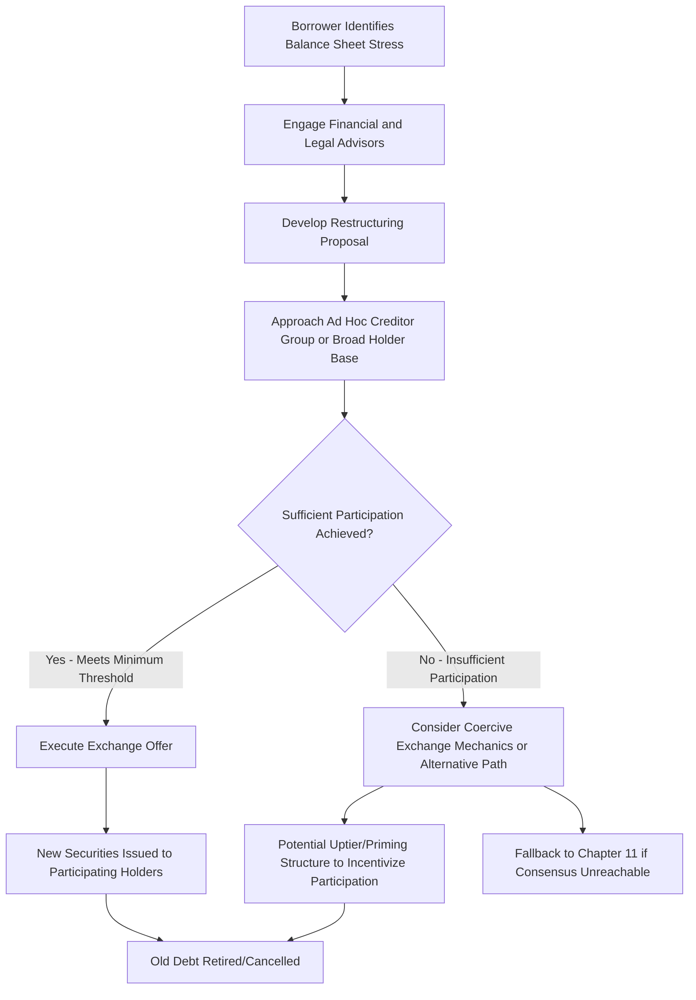

## Distressed Exchanges and Out-of-Court Restructuring

### Definition and Scope

A distressed exchange is a transaction in which a financially stressed issuer offers creditors new securities (debt, equity, or a combination) in exchange for existing debt obligations, typically at a discount to par or with materially different terms, as an alternative to defaulting or filing for formal bankruptcy protection. Out-of-court restructuring encompasses the broader category of consensual debt restructuring techniques — including distressed exchanges, amend-and-extend transactions, and negotiated maturity/covenant modifications — that achieve balance sheet repair without judicial process.

### Objectives of Out-of-Court Restructuring

**Key Points**

1. **Avoid bankruptcy costs and value destruction** — Chapter 11 involves substantial professional fees, operational disruption, and potential loss of customer/supplier/employee confidence; out-of-court solutions preserve enterprise value that formal proceedings can erode.
2. **Speed of execution** — Consensual exchanges can often be completed in weeks to a few months, versus the many months to years a contested Chapter 11 case may require.
3. **Preserve going-concern relationships** — Avoiding public disclosure of financial distress associated with a bankruptcy filing helps maintain supplier, customer, and employee relationships.
4. **Deleverage without full capital structure conversion** — Unlike a bankruptcy cramdown, distressed exchanges are voluntary and typically require sufficient creditor participation to achieve the borrower's deleveraging objectives.
5. **Preserve equity value optionality** — Sponsors generally prefer out-of-court solutions that avoid triggering a change-of-control or full equity wipeout scenario more likely in a contested bankruptcy.

### Types of Distressed Exchange Structures

| Structure | Mechanism | Typical Use Case |
| --- | --- | --- |
| Par-for-par maturity extension | Existing debt exchanged for identical principal amount with extended maturity | Addressing near-term maturity wall without requiring debt reduction |
| Discount exchange (debt-for-debt) | Existing debt exchanged for new debt with lower face value | Reducing overall leverage while preserving debt-like structure |
| Debt-for-equity exchange | Existing debt exchanged for equity or equity-linked instruments | More severe distress requiring substantial deleveraging |
| Debt-for-new-money-plus-debt | Existing debt exchanged for a combination of reduced debt and new priority capital | Combining deleveraging with liquidity injection |
| Amend-and-extend (A&E) | Existing debt terms amended (maturity, pricing, covenants) without a formal exchange offer structure | Comparatively cooperative, less severe distress |

### Distressed Exchange Process Flow

### Achieving Sufficient Creditor Participation

**Key Points**

- Distressed exchanges are inherently voluntary at the individual creditor level, but issuers typically need to achieve a minimum participation threshold to accomplish their deleveraging or maturity extension objectives, creating a coordination challenge.
- **Exit consent mechanics** — A common technique where participating creditors, as a condition of the exchange, vote to strip protective covenants from the remaining (non-exchanged) old debt via majority consent, making non-participation less attractive and incentivizing higher participation ("coercive exchange" structures).
- **Minimum participation conditions** — Exchange offers are often conditioned on achieving a specified minimum tender threshold, giving the issuer flexibility to abandon the transaction if insufficient participation is achieved rather than proceeding with a partial, less effective restructuring.
- **Early participation incentives** — Offering more favorable terms (higher exchange ratio, cash consent fees) to creditors who tender by an early deadline, encouraging prompt participation and building momentum.

### Coercive Exchange Mechanics — Detailed Illustration

**Example**

An issuer offers to exchange existing unsecured notes for new secured notes at a ratio reflecting a modest discount to par. As a condition of the exchange, participating noteholders agree to consent to an amendment removing financial maintenance covenants and certain negative covenants from the old (non-exchanged) notes. A noteholder who declines to participate is left holding notes that are both subordinated (structurally, since the new notes are secured) and stripped of covenant protection — creating strong practical pressure to participate even though the exchange is nominally voluntary.

### Distressed Exchange vs. Formal Bankruptcy: Comparative Framework

| Dimension | Out-of-Court Distressed Exchange | Chapter 11 Reorganization |
| --- | --- | --- |
| Consent requirement | Generally requires voluntary creditor participation (though coercive elements may apply pressure) | Court can approve a plan that binds dissenting creditors via cramdown, subject to statutory requirements |
| Timeline | Weeks to a few months typically | Months to years, particularly if contested |
| Cost | Lower professional fees, no court costs | Substantial professional fees, U.S. Trustee fees, potential examiner costs |
| Public disclosure | Limited, though exchange offers for public debt require SEC disclosure | Extensive public disclosure inherent in bankruptcy filings |
| Automatic stay protection | Not available — creditors retain individual enforcement rights absent participation | Available immediately upon filing, halting most creditor actions |
| Ability to reject executory contracts/leases | Not available | Available under Bankruptcy Code Section 365 |
| Cramdown of non-consenting classes | Not available in a pure out-of-court context | Available subject to absolute priority rule and other statutory requirements |

### Rating Agency Treatment of Distressed Exchanges

**Key Points**

- Rating agencies (Moody's, S&P) generally treat a distressed exchange as a form of default for rating purposes if creditors receive less than the original promise (reduced principal, reduced interest, or other diminished terms) and the exchange is undertaken to avoid a payment default or bankruptcy — commonly resulting in a "distressed exchange" or "selective default" rating designation even though no formal payment default or bankruptcy filing occurred.
- This rating treatment reflects agencies' view that the economic substance of the transaction (creditors receiving less than originally contracted, under duress of the alternative being worse) is analogous to a default, regardless of the transaction's voluntary legal form.
- Post-exchange, rated entities typically receive a new rating reflecting the post-transaction capital structure, though the "distressed exchange" designation remains a permanent part of the issuer's default history for statistical/actuarial purposes used in future default rate studies.

### Relationship to Liability Management Exercises

**Key Points**

- Distressed exchanges frequently incorporate LME techniques (uptiering, priming new money) as part of the exchange structure — the categories are not mutually exclusive, and many of the landmark LME cases discussed in prior topics (Serta, Wesco/Incora) involved transactions that were simultaneously structured as distressed exchanges.
- The key distinguishing feature is that a "pure" distressed exchange (without priming/subordination elements) treats all holders of a given tranche equivalently, offering the same exchange terms to all holders regardless of participation timing (aside from early consent incentives), whereas an uptier-style LME specifically creates differentiated outcomes between participating and non-participating holders within the same original tranche.
- As discussed in the creditor cooperation and litigation topics, the trend toward more inclusive, non-differentiated exchange structures has been partly driven by lessons learned from LME litigation, where courts have shown greater willingness to scrutinize exchanges that create stark participant/non-participant disparities.

### Amend-and-Extend as the Least Contentious Out-of-Court Technique

**Key Points**

- Amend-and-extend (A&E) transactions typically involve negotiating directly with the full existing lender group (or the requisite majority under existing amendment provisions) to push out maturities and modestly adjust economics, without necessarily involving an exchange offer structure or differentiated treatment among lenders.
- Because A&E transactions generally preserve pro rata treatment among the existing lender group, they generate substantially less creditor-on-creditor conflict and litigation risk than uptier-style exchanges, making them the preferred first-choice out-of-court technique where covenant/maturity relief alone (without deleveraging) is sufficient to address the borrower's near-term needs.
- A&E is often used as a bridge technique — providing near-term runway while a more comprehensive deleveraging solution (a distressed exchange or eventual Chapter 11 filing) is negotiated in parallel.

### SEC and Securities Law Considerations for Public Debt Exchanges

**Key Points**

- Exchange offers involving publicly registered debt securities are subject to SEC tender offer rules (Regulation 14E) and disclosure requirements, requiring careful structuring to ensure adequate offering periods, withdrawal rights, and disclosure of material information to all eligible holders.
- Private exchange offers (for debt issued under Rule 144A or other exempt offerings) face fewer procedural requirements but still require careful securities law analysis, particularly regarding the exchange securities' own exempt status and any resale restrictions.
- Material non-public information (MNPI) considerations, as discussed in the Creditor Cooperation Agreements topic, are particularly relevant during exchange negotiations, since issuers frequently share confidential financial projections with potential exchange participants before launching a public exchange offer.

### Practical Considerations for Structuring Practitioners

**Key Points**

- Achieving the right balance between exchange incentives (attractive enough to drive participation) and value preservation (not over-conceding economics to participating creditors) requires careful modeling of post-exchange leverage, liquidity runway, and covenant headroom.
- Advisors typically model multiple participation scenarios (minimum threshold, moderate, full participation) to stress-test whether the exchange achieves its deleveraging or maturity extension objectives across a range of realistic outcomes.
- Given the rating agency "distressed exchange" default designation, issuers and advisors should factor the reputational and future capital markets access implications of this designation into the decision between an out-of-court exchange and other alternatives.

### Conclusion

Distressed exchanges and out-of-court restructuring techniques provide financially stressed issuers a faster, less costly alternative to formal bankruptcy, ranging from cooperative, non-differentiated amend-and-extend transactions to more aggressive, potentially coercive exchange structures that incorporate liability management techniques. While these transactions avoid the automatic stay, cramdown authority, and executory contract rejection powers available in Chapter 11, they offer speed, reduced cost, and preserved optionality — trade-offs that rating agencies formally recognize by treating economically diminished exchanges as a form of default despite their voluntary legal structure, and that increasingly intersect with the creditor-on-creditor conflict dynamics covered throughout this chapter.

**Related Topics**

- Liability Management Exercises: Objectives and Triggers
- Uptiering Transactions and Priming Debt
- Rating Agency Default Definitions and Distressed Exchange Classification
- Exit Consent Mechanics and Coercive Exchange Structures
- Chapter 11 Cramdown and Absolute Priority Rule
- SEC Tender Offer Rules and Regulation 14E Compliance
- Creditor Cooperation Agreements and Group Formation