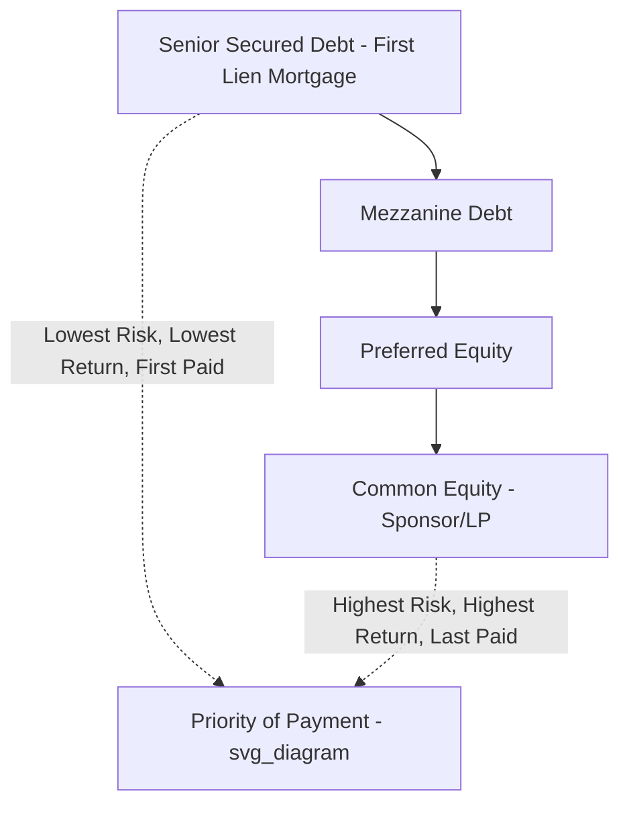

## Real Estate Capital Stack Components from Senior Debt to Common Equity

### Definition and Scope

The real estate capital stack refers to the layered hierarchy of capital sources used to finance a real estate acquisition, development, or recapitalization, arranged in order of priority of claim on the property's cash flows and liquidation proceeds. Each layer carries a distinct risk-return profile, with priority of payment and security position generally inversely related to expected return: senior positions receive lower yields but greater protection, while junior positions bear first-loss risk in exchange for higher return potential.

### The Capital Stack Hierarchy

### Senior Secured Debt (First Mortgage)

**Key Points**

1. **Position**: First-priority lien on the real property itself, senior to all other capital sources.
2. **Typical providers**: Life insurance companies, banks, commercial mortgage-backed securities (CMBS) conduits, debt funds, and government-sponsored entities (Fannie Mae/Freddie Mac for multifamily).
3. **Typical loan-to-value (LTV)**: Often 55-70% of appraised property value, varying by asset class, market conditions, and lender risk appetite.
4. **Typical pricing**: Lowest cost of capital in the stack, priced as a spread over a benchmark rate (SOFR for floating-rate, or Treasury yield for fixed-rate) reflecting the senior, secured position.
5. **Recourse**: Often structured as non-recourse to the sponsor (subject to standard "bad boy" carve-outs for fraud, misrepresentation, or voluntary bankruptcy filing), particularly for stabilized, income-producing assets.

### Mezzanine Debt

**Key Points**

1. **Position**: Subordinate to the senior mortgage but senior to preferred and common equity; typically secured not by a lien on the real property itself but by a pledge of the equity interests in the property-owning entity.
2. **Structural mechanism**: Because mezzanine lenders cannot foreclose on the real property directly (that collateral is already pledged to the senior lender), they instead hold a security interest in the ownership interests (LLC membership interests or partnership interests) of the borrower entity, allowing foreclosure on the equity interests as a remedy — a materially faster and less costly remedy than a judicial real property foreclosure.
3. **Typical LTV range added**: Often extends total leverage from the senior debt's 55-70% up to 75-85% of property value.
4. **Governance**: Mezzanine lenders typically negotiate an intercreditor agreement with the senior lender governing standstill periods, cure rights, and cross-default provisions.
5. **Pricing**: Materially higher than senior debt, reflecting subordination and the reduced remedy efficiency, often structured with current-pay and accrual (PIK) components.

### Preferred Equity

**Key Points**

1. **Position**: Subordinate to all debt (senior and mezzanine) but senior to common equity; technically an equity instrument (no direct lien rights) but structured with debt-like features (fixed or targeted preferred return, defined redemption/buyout mechanics).
2. **No direct collateral lien**: Unlike mezzanine debt, preferred equity holders generally have no security interest; their protection comes from contractual and structural mechanisms embedded in the partnership/operating agreement (control rights upon default, forced sale provisions, board/manager removal rights).
3. **Return structure**: Typically structured as a preferred return (a specified annual rate, e.g., 8-12%, cumulative and sometimes compounding) that must be paid before any distributions reach common equity, plus in many structures a defined exit multiple or accrued return upon a capital event (sale or refinancing).
4. **Common use cases**: Filling a gap between what senior/mezzanine debt will provide and the sponsor's available common equity, particularly in development or value-add transactions where total leverage capacity from debt alone is insufficient.
5. **Control rights upon default**: Preferred equity agreements frequently include remedies allowing the preferred investor to take control of major decisions, remove the sponsor as managing member, or force a sale of the property if preferred distributions are not met — a critical negotiated point distinguishing "hard pay" (enforceable, control-triggering) from "soft pay" (accruing without immediate remedy) preferred structures.

### Common Equity

**Key Points**

1. **Position**: The most junior position in the capital stack, entitled to residual cash flow and appreciation only after all debt service and preferred returns are satisfied.
2. **Typical providers**: The sponsor/general partner (often contributing a smaller co-investment alongside outside capital) and limited partner investors (institutional capital, family offices, high-net-worth individuals, or syndicated retail investors).
3. **Return profile**: Highest expected return potential in the stack, but also first-loss exposure — common equity value can be entirely eroded before any debt or preferred equity holder experiences a loss.
4. **Promote/carried interest structure**: Sponsors typically receive a disproportionate share of profits above specified return hurdles (the "promote" or "carried interest") in exchange for asset management responsibilities and often a smaller relative capital contribution than the LP investors.
5. **Governance and control**: Common equity, particularly the sponsor/GP, typically retains day-to-day operational and management control of the property, subject to major decision approval rights sometimes granted to LP investors or preferred equity holders.

### Comparative Capital Stack Summary Table

| Layer | Typical Position | Security/Collateral | Typical Target Return (illustrative) | Payment Priority |
| --- | --- | --- | --- | --- |
| Senior Debt | First lien | Direct mortgage on real property | SOFR/Treasury + spread (lowest cost) | 1st |
| Mezzanine Debt | Subordinate debt | Pledge of equity interests in property-owning entity | Materially higher spread than senior debt | 2nd |
| Preferred Equity | Structured equity | No direct lien; contractual/structural control rights | Fixed/targeted preferred return (e.g., 8-12%+) | 3rd |
| Common Equity | Residual equity | None (ownership interest only) | Residual, uncapped upside (and full downside risk) | 4th (last) |

[Inference — specific return figures and LTV ranges are illustrative approximations that vary substantially by property type, market, sponsor track record, and prevailing capital markets conditions]

### Waterfall Distribution Logic Across the Full Stack

$$\text{Common Equity Cash Flow} = \text{NOI} - \text{Senior Debt Service} - \text{Mezzanine Debt Service} - \text{Preferred Return} - \text{Reserves/Fees}$$

**Key Points**

- Net Operating Income (NOI) flows sequentially through the stack: senior debt service is paid first (contractual obligation, default risk if unpaid), followed by mezzanine debt service, followed by the preferred equity's preferred return, with any residual flowing to common equity.
- At a capital event (sale or refinancing), proceeds are distributed in the same priority order: senior debt principal repaid first, then mezzanine principal, then preferred equity's return of capital plus any accrued/unpaid preferred return, with remaining proceeds split among common equity holders (subject to any GP promote structure).

### Intercreditor and Structural Coordination

**Key Points**

- **Intercreditor agreements** between senior lenders and mezzanine lenders govern critical coordination points: standstill periods (preventing the mezzanine lender from exercising remedies while the senior lender is actively pursuing its own remedies), cure rights (allowing the mezzanine lender to cure a senior loan default to protect its position), and notice requirements.
- **Subordination, non-disturbance, and attornment agreements (SNDAs)** may also be relevant where tenants' lease rights need to be protected and coordinated across the capital stack in the event of a foreclosure.
- **Co-investment/side letters** between the sponsor and preferred/common equity investors define specific control rights, reporting obligations, and fee structures that sit alongside (but are distinct from) the pure capital stack priority analysis.

### Illustrative Capital Stack Composition (SVG)

<svg xmlns="http://www.w3.org/2000/svg" viewBox="0 0 700 420">
<text x="350" y="30" text-anchor="middle" font-size="16" font-weight="bold" fill="#1a1a2e">Real Estate Capital Stack Composition (svg_diagram)</text>
<rect x="150" y="60" width="400" height="80" fill="#1e3a8a" stroke="#000" />
<text x="350" y="95" text-anchor="middle" font-size="14" fill="#fff" font-weight="bold">Senior Secured Debt</text>
<text x="350" y="115" text-anchor="middle" font-size="12" fill="#dbeafe">~55-70% of Value | Lowest Cost</text>
<rect x="150" y="140" width="400" height="70" fill="#2563eb" stroke="#000" />
<text x="350" y="170" text-anchor="middle" font-size="14" fill="#fff" font-weight="bold">Mezzanine Debt</text>
<text x="350" y="190" text-anchor="middle" font-size="12" fill="#dbeafe">Extends to ~75-85% of Value</text>
<rect x="150" y="210" width="400" height="70" fill="#7c3aed" stroke="#000" />
<text x="350" y="240" text-anchor="middle" font-size="14" fill="#fff" font-weight="bold">Preferred Equity</text>
<text x="350" y="260" text-anchor="middle" font-size="12" fill="#ede9fe">Fixed/Targeted Preferred Return</text>
<rect x="150" y="280" width="400" height="90" fill="#be123c" stroke="#000" />
<text x="350" y="315" text-anchor="middle" font-size="14" fill="#fff" font-weight="bold">Common Equity</text>
<text x="350" y="335" text-anchor="middle" font-size="12" fill="#fecdd3">Sponsor/GP + LP Investors</text>
<text x="350" y="352" text-anchor="middle" font-size="12" fill="#fecdd3">Residual, First-Loss Position</text>
<text x="120" y="105" text-anchor="end" font-size="11">Lowest Risk</text>
<text x="120" y="330" text-anchor="end" font-size="11">Highest Risk</text>
<line x1="100" y1="65" x2="100" y2="365" stroke="#333" stroke-width="1" marker-end="url(#arrow)" />
</svg>

### Hybrid and Additional Structural Layers

**Key Points**

- **A/B note structures** — Senior debt itself is sometimes bifurcated into a senior "A note" and a subordinate "B note" (or "B-piece"), effectively creating an internal senior/junior split within what appears externally as a single mortgage loan, common in CMBS structures.
- **Preferred equity vs. mezzanine debt selection** — Sponsors choose between mezzanine debt and preferred equity (or a combination) based on factors including desired tax treatment (debt interest deductibility vs. equity treatment), speed/cost of remedies upon default, and the specific capital provider's investment mandate constraints (some institutional capital pools are restricted to debt-only or equity-only investments).
- **Sponsor co-investment (GP capital)** — Sponsors typically contribute a portion of the common equity themselves (often 5-20% of the common equity tranche) to align incentives with LP investors, a factor LP investors typically scrutinize during underwriting.

### Conclusion

The real estate capital stack organizes financing sources into a strict hierarchy of payment priority and security position, ranging from senior secured debt (lowest risk, lowest return, direct property lien) through mezzanine debt (equity-interest-secured subordinate debt), preferred equity (structurally subordinate, contractually protected), to common equity (residual, highest risk and return potential). Understanding how cash flow and capital event proceeds waterfall through this hierarchy — and the intercreditor mechanics coordinating the debt layers — is foundational to structuring, negotiating, and analyzing real estate transactions across all property types and risk profiles.

**Related Topics**

- Mezzanine Debt Structuring and Intercreditor Agreement Mechanics
- Preferred Equity Structures: Hard Pay vs. Soft Pay Provisions
- Sponsor Promote and Carried Interest Waterfall Structures
- CMBS A/B Note Structures and B-Piece Investing
- Loan-to-Value and Debt Yield Underwriting Standards by Property Type
- Real Estate Joint Venture Governance and Major Decision Rights
- Real Estate Syndication to Retail and High-Net-Worth Investors