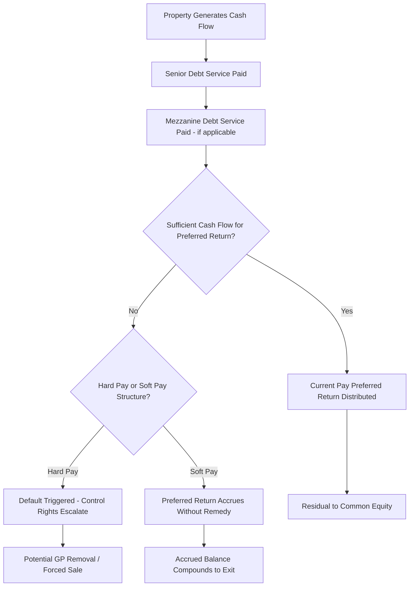

## Preferred Equity Structuring in Real Estate

### Definition and Scope

Preferred equity in real estate is a structured capital instrument that sits junior to all debt (senior and mezzanine) but senior to common equity in the capital stack, combining equity-like legal form (an ownership or membership interest, not a secured loan) with debt-like economic features (a fixed or targeted preferred return paid before common equity distributions, defined redemption mechanics, and remedies upon non-payment). This hybrid character makes preferred equity one of the most heavily negotiated and structurally varied instruments in real estate capital formation.

### Position in the Capital Stack

**Key Points**

1. Subordinate to senior mortgage debt and any mezzanine debt.
2. Senior to common equity (sponsor/GP co-investment and LP investors).
3. No direct lien on real property (unlike senior debt) and no pledge of equity interests as collateral (unlike mezzanine debt) — protection instead derives from contractual and governance mechanisms within the operating/partnership agreement.
4. Commonly used to fill a "gap" between maximum available debt proceeds and the sponsor's desired or available common equity contribution, particularly in development, value-add, or recapitalization transactions.

### Preferred Return Structures

**Key Points**

- **Fixed preferred return** — A specified annual rate (commonly cited in market ranges of roughly 8-12%, though this varies significantly by risk profile, asset type, and market conditions) accruing on the preferred equity's unreturned capital balance.
- **Cumulative vs. non-cumulative** — Cumulative preferred returns accrue and compound if unpaid in a given period, carrying forward as an obligation; non-cumulative structures forfeit any unpaid preferred return for periods it is not paid, a materially less protective structure for the preferred investor.
- **Current pay vs. accrual (PIK)** — Current pay structures require the preferred return to be distributed in cash from operating cash flow when available; accrual structures allow the return to compound unpaid until a capital event (sale/refinancing), often used when the property's near-term cash flow cannot support current preferred payments (e.g., during a lease-up or renovation period).
- **Exit multiple/additional return kicker** — Some structures include an additional return component payable at exit (a multiple on invested capital, or a percentage of profit above a threshold) compensating the preferred investor for structural subordination risk beyond the base preferred rate.

$$\text{Accrued Preferred Balance}_t = \text{Accrued Preferred Balance}_{t-1} \times (1 + r) - \text{Cash Distributions Paid}_t$$

Where $r$ represents the periodic preferred return rate, applicable in cumulative, compounding structures.

### Hard Pay vs. Soft Pay: The Central Structuring Distinction

**Key Points**

This is the most consequential negotiated distinction in preferred equity structuring:

| Feature | Hard Pay Preferred | Soft Pay Preferred |
| --- | --- | --- |
| Consequence of missed payment | Triggers enforceable default remedies (control rights, forced sale, removal of sponsor) | Return simply accrues/compounds without triggering immediate remedy |
| Investor leverage | High — behaves similarly to a debt default in practical effect | Lower — investor's recourse is limited to eventual accrued return at exit |
| Sponsor risk | Higher — genuine risk of losing control if preferred return is missed | Lower — sponsor retains control through the investment period |
| Typical use case | Institutional preferred equity providers with strong negotiating leverage | Sponsor-friendly structures, often used when sponsor has strong track record/leverage |
| Pricing implication | Often somewhat lower required return given the enhanced protection | Often somewhat higher required return to compensate for reduced enforceability |

### Remedies and Control Rights Upon Default

**Key Points**

1. **Consent/veto rights escalation** — Upon a preferred return default, the preferred investor's approval rights over major decisions (financing, leasing, capital expenditures, sale) often expand automatically.
2. **Manager/GP removal rights** — Many hard-pay structures grant the preferred investor the right to remove and replace the sponsor as managing member/general partner upon a sustained default, transferring day-to-day control.
3. **Forced sale/buy-sell provisions** — Some structures grant the preferred investor the right to force a marketing/sale process of the property if the default is not cured within a specified period, providing a liquidity path independent of the sponsor's cooperation.
4. **Step-up rate upon default** — Rather than (or in addition to) control remedies, some structures simply increase the preferred return rate during any period of non-payment, compensating the investor financially rather than through governance escalation.

### Preferred Equity Structuring Diagram

### Redemption and Exit Mechanics

**Key Points**

- **Mandatory redemption date** — Many preferred equity structures include a specified date by which the sponsor must redeem the preferred position (return of capital plus accrued/unpaid preferred return), functioning similarly to a debt maturity date despite the instrument's equity form.
- **Optional redemption/call rights** — Sponsors often negotiate the right to redeem the preferred equity early (sometimes subject to a minimum holding period or prepayment premium), providing refinancing flexibility.
- **Capital event triggers** — Redemption is frequently triggered automatically upon a sale or refinancing of the property, with proceeds applied first to preferred capital and accrued return before any common equity distribution.
- **Extension options** — Some structures grant the sponsor the ability to extend the preferred equity term (sometimes with a rate step-up as consideration) if a capital event has not occurred by the mandatory redemption date.

### Tax Treatment Considerations

**Key Points**

- Because preferred equity is structured as an equity/partnership interest rather than debt, it generally does not generate interest expense deductions for the property-owning entity in the way mezzanine debt would — a factor sponsors weigh when choosing between mezzanine debt and preferred equity to fill the same capital gap.
- Preferred equity holders typically receive an allocation of partnership tax items reflecting their preferred return, though the specific tax allocation mechanics (guaranteed payment treatment vs. priority distribution treatment) require careful drafting to achieve the intended economic and tax result. [Fact — general tax treatment framework; specific tax outcomes depend on the precise partnership agreement drafting and applicable tax elections, and require qualified tax counsel review for any specific transaction]
- REIT-related considerations may also influence structuring choices where either the preferred equity provider or a downstream ownership structure involves REIT qualification requirements.

### Comparison: Preferred Equity vs. Mezzanine Debt

| Dimension | Preferred Equity | Mezzanine Debt |
| --- | --- | --- |
| Legal form | Equity/partnership interest | Secured loan |
| Collateral | None (contractual/governance protection only) | Pledge of equity interests in property-owning entity |
| Remedy upon default | Governance rights, forced sale (if hard pay) | UCC foreclosure on pledged equity interests |
| Speed of remedy | Generally slower, governance-dependent | Generally faster (UCC foreclosure vs. judicial process) |
| Interest deductibility | Generally not deductible as interest expense | Generally deductible as interest expense |
| Typical use case | Flexible gap capital, particularly where debt capacity is exhausted | Additional leverage where lender's mortgage debt capacity is exhausted |
| Investor base | REITs, institutional real estate funds, family offices, insurance capital | Debt funds, insurance companies, specialty finance lenders |

### Common Structuring Variations by Transaction Type

**Key Points**

- **Development/construction preferred equity** — Often structured with accrual-only (PIK) preferred returns during the construction/lease-up period, converting to current pay once the property stabilizes and generates sufficient cash flow.
- **Recapitalization preferred equity** — Used to return capital to existing investors or buy out a partner without triggering a full refinancing or sale, often structured with a defined, relatively near-term redemption horizon.
- **Rescue capital/distressed preferred equity** — Deployed into a stressed property to address a looming debt maturity or capital call need, typically commanding higher preferred returns and more aggressive hard-pay control rights given the elevated risk profile.

### Negotiation Considerations for Sponsors and Preferred Investors

**Key Points**

- Sponsors generally prioritize preserving operational control and negotiating toward softer default remedies and cumulative-but-non-control-triggering accrual mechanics, while preferred investors prioritize enforceable, hard-pay-style protections and clearly defined exit/redemption timelines.
- The relative negotiating leverage is significantly influenced by market conditions (capital availability, sponsor track record, asset quality) and the specific purpose of the preferred equity (growth capital in a strong market vs. rescue capital in a distressed situation). [Inference — this negotiating dynamic reflects a widely observed general market pattern rather than a fixed, quantifiable relationship]
- Both parties typically negotiate detailed reporting requirements, major decision consent lists, and specific definitions of what constitutes a "capital event" triggering redemption, since ambiguity in these provisions is a common source of later dispute.

### Conclusion

Preferred equity occupies a structurally distinctive position in the real estate capital stack, offering equity-form flexibility with negotiated debt-like protections that vary enormously based on the hard pay/soft pay distinction, redemption mechanics, and control rights upon default. Because preferred equity lacks the direct collateral security available to mezzanine debt, the quality of governance and remedy provisions negotiated into the partnership/operating agreement is the primary determinant of how genuinely protective — versus effectively subordinate and illiquid — a given preferred equity position will prove to be in a stress scenario.

**Related Topics**

- Real Estate Capital Stack Components from Senior Debt to Common Equity
- Mezzanine Debt Structuring and Intercreditor Agreement Mechanics
- Sponsor Promote and Carried Interest Waterfall Structures
- REIT Qualification Considerations in Structured Real Estate Capital
- Rescue Capital and Distressed Real Estate Recapitalizations
- Real Estate Joint Venture Governance and Major Decision Rights
- Partnership Tax Allocation Mechanics for Preferred Return Structures