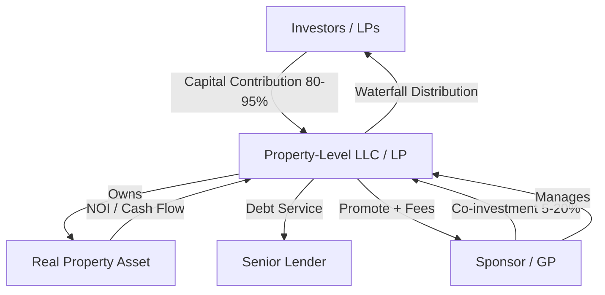

## General Partner and Limited Partner Structures

### Overview

A General Partner (GP) and Limited Partner (LP) structure is the dominant legal and economic framework used in real estate syndications to pool capital from multiple investors under the management of a sponsor. The structure separates two roles: the GP, who sources, underwrites, manages, and operates the investment, and the LPs, who provide the bulk of the equity capital in exchange for passive ownership interests. This bifurcation allows capital-constrained but experienced operators (GPs) to control and manage assets far larger than they could acquire alone, while giving passive investors (LPs) access to institutional-quality real estate deals with limited liability and limited involvement.

### Legal Foundation

**Entity Types**

The GP/LP relationship is typically formalized through one of the following entity structures:

- **Limited Partnership (LP)**: The traditional vehicle, governed by state limited partnership statutes (e.g., the Revised Uniform Limited Partnership Act, RULPA, in most U.S. states). The GP bears unlimited personal liability for partnership obligations unless it is itself a corporate entity (typically an LLC), while limited partners' liability is capped at their capital contribution.
- **Limited Liability Company (LLC)**: Increasingly the preferred vehicle in modern syndications. In an LLC, the "GP" role is filled by a **Managing Member**, and "LPs" become **non-managing (passive) members**. LLCs offer liability protection to all members, including the manager, which is why sponsors often form a dedicated LLC to serve as the GP of an underlying LP, or use an LLC as the sole operating entity.
- **Series LLC**: Used in some jurisdictions to isolate multiple deals or investor tranches under a single parent entity with segregated liability between series.

**Governing Document**

The relationship is governed by the **Limited Partnership Agreement (LPA)** or, in an LLC, the **Operating Agreement (OA)**. This document is the controlling contract and specifies:

- Capital contribution obligations and timing
- Profit and loss allocation (waterfall structure)
- Distribution timing and priority
- GP authority and fiduciary duties
- Fee structures
- Transfer restrictions and rights of first refusal
- Removal provisions ("for cause" and "no cause")
- Dilution and default (capital call) mechanics
- Dissolution and exit provisions

### Roles and Responsibilities

**General Partner (Sponsor)**

- **Deal sourcing**: Identifying, underwriting, and negotiating acquisition of the asset
- **Capital formation**: Structuring the offering, preparing the Private Placement Memorandum (PPM), and marketing to investors (subject to securities law constraints)
- **Financing**: Negotiating debt terms with lenders, providing loan guarantees (often personally, via **key principal** or **carve-out guarantor** roles)
- **Asset management**: Overseeing property management, capital improvement plans, leasing strategy, and budget execution
- **Reporting**: Providing periodic financial statements, K-1 tax forms, and investor communications
- **Exit execution**: Timing and executing the disposition or refinance
- **Fiduciary duty**: Owes duties of loyalty and care to the LPs; most LPAs modify default fiduciary standards contractually (see Fiduciary Duty section below)

**Limited Partner (Passive Investor)**

- Contributes capital, typically the majority (often 80-95%) of total equity
- Has no day-to-day control over operations — this is the defining feature that preserves limited liability
- Receives passive income allocations and distributions per the waterfall
- Retains limited consent rights over "major decisions" as negotiated in the LPA (e.g., sale of the property, refinancing, admission of new partners, amendments to the agreement)
- Bears economic risk proportional to capital contributed, with liability capped at that contribution (the **corporate veil** protecting LPs from operational liabilities, litigation, and debt beyond their investment)

**Control Rule**

The core legal doctrine underpinning limited liability is that LPs must not exercise control over the business. Historically, under RULPA and its predecessor ULPA, an LP who participated in "control of the business" could lose limited liability protection and become liable as a general partner. Most modern state statutes (following the Revised Uniform Limited Partnership Act of 2001) have relaxed or eliminated this control-liability link, but LPAs are still drafted conservatively to avoid ambiguity, reserving all operational authority to the GP/manager.

### Capital Structure and Contribution Mechanics

**Typical Capital Split**

| Component | Typical Range | Notes |
| --- | --- | --- |
| GP Co-investment | 5-20% of total equity | Aligns incentives ("skin in the game") |
| LP Capital | 80-95% of total equity | Pooled from multiple passive investors |
| Debt (senior + mezzanine) | 55-75% of total capitalization | Sits above equity in the capital stack |

**Capital Calls**

LPAs typically permit the GP to call additional capital under defined circumstances (unbudgeted capital expenditures, debt service shortfalls, litigation reserves). Non-funding LPs face contractually defined remedies, most commonly:

- **Dilution**: Non-funding LP's ownership percentage is reduced, often at a punitive ratio (e.g., 2x or 3x the shortfall amount credited to funding partners)
- **Forced loan**: Funding partners treat the shortfall as a preferred loan to the non-funding LP, bearing high interest (often 12-20%)
- **Forfeiture**: In severe cases, complete loss of interest (rare, and scrutinized under state partnership law for reasonableness)

### Profit Allocation: The Waterfall Structure

The **distribution waterfall** governs how cash flow and sale proceeds are split between GP and LP after debt service. A standard multi-tier waterfall:

1. **Return of Capital**: 100% to LPs until invested capital is fully returned
2. **Preferred Return ("Pref")**: LPs receive a cumulative, often compounding, return threshold (commonly 6-9% annually) before the GP participates in profit-sharing (return *of* capital is distinct from the pref, which is a return *on* capital)
3. **GP Catch-Up**: Once the pref is met, the GP receives an accelerated share (often 50-100% of distributions) until the GP's cumulative share matches its target promote percentage of total profit above return of capital
4. **Carried Interest / Promote Split**: Remaining profits split per an agreed ratio (e.g., 70/30 or 80/20 LP/GP)

**Multi-Tier (Hurdle-Based) Waterfalls**

Larger syndications often use IRR-based hurdles with escalating GP promote:

| Tier | IRR Hurdle | LP Share | GP Share |
| --- | --- | --- | --- |
| Tier 1 | Up to 8% | 100% | 0% |
| Tier 2 | 8%-12% | 80% | 20% |
| Tier 3 | 12%-18% | 70% | 30% |
| Tier 4 | Above 18% | 60% | 40% |

**Worked Example**

Assume a $10M raise, 8% preferred return (non-compounding, simple), GP catch-up to 20% of profit above return of capital, and an 80/20 final split.

- Property sells generating $4M in total profit after debt repayment
- **Step 1 — Return of Capital**: LPs receive their $10M principal back first (assume already returned pro rata over the hold or at sale)
- **Step 2 — Preferred Return**: If accrued pref owed is $1.6M (8% × $10M × 2 years, for example), LPs receive $1.6M from the $4M profit pool, leaving $2.4M
- **Step 3 — GP Catch-Up**: GP receives distributions until its share equals 20% of (Pref + Catch-Up) combined. If catch-up requires $0.4M to bring GP to 20% of profits distributed so far ($1.6M pref + $0.4M catch-up = $2M, and $0.4M / $2M = 20%), GP takes $0.4M, leaving $2.0M
- **Step 4 — Residual Split (80/20)**: Remaining $2.0M split 80/20: LPs get $1.6M, GP gets $0.4M

Final GP total: $0.4M (catch-up) + $0.4M (residual) = $0.8M. Final LP total: $1.6M (pref) + $1.6M (residual) = $3.2M. Total profit reconciles: $0.8M + $3.2M = $4.0M. [Inference: exact catch-up mechanics vary by LPA drafting — some catch-ups are 100% to GP until target reached rather than the pro-rata approach approximated here; investors should model the specific formula in the governing LPA.]

**Compounding vs. Simple Preferred Return**

$$\text{Compounding Pref (annual)} = P \times \left[(1 + r)^n - 1\right]$$

where $P$ is invested capital, $r$ is the preferred rate, and $n$ is the number of years. Simple (non-compounding) pref uses $P \times r \times n$ instead. Compounding pref materially increases the LP's preferred distribution over multi-year holds and is common in institutional-grade LPAs; syndicators marketing to retail LPs sometimes use simple pref, which is less favorable to investors but simpler to communicate.

### Fee Structures

GPs commonly earn fees independent of the profit waterfall, compensating for transaction execution and ongoing management regardless of deal performance:

- **Acquisition Fee**: 1-3% of purchase price, paid at closing
- **Asset Management Fee**: 1-2% of effective gross income or equity raised, paid annually
- **Disposition Fee**: 1-3% of sale price, paid at exit
- **Financing/Loan Guarantee Fee**: 0.5-1.5%, compensating the GP for balance-sheet risk on guaranteed debt
- **Construction Management Fee**: 3-6% of hard construction costs, for value-add or ground-up deals
- **Property Management Fee**: 3-5% of collected revenue, if self-managed by an affiliate of the GP

[Unverified: fee ranges above reflect commonly cited market norms and vary significantly by market, asset class, deal size, and sponsor track record; actual terms are negotiated per-deal and disclosed in the PPM.]

### Fiduciary Duty and Its Contractual Modification

Under default state partnership and LLC law, a GP/manager owes **duty of loyalty** and **duty of care** to the partnership and its LPs. However, most LPAs and Operating Agreements — particularly under Delaware law, which permits broad freedom of contract in alternative entities — explicitly modify or eliminate default fiduciary duties, replacing them with contractual standards such as:

- A "good faith and fair dealing" standard, which cannot be eliminated even under Delaware's Limited Partnership Act and LLC Act
- Explicit disclosure and waiver of conflicts of interest (e.g., GP's affiliated property management company, related-party fee arrangements)
- Exculpation clauses limiting GP liability to gross negligence or willful misconduct, rather than ordinary negligence

LPs should review the "Fiduciary Duties," "Exculpation," and "Indemnification" sections of the LPA closely, since these provisions can substantially narrow the standard of care the GP is actually held to. [Inference: the degree of duty-modification varies significantly by state; Delaware permits the broadest contractual modification among common syndication jurisdictions.]

### Securities Law Context

LP interests in a syndication are generally securities under the **Howey Test** (investment of money in a common enterprise with profit expected primarily from the efforts of others — here, the GP). This triggers registration requirements under the Securities Act of 1933 unless an exemption applies. Common exemptions used in real estate syndication:

- **Regulation D, Rule 506(b)**: No general solicitation; up to 35 non-accredited (but sophisticated) investors plus unlimited accredited investors
- **Regulation D, Rule 506(c)**: General solicitation permitted, but all investors must be verified accredited investors
- **Regulation A+ (Reg A)**: Allows solicitation to non-accredited investors with SEC qualification, subject to offering size caps

GPs act as **issuers** and often engage a **broker-dealer or registered investment advisor** for capital raising in larger deals, though many sponsors rely on the issuer exemption for self-directed capital raising under Rule 506(b)/(c).

### GP Removal Provisions

Sophisticated LPAs include removal rights to protect LP capital from GP misconduct or underperformance:

- **"For Cause" Removal**: Typically requires proof of fraud, gross negligence, willful misconduct, or material breach — usually requires supermajority LP vote (e.g., 66-75%)
- **"No Cause" Removal**: Rare in sponsor-favorable agreements; when present, usually requires a supermajority LP vote and payment of a termination fee to the GP to compensate for lost promote

### Ownership Structure Diagram

### Capital Stack Position (svg_diagram)

<svg xmlns="http://www.w3.org/2000/svg" viewBox="0 0 640 380">
<text x="320" y="25" text-anchor="middle" font-size="16" font-weight="bold" fill="#1a1a1a">Capital Stack Position: GP/LP Equity (svg_diagram)</text>
<rect x="120" y="50" width="400" height="50" fill="#8c1c1c" stroke="#1a1a1a" />
<text x="320" y="80" text-anchor="middle" font-size="13" fill="#ffffff">Senior Debt (55-70% LTV) — Lowest Risk, First Priority</text>
<rect x="120" y="100" width="400" height="40" fill="#c25b1c" stroke="#1a1a1a" />
<text x="320" y="125" text-anchor="middle" font-size="12" fill="#ffffff">Mezzanine Debt / Preferred Equity (optional layer)</text>
<rect x="120" y="140" width="400" height="80" fill="#d99a1c" stroke="#1a1a1a" />
<text x="320" y="170" text-anchor="middle" font-size="13" fill="#1a1a1a" font-weight="bold">LP Equity (80-95% of total equity)</text>
<text x="320" y="190" text-anchor="middle" font-size="11" fill="#1a1a1a">Return of Capital -&gt; Preferred Return -&gt; Residual Split</text>
<rect x="120" y="220" width="400" height="50" fill="#2e7d32" stroke="#1a1a1a" />
<text x="320" y="245" text-anchor="middle" font-size="13" fill="#ffffff">GP Co-Investment (5-20% of total equity)</text>
<text x="320" y="262" text-anchor="middle" font-size="11" fill="#ffffff">Subordinate to LP pref, earns promote above hurdles</text>
<line x1="60" y1="50" x2="60" y2="270" stroke="#1a1a1a" stroke-width="2" />
<polygon points="55,50 65,50 60,40" fill="#1a1a1a" />
<text x="30" y="160" text-anchor="middle" font-size="11" fill="#1a1a1a" transform="rotate(-90 30,160)">Risk / Priority Increases Downward</text>
<text x="320" y="300" text-anchor="middle" font-size="11" font-style="italic" fill="#555555">Note: Illustrative ranges only; actual capital stack composition is deal-specific.</text>
</svg>

### Key Points

- The GP/LP structure separates active management (GP) from passive capital (LP), preserving limited liability for LPs so long as they do not exercise control
- The LPA/Operating Agreement is the controlling document — always review waterfall mechanics, fee structures, fiduciary duty modifications, and removal provisions before committing capital
- GP compensation comes through two distinct channels: **fees** (paid regardless of performance) and **promote/carried interest** (paid only after LP hurdles are cleared)
- Compounding vs. simple preferred return calculations can produce materially different LP outcomes over a multi-year hold
- Securities law exemptions (Reg D 506(b)/506(c)) govern how and to whom a GP may market an offering

### Related Topics

- Waterfall Modeling and IRR Hurdle Structures
- Private Placement Memorandum (PPM) Components
- Reg D 506(b) vs. 506(c) Compliance Requirements
- Key Principal and Loan Guarantee Obligations
- Series LLC Structures for Multi-Deal Syndicators
- Preferred Equity vs. Common Equity in the Capital Stack
- Depreciation Pass-Through and K-1 Allocation Mechanics
- LP Advisory Committees and Major Decision Rights