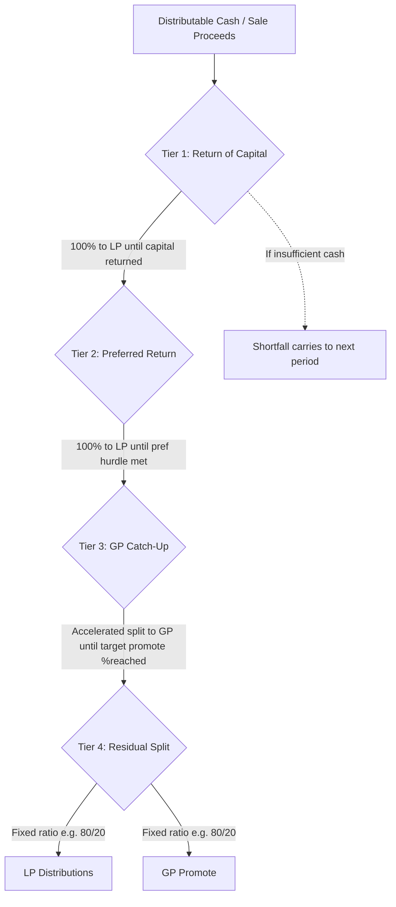

## Waterfall Structures, Hurdle Rates, and Promote/Carried Interest

### Overview

The distribution waterfall is the contractual mechanism in a real estate syndication's LPA/Operating Agreement that determines the order and proportion in which cash flow and sale proceeds are allocated between the General Partner (GP) and Limited Partners (LPs). It is the single most economically consequential section of the governing document, since it directly translates deal performance into investor and sponsor returns. Waterfalls are built from three interlocking components: **tiers** (the sequential distribution steps), **hurdle rates** (the return thresholds that trigger movement between tiers), and **promote/carried interest** (the GP's disproportionate share of profit above the hurdles, compensating for skill, sourcing, and risk-bearing).

### Core Terminology

- **Preferred Return ("Pref")**: A threshold return (expressed as an annual percentage) that LPs must receive before the GP participates in profit-sharing beyond its pro-rata co-investment share
- **Hurdle Rate**: The IRR or equity multiple threshold that separates one distribution tier from the next
- **Catch-Up**: A tier in which the GP receives an accelerated (often 50-100%) share of distributions to "catch up" to its target overall promote percentage
- **Promote / Carried Interest**: The GP's disproportionate share of profits above the pref, in excess of its pro-rata capital ownership
- **Return of Capital**: Distribution of investor principal, distinct from any return *on* that capital
- **Equity Multiple**: Total distributions received divided by total capital invested (e.g., a 2.0x multiple means an LP received back twice their invested capital, inclusive of return of capital)
- **Lookback / True-Up Provision**: A mechanism, often applied at exit or periodically, that recalculates cumulative distributions against the target promote split and "trues up" any over- or under-payment to the GP

### Why Waterfalls Exist

Waterfalls solve an incentive-alignment problem. LPs provide the overwhelming majority of capital but have no operational control; GPs control operations but often contribute a minority of capital. A flat pro-rata split (e.g., straight 90/10 on every dollar from day one) would compensate the GP identically whether the deal barely breaks even or dramatically outperforms. Tiered waterfalls instead:

1. Protect LP downside by guaranteeing return of capital and a baseline return before GP profit-sharing
2. Reward GP outperformance by escalating the GP's share only after LPs clear defined return thresholds
3. Align incentives so the GP is financially motivated to maximize total deal performance, not merely to close the transaction

### Standard Waterfall Tier Structure

A typical single-hurdle waterfall proceeds through four sequential tiers:

**Tier 1 — Return of Capital**

100% of available cash flows to LPs until cumulative distributions equal 100% of LP invested capital.

**Tier 2 — Preferred Return**

100% of remaining cash to LPs until they have received their cumulative preferred return (commonly 6-9% annually, simple or compounding) on unreturned capital.

**Tier 3 — GP Catch-Up**

An accelerated split (commonly 50/50 or 100% to GP) until the GP's cumulative profit share equals a target percentage (e.g., 20%) of total profit distributed above return of capital.

**Tier 4 — Residual Split**

Remaining cash split per an agreed ratio (commonly 70/30 or 80/20 LP/GP) for the remainder of the hold or at exit.

### Multi-Tier (IRR-Hurdle-Escalation) Waterfalls

Institutional syndications frequently extend beyond a single hurdle, using multiple IRR bands with an escalating GP promote at each level. This structure rewards the GP more heavily as performance improves, compressing GP economics if the deal underperforms and expanding them if it outperforms.

| Tier | IRR Range | LP Share | GP Share | Rationale |
| --- | --- | --- | --- | --- |
| 1 | 0-8% | 100% | 0% | Capital preservation priority |
| 2 | 8-12% | 80% | 20% | Base promote for meeting business plan |
| 3 | 12-18% | 70% | 30% | Reward for outperformance |
| 4 | 18%+ | 60% | 40% | Reward for exceptional execution |

Each tier's split applies only to the incremental cash flow within that IRR band, not to the entire distribution — a marginal-rate structure analogous to progressive tax brackets.

### Hurdle Rate Calculation Methods

**IRR-Based Hurdles**

The Internal Rate of Return is the discount rate that sets the net present value of all cash flows (contributions as negative, distributions as positive) to zero:

$$0 = \sum_{t=0}^{n} \frac{CF_t}{(1 + IRR)^t}$$

IRR-based hurdles account for the *timing* of cash flows, not just the total amount, making them the preferred hurdle metric for multi-year holds with irregular distributions.

**Equity Multiple Hurdles**

Simpler and time-insensitive, calculated as:

$$\text{Equity Multiple} = \frac{\text{Total Distributions}}{\text{Total Capital Invested}}$$

A GP might structure hurdles as "LP receives 100% until 1.0x capital returned, then 80/20 until 1.5x, then 70/30 thereafter." Equity multiple hurdles are easier for retail LPs to understand but ignore the time value of money — a 2.0x multiple over 3 years is far superior to a 2.0x multiple over 10 years, yet both trigger identical tier thresholds.

**Compounding vs. Simple Preferred Return**

$$\text{Compounding Pref} = P \times \left[(1 + r)^n - 1\right]$$

$$\text{Simple Pref} = P \times r \times n$$

where $P$ is invested capital, $r$ is the annual preferred rate, and $n$ is the number of years the capital was outstanding. Compounding pref accrues interest on unpaid preferred return balances (similar to compound interest on a loan), producing meaningfully larger LP distributions in later years of a hold compared to simple pref, which accrues linearly.

### Worked Example: Single-Hurdle Waterfall with Catch-Up

**Assumptions**: $10,000,000 LP capital, 8% simple annual preferred return, 3-year hold, 20% target GP promote above return of capital, 100% GP catch-up tier, 80/20 residual split.

**Step 1 — Accrued Preferred Return**

$$\$10{,}000{,}000 \times 0.08 \times 3 = \$2{,}400{,}000$$

**Step 2 — Total Sale Profit**

Assume the property sells generating $6,000,000 in total distributable profit after debt repayment and return of the $10M LP principal.

**Step 3 — Tier 1: Return of Capital**

LPs receive $10,000,000 (already netted out of the $6M profit figure above).

**Step 4 — Tier 2: Preferred Return**

LPs receive $2,400,000 of the $6,000,000 profit pool. Remaining pool: $3,600,000.

**Step 5 — Tier 3: GP Catch-Up**

GP needs to reach 20% of (Pref + Catch-Up) combined. Let $X$ = catch-up amount:

$$\frac{X}{2{,}400{,}000 + X} = 0.20$$

$$X = 0.20 \times (2{,}400{,}000 + X)$$

$$X - 0.20X = 480{,}000$$

$$X = \$600{,}000$$

GP receives $600,000 in catch-up. Remaining pool: $3,600,000 - $600,000 = $3,000,000.

**Step 6 — Tier 4: Residual Split (80/20)**

LPs receive $2,400,000; GP receives $600,000.

**Final Totals**

- LP total profit (above return of capital): $2,400,000 (pref) + $2,400,000 (residual) = $4,800,000
- GP total profit: $600,000 (catch-up) + $600,000 (residual) = $1,200,000
- Verification: $4,800,000 + $1,200,000 = $6,000,000 ✓
- GP's share of total profit above return of capital: $1,200,000 / $6,000,000 = 20% ✓ (matches target promote)

**LP Realized Metrics**

- LP total distributions: $10,000,000 (capital) + $4,800,000 (profit) = $14,800,000
- LP equity multiple: $14,800,000 / $10,000,000 = 1.48x
- LP approximate IRR (3-year hold, back-loaded distribution): roughly 14% annualized [Inference: exact IRR depends on interim cash flow timing during the hold, which is not specified in this simplified example; a full IRR calculation requires the complete cash flow schedule]

### Catch-Up Structure Variants

Not all catch-ups work identically; LPAs vary on this mechanic significantly:

- **100% GP Catch-Up**: GP receives 100% of distributions in the catch-up tier until reaching target promote percentage (fastest catch-up, most GP-favorable)
- **50/50 Catch-Up**: GP and LP split the catch-up tier evenly, slowing the GP's path to full target promote
- **Partial/Capped Catch-Up**: Catch-up tier has a maximum dollar cap, after which any shortfall to full target promote is waived entirely — more LP-favorable
- **No Catch-Up**: Some LPAs omit catch-up entirely, moving directly from pref to residual split; this structurally caps the GP's effective blended promote below the stated residual percentage, especially in shorter holds

[Inference: catch-up variant choice significantly shifts economics between GP and LP, and retail syndication PPMs do not always make the variant clearly distinguishable from the headline "80/20 split" marketing language — reviewing the actual LPA waterfall exhibit, not just the summary, is necessary to model true economics.]

### European vs. American Waterfall (Deal-by-Deal vs. Whole-Fund)

This distinction is more common in fund-level (multi-asset) structures than single-asset syndications, but is increasingly relevant as sponsors raise multi-property funds:

- **American (Deal-by-Deal) Waterfall**: GP earns promote on each individual asset's profit as it is realized, independent of overall fund performance. GP-favorable, as it can earn carry on winning deals even if the fund overall underperforms once losing deals are later realized.
- **European (Whole-Fund) Waterfall**: GP earns promote only after LPs have received return of capital and preferred return across the **entire fund portfolio**, not deal-by-deal. LP-favorable, as it prevents the GP from front-loading promote on early wins before losses on other assets are realized.

**Clawback Provision**: In American waterfalls, a clawback obligates the GP to return previously distributed promote if, at fund wind-down, the GP's cumulative carry exceeds what it would have earned under a whole-fund calculation. Clawbacks are a critical LP protection but are only as strong as the GP's financial capacity or escrow arrangement to actually fund the repayment.

### Waterfall Structure Flow

### Sensitivity: Hurdle Rate Impact on GP/LP Split (svg_diagram)

<svg xmlns="http://www.w3.org/2000/svg" viewBox="0 0 640 340">
<text x="320" y="25" text-anchor="middle" font-size="15" font-weight="bold" fill="#1a1a1a">GP Promote vs. Deal IRR Performance (svg_diagram)</text>
<line x1="70" y1="280" x2="580" y2="280" stroke="#1a1a1a" stroke-width="2" />
<line x1="70" y1="280" x2="70" y2="50" stroke="#1a1a1a" stroke-width="2" />
<text x="325" y="310" text-anchor="middle" font-size="12" fill="#1a1a1a">Deal IRR (%)</text>
<text x="30" y="165" text-anchor="middle" font-size="12" fill="#1a1a1a" transform="rotate(-90 30,165)">GP Share of Profit (%)</text>
<polyline points="70,280 150,280 150,240 260,240 260,190 370,190 370,140 580,90" fill="none" stroke="#8c1c1c" stroke-width="3" />
<text x="100" y="295" font-size="10" fill="#1a1a1a">0%</text>
<text x="145" y="295" font-size="10" fill="#1a1a1a">8%</text>
<text x="255" y="295" font-size="10" fill="#1a1a1a">12%</text>
<text x="365" y="295" font-size="10" fill="#1a1a1a">18%</text>
<text x="560" y="295" font-size="10" fill="#1a1a1a">25%+</text>
<text x="90" y="275" font-size="10" fill="#1a1a1a">0%</text>
<text x="45" y="245" font-size="10" fill="#1a1a1a">20%</text>
<text x="45" y="195" font-size="10" fill="#1a1a1a">30%</text>
<text x="45" y="145" font-size="10" fill="#1a1a1a">40%</text>
<text x="320" y="330" text-anchor="middle" font-size="10" font-style="italic" fill="#555555">Illustrative step-function based on a 4-tier IRR hurdle structure; actual tier boundaries are deal-specific.</text>
</svg>

### Common Negotiation Points for LPs

- Whether preferred return compounds annually or is simple
- Whether the catch-up is 100%, 50/50, capped, or absent
- Whether hurdles are IRR-based (time-sensitive) or equity-multiple-based (time-insensitive)
- Presence and strength of a clawback provision (particularly in multi-asset funds)
- Whether fees (acquisition, asset management, disposition) are paid independent of the waterfall or netted against GP promote
- Whether the GP's co-investment capital participates pro-rata in Tier 1/Tier 2 alongside LPs, or is excluded from pref entitlement

### Key Points

- Waterfalls exist to align GP incentives with LP outcomes by making GP profit-sharing conditional on clearing LP-protective hurdles first
- IRR-based hurdles account for cash flow timing; equity-multiple hurdles do not — the two can produce very different tier trigger points for economically similar deals
- The catch-up mechanic determines how quickly the GP reaches its full target promote percentage and varies widely in LPA drafting (100%, 50/50, capped, or none)
- American (deal-by-deal) waterfalls are GP-favorable relative to European (whole-fund) waterfalls; clawback provisions mitigate but do not eliminate this asymmetry
- Modeling true LP/GP economics requires the full LPA waterfall exhibit, not summary marketing language like "80/20 split"

### Next Steps

- Fund-Level vs. Deal-Level Waterfall Modeling in Multi-Asset Vehicles
- GP Clawback Mechanics and Escrow/Guaranty Enforcement
- Sensitivity Analysis: Modeling LP IRR Across Exit Cap Rate Scenarios
- Preferred Equity Structures as a Hybrid Between Debt and Common Equity
- Tax Treatment of Carried Interest (Section 1061 Holding Period Rules)
- Building a Waterfall Model in Excel with XIRR and Iterative Tier Logic