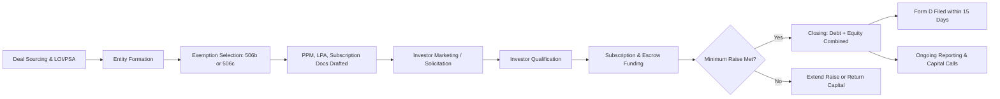

## Real Estate Syndication Capital Raising Process

### Overview

The capital raising process is the sequence of legal, financial, and operational steps a sponsor (GP) undertakes to pool investor (LP) capital for a real estate acquisition. It spans from initial deal sourcing through closing and encompasses securities law compliance, offering document preparation, investor marketing, subscription processing, and capital call execution. Unlike public real estate investment (e.g., publicly traded REITs), syndication capital raising occurs in the **private placement market**, meaning it is exempt from full SEC registration but still subject to strict federal and state securities regulation governing who may be solicited, how, and under what disclosure standards.

### Process Sequence

**Phase 1 — Deal Identification and Underwriting**

Before any capital raising begins, the GP identifies and underwrites the target asset:

- Sources the deal through broker relationships, off-market outreach, or direct owner contact
- Performs preliminary underwriting: rent roll analysis, trailing 12-month (T-12) operating statement review, market comparables, and business plan formulation (e.g., value-add renovation, repositioning, or stabilized hold)
- Negotiates and executes a **Letter of Intent (LOI)** or goes directly to a **Purchase and Sale Agreement (PSA)**, typically with a due diligence period and earnest money deposit
- Secures a debt financing term sheet from a lender to determine the equity gap that must be raised

**Phase 2 — Entity Formation and Structuring**

- Forms the acquisition entity (typically a single-purpose LLC) that will hold title to the property
- Forms or designates the GP/Managing Member entity
- Determines the capital stack composition: senior debt, potential mezzanine debt or preferred equity, GP co-investment, and LP common equity
- Drafts the waterfall structure, fee schedule, and governance terms that will populate the offering documents

**Phase 3 — Securities Exemption Selection**

The GP determines which federal exemption from registration under the Securities Act of 1933 the offering will rely on. This decision shapes every subsequent marketing and disclosure choice:

| Exemption | Solicitation | Investor Eligibility | Investor Cap | Verification |
| --- | --- | --- | --- | --- |
| Rule 506(b) | No general solicitation/advertising | Accredited + up to 35 sophisticated non-accredited | 35 non-accredited | Self-certification |
| Rule 506(c) | General solicitation permitted | Accredited investors only | Unlimited | Third-party verification required |
| Regulation A+ (Tier 2) | General solicitation permitted | Accredited and non-accredited | Unlimited (subject to offering caps) | SEC qualification required |

Most syndications use **Rule 506(b)** because it permits raising from a mix of accredited and (limited) sophisticated non-accredited investors without third-party income/net-worth verification, provided no general solicitation occurs (i.e., no public advertising, cold outreach to strangers, or open social media promotion — only pre-existing "substantive relationships").

**Phase 4 — Offering Document Preparation**

- **Private Placement Memorandum (PPM)**: The core disclosure document, detailing the business plan, risk factors, sponsor track record, fee structure, use of proceeds, and financial projections
- **Limited Partnership Agreement / Operating Agreement**: The controlling legal contract defining waterfall, governance, and investor rights (see prior chapter items for detailed waterfall and GP/LP mechanics)
- **Subscription Agreement**: The contract an investor signs to purchase an interest, including representations about accredited status, investment risk acknowledgment, and suitability
- **Form D**: Filed with the SEC within 15 days of the first sale under Regulation D, providing basic notice of the offering (issuer identity, offering size, exemption relied upon); does not constitute SEC approval or review of the offering's merits
- **Blue Sky Filings**: State-level securities notice filings, required in addition to federal Form D in most states where investors reside

**Phase 5 — Investor Marketing and Solicitation**

- Under 506(b): Outreach is limited to investors with whom the sponsor has a pre-existing substantive relationship — typically built through prior deals, referrals, or a sufficiently long relationship-building period before an offer is made
- Under 506(c): General solicitation (webinars, social media, paid advertising) is allowed, but the sponsor must take "reasonable steps to verify" accredited status — commonly satisfied via third-party verification letters (CPA, attorney, or licensed broker-dealer confirmation), bank/brokerage statements, or tax return review
- Sponsors typically distribute an **investment summary or executive summary** first (a marketing-oriented overview), followed by the full PPM once investor interest is established, since the PPM contains material non-public and legally sensitive disclosures

**Phase 6 — Investor Qualification and Subscription**

- Investors complete an **Investor Questionnaire** to self-certify (506(b)) or provide documentation (506(c)) confirming accredited investor status per SEC definitions (income thresholds of $200,000 individual/$300,000 joint for the preceding two years, or net worth exceeding $1,000,000 excluding primary residence, among other qualifying categories)
- Investors execute the Subscription Agreement and wire funds, typically into an escrow account or directly to the acquisition entity's operating account depending on deal timing
- The GP reviews and accepts (or rejects) each subscription; acceptance is not automatic — GPs retain discretion to decline a subscriber

**Phase 7 — Closing and Capital Deployment**

- Once the raise reaches its minimum threshold (and ideally the full target), capital is released from escrow (if used) and combined with debt proceeds at closing
- The acquisition entity takes title to the property
- Investors receive their initial capital account statement reflecting their percentage ownership interest

**Phase 8 — Ongoing Capital Calls (if applicable)**

- For value-add or development deals, the LPA often permits follow-on capital calls beyond the initial raise, for unbudgeted capital expenditures or shortfalls
- Follow-on calls generally do not require a new securities offering if properly provided for in the original PPM and LPA (since the obligation was disclosed as part of the original security), but sponsors should confirm this within their specific compliance framework

### Investor Accreditation Categories (Rule 501)

- **Income-based**: Individual income exceeding $200,000 (or $300,000 joint with spouse) in each of the two most recent years, with reasonable expectation of the same in the current year
- **Net-worth-based**: Net worth exceeding $1,000,000, individually or jointly with spouse, excluding the value of a primary residence
- **Professional certification**: Holders of certain FINRA licenses (e.g., Series 7, Series 65, Series 82), per the SEC's 2020 expansion of the accredited investor definition
- **Entity-based**: Trusts with assets exceeding $5,000,000 not formed for the specific purpose of acquiring the securities offered, or entities in which all equity owners are themselves accredited investors

[Unverified: exact dollar thresholds and qualifying categories are subject to periodic SEC amendment; sponsors and investors should confirm current figures against the SEC's most recent guidance at the time of any offering.]

### Roles of Third-Party Professionals

- **Securities Attorney**: Drafts the PPM, subscription documents, and LPA; advises on exemption selection and blue sky compliance
- **Broker-Dealer / Registered Investment Advisor**: Engaged when the sponsor pays transaction-based compensation to third parties for raising capital (required under securities law if compensation is contingent on the sale); not required if the sponsor's own principals raise capital without commission-based finder arrangements
- **CPA / Fund Administrator**: Handles investor capital account tracking, K-1 preparation, and financial reporting
- **Escrow Agent**: Holds investor funds until the minimum raise threshold and closing conditions are satisfied, particularly in contingency-based ("all-or-none" or "best efforts, minimum-maximum") offerings

### Capital Raising Timeline (Typical Single-Asset Syndication)

### Common Structural Variants

- **Blind Pool Offering**: Capital is raised before a specific asset is identified, giving the GP discretion to deploy across a portfolio strategy — carries higher investor risk due to lack of asset-specific underwriting at the time of investment
- **Best Efforts, Minimum-Maximum**: The offering specifies a minimum raise threshold below which the deal cannot close and funds are returned to investors, and a maximum cap on total capital accepted
- **Rolling Close / Multiple Closings**: Some syndications, particularly larger raises, close in tranches as capital commitments are secured, rather than requiring all capital simultaneously

### Common Compliance Pitfalls

- **Inadvertent general solicitation under 506(b)**: Publicly posting deal details on social media, personal websites, or unrestricted webinars before establishing a substantive pre-existing relationship with the audience can void the exemption for the entire offering
- **Insufficient verification under 506(c)**: Relying solely on investor self-certification (a 506(b) practice) does not satisfy 506(c)'s "reasonable steps to verify" standard
- **Integration of offerings**: Conducting multiple separate raises in a way regulators may treat as a single integrated offering, potentially breaching investor caps or solicitation restrictions
- **Unlicensed transaction-based compensation**: Paying a "finder" a percentage-based fee for introducing investors without that person holding an appropriate broker-dealer license

[Inference: enforcement emphasis and specific interpretive guidance on these pitfalls evolves through SEC no-action letters and case law; sponsors should confirm current interpretation with securities counsel rather than relying solely on general practice norms.]

### Key Points

- The capital raise cannot legally begin (in terms of solicitation) until the exemption pathway (506(b) vs. 506(c)) is chosen, since it dictates who may be contacted and how
- Form D filing is a notice requirement, not an SEC approval — the SEC does not vouch for the merits or safety of the offering
- 506(b) trades broader investor eligibility (including limited non-accredited investors) for solicitation restrictions; 506(c) trades open marketing for stricter accredited-investor-only verification
- The PPM, LPA, and Subscription Agreement collectively form the legal backbone of investor protection and must be reviewed together, not in isolation
- Escrow and minimum-raise thresholds protect both investors (capital is returned if the deal cannot proceed as underwritten) and GPs (avoids under-capitalized closings)

### Related Topics

- Rule 506(b) vs. 506(c): Detailed Compliance Comparison
- Private Placement Memorandum (PPM) Component Breakdown
- Accredited Investor Verification Methods Under 506(c)
- Blue Sky Law Filing Requirements by State
- Broker-Dealer Registration Triggers for Capital Raisers
- Fund Administration and K-1 Reporting Workflows
- Blind Pool vs. Identified-Asset Syndication Structures