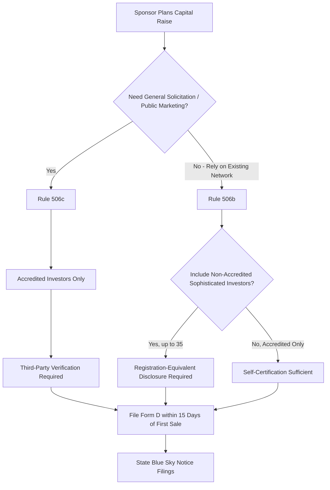

## Regulation D Exemptions in Real Estate Syndication

### Overview

Regulation D ("Reg D") is a set of rules promulgated by the U.S. Securities and Exchange Commission under the Securities Act of 1933 that provides exemptions from full registration for private securities offerings. Real estate syndications rely on Reg D almost universally, because registering an offering with the SEC (as public companies do via Form S-1) is cost-prohibitive and impractical for a single-asset or small-fund private placement. Reg D shifts the compliance burden from *registration and SEC review* to *disclosure and investor eligibility restrictions*, allowing sponsors to raise capital from private investors while remaining outside the full reporting regime applicable to public securities.

### Legal Basis

Reg D is codified at 17 CFR §230.501-508. It operates as a **safe harbor** under Section 4(a)(2) of the Securities Act, which exempts "transactions by an issuer not involving any public offering." Reg D does not eliminate securities law obligations — it defines a compliant path for satisfying the private offering exemption's requirements, including anti-fraud provisions, which apply regardless of exemption status.

### Rule 504

- Permits offerings up to $10,000,000 in a 12-month period (as of the SEC's 2021 amendments raising the cap from $5,000,000)
- Does not require specific disclosure documents to non-accredited investors under federal law (though state blue sky laws may impose their own disclosure requirements)
- Generally impractical for real estate syndication due to the smaller ceiling and reduced investor protections, making them less attractive to sophisticated institutional or high-net-worth LPs
- [Unverified: rarely used in practice for real estate syndication compared to 506(b)/506(c); most sponsors default to Rule 506 exemptions even when Rule 504's dollar ceiling would technically suffice]

### Rule 506(b) — The Traditional Private Placement

**Solicitation Restriction**

No general solicitation or general advertising is permitted. The offering may only be made to investors with whom the sponsor (or its principals) has a **pre-existing, substantive relationship** — a relationship established prior to the offering and sufficient in duration and nature to allow the sponsor to evaluate the investor's sophistication and financial circumstances without relying on the offering communication itself.

**Investor Eligibility**

- Unlimited number of **accredited investors**
- Up to **35 non-accredited investors**, provided they are "sophisticated" — meaning they have sufficient knowledge and experience in financial and business matters to evaluate the merits and risks of the investment, either alone or with a **purchaser representative**

**Disclosure Requirements**

- If the offering includes any non-accredited investors, the issuer must provide specified disclosure documents comparable in substance to what would be required in a registered offering (financial statements, business description, risk factors), which significantly increases the PPM's complexity and cost
- If the offering is limited exclusively to accredited investors, no specific disclosure format is mandated by Reg D itself, though anti-fraud provisions still require that any information provided not be false or misleading, and most sponsors voluntarily provide a full PPM regardless as a liability-mitigation practice

**Verification Standard**

Investors **self-certify** accredited status via the Investor Questionnaire; the sponsor is not required to independently verify income, net worth, or professional certifications under 506(b), provided it has no reason to believe the self-certification is false.

### Rule 506(c) — General Solicitation Permitted

Introduced under the JOBS Act of 2012, Rule 506(c) allows issuers to advertise and solicit investors broadly — including through public websites, social media, webinars, and paid marketing — in exchange for stricter investor verification obligations.

**Solicitation**

General solicitation and advertising are affirmatively permitted, removing the "pre-existing relationship" constraint of 506(b).

**Investor Eligibility**

All purchasers must be accredited investors — 506(c) does not permit any non-accredited investor participation, even sophisticated ones.

**Verification Standard**

The issuer must take **reasonable steps to verify** accredited status, which is a materially higher bar than 506(b)'s self-certification. Acceptable verification methods include:

- Reviewing IRS forms (W-2, 1099, K-1, or tax returns) for the two most recent years, plus written representation of expected continuation, to verify income-based accreditation
- Reviewing bank statements, brokerage statements, and consumer credit reports (for liabilities) to verify net-worth-based accreditation
- Obtaining a written confirmation letter from a registered broker-dealer, SEC-registered investment adviser, licensed attorney, or CPA, dated within the prior three months, confirming the investor's accredited status
- Relying on prior verification of the same investor within the preceding five years, provided the investor certifies continued accredited status and the issuer has no information suggesting otherwise

### Comparison Table

| Feature | Rule 506(b) | Rule 506(c) |
| --- | --- | --- |
| General solicitation | Prohibited | Permitted |
| Accredited investors | Unlimited | Unlimited |
| Non-accredited investors | Up to 35 (sophisticated) | Not permitted |
| Verification method | Self-certification | Third-party/documentary verification |
| Pre-existing relationship required | Yes | No |
| Disclosure if non-accredited investors included | Required (registration-equivalent) | N/A (no non-accredited allowed) |
| Typical use case | Sponsor's existing investor network | Broad public capital raising campaigns |

### Federal Filing Requirements: Form D

Regardless of which Rule 506 exemption is used, the issuer must file **Form D** electronically with the SEC via the EDGAR system within **15 calendar days** after the first sale of securities in the offering. Form D discloses:

- Issuer identity and principals
- Exemption relied upon (506(b) or 506(c))
- Total offering amount and amount sold to date
- Use of proceeds categories
- Sales compensation paid to broker-dealers or finders, if any

Filing Form D does not constitute SEC review, approval, or endorsement of the offering's merits — it is purely a notice filing. Failure to file, or late filing, does not automatically void the exemption for a single offering but can result in the issuer being barred from relying on Reg D for future offerings for a period, and may trigger state-level consequences.

### State-Level "Blue Sky" Coordination

Reg D offerings are federally exempt from registration, but the **National Securities Markets Improvement Act of 1996 (NSMIA)** preempts states from imposing their own merit registration or review requirements on Reg D offerings. However, states retain authority to require a **notice filing** (typically a Form D copy plus a state-specific cover sheet and filing fee) in each state where securities are offered or sold. Sponsors must track and comply with notice filing deadlines and fees in every state where an investor resides, not merely the state where the sponsor or property is located.

### Interaction with Integration Rules

The SEC's **integration doctrine** evaluates whether multiple, seemingly separate securities offerings should be treated as a single offering for exemption-compliance purposes. Under current SEC guidance (post-2020 amendments), a safe harbor generally applies if offerings are separated by at least 30 calendar days and comply with the requirements of the exemption relied upon for each offering. Sponsors raising capital across sequential deals, or running a 506(b) raise concurrently with a 506(c) raise for the same or related entities, should evaluate integration risk with securities counsel, since improper integration can retroactively taint an otherwise-compliant exemption.

### Exemption Selection Process Flow

### Common Compliance Risks Specific to Real Estate Sponsors

- **Website and social media exposure**: A sponsor's public website describing "current investment opportunities" in specific, actionable terms can constitute general solicitation, inadvertently breaching 506(b) — many sponsors solve this with a gated, password-protected deal page requiring pre-qualification before deal-specific details are shown
- **Webinars and podcasts**: Discussing an active raise on a public podcast or webinar without proper 506(c) verification infrastructure in place is a common and material 506(b) violation
- **Mixing exemptions across related entities**: Running a 506(b) raise for one property while simultaneously running a 506(c) marketing campaign for the sponsor's brand generally can create integration and general solicitation risk if not properly separated and documented

[Inference: the practical line between permissible "generic sponsor branding" and impermissible "general solicitation of a specific securities offering" is fact-specific and has been the subject of extensive SEC no-action letter guidance; sponsors operating an active marketing presence should have securities counsel review both the specific offering communications and the sponsor's broader digital footprint.]

### Key Points

- Reg D is a safe harbor under Securities Act Section 4(a)(2), exempting private offerings from full SEC registration, not from anti-fraud liability
- Rule 506(b) restricts solicitation but allows limited non-accredited sophisticated investors with self-certified status; Rule 506(c) allows public solicitation but requires accredited-only investors with documented third-party verification
- Form D is a notice filing, due within 15 days of first sale, and does not represent SEC approval of the offering
- State blue sky notice filings are still required for Reg D offerings despite federal preemption of state merit review
- Improper general solicitation under 506(b) — including through websites, podcasts, or social media — can void the exemption for the entire offering

### Related Topics

- Accredited Investor Verification Methods and Acceptable Documentation
- State Blue Sky Notice Filing Procedures and Fee Schedules
- SEC Integration Doctrine and the 30-Day Safe Harbor
- Regulation A+ (Tier 2) as an Alternative to Reg D for Broader Retail Access
- Broker-Dealer Registration Requirements for Capital Raisers
- Anti-Fraud Liability Under Rule 10b-5 in Private Placements
- Crowdfunded Real Estate Syndication Platforms and Regulation CF Comparisons