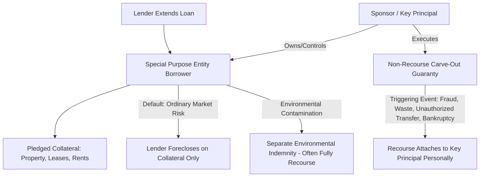

## Non-Recourse and Limited-Recourse Financing Principles

### Overview

Non-recourse and limited-recourse financing are debt structures that restrict a lender's ability to seek repayment from a borrower's general assets or sponsor's personal balance sheet beyond a defined, often narrow, set of collateral and remedies. These structures are foundational to project finance and real estate/infrastructure syndication because they allow sponsors to isolate transaction risk within a single-purpose entity, preserving the sponsor's broader balance sheet and enabling off-balance-sheet-style treatment while still permitting lenders to extend substantial leverage against a specific asset's cash flows.

### Core Definitions

**Non-Recourse Debt**

A loan under which the lender's remedy upon default is limited strictly to foreclosure on or seizure of the pledged collateral (typically the real property or project asset itself, plus assignment of leases, rents, and contracts). The lender has no legal claim against the borrower's other assets or the personal assets of its principals, beyond the collateral pool defined in the loan documents.

**Limited-Recourse (Partial-Recourse) Debt**

A loan structure that is non-recourse for most purposes but carries specific, enumerated **carve-outs** under which recourse liability attaches to a guarantor (typically a "key principal" of the sponsor) upon the occurrence of defined triggering events — most commonly related to fraud, waste, environmental liability, or bankruptcy-related actions. Limited-recourse debt is, in practice, the dominant structure in modern commercial real estate and project finance lending; pure non-recourse debt without any carve-outs is comparatively rare.

**Full-Recourse Debt**

By contrast (and outside the scope of most syndication structures), full-recourse debt allows the lender to pursue the borrower's and/or guarantor's full personal or corporate assets to satisfy any deficiency after collateral liquidation — the standard structure in most conventional small-business and residential lending, but atypical for institutional-scale project and real estate finance.

### Legal Mechanism: The Special Purpose Entity (SPE)

Non-recourse lending is structurally enabled by isolating the financed asset within a **Special Purpose Entity (SPE)**, typically a single-asset LLC formed specifically to hold title to the project or property and no other assets. Lenders require the SPE's organizational documents to include **bankruptcy-remoteness** provisions:

- **Separateness covenants**: Requiring the SPE to maintain separate books, bank accounts, and observe corporate formalities distinct from affiliated entities, preventing "substantive consolidation" in a sponsor bankruptcy
- **Restrictions on additional debt**: Prohibiting the SPE from incurring debt beyond the mortgage loan
- **Independent director / manager requirement**: Many SPE structures require at least one independent director or manager whose consent is needed before the entity can file for bankruptcy, reducing the risk of a sponsor-driven bankruptcy filing that could delay foreclosure
- **Restrictions on merger, dissolution, or asset transfer**: Preventing corporate actions that could complicate the lender's collateral position

These provisions collectively ensure the SPE's assets and liabilities remain legally and practically isolated, which is the structural precondition that makes true non-recourse lending viable for the lender (since its only recovery source is the isolated collateral pool).

### Standard "Bad Boy" Carve-Outs

The enumerated events triggering recourse liability under a limited-recourse structure are commonly termed **"bad boy" carve-outs** or **non-recourse carve-outs**, memorialized in a separate **Non-Recourse Carve-Out Guaranty** (sometimes called a "bad boy guaranty") executed by the sponsor's key principal(s). Standard carve-out categories include:

**Full Recourse Triggers** (typically make the *entire* loan balance recourse, not just damages)

- Voluntary bankruptcy filing by the borrower, or collusive involuntary bankruptcy filing
- Unauthorized transfer of the property or a controlling interest in the borrower without lender consent (violating a due-on-sale/due-on-encumbrance clause)
- Fraud or intentional material misrepresentation in obtaining the loan
- Waste of the collateral (intentional or grossly negligent physical destruction or deferred maintenance materially impairing value)

**Springing/Partial Recourse Triggers** (typically limit recourse to actual damages caused by the specific breach, rather than the full loan balance)

- Misapplication or diversion of rents, insurance proceeds, or condemnation awards ("cash diversion" or "misappropriation" carve-outs)
- Failure to maintain required insurance coverage
- Environmental contamination or violation of environmental covenants (frequently paired with a **separate Environmental Indemnity Agreement**, which is often unconditionally full-recourse regardless of the primary loan's non-recourse status)
- Physical waste resulting from failure to pay real estate taxes when cash flow was available to do so

### Key Principal / Guarantor Role

The sponsor's principal(s) who execute the carve-out guaranty are commonly termed **Key Principals** or **Key Sponsors**. Lenders typically require:

- Minimum net worth and liquidity covenants for the guarantor, monitored annually via financial statement delivery requirements
- "Bad boy" guaranty execution as a condition precedent to closing, independent of the SPE borrower's non-recourse loan obligation
- In some structures, a **completion guaranty** (for construction/development projects) requiring the guarantor to fund cost overruns or complete construction if the borrower fails to do so, which is separate from and often broader than the standard carve-out guaranty

[Inference: the specific scope, negotiated caps, and enforcement pattern of carve-out guaranties vary meaningfully by lender type (life insurance company, CMBS conduit, bank, debt fund) and loan size; sponsors should review carve-out language closely with counsel rather than assuming standardized terms across lenders.]

### Rationale for Non-Recourse Structuring

**From the Sponsor's Perspective**

- Isolates downside risk to the specific investment, protecting the sponsor's broader balance sheet and other projects from cross-default or cross-collateralization exposure
- Enables the sponsor to raise capital from passive LP investors who would not accept personal liability exposure as a condition of investing
- Facilitates syndication itself — LPs investing passive capital in a syndication structure generally expect (and often require, per securities law "control" doctrines) that they bear no personal liability beyond their capital contribution; a non-recourse loan structure at the property level is consistent with and reinforces this expectation

**From the Lender's Perspective**

- Compensated for the additional risk of non-recourse lending through more conservative underwriting: lower loan-to-value (LTV) ratios, higher debt service coverage ratio (DSCR) requirements, and more comprehensive collateral packages (assignment of leases and rents, UCC filings on personal property, reserve requirements)
- Carve-outs provide a targeted recourse remedy specifically for borrower/sponsor bad-faith conduct, without exposing the lender to full-recourse enforcement complexity for ordinary market-driven defaults (e.g., loss of value due to market conditions, tenant vacancy, or interest rate movement)
- CMBS (Commercial Mortgage-Backed Securities) lenders in particular rely heavily on standardized non-recourse-with-carve-outs structures because loan pools are securitized and sold to bond investors who require predictable, well-defined risk parameters rather than case-by-case personal guaranty enforcement

### Application in Project Finance (Infrastructure Context)

In infrastructure and large-scale project finance (as distinct from single-asset commercial real estate), non-recourse structuring takes on additional dimensions:

- **Project company (ProjectCo)**: The SPE borrower is typically the sole owner of the project asset (e.g., a toll road, power plant, or public-private partnership concession), with lenders' recourse limited to ProjectCo's assets and contracted cash flows
- **Completion risk allocation**: During construction, lenders typically require sponsor completion guarantees (given non-recourse lending is particularly risky before the asset is operational and generating cash flow) — often converting to fully non-recourse only upon achieving "completion" or "commercial operation date" milestones
- **Cash flow waterfall / cash trap mechanisms**: Loan agreements impose mandatory cash sweep and reserve account requirements (debt service reserve, maintenance reserve, major maintenance reserve) that function as a substitute for personal guaranty protection, giving the lender structural priority claims on project cash flow rather than relying on sponsor credit
- **Step-in rights**: Lenders in project finance frequently negotiate direct agreements with offtakers, operators, and government counterparties, allowing the lender to "step into" the sponsor's contractual role upon default rather than relying solely on collateral foreclosure — a structural feature less common in standard commercial real estate non-recourse lending

### Non-Recourse Structure and Carve-Out Flow

### Underwriting Implications of Non-Recourse Structure

Because lenders cannot rely on sponsor balance sheet strength as a secondary repayment source, non-recourse underwriting places disproportionate emphasis on asset-level cash flow metrics:

$$\text{DSCR} = \frac{\text{Net Operating Income}}{\text{Annual Debt Service}}$$

Non-recourse lenders typically require higher minimum DSCR thresholds (often 1.20x-1.35x for stabilized commercial real estate, higher for riskier or construction-phase project finance) compared to full-recourse lending, precisely because the collateral and its cash flow constitute the lender's sole practical recovery mechanism absent a carve-out trigger.

### Key Points

- Non-recourse debt limits lender remedy to pledged collateral; limited-recourse debt is functionally non-recourse except for enumerated "bad boy" carve-out events that spring personal liability onto a key principal guarantor
- The Special Purpose Entity structure, with bankruptcy-remoteness covenants, is the legal precondition enabling true non-recourse lending by isolating the financed asset from sponsor-wide liabilities
- Carve-outs split into full-balance recourse triggers (fraud, unauthorized transfer, bankruptcy) and springing/damages-limited triggers (cash misapplication, insurance lapse, environmental issues)
- Environmental indemnities are frequently structured as separately and fully recourse, regardless of the primary loan's non-recourse status
- Because lenders cannot rely on sponsor credit as backstop, non-recourse underwriting emphasizes asset-level DSCR, LTV, and reserve requirements more heavily than full-recourse lending

### Related Topics

- Special Purpose Entity Bankruptcy-Remoteness Drafting Requirements
- CMBS Loan Pooling and Standardized Carve-Out Language
- Completion Guarantees and Construction-Phase Recourse Conversion
- Debt Service Coverage Ratio and Loan-to-Value Underwriting Standards
- Cash Management and Lockbox Structures in Non-Recourse Lending
- Environmental Indemnity Agreements as a Recourse Exception
- Step-In Rights and Direct Agreements in Infrastructure Project Finance