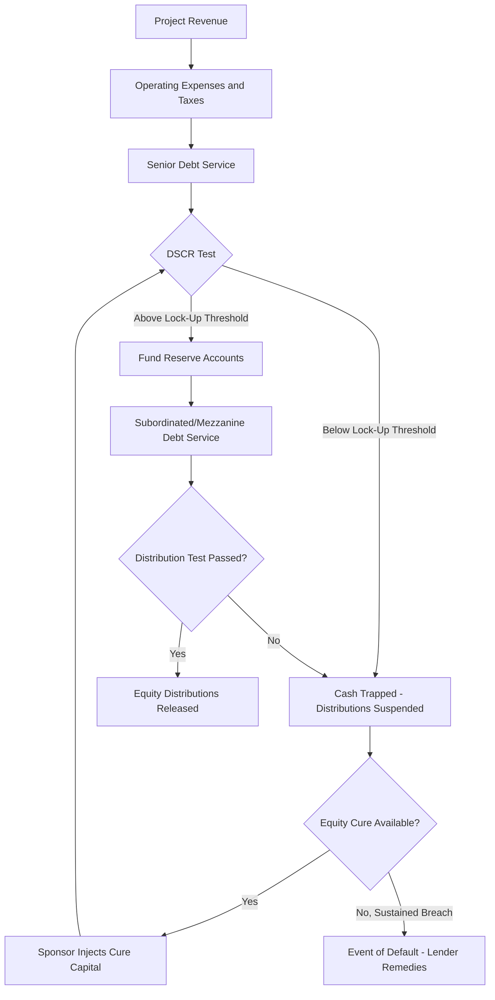

## Project Finance Capital Structure and Ratio Covenants

### Overview

Project finance capital structuring is the discipline of allocating funding sources — senior debt, subordinated/mezzanine debt, and sponsor equity — across a single-purpose project entity in a manner that matches each capital layer's risk tolerance to the project's cash flow risk profile at each phase of its lifecycle. Because project finance lending is non-recourse or limited-recourse to the sponsor (see the prior chapter item), lenders rely heavily on **ratio covenants** — contractually defined financial tests embedded in the loan and inter-creditor agreements — to monitor ongoing project health and to trigger cash flow restrictions or default remedies before the project's ability to service debt is irreparably impaired.

### Capital Structure Layers

**Senior Debt**

The most senior, lowest-cost capital layer, typically provided by commercial banks, institutional lenders, export credit agencies, or (for larger infrastructure) the project bond market. Senior debt carries first-priority claims on project cash flow and collateral, and typically comprises 60-80% of total project capitalization for stabilized, contracted-revenue infrastructure (e.g., availability-payment public-private partnerships or long-term power purchase agreement-backed generation assets), though leverage is materially lower for merchant-risk or greenfield/construction-stage projects.

**Subordinated / Mezzanine Debt**

An intermediate layer, contractually or structurally subordinated to senior debt, bearing higher interest rates (compensating for subordination risk) and sometimes structured as unsecured or second-lien debt. Mezzanine debt bridges the gap between what senior lenders will underwrite and the sponsor's targeted equity contribution, typically comprising 5-15% of total capitalization when present. It may include equity-like features (warrants, conversion rights) blurring the line between debt and equity.

**Sponsor Equity**

The most junior, highest-cost, residual-risk capital layer, typically 15-30% of total capitalization, contributed by the project sponsor(s) and, in syndicated infrastructure deals, co-investing institutional equity partners (infrastructure funds, pension funds, sovereign wealth funds). Equity absorbs first losses and receives residual cash flow only after debt service and reserve funding requirements are satisfied.

**Government/Concessionary Layers (where applicable)**

Public-private partnership (PPP) and certain infrastructure projects may include government grants, viability gap funding, or subordinated public loans, which typically rank junior to private senior debt but may rank senior to or pari passu with private equity, depending on the specific concession structure.

### Capital Structure Allocation by Project Phase

| Phase | Typical Leverage | Risk Profile | Capital Structure Implication |
| --- | --- | --- | --- |
| Development/Pre-Construction | Minimal to no debt | Highest risk (permitting, offtake uncertainty) | Predominantly sponsor equity or development capital |
| Construction | Moderate leverage (50-65%) | High risk (completion, cost overrun) | Construction loan facility, often with sponsor completion guarantee |
| Ramp-Up/Stabilization | Leverage may step up post-completion | Moderate risk (performance testing, initial operations) | Conversion from construction to term loan, contingent on completion tests |
| Operations (Stabilized) | Highest sustainable leverage (65-80%+ for contracted assets) | Lowest risk (established, often contracted cash flow) | Term debt refinancing, potential capital markets takeout (project bonds) |

### Core Ratio Covenants

**Debt Service Coverage Ratio (DSCR)**

The most fundamental project finance covenant, measuring the project's cash flow available for debt service relative to scheduled debt service obligations:

$$\text{DSCR} = \frac{\text{Cash Flow Available for Debt Service (CFADS)}}{\text{Scheduled Debt Service (Principal + Interest)}}$$

where CFADS is typically defined as project revenue less operating expenses, maintenance capital expenditures, and taxes, before debt service. Lenders typically require minimum DSCR thresholds ranging from 1.20x-1.50x depending on revenue predictability (contracted/availability-based revenue supports lower required DSCR than merchant/market-price-exposed revenue).

**Loan Life Coverage Ratio (LLCR)**

A forward-looking variant of DSCR, comparing the net present value of projected cash flows over the remaining loan term to the outstanding debt balance:

$$\text{LLCR} = \frac{\text{NPV of CFADS from present through loan maturity}}{\text{Outstanding Debt Principal}}$$

LLCR captures the project's capacity to service debt across its full remaining term, not merely the current period, making it particularly relevant for identifying refinancing or amortization structuring risk in later loan years.

**Project Life Coverage Ratio (PLCR)**

Similar to LLCR but measured over the project's full useful/concession life rather than just the loan term, providing lenders visibility into cushion beyond loan maturity — relevant when assessing residual asset value and refinancing risk at the loan's balloon date.

$$\text{PLCR} = \frac{\text{NPV of CFADS from present through end of project/concession life}}{\text{Outstanding Debt Principal}}$$

**Leverage Ratio (Debt-to-EBITDA or Gearing Ratio)**

Measures total capital structure leverage:

$$\text{Gearing Ratio} = \frac{\text{Total Debt}}{\text{Total Debt} + \text{Total Equity}}$$

Used both at initial financial close (setting the sponsor's minimum equity commitment) and as an ongoing covenant restricting additional indebtedness.

### Covenant Enforcement Mechanisms

**Cash Flow Waterfall (Cash Trap Structure)**

Project finance loan agreements typically impose a mandatory cash flow waterfall governing how project revenue is applied each period, in strict priority order:

1. Operating expenses and taxes
2. Senior debt service (interest, then scheduled principal)
3. Senior debt service reserve account (if underfunded)
4. Major maintenance reserve account funding
5. Subordinated/mezzanine debt service
6. Distributions to equity (only if all coverage tests are satisfied)

**Distribution Lock-Up / Cash Trap Triggers**

If DSCR falls below a defined threshold (a "lock-up" level, typically set above the default-trigger DSCR level, e.g., lock-up at 1.10x when default trigger is 1.00x), the loan agreement typically prohibits equity distributions and traps excess cash within the project accounts, even absent a payment default. This provides an early-warning enforcement mechanism, redirecting cash flow to protect senior lenders before an actual payment default occurs.

**Reserve Accounts**

- **Debt Service Reserve Account (DSRA)**: Funded typically to cover 6-12 months of forward debt service, drawn upon if operating cash flow is temporarily insufficient
- **Maintenance Reserve Account (MRA)**: Funded to cover periodic major maintenance or capital expenditure requirements (e.g., turbine overhauls in power generation, resurfacing in toll road concessions), smoothing lumpy capital needs against the debt service schedule
- **Working Capital Reserve**: Provides liquidity cushion for short-term operating cash flow timing mismatches

### Covenant Breach Consequences (Escalating Structure)

| Covenant Level | Typical Threshold Example | Consequence |
| --- | --- | --- |
| Distribution Lock-Up Trigger | DSCR < 1.15x | Equity distributions suspended; cash trapped in reserve accounts |
| Cure Period / Equity Cure Right | DSCR < 1.10x | Sponsor permitted to inject additional equity or subordinated capital to cure the ratio within a defined period, avoiding formal default |
| Event of Default Trigger | DSCR < 1.00x (or sustained breach beyond cure period) | Lender default remedies available: acceleration, enforcement against collateral, step-in rights exercised |

**Equity Cure Rights**

Many project finance facilities negotiate a limited number of **equity cure rights**, permitting the sponsor to inject additional capital to artificially restore a breached covenant to compliance, subject to limits on frequency (e.g., no more than twice in any four-quarter period) and total cumulative cure amount over the loan term. This provides the sponsor a contractual mechanism to avoid default triggered by temporary cash flow shortfalls without triggering full enforcement remedies.

### Inter-Creditor Considerations in Multi-Tranche Structures

When senior and subordinated/mezzanine debt coexist, an **Inter-Creditor Agreement** governs the relative rights of each creditor class, typically addressing:

- Payment subordination (mezzanine debt service payable only after senior debt service and reserve funding requirements are satisfied)
- Standstill periods restricting mezzanine lenders from exercising independent default remedies for a defined period after a senior default
- Voting and consent rights on amendments, waivers, and enforcement decisions
- Turnover provisions requiring mezzanine lenders to remit any payments received in violation of subordination terms to the senior lender

### Capital Structure and Covenant Flow Diagram

### Illustrative DSCR Sensitivity Example

Assume a project with $50,000,000 CFADS annually and $38,000,000 in scheduled annual debt service:

$$\text{DSCR} = \frac{\$50{,}000{,}000}{\$38{,}000{,}000} = 1.32x$$

If a revenue shock reduces CFADS by 15% to $42,500,000:

$$\text{DSCR} = \frac{\$42{,}500{,}000}{\$38{,}000{,}000} = 1.12x$$

This would likely breach a typical 1.15x distribution lock-up threshold (triggering cash trapping) while remaining above a 1.00x hard default threshold — illustrating how the tiered covenant structure provides an intermediate remedial stage before actual payment default, giving the sponsor an opportunity to cure or the project time to recover before lender enforcement action becomes available.

### Key Points

- Project finance capital structure allocates risk across senior debt, subordinated/mezzanine debt, and sponsor equity, with leverage capacity increasing substantially as the project moves from development/construction risk to stabilized, contracted operations
- DSCR, LLCR, and PLCR serve complementary purposes: DSCR measures current-period coverage, LLCR measures coverage across the remaining loan term, and PLCR measures coverage across the full project/concession life
- Distribution lock-up triggers, set above the hard default threshold, allow lenders to trap cash and restrict equity distributions as an early-warning mechanism before a full payment default occurs
- Equity cure rights give sponsors a limited, negotiated ability to inject capital to restore covenant compliance, avoiding formal default remedies
- Inter-creditor agreements govern payment priority, standstill periods, and enforcement coordination whenever senior and subordinated debt tranches coexist in the capital structure

### Related Topics

- Inter-Creditor Agreement Drafting: Standstill Periods and Turnover Provisions
- Construction-Phase Completion Tests and Loan Conversion Mechanics
- Project Bond Structures as a Refinancing Takeout for Term Bank Debt
- Merchant Risk vs. Contracted Revenue Impact on Sustainable Leverage
- Reserve Account Structuring: DSRA and Major Maintenance Reserve Sizing
- Public-Private Partnership Concession Agreements and Government Support Mechanisms