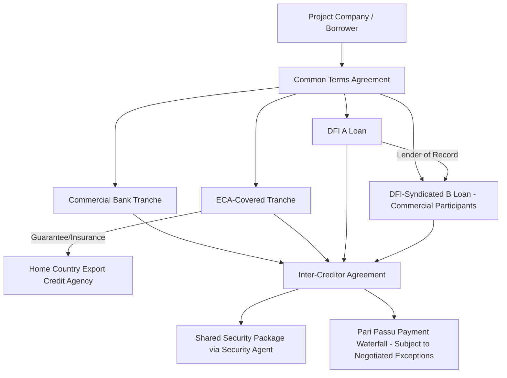

## Syndication Among Commercial Banks, Export Credit Agencies, and Development Finance Institutions

### Overview

Large-scale infrastructure and project finance transactions frequently exceed the risk appetite, lending limits, or currency/political risk tolerance of any single lender, necessitating a **syndicate** of multiple financial institutions that collectively fund the debt facility under a shared set of loan documents. Unlike single-lender bilateral financing, multi-institution syndication in project finance typically blends three distinct categories of capital provider — commercial banks, export credit agencies (ECAs), and development finance institutions (DFIs) — each bringing different risk mandates, pricing structures, and non-financial objectives to the transaction. Structuring these disparate participants into a coherent, enforceable capital stack is a defining skill in cross-border project finance syndication.

### Participant Categories

**Commercial Banks**

Profit-motivated lenders providing senior secured debt priced on a risk-adjusted commercial basis. In syndicated project finance, commercial banks typically participate through:

- **Mandated Lead Arrangers (MLAs)**: Banks engaged by the sponsor to structure, underwrite, and syndicate the facility, often committing to a "best efforts" or "underwritten" position before broader syndication
- **Participant banks**: Institutions joining the syndicate post-launch, typically taking smaller allocations with limited or no structuring input
- Commercial banks are motivated by risk-adjusted return, relationship banking (cross-sell opportunities with the sponsor), and regulatory capital efficiency

**Export Credit Agencies (ECAs)**

Government-affiliated or government-owned institutions that provide financing, guarantees, or insurance to support their home country's exporters by facilitating the sale of goods and services to the project. Prominent examples include the U.S. Export-Import Bank (EXIM), UK Export Finance (UKEF), Euler Hermes (Germany), COFACE (France), and Japan Bank for International Cooperation (JBIC). ECAs typically participate through:

- **Direct lending**: The ECA extends a loan directly to the project company, often at concessional or government-backed rates
- **Guarantee/insurance cover**: The ECA guarantees a portion of a commercial bank loan (commonly 85-95% political and commercial risk cover under OECD Arrangement guidelines), allowing the commercial bank to extend financing it otherwise could not justify on a pure credit basis
- ECA involvement is typically contingent on a **national content requirement** — a minimum percentage of project procurement (equipment, services, engineering) must be sourced from the ECA's home country, directly linking ECA participation to export promotion rather than pure investment return

**Development Finance Institutions (DFIs)**

Multilateral or bilateral institutions mandated to promote economic development, often in emerging markets, by providing financing on more patient or risk-tolerant terms than pure commercial capital would accept. Examples include the World Bank Group's International Finance Corporation (IFC), the European Bank for Reconstruction and Development (EBRD), the Asian Development Bank (ADB), the African Development Bank (AfDB), and bilateral DFIs such as the U.S. International Development Finance Corporation (DFC) and Germany's DEG. DFIs participate through:

- **A/B loan structures**: The DFI lends its own capital (the "A loan") while syndicating a parallel "B loan" tranche to commercial banks that benefits from the DFI's preferred creditor status and, in many jurisdictions, exemption from certain withholding taxes and capital controls that would otherwise apply to purely commercial cross-border lending
- **Political risk guarantees and partial credit guarantees**: Covering specific risk categories (currency inconvertibility, expropriation, breach of contract by a government counterparty) to enable commercial lender participation in jurisdictions they would not otherwise enter
- **Preferred Creditor Status (PCS)**: A market convention (not a formal legal doctrine in most jurisdictions) under which sovereign borrowers and host governments customarily continue servicing multilateral DFI debt even during broader sovereign debt distress or restructuring, reflecting the practical reality that continued access to multilateral development financing depends on maintaining this relationship

### The A/B Loan Structure in Detail

The A/B loan mechanism, pioneered and most extensively used by the IFC, allows commercial banks to lend into higher-risk emerging market projects by structurally attaching themselves to the DFI's preferred creditor status:

- The **A Loan** is funded and held on the DFI's own balance sheet
- The **B Loan** is funded by participating commercial banks, but the DFI remains the "lender of record" on the loan documentation — commercial participants hold a **participation interest** in the B loan rather than a direct contractual relationship with the borrower
- Because the DFI is the lender of record for both tranches, host governments and borrowers treat the entire facility (A and B loans combined) as multilateral DFI debt for purposes of preferred creditor treatment, extending PCS benefits to the commercial B loan participants who would not otherwise qualify for this treatment on a standalone bilateral basis
- This structure allows the DFI to mobilize significantly more capital than its own balance sheet would permit, while giving commercial banks access to PCS-protected emerging market exposure and, in many jurisdictions, favorable withholding tax treatment on interest payments

[Inference: the degree of practical benefit from preferred creditor status is a market convention reinforced by borrower government incentives to preserve future multilateral access, rather than a binding legal priority right enforceable in insolvency in most jurisdictions — sponsors and participants should not treat PCS as equivalent to a formal legal security priority.]

### Documentation Architecture in Multi-Institution Syndicates

**Common Terms Agreement (CTA)**

In complex multi-tranche syndications combining commercial, ECA, and DFI tranches, a **Common Terms Agreement** is frequently used to harmonize shared provisions (representations, covenants, events of default, conditions precedent) across all tranches, while each tranche retains a separate **Facility Agreement** governing tranche-specific pricing, tenor, and repayment terms. This avoids the need to renegotiate identical boilerplate provisions across multiple bilateral-style agreements and ensures consistent covenant treatment across all lender classes.

**Inter-Creditor Agreement (ICA)**

Governs the relative priority, voting thresholds, and enforcement coordination among the different lender classes:

- **Payment waterfall priority**: Typically pari passu among senior tranches (commercial, ECA, DFI A/B loans) unless specific subordination is negotiated, though ECA-covered tranches may carry distinct payment mechanics tied to the guarantee structure
- **Voting thresholds**: Defining what percentage of aggregate commitments (and which specific lender classes) must consent to waivers, amendments, or enforcement action — ECAs and DFIs frequently negotiate specific consent or consultation rights over matters affecting their policy mandates (e.g., environmental and social covenant waivers)
- **Standstill and enforcement coordination**: Preventing any single lender class from unilaterally accelerating or enforcing security in a manner that could prejudice the collective syndicate position

**Security Sharing Arrangements**

Given the typically pari passu ranking of commercial, ECA, and DFI senior tranches, security (mortgages, share pledges, assignment of project contracts) is generally held by a common security agent or security trustee on behalf of all senior lenders collectively, with enforcement proceeds distributed per the inter-creditor waterfall rather than on a first-come, first-served basis.

### Environmental and Social Standards Overlay

DFI participation typically imposes environmental and social (E&S) compliance requirements substantially more rigorous than a purely commercial lending relationship would require, most commonly benchmarked to the **IFC Performance Standards** or the **Equator Principles** (a voluntary framework adopted by many commercial banks, originally modeled on IFC standards, for managing environmental and social risk in project finance). When a DFI participates alongside commercial banks, the DFI's E&S requirements frequently become binding covenants across the entire syndicate via the Common Terms Agreement, effectively exporting DFI-grade E&S standards onto commercial lenders who might not independently impose equivalent requirements. This creates ongoing compliance obligations including:

- Environmental and Social Impact Assessments (ESIA) prior to financial close
- Independent Environmental and Social consultants monitoring construction and operational compliance
- Grievance mechanisms for affected communities
- Periodic E&S compliance reporting as a condition of continued lender support

### Syndication Structure Diagram

### Rationale for Blended Syndicate Structures

**Risk Mitigation and Capital Mobilization**

Blending DFI, ECA, and commercial capital allows a project to access total debt capacity that no single institution or lender category could provide alone — DFIs and ECAs absorb specific risk categories (political, currency, sovereign counterparty) that commercial banks are unwilling or regulatorily unable to bear directly, while commercial banks contribute the bulk of low-margin senior capital once that residual risk is mitigated or covered.

**Political Risk Mitigation via Institutional Presence**

Beyond the explicit guarantee or insurance instruments, the mere presence of a DFI or ECA as a lender of record can itself function as informal political risk mitigation: host governments are generally reluctant to take adverse action (expropriation, discriminatory regulation, contract breach) against a project when doing so risks damaging the government's relationship with the World Bank Group, a bilateral ECA's home government, or other multilateral development relationships. [Speculation: the strength of this deterrent effect varies significantly by country, political context, and the specific DFI/ECA involved, and should not be treated as a guaranteed substitute for formal contractual and insurance-based risk mitigation.]

**Pricing Blend**

The blended facility typically achieves an all-in cost of capital lower than a hypothetical all-commercial-bank facility of equivalent size and tenor would command, because ECA-covered and DFI tranches are priced to reflect their risk mitigation function and policy mandate rather than purely commercial risk-return requirements, effectively subsidizing the overall syndicate's average cost of capital.

### Key Points

- Multi-institution project finance syndicates typically blend commercial banks (profit-motivated senior debt), ECAs (export-promotion-linked financing tied to national content requirements), and DFIs (development-mandate financing with preferred creditor status benefits)
- The A/B loan structure allows commercial banks to access DFI preferred creditor status by holding a participation interest in a B loan for which the DFI remains lender of record
- Common Terms Agreements harmonize shared covenant and default provisions across tranches, while Inter-Creditor Agreements govern payment priority, voting thresholds, and enforcement coordination among lender classes
- DFI participation frequently imports IFC Performance Standards or Equator Principles-level environmental and social compliance obligations across the entire syndicate, not merely the DFI's own tranche
- Preferred creditor status is a market convention rather than a formally enforceable legal priority in most jurisdictions, and should be understood as such when evaluating its risk-mitigation value

### Related Topics

- OECD Arrangement Guidelines on Officially Supported Export Credits
- IFC Performance Standards and Equator Principles Compliance Frameworks
- Political Risk Insurance Products: MIGA Guarantees and Private Market Alternatives
- Common Terms Agreement Drafting in Multi-Tranche Infrastructure Financing
- National Content Requirements and Their Impact on Project Procurement Strategy
- Sovereign Debt Restructuring and Preferred Creditor Treatment in Practice