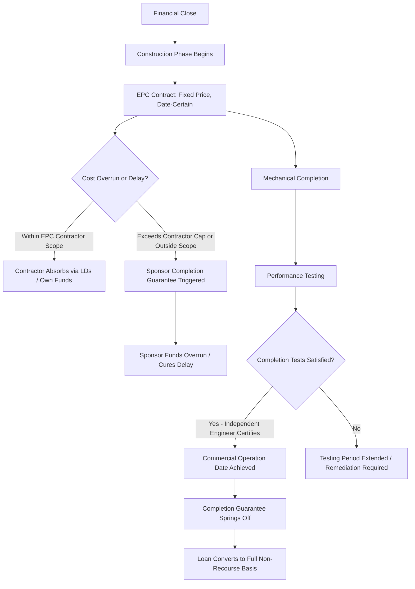

## Risk Allocation and Completion Guarantees

### Overview

Risk allocation is the structuring discipline of assigning each category of project risk — construction, operating, market, and financial — to the party best positioned to control, mitigate, or absorb it, memorialized through a network of contracts (EPC agreements, offtake agreements, guarantees, and insurance) rather than through equity or debt pricing alone. Completion guarantees are the specific instrument addressing the highest-risk phase of a project's life: the period between financial close and the point at which the asset demonstrates it can generate the cash flow the entire capital structure was underwritten against. Because project finance debt is non-recourse or limited-recourse once a project is operational (see prior chapter items), lenders require an explicit, often full-recourse, sponsor commitment to bridge completion risk before that non-recourse treatment applies.

### The Fundamental Risk Allocation Principle

The governing principle of project finance risk allocation is that **risk should rest with the party best able to control or price it**, since this minimizes the aggregate risk premium embedded in the capital structure and reduces moral hazard. Misallocating risk to a party without the ability to manage or mitigate it (e.g., asking a passive lender to bear construction execution risk it cannot control) results in either the risk being underpriced (creating a hidden vulnerability) or overpriced (making the project uneconomic). A disciplined project finance structuring process maps every material risk category to a specific contractual counterparty before financial close.

### Risk Categories and Standard Allocation

| Risk Category | Typical Bearer | Mitigation Instrument |
| --- | --- | --- |
| Construction/completion risk | Sponsor (via completion guarantee), EPC contractor | Fixed-price, date-certain EPC contract; completion guarantee |
| Technology/performance risk | EPC contractor, equipment supplier | Performance guarantees, liquidated damages, warranties |
| Operating cost risk | Project company, operator | Fixed-price O&M contract, performance-based O&M incentives |
| Market/offtake (demand) risk | Offtaker (if contracted) or project company (if merchant) | Long-term power purchase agreement (PPA), take-or-pay contract |
| Input/fuel supply risk | Supplier (if contracted) or project company | Long-term supply agreement, tolling arrangement |
| Currency/interest rate risk | Project company (mitigated) | Hedging instruments, matched-currency financing |
| Political/regulatory risk | Host government (via contract), political risk insurers | Government support agreements, MIGA/political risk insurance |
| Force majeure risk | Shared, per contractual allocation | Insurance, extension-of-time provisions, relief events |
| Environmental/social risk | Sponsor, project company | E&S covenants, IFC Performance Standards compliance |

### Construction/Completion Risk in Detail

Completion risk is generally considered the single highest-risk phase of project finance because, unlike operating risk (which benefits from actual performance data once the asset is running), construction-phase risk is entirely forward-looking and dependent on the EPC contractor's execution capability, cost estimation accuracy, and the absence of unforeseen site or design conditions. Key sub-risks include:

- **Cost overrun risk**: Actual construction costs exceeding budgeted costs, potentially due to design changes, material price escalation, or contractor error
- **Delay risk**: Construction extending beyond the scheduled completion date, delaying revenue generation and potentially breaching offtake contract milestones
- **Technical/performance risk**: The completed asset failing to meet designed output, efficiency, or quality specifications upon testing
- **Force majeure during construction**: Weather events, geopolitical disruption, or other uncontrollable events delaying or damaging work in progress

### The EPC Contract as Primary Risk Transfer Mechanism

The **Engineering, Procurement, and Construction (EPC) contract** is the primary instrument transferring construction risk from the project company (and ultimately, lenders) to a single, contractually accountable contractor. Lenders in project finance typically require, as a condition of achieving favorable (non-recourse-eligible) financing terms:

- **Fixed-price, date-certain structure**: The EPC contractor commits to a guaranteed maximum price and a guaranteed completion date, absorbing cost overrun and delay risk within the contractor's own scope (subject to defined relief events)
- **Single point of responsibility**: One contractor (sometimes as the lead of a consortium) is contractually responsible for the entire scope, avoiding the interface risk that arises when a project company must coordinate multiple contractors directly
- **Liquidated damages (LDs)**: Pre-agreed per-day (or per-unit) financial penalties payable by the contractor for late completion, typically structured to approximate the project company's actual damages (e.g., lost revenue, additional interest during construction) without requiring proof of actual loss
- **Performance liquidated damages**: A separate LD category, payable if the completed facility fails to meet guaranteed performance metrics (output capacity, efficiency, availability) upon commissioning tests
- **LD caps**: Contractors typically negotiate an aggregate cap on total liquidated damages exposure (commonly 10-20% of contract value), meaning LDs alone rarely cover the full magnitude of a severe delay or performance shortfall — a key gap that completion guarantees and other mitigants must address

### Completion Guarantees: Structure and Function

A **completion guarantee** is a sponsor-level (rather than EPC contractor-level) undertaking, typically required by lenders as a condition of construction-phase financing, obligating the sponsor to ensure the project reaches completion — funding cost overruns, curing delays, or repaying/converting debt if completion does not occur — notwithstanding the underlying loan's otherwise non-recourse or limited-recourse character.

**Key Completion Guarantee Provisions**

- **Cost overrun funding obligation**: Sponsor commits to fund construction costs exceeding the original budget, often up to an agreed cap or, in some structures, uncapped until completion is achieved
- **Debt service undertaking during construction**: Sponsor may guarantee debt service payments during the construction period, since the project generates no revenue to service debt until operational
- **Completion date guarantee**: Sponsor guarantees the project will achieve defined "completion" milestones (mechanical completion, substantial completion, commercial operation date) by an outside date, with recourse liability if the date is missed
- **Springing to non-recourse upon completion**: The defining feature of the completion guarantee structure — once the project satisfies negotiated "completion tests," the guarantee automatically terminates (or "springs off"), and the loan converts to its intended non-recourse or limited-recourse basis for the remainder of the term

### Completion Test Standards

Lenders and sponsors negotiate specific, objectively measurable **completion tests** that must be satisfied before the completion guarantee springs off. Common formulations include:

- **Mechanical Completion**: Physical construction is finished and the facility is capable of operating, though full performance testing may not yet be complete
- **Substantial Completion**: The facility is capable of performing its intended function at a substantial (though not necessarily full) level of designed capacity
- **Commercial Operation Date (COD)**: The facility has passed all performance tests, met minimum output/efficiency thresholds, and is contractually authorized to begin commercial operations and revenue generation under the offtake agreement
- **Final/Physical Completion**: All contractual construction obligations, including any post-COD punch-list items, are fully discharged

Lenders typically require completion to be certified by an **Independent Engineer**, a technical advisor retained by (and reporting primarily to) the lenders, whose certification of test results is a condition precedent to the completion guarantee's release — a critical independence safeguard against sponsor or contractor self-certification bias.

### Illustrative Completion Test Threshold Table

| Test | Typical Threshold | Consequence of Failure |
| --- | --- | --- |
| Mechanical Completion | 100% of physical construction per specifications | Construction milestone draws suspended pending remediation |
| Performance Test (Capacity) | Minimum 95-100% of guaranteed output | Performance LDs invoked; may delay COD determination |
| Performance Test (Efficiency) | Minimum guaranteed heat rate/efficiency threshold | Performance LDs invoked; potential re-testing period |
| Reliability/Availability Test | Sustained operation over a defined test period (e.g., 30-90 days) at minimum availability | COD delayed until sustained threshold achieved |

[Unverified: exact threshold percentages and test period lengths are project- and sector-specific, heavily negotiated, and vary substantially between power generation, transportation, water, and other infrastructure sub-sectors — the figures above represent illustrative market-typical ranges rather than fixed standards.]

### Risk Allocation and Completion Guarantee Flow

### Interaction with Non-Recourse Carve-Outs

Completion guarantees operate alongside, but are structurally distinct from, the "bad boy" non-recourse carve-out guarantees discussed in prior chapter items. A completion guarantee is a **performance-based, springing** recourse obligation tied to construction risk specifically, expected to terminate upon successful completion. A non-recourse carve-out guaranty, by contrast, is a **permanent, conduct-based** recourse obligation that persists for the life of the loan, triggered only by defined bad-faith conduct (fraud, unauthorized transfer, bankruptcy). Lenders in construction-phase project finance typically require both instruments simultaneously: the completion guarantee addressing the temporary elevated risk of the construction period, and the carve-out guaranty addressing permanent bad-faith-conduct risk throughout the entire loan term.

### Force Majeure and Relief Event Allocation

EPC contracts and completion guarantees typically distinguish between:

- **Excusable/Relief Events**: Force majeure events (defined narrowly — typically natural disasters, war, government action) entitle the contractor to a time extension without incurring liquidated damages, and may excuse the sponsor's completion guarantee obligations for the corresponding delay period
- **Non-Excusable Events**: Events within the contractor's reasonable control (labor disputes attributable to the contractor's own labor practices, equipment failure, design error) do not excuse performance and leave the contractor fully liable for resulting delay and cost consequences

Careful drafting of the force majeure definition and its interaction with the completion guarantee is a frequent negotiation focal point, since an overly broad force majeure clause can shift risk back onto the sponsor/lender side that the EPC contract was intended to transfer to the contractor.

### Key Points

- Effective risk allocation assigns each risk category to the party best positioned to control or mitigate it, transferring construction risk primarily to the EPC contractor and residual/gap risk to the sponsor via completion guarantees
- Fixed-price, date-certain EPC contracts with liquidated damages are the primary contractual risk transfer mechanism, but LD caps typically leave a residual risk gap that only a sponsor completion guarantee can cover
- Completion guarantees are springing obligations — full or limited recourse during construction, automatically terminating upon independent-engineer-certified satisfaction of negotiated completion tests
- Completion guarantees and non-recourse carve-out guaranties are distinct instruments: one is performance-based and temporary (springs off at completion), the other is conduct-based and permanent for the loan term
- Force majeure and relief event definitions in the EPC contract directly affect how much residual completion risk flows back to the sponsor, making their drafting a critical structuring negotiation point

### Related Topics

- EPC Contract Structuring: Liquidated Damages Caps and Performance Guarantees
- Independent Engineer Role and Completion Test Certification Standards
- Force Majeure and Relief Event Drafting in Construction Contracts
- Offtake Agreement Structures: Power Purchase Agreements and Take-or-Pay Contracts
- Political Risk Insurance and Government Support Agreements
- Construction-to-Term Loan Conversion Mechanics and Conditions Precedent