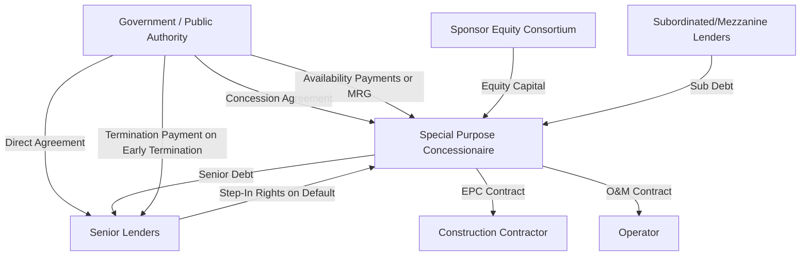

## Public-Private Partnership Capital Structuring

### Overview

Public-Private Partnership (PPP or P3) capital structuring addresses how a private consortium finances, and how a government counterparty compensates, the design, construction, financing, operation, and/or maintenance of public infrastructure under a long-term concession arrangement. Unlike conventional project finance where revenue derives entirely from private market transactions (tolls, tariffs, offtake contracts), PPP capital structures are distinguished by the presence of a government or public-sector counterparty as either the primary revenue source, a risk-sharing partner, or a regulatory gatekeeper — introducing a distinct layer of political, contractual, and payment-mechanism risk that shapes the entire capital stack.

### PPP Payment Mechanism Categories

The revenue/payment structure is the foundational determinant of a PPP's risk profile and therefore its achievable capital structure. Three principal mechanisms dominate:

**Availability-Based PPPs**

The government pays the private concessionaire a periodic "availability payment" contingent on the asset being available for use to specification (uptime, condition, service quality) — **not** on actual usage or demand. Common in social infrastructure (schools, hospitals, government buildings) and increasingly in transportation (managed lanes, some highway concessions).

- Demand/volume risk sits with the government/public sector, not the private concessionaire
- Because revenue is contractually predictable (subject only to availability/performance deductions), availability-based PPPs typically support the highest sustainable leverage among PPP structures, often comparable to contracted-revenue project finance generally

**Demand-Risk (Toll/User-Pay) PPPs**

The concessionaire's revenue derives directly from user charges (tolls, fares, tariffs), meaning the private party bears market/volume risk in addition to construction and operating risk.

- Requires more conservative underwriting (lower leverage, higher required DSCR) given exposure to traffic/usage forecasting risk, which has a well-documented history of forecast optimism bias in toll road projects specifically
- May include government-provided **minimum revenue guarantees** or **traffic risk-sharing bands** to partially mitigate demand risk and improve financeability

**Hybrid/Shadow Toll Structures**

The government pays the concessionaire based on actual usage (mimicking a toll), but the payment obligation runs from the government rather than end users directly — combining elements of both structures: usage-linked payment mechanics with government (rather than user) counterparty credit risk.

### Capital Structure Implications by Payment Mechanism

| Structure | Revenue Risk Bearer | Typical Leverage | Typical DSCR Requirement |
| --- | --- | --- | --- |
| Availability-based | Government | 80-90%+ (highest) | 1.10x-1.25x (lower, given predictable revenue) |
| Demand-risk (toll/user-pay) | Private concessionaire | 50-70% (lowest) | 1.30x-1.50x+ (higher, given volume uncertainty) |
| Shadow toll / hybrid | Shared | 65-80% (intermediate) | 1.20x-1.35x (intermediate) |

[Unverified: specific leverage and DSCR figures vary substantially by jurisdiction, sector, sovereign/sub-sovereign credit quality, and prevailing capital market conditions at financial close — the ranges above represent illustrative market tendencies rather than fixed benchmarks.]

### Capital Stack Components in PPP Structures

**Senior Private Debt**

Provided by commercial banks, institutional investors (via project bonds), or blended syndicates including ECAs/DFIs for cross-border or emerging market PPPs (see prior chapter items). Senior debt in availability-based PPPs frequently achieves institutional-grade credit characteristics due to the government payment obligation's relative predictability, enabling access to capital markets takeout via project bonds post-construction.

**Subordinated Debt / Mezzanine**

Bridges the gap between senior debt capacity and required equity, particularly in higher-risk demand-based structures where senior lenders underwrite conservatively.

**Private Equity (Sponsor Consortium)**

Typically contributed by a consortium of infrastructure sponsors — construction companies (often the EPC contractor itself, taking an equity stake to align incentives), infrastructure funds, pension funds, and specialist PPP developers. Equity consortiums commonly include:

- **Developer/Sponsor equity**: The lead party structuring and often operating the asset, retaining meaningful ownership to preserve operational alignment
- **Financial investor equity**: Institutional co-investors (pension funds, infrastructure funds, sovereign wealth funds) providing capital with lower return requirements than the developer, often entering post-construction once completion risk has been retired (see the "Primary vs. Secondary Market Equity" section below)

**Government Capital Contributions**

Governments frequently contribute capital directly to improve project financeability, particularly where user-pay revenue alone would not support sufficient private financing for a socially necessary project:

- **Viability Gap Funding (VGF)**: A capital grant provided upfront or during construction to bridge the gap between a project's total cost and the level of private financing that projected revenues can support, common in emerging market PPP programs
- **Milestone/Construction Payments**: Government payments tied to construction progress, reducing the private financing requirement and construction-period debt exposure
- **Land or in-kind contributions**: Governments contributing land, existing assets, or co-located development rights (e.g., transit-oriented development rights alongside a rail concession) as a non-cash capital contribution

### Government Support Instruments Beyond Direct Capital

- **Minimum Revenue Guarantees (MRGs)**: Government commits to top up concessionaire revenue if actual usage/toll revenue falls below a specified floor, partially converting demand risk back to government risk in exchange for lower required user tariffs or reduced private capital cost
- **Termination Payments**: Contractually defined compensation payable by the government to the concessionaire (or its lenders directly, via a **direct agreement** — see below) upon early contract termination, varying by termination cause (government default/convenience termination typically triggers the most generous compensation, concessionaire default the least)
- **Political Risk Guarantees**: Multilateral instruments (e.g., World Bank Multilateral Investment Guarantee Agency, MIGA) or bilateral DFI guarantees covering currency inconvertibility, expropriation, or government contract breach risk, particularly relevant in emerging market PPPs

### Direct Agreements and Lender Step-In Rights

A defining PPP-specific structuring feature is the **Direct Agreement** (or "tripartite deed") between the government/public authority, the private concessionaire, and the senior lenders. This agreement grants lenders specific rights to protect their financing position notwithstanding the underlying concession agreement being solely between the government and the concessionaire:

- **Step-in rights**: Allowing lenders to temporarily assume the concessionaire's role (directly or via a substitute operator) upon a concessionaire default, curing the default and preserving the concession rather than allowing the government to terminate
- **Cure period extensions**: Providing lenders additional time beyond what the concession agreement grants the concessionaire directly, to arrange a step-in or substitution before the government may terminate
- **Termination payment assignment**: Ensuring termination compensation, if the concession is ultimately terminated, is payable in a manner that protects outstanding lender claims (often requiring termination payments to at least cover outstanding senior debt in non-concessionaire-default termination scenarios)

Direct agreements are the mechanism by which lenders achieve comfort that their collateral position (the concession right itself, which typically cannot be conventionally mortgaged in the way real property can) retains practical value and enforceability, since the concession is fundamentally a contractual right granted by the government rather than a freely transferable physical asset.

### PPP Capital Structure and Government Interface Diagram

### Risk Matrix Distinctive to PPP Structures

| Risk | PPP-Specific Consideration |
| --- | --- |
| Change in law / regulatory risk | Concession agreements typically include compensation mechanisms for discriminatory or PPP-specific adverse legislative changes, distinguishing these from general changes in law affecting all market participants |
| Government payment/credit risk | Availability-based PPPs substitute government payment credit risk for market demand risk — sub-sovereign or fiscally weak governments can introduce payment risk comparable to or exceeding private counterparty risk |
| Political/expropriation risk | Elevated in cross-border/emerging market PPPs; mitigated via political risk insurance, DFI participation, and direct agreements |
| Refinancing risk | Many PPPs use shorter-tenor bank debt during construction with planned refinancing (via project bonds or institutional debt) post-completion; refinancing gain-sharing clauses are common, requiring the concessionaire to share refinancing benefits with the government |
| Handback/residual value risk | Long-dated concessions (25-99 years) typically require the asset be handed back to the government in a defined condition at concession expiry, creating end-of-term capital expenditure obligations that must be reserved for within the capital structure |

### Primary vs. Secondary Market Equity Dynamics

A distinctive feature of PPP equity structuring is the frequent **rotation of equity ownership** across the asset lifecycle:

- **Primary/development-stage investors** (construction contractors, specialist developers) typically require higher return targets commensurate with construction and completion risk, and often plan to **sell down** their equity stake once the asset reaches stabilized operations and completion risk has retired
- **Secondary-market/core infrastructure investors** (pension funds, insurance companies, infrastructure funds with lower return hurdles) acquire operational-stage equity stakes, valuing the asset's now-de-risked, bond-like cash flow profile
- This equity rotation is a structural feature specific to how PPP (and broader infrastructure) equity capital is priced across the risk lifecycle, and sponsors frequently plan financing and shareholder agreement transfer provisions with an anticipated future sell-down in mind from financial close

### Key Points

- The payment mechanism (availability-based, demand-risk, or hybrid/shadow toll) is the primary determinant of a PPP's risk profile and achievable leverage, with availability-based structures generally supporting the highest private debt capacity
- Government capital contributions (viability gap funding, milestone payments, land contributions) and support instruments (minimum revenue guarantees, termination payments, political risk guarantees) are structuring tools used to improve financeability where pure private-sector risk-bearing would be uneconomic
- Direct agreements between government, concessionaire, and lenders — granting step-in rights and termination payment protections — are the PPP-specific mechanism addressing the fact that a concession right is a contractual rather than freely mortgageable physical asset
- PPP risk allocation must address change-in-law, government payment/credit, refinancing, and handback/residual value risks in addition to the construction and operating risks common to general project finance
- Equity ownership frequently rotates from higher-return development-stage sponsors to lower-return core infrastructure investors once an asset reaches stabilized operations, reflecting the shifting risk profile across the concession lifecycle

### Related Topics

- Availability Payment Mechanism Design and Performance Deduction Regimes
- Minimum Revenue Guarantee Structuring and Government Contingent Liability Management
- Direct Agreement Drafting: Step-In Rights and Cure Period Mechanics
- Refinancing Gain-Sharing Clauses in Long-Term Concession Agreements
- Handback and Residual Value Reserve Requirements in Concession Structuring
- Viability Gap Funding Program Design in Emerging Market PPP Frameworks
- Change-in-Law and Compensation Event Provisions in Concession Agreements