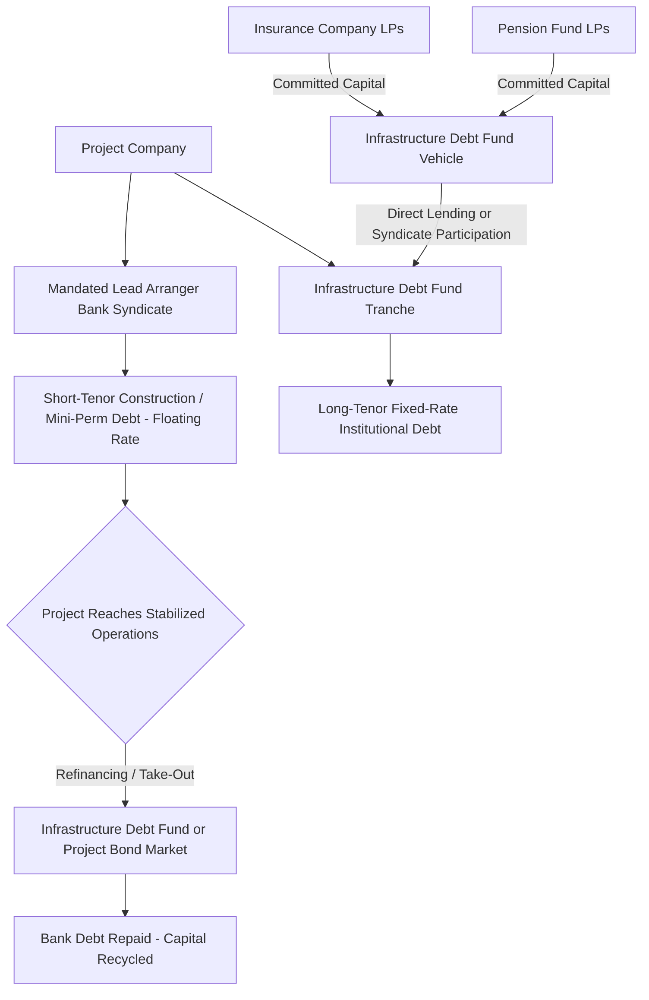

## Infrastructure Debt Funds and Institutional Syndication

### Overview

Infrastructure debt funds are pooled investment vehicles, typically managed by dedicated asset managers or insurance company affiliates, that raise capital from institutional investors specifically to provide senior or subordinated debt financing to infrastructure and project finance transactions. They represent a structurally distinct capital source from the traditional bank-led and DFI/ECA-blended syndicates discussed in prior chapter items, having emerged largely in response to post-2008 regulatory capital constraints on bank balance-sheet lending and the search among long-duration institutional investors (insurance companies, pension funds) for stable, long-tenor, illiquid credit assets matching their liability profiles.

### Why Infrastructure Debt Funds Emerged

**Bank Capacity Constraints**

Following the 2008 financial crisis, Basel III capital and liquidity requirements (risk-weighted capital ratios, the Net Stable Funding Ratio, and Liquidity Coverage Ratio) materially increased the capital cost for commercial banks to hold long-tenor project finance loans on balance sheet, particularly for tenors extending beyond 10-15 years — a maturity mismatch that infrastructure projects, with concession or asset lives often spanning 25-99 years, frequently require. This created a **financing gap** for long-dated infrastructure debt that banks became structurally less willing or able to fill.

**Institutional Investor Demand**

Insurance companies (particularly life insurers with long-duration liabilities) and pension funds have a natural asset-liability matching incentive to hold long-duration, stable-cash-flow assets. Infrastructure debt — particularly senior debt backed by contracted or availability-based revenue — offers:

- Long tenor matching long-duration liabilities
- Predictable, often inflation-linked or fixed cash flows
- A yield premium over comparable-rated corporate bonds, compensating for illiquidity and structural complexity
- Historically lower observed default and higher recovery rates relative to comparably-rated corporate credit, based on published rating agency infrastructure debt studies [Unverified: specific default/recovery statistics vary by study period, rating agency methodology, and sector composition — sponsors and investors should consult current published rating agency infrastructure default studies (e.g., Moody's, S&P infrastructure finance default and recovery reports) rather than relying on generalized claims]

### Fund Structure and Investor Base

**Typical Fund Structure**

Infrastructure debt funds are typically organized as closed-end or open-end commingled vehicles (frequently structured as Luxembourg or Irish regulated fund vehicles for European-domiciled funds, or Delaware LP structures for U.S.-domiciled funds), raising committed capital from institutional Limited Partners with a defined investment period during which the fund manager deploys capital across a portfolio of infrastructure debt investments.

**Investor Base**

- Insurance companies (life and, to a lesser extent, non-life insurers seeking asset-liability matched credit exposure)
- Pension funds (public and corporate, particularly defined-benefit plans with long-duration liabilities)
- Sovereign wealth funds
- Increasingly, other institutional allocators seeking diversification away from traditional corporate credit and public infrastructure equity exposure

**Fund Economics**

Infrastructure debt funds typically charge lower management fees than infrastructure equity funds (reflecting debt's lower risk/return profile and reduced active management intensity), commonly in the range of 0.5-1.0% of committed or invested capital, generally without a carried interest/promote structure comparable to equity funds — though some funds structure a modest performance fee tied to achieving target portfolio yields. [Unverified: specific fee structures vary by manager, fund vintage, and investor negotiating leverage; the ranges cited are illustrative of general market practice rather than fixed industry standards.]

### Investment Strategy Segmentation

Infrastructure debt funds typically differentiate strategy along several axes:

**Seniority**

- **Senior debt funds**: Focus on senior secured project finance loans, typically targeting lower yield in exchange for priority claim and lower loss-given-default
- **Subordinated/mezzanine debt funds**: Target the layer between senior debt and equity, accepting higher risk for higher yield, often including equity-like features (warrants, equity kickers)

**Origination Approach**

- **Direct lending**: The fund originates loans directly as sole lender or co-lead arranger, typically for mid-market transactions where the fund's size and origination team can efficiently structure bespoke terms
- **Club/syndicated participation**: The fund participates alongside banks, ECAs, and DFIs in larger syndicated facilities, taking allocations in transactions originated and structured primarily by bank arrangers
- **Secondary market acquisition**: The fund acquires existing project finance loans from banks seeking balance sheet relief or portfolio rebalancing, rather than originating new loans directly

**Sector and Geography Focus**

Funds commonly specialize by sector (renewable energy, digital infrastructure/data centers and fiber, transportation, social infrastructure) and geography (developed market core infrastructure vs. emerging market/higher-yield strategies), reflecting both risk appetite and the specialized underwriting expertise required across infrastructure sub-sectors.

### Role in the Syndication Process

**Complementary Capital Source, Not Replacement**

Infrastructure debt funds typically participate alongside, rather than in place of, commercial bank syndicates in large transactions, occupying tranches particularly suited to their institutional investor base:

- Longer-tenor tranches (15-30+ years) that banks are structurally reluctant to hold, allowing banks to focus on shorter-tenor construction and early-operations financing with planned refinancing into debt fund or capital markets takeout
- Fixed-rate tranches matching insurance company liability duration, complementing floating-rate bank tranches
- Private placement note structures, particularly in the U.S. market, where infrastructure debt funds and insurance companies directly negotiate customized note terms with the borrower, functioning similarly to but distinct from broadly syndicated bank loans

**Take-Out Financing / Mini-Perm Refinancing**

A common structural pattern involves banks providing shorter-tenor "mini-perm" construction and early-operations financing (typically 5-7 years), with an anticipated refinancing (or "take-out") by infrastructure debt funds, insurance companies, or the project bond market once the asset reaches stabilized operations and completion risk has retired — allowing banks to recycle balance sheet capacity while institutional investors acquire the now-de-risked, longer-duration operational credit exposure.

### Comparison: Bank Syndicate vs. Infrastructure Debt Fund Participation

| Dimension | Commercial Bank Syndicate | Infrastructure Debt Fund |
| --- | --- | --- |
| Typical tenor appetite | Shorter (5-10 years, often with refinancing assumption) | Longer (10-30+ years) |
| Rate structure | Predominantly floating rate | Frequently fixed rate or fixed-to-floating hybrid |
| Regulatory capital driver | Basel III risk-weighted capital and liquidity ratios | Insurance regulatory capital regimes (e.g., Solvency II in Europe) favoring long-duration matched assets |
| Origination role | Often active arranger/structurer (MLA role) | Often participant in bank-led syndicates, or direct originator in private placement/club deals |
| Documentation preference | Syndicated loan market standard documentation (LMA/LSTA-style) | Often private placement note format, particularly for insurance company direct investment |
| Relationship banking motive | Often present (cross-sell, ancillary business) | Generally absent — pure financial investment motive |

### Regulatory Capital Treatment Driving Institutional Appetite

**Solvency II (European Insurers)**

Under the European Union's Solvency II insurance regulatory capital framework, "qualifying infrastructure investments" satisfying specific criteria (predictable cash flows, robust risk mitigation, appropriate creditor protections) receive preferential capital charge treatment compared to standard corporate credit exposure of comparable rating, directly incentivizing European insurers to allocate to qualifying infrastructure debt, including via infrastructure debt funds structured to meet these qualifying criteria. [Unverified: specific qualifying criteria and capital charge calibrations are subject to periodic regulatory review and amendment; fund managers and investors should confirm current Solvency II qualifying infrastructure criteria against the applicable EU technical standards in effect at the time of investment.]

**U.S. NAIC Framework**

U.S. insurance companies operate under state-based risk-based capital (RBC) requirements administered through the National Association of Insurance Commissioners (NAIC) framework, which similarly assigns capital charges based on the credit rating and asset class designation of infrastructure debt holdings, influencing U.S. insurer appetite for infrastructure debt fund allocations and direct private placement infrastructure notes.

### Institutional Syndication Structure Diagram

### Documentation and Structuring Considerations Specific to Fund Participation

- **Intercreditor alignment**: Infrastructure debt fund tranches must be integrated into the same inter-creditor framework governing bank, ECA, and DFI tranches (see prior chapter item), notwithstanding differing rate structures and tenors, requiring careful drafting of pro-rata sharing, voting thresholds, and enforcement coordination provisions that accommodate fixed-rate note holders alongside floating-rate bank lenders
- **Make-whole and prepayment provisions**: Fixed-rate institutional debt (particularly U.S. private placement note structures) commonly includes make-whole premium provisions compensating noteholders for prepayment-driven reinvestment risk, a feature less standard in floating-rate bank facilities and requiring specific inter-creditor accommodation
- **Ratings requirements**: Institutional debt fund and insurance company participation frequently requires or benefits from an external credit rating (from Moody's, S&P, or Fitch) on the specific project finance instrument, both for the investor's own regulatory capital determination and to support the instrument's marketability in private placement or club deal contexts

### Key Points

- Infrastructure debt funds emerged primarily to fill a financing gap created by post-2008 bank regulatory capital constraints on long-tenor project finance lending, matched against institutional investor demand for long-duration, stable-yield credit assets
- Insurance companies and pension funds are the dominant investor base, driven substantially by asset-liability duration matching and, for European insurers, preferential Solvency II capital treatment for qualifying infrastructure debt
- Infrastructure debt funds typically complement rather than replace bank syndicates, often providing longer-tenor, fixed-rate take-out financing that refinances shorter-tenor bank "mini-perm" construction debt once a project reaches stabilized operations
- Fund strategies segment by seniority (senior vs. mezzanine), origination approach (direct lending, syndicate participation, secondary acquisition), and sector/geography specialization
- Integrating fixed-rate institutional debt fund tranches alongside floating-rate bank tranches requires careful inter-creditor documentation addressing pro-rata sharing, make-whole provisions, and voting threshold alignment

### Related Topics

- Solvency II Qualifying Infrastructure Investment Criteria and Capital Charge Calibration
- Mini-Perm Financing Structures and Refinancing Risk Allocation
- U.S. Private Placement Note Market Documentation Standards for Infrastructure Debt
- Project Bond Structures as an Alternative Institutional Take-Out Mechanism
- NAIC Risk-Based Capital Framework and Insurer Infrastructure Debt Allocation
- Make-Whole Premium Calculation Methodologies in Fixed-Rate Project Debt
- Rating Agency Infrastructure Default and Recovery Study Methodologies