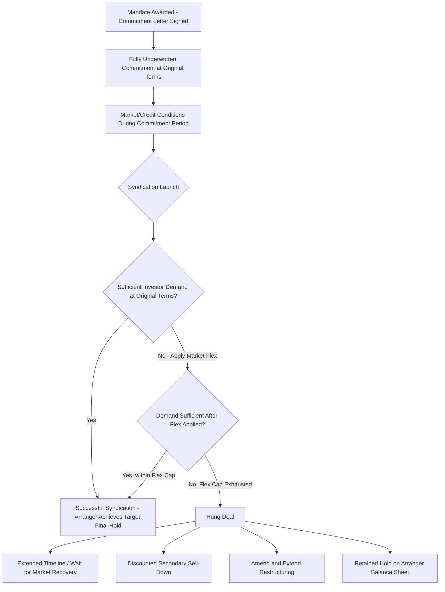

## Underwriting Risk and Hung Deal Management

### Overview

Underwriting risk arises when a lead arranger or syndicate of banks commits to provide financing on fixed terms before the debt or equity has actually been placed with final investors or sub-participant lenders. Because the underwriter bears the gap risk between commitment and successful distribution, adverse movement in credit markets, investor sentiment, or borrower-specific circumstances between signing and syndication can leave the arranger holding more of the exposure than intended, at pricing that no longer reflects prevailing market conditions — a scenario known as a **hung deal** (or "hung bridge," in leveraged finance/M&A contexts). Managing this risk is a core discipline in syndication, spanning pre-commitment structuring, market flex mechanisms, and post-hang workout strategies.

### Underwriting Commitment Types

**Fully Underwritten Commitment**

The lead arranger(s) commit to provide 100% of the financing amount at agreed terms, regardless of whether syndication to other lenders succeeds. This is the highest-risk commitment structure from the arranger's perspective, since the arranger's balance sheet is fully exposed until the loan or bond is successfully syndicated or sold down. Fully underwritten commitments are typically required to win competitive mandates, particularly in acquisition financing and leveraged buyout contexts where the borrower/sponsor requires financing certainty to sign a binding purchase agreement.

**Best-Efforts Commitment**

The arranger commits only to use reasonable efforts to arrange financing, without guaranteeing the full amount will be raised, and the borrower bears the risk that syndication falls short of the target amount. Best-efforts structures shift execution risk to the borrower but are generally less competitive in win-the-mandate scenarios where certainty of funds is a differentiating factor.

**Club Deal Structure**

A small group of relationship lenders commits collectively from the outset, with each lender holding its final allocation directly rather than relying on post-commitment syndication to a broader market. This structure largely eliminates underwriting/syndication risk (since there is no intended sell-down), at the cost of requiring the borrower to negotiate directly with each committed lender rather than relying on a single lead arranger's market access.

### Sources of Underwriting Risk

**Market Risk (Systematic)**

Broad credit market deterioration between commitment and syndication launch — widening credit spreads, declining risk appetite, or a general "risk-off" shift — can make the originally agreed pricing and terms unattractive to prospective syndicate participants, independent of anything specific to the borrower or transaction.

**Credit/Borrower-Specific Risk**

Adverse developments specific to the borrower or transaction between commitment and syndication (earnings miss, credit rating downgrade, adverse litigation, sector-specific news) can reduce investor appetite even in a stable broader market.

**Timing/Duration Risk**

The longer the period between underwriting commitment and syndication launch, the greater the cumulative exposure to both systematic and borrower-specific adverse developments — large or complex transactions (particularly those requiring regulatory approval, such as M&A financing subject to antitrust clearance) can carry underwriting exposure for many months.

**Concentration Risk**

If a single arranger or small group underwrites a very large commitment relative to their typical hold size or risk appetite, even a partially successful syndication can leave a residual balance sheet exposure exceeding the arranger's intended final position.

### Market Flex Provisions as a Primary Risk Mitigant

**Market flex** (or "flex language") is the principal contractual mechanism arrangers use to shift underwriting risk back toward the borrower, embedded in the commitment letter and fee letter at the time of original commitment:

- **Pricing flex**: Permits the arranger to increase interest rate margins (and in some cases original issue discount) up to a specified cap if necessary to achieve successful syndication, without requiring the borrower's separate consent
- **Structural flex**: Permits the arranger to adjust non-pricing terms — covenant levels, amortization schedules, tranche sizing (e.g., shifting amounts between a term loan and a bond tranche), or adding collateral — to improve marketability
- **Reverse flex**: Less common, allows pricing to tighten (benefiting the borrower) if syndication demand significantly exceeds the offered amount, reflecting strong investor appetite

Market flex provisions are heavily negotiated at commitment, since the borrower's fee letter typically caps the arranger's total permitted flex (e.g., a maximum 75-100 basis point pricing flex), balancing the arranger's need for syndication flexibility against the borrower's desire for cost certainty at the time of signing.

### The "Hung Deal" Scenario

A deal becomes "hung" when the arranger cannot successfully syndicate the committed financing to the broader market at (or even after adjusting to the maximum permitted flex) terms acceptable to prospective lenders, leaving the arranger holding a larger final position than intended — potentially the entire committed amount. Hung deals are most acutely associated with periods of sudden credit market dislocation (e.g., the 2007-2008 financial crisis, when numerous leveraged buyout financings committed during the 2006-2007 credit boom became hung as credit markets seized shortly after commitment but before syndication could be completed).

**Consequences for the Arranger**

- The arranger's balance sheet carries the unsold exposure at the original committed terms, which may be significantly below prevailing market-clearing pricing, creating a mark-to-market loss if the position is carried at fair value or accounted for as held-for-sale
- Regulatory capital consequences, since an unsyndicated loan held on balance sheet consumes risk-weighted capital the arranger had planned to recycle through successful distribution
- Reputational and future mandate implications, as repeated hung deals can affect an arranger's perceived reliability and pricing competitiveness in future mandates

### Hung Deal Management Strategies

**Extended Syndication Timeline**

Rather than forcing a sale at distressed pricing, arrangers may extend the syndication period, waiting for market conditions to improve or for borrower-specific credit concerns to resolve, while continuing to hold the exposure on balance sheet in the interim.

**Discounted Sell-Down**

Selling the position (or portions of it) to secondary market buyers (distressed debt funds, CLO managers, opportunistic credit investors) at a discount to par, crystallizing a realized loss but freeing balance sheet capacity and eliminating ongoing mark-to-market exposure risk.

**Amend-and-Extend / Term Restructuring**

Renegotiating loan terms directly with the borrower (pricing step-ups, covenant modifications, tenor extension) to make the position more attractive to eventual syndicate participants, effectively resetting terms closer to prevailing market conditions before attempting syndication again.

**Retained Hold Strategy**

The arranger may deliberately retain a larger final position than originally intended, treating the exposure as a relationship-driven balance sheet investment rather than pursuing a forced sale, particularly where the underlying credit is viewed as fundamentally sound despite temporary syndication market weakness.

**CLO and Structured Vehicle Placement**

For broadly syndicated leveraged loans specifically, placement into Collateralized Loan Obligation (CLO) vehicles is a common distribution channel; a hung deal scenario may require waiting for CLO formation/reinvestment period timing to align, or accepting placement at wider spreads than CLO managers would have accepted absent the syndication overhang.

### Underwriting Risk Timeline and Flex Mechanism

### Pre-Commitment Risk Mitigation Practices

**Market Sounding / Early Look Syndication**

Prior to finalizing underwriting commitment terms, arrangers frequently conduct informal soundings with anticipated syndicate participants or key institutional investors to gauge appetite and pricing sensitivity, reducing (though not eliminating) the risk of mispricing the original commitment relative to actual syndication market demand.

**Syndication Strategy and Timing**

Arrangers structure the syndication process — general syndication versus a more targeted, relationship-based approach; timing relative to other competing new-issue supply in the market; and structuring the transaction (tranching, covenant package) with anticipated syndicate investor preferences in mind from the outset — to reduce the probability of a shortfall requiring flex or resulting in a hang.

**MAC (Material Adverse Change) Clauses**

Commitment letters typically include Material Adverse Change conditions permitting the arranger to withdraw or renegotiate the commitment if a defined adverse event affecting the borrower's business or the broader financial markets occurs between signing and closing — though MAC clauses are narrowly drafted and difficult to invoke successfully in practice, particularly for general market deterioration rather than borrower-specific developments, as demonstrated in various contested M&A financing disputes.

**Bridge-to-Bond / Bridge-to-Perm Structures**

In acquisition financing specifically, arrangers may structure a bridge loan commitment (short-tenor, higher pricing step-up features) intended to be quickly refinanced via permanent bond or term loan financing post-closing, isolating underwriting risk to a defined, shorter interim period rather than committing to the full permanent capital structure terms at signing.

### Key Points

- Underwriting risk arises whenever an arranger commits to financing terms before successfully distributing that exposure to the broader syndicate or investor market, exposing the arranger to gap risk between commitment and placement
- Market flex provisions (pricing and structural flex, subject to negotiated caps) are the primary contractual mechanism shifting some syndication risk back toward the borrower without requiring separate consent for each adjustment
- A hung deal occurs when syndication fails even after maximum permitted flex is applied, leaving the arranger holding an unintended residual position, historically most severe during periods of sudden credit market dislocation
- Hung deal management strategies range from patient balance sheet retention and amend-and-extend restructuring to crystallizing losses via discounted secondary market sell-down
- Pre-commitment mitigants — market soundings, syndication strategy design, MAC clauses, and bridge structuring — reduce but do not eliminate underwriting risk, since MAC clauses in particular are narrowly enforceable in practice

### Related Topics

- Market Flex Mechanics: Pricing Caps and Structural Flex Negotiation
- CLO Formation Timing and Reinvestment Period Impact on Loan Placement
- Material Adverse Change Clause Enforceability in Financing Disputes
- Bridge-to-Bond Financing Structures in Leveraged Acquisition Finance
- Secondary Loan Market Trading and Distressed Debt Fund Participation
- Syndication Strategy Design: General Syndication vs. Club/Relationship Placement
- Historical Case Study: 2007-2008 Leveraged Loan Hung Deal Overhang