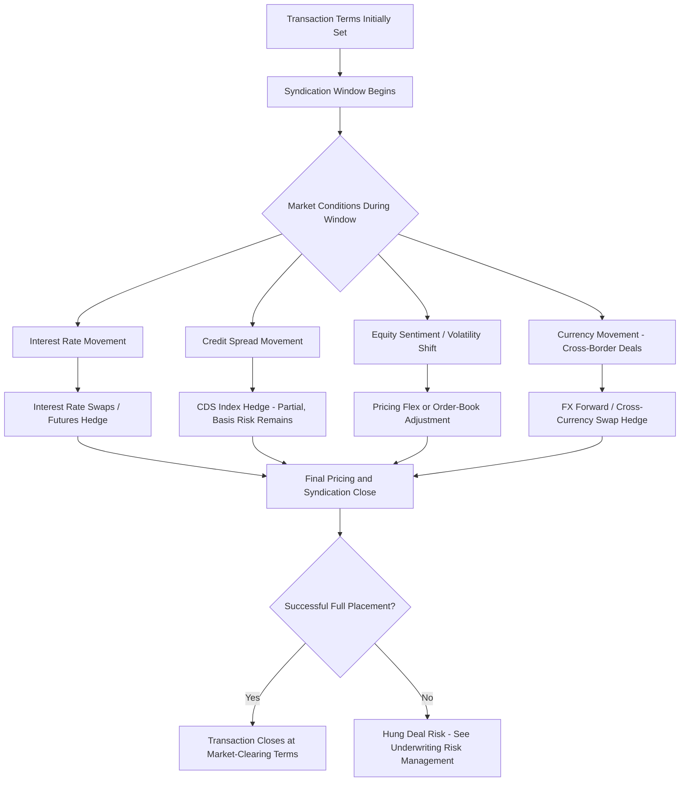

## Market Risk During the Syndication Period

### Overview

Market risk during the syndication period refers to the exposure an arranger, sponsor, or issuer faces to adverse movements in interest rates, credit spreads, equity market sentiment, and broader macroeconomic conditions in the interval between committing to transaction terms and successfully placing the debt or equity with final investors. This risk category is distinct from (though related to) the underwriting/hung-deal risk discussed in the prior chapter item: market risk specifically concerns the *pricing and valuation* exposure created by market movement during the syndication window, whereas hung deal risk concerns the *distribution failure* outcome that severe adverse market risk can ultimately produce. Effective market risk management during syndication combines timing strategy, hedging instruments, and structural flexibility to minimize the window and magnitude of exposure.

### Sources of Market Risk During Syndication

**Interest Rate Risk**

Between the time a transaction's pricing benchmark is set (or a fixed coupon is agreed) and final syndication/closing, benchmark rate movements (SOFR, government bond yields for fixed-rate tranches) can shift the transaction's relative attractiveness to investors, independent of any change in the underlying credit quality.

**Credit Spread Risk**

Broader credit spread widening or tightening across comparable-rated debt in the market shifts the required yield investors demand for a given credit quality, potentially making the originally negotiated spread over benchmark unattractive (if spreads widen) or unnecessarily generous to the borrower (if spreads tighten, in which case reverse flex may apply).

**Equity Market Risk (Equity Syndications)**

For syndicated equity capital raises — real estate syndication LP capital calls, infrastructure equity co-investment placements, or IPO/follow-on equity underwriting — broader equity market volatility or sector-specific sentiment shifts between pricing and final allocation/closing can affect investor willingness to fund at the agreed valuation.

**Currency Risk**

In cross-border syndications, movement in exchange rates between the currency of the underlying asset's cash flows and the currency of syndicated debt/equity tranches (particularly relevant in the ECA/DFI-blended structures and cross-border infrastructure syndications discussed elsewhere in this chapter) can materially affect the economics for both the borrower and international syndicate participants if unhedged.

**Volatility and Liquidity Risk**

Beyond directional rate or spread movement, elevated market volatility itself reduces investor risk appetite for taking on new primary market exposure, since investors generally demand a larger liquidity/volatility premium (wider spreads, more conservative structuring) during volatile periods regardless of the specific direction of rate or spread movement.

### The Syndication Window as the Core Risk Period

**Duration Sensitivity**

The length of time between initial pricing/commitment and final closing/settlement is the primary determinant of cumulative market risk exposure. Shorter syndication windows (days to a few weeks, typical of well-telegraphed, high-quality broadly syndicated loans) carry materially less market risk than extended windows (multiple months, common in complex acquisition financings requiring regulatory approval, large infrastructure financings with extensive due diligence, or real estate syndication capital raises with rolling closes).

**Bought Deal vs. Marketed Deal Timing**

- **Bought deal**: The arranger(s) commit to final pricing terms essentially simultaneously with (or shortly before) launching to the broader syndicate, compressing the market risk window to the minimum practical duration but requiring the arranger to absorb pricing risk internally during that compressed period
- **Marketed/roadshow deal**: Pricing is finalized only after a period of investor education, roadshow meetings, and order-book building (common in bond issuance and equity capital markets), extending the market risk window but allowing price discovery based on actual investor demand rather than the arranger's internal estimate

### Hedging Instruments for Market Risk During Syndication

**Interest Rate Hedges**

Arrangers or borrowers may execute interest rate swaps, forward rate agreements, or Treasury/government bond futures/options positions to lock in the benchmark rate component of pricing during the syndication window, isolating credit spread risk as the primary remaining variable. This is particularly relevant when a fixed-rate bond or note issuance's coupon is influenced by movement in the underlying government benchmark yield between price talk and final pricing.

**Credit Spread Hedges**

Credit default swap (CDS) indices (e.g., CDX or iTraxx, for broadly referenced credit market segments) can provide a partial hedge against systematic credit spread widening during a syndication window, though single-name or bespoke project finance credit exposure is generally not perfectly hedgeable via standardized index instruments, leaving basis risk.

**Currency Hedges**

Forward foreign exchange contracts or cross-currency swaps are used to lock in the exchange rate applicable to cross-border syndication proceeds, particularly where the underlying project's revenue currency differs from one or more syndicate tranches' funding currency.

**Structural Hedges: Delayed Draw and Forward-Starting Structures**

Rather than (or in addition to) financial derivative hedging, transactions can be structured with delayed draw provisions or forward-starting effective dates, reducing the borrower's/arranger's exposure to committing capital or locking pricing significantly ahead of actual need, thereby compressing the effective market risk window even if the legal commitment period is longer.

### Market Risk Management Framework

### Market Risk in Real Estate and Infrastructure Syndication Contexts Specifically

**Real Estate Syndication Capital Raises**

Because real estate syndication capital raises (see the corresponding chapter item on the capital raising process) often extend over weeks or months with a rolling close structure, and because pricing is typically fixed at the outset (the offered LP terms, waterfall, and implied property valuation do not typically flex with daily market movement the way a floating-rate bank loan might), market risk during a real estate syndication capital raise manifests primarily as:

- **Financing rate risk**: If the acquisition debt has not been locked (via a rate lock or forward-starting swap) at the time equity commitments are solicited, movement in the underlying debt cost between LP subscription and closing can alter the deal's actual returns relative to what was represented to investors in the PPM
- **Investor sentiment/re-trade risk**: Broader market volatility (e.g., a sudden equity market selloff or interest rate shock) during a multi-week or multi-month raise can cause committed-but-not-yet-funded LPs to reconsider or attempt to re-negotiate/withdraw commitments, particularly in a best-efforts (non-binding-until-funded) subscription structure

**Infrastructure/Project Finance Syndication**

Given the extended timelines common to infrastructure financial close processes (often 6-18+ months from mandate to financial close, particularly for complex PPP or emerging market transactions), market risk exposure during syndication is structurally elevated relative to standard corporate loan syndication. This is a significant driver behind the market flex provisions and extended MAC clause negotiations discussed in the underwriting risk item, as well as the increased use of rate locks and forward-starting hedge structures specifically tailored to infrastructure financial close timelines.

### Reverse Flex and Investor-Favorable Market Movement

Market risk during syndication is not unidirectional — if credit spreads tighten or investor demand significantly exceeds the offered amount during the syndication window (an "oversubscribed" order book), **reverse flex** provisions (where present) allow pricing to tighten in the borrower's favor, or the arranger may upsize the transaction to accommodate excess demand ("upsizing the deal"). This dynamic is common in strong credit market conditions and represents the mirror image of the adverse market risk scenario, underscoring that the syndication window is a genuine period of price discovery rather than solely a source of downside risk to the arranger or borrower.

### Distinguishing Market Risk from Credit/Underwriting Risk

| Dimension | Market Risk | Underwriting/Hung Deal Risk (prior item) |
| --- | --- | --- |
| Nature of exposure | Pricing/valuation movement due to systematic market factors | Distribution/placement failure, potentially due to market risk materializing severely |
| Primary mitigant | Hedging instruments (rate swaps, CDS, FX forwards), timing/window compression | Market flex provisions, syndication strategy, MAC clauses |
| Typical outcome if realized | Repricing (flex) to reflect new market-clearing terms | Residual unsold position retained on arranger balance sheet |
| Directionality | Bidirectional (can benefit or harm the borrower/arranger) | Generally only a downside/failure scenario |

### Key Points

- Market risk during syndication arises from interest rate, credit spread, equity sentiment, and currency movement occurring between initial pricing/commitment and final closing, with exposure magnitude directly correlated to syndication window duration
- Bought deals compress market risk exposure into a short window at the cost of arranger pricing risk; marketed/roadshow deals extend the window but allow genuine investor-demand-based price discovery
- Interest rate swaps, CDS index hedges, and FX forwards are the primary financial hedging instruments, though single-name or bespoke project credit exposure typically retains basis risk even when hedged via standardized index instruments
- Real estate syndication capital raises face market risk primarily through unlocked financing rate exposure and investor re-trade risk during extended rolling-close periods, while infrastructure financings face structurally elevated exposure due to extended financial close timelines
- Market risk is bidirectional — reverse flex and deal upsizing capture favorable market movement just as standard flex captures adverse movement, distinguishing genuine price discovery risk from the largely downside-oriented underwriting/hung deal risk category

### Related Topics

- Interest Rate Swap and Forward Rate Agreement Structuring for Financial Close Timing
- CDS Index Hedging and Basis Risk in Project-Specific Credit Exposure
- Rate Lock Mechanisms in Real Estate Acquisition Financing
- Bought Deal vs. Marketed/Roadshow Execution Strategy Selection
- Cross-Currency Swap Structuring in International Infrastructure Syndication
- Order Book Building and Price Discovery in Syndicated Bond Issuance