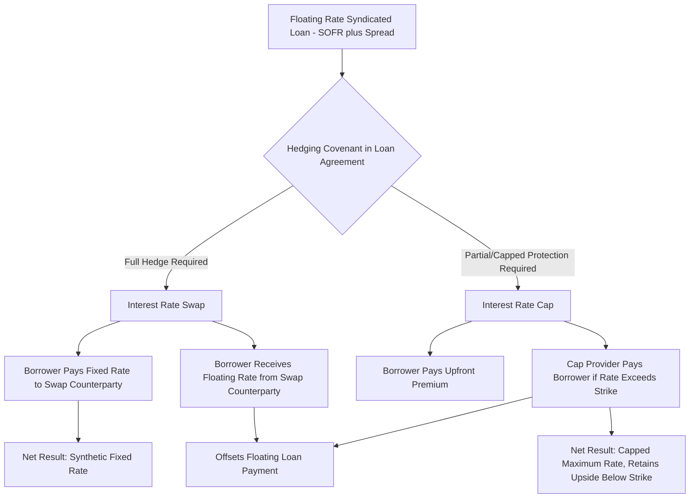

## Interest Rate Hedging with Swaps and Caps

### Overview

Interest rate hedging with swaps and caps is the practice of using derivative instruments to manage exposure to floating-rate interest rate movements on syndicated debt, converting variable-rate risk into a more predictable or bounded cost profile. In syndicated real estate and project finance transactions, borrowers frequently take on floating-rate debt (priced off SOFR or a similar reference rate) to access competitive spreads and prepayment flexibility, but many lenders — and often the borrower's own risk tolerance or lender-imposed covenants — require some form of interest rate risk mitigation for a portion or all of the loan term, particularly for longer-tenor or higher-leverage facilities.

### Why Hedging Is Required in Syndicated Transactions

**Lender-Imposed Hedging Covenants**

Loan agreements for leveraged or higher-LTV floating-rate financings commonly include mandatory hedging covenants, requiring the borrower to hedge a minimum percentage of the outstanding loan balance (often 50-100%) for a minimum duration (often 2-5 years or the full initial loan term) as a condition of closing or as an ongoing covenant. This protects the lender's underwritten debt service coverage ratio (DSCR) from deteriorating if rates rise materially after closing, since DSCR covenants are typically tested against actual (not underwritten) debt service.

**Cash Flow Certainty for the Borrower/Sponsor**

Even absent a lender mandate, sponsors frequently hedge to protect underwritten equity returns and business plan cash flow projections from interest rate volatility, particularly in value-add or development deals where the business plan already carries substantial execution risk without adding open-ended rate risk on top.

**Rating Agency and Capital Markets Considerations**

For loans intended for securitization (e.g., CMBS) or that will be marketed to institutional syndicate participants and rating agencies, a hedged interest rate profile is often necessary to achieve the desired credit rating or investor marketability, since unhedged floating-rate exposure introduces cash flow volatility that complicates coverage ratio analysis for rating purposes.

### Interest Rate Swap Mechanics

**Basic Structure**

An interest rate swap is a bilateral contract in which two counterparties exchange interest payment streams calculated on a common notional principal amount, without exchanging the principal itself. In the standard borrower hedging application:

- The borrower pays a **fixed rate** to the swap counterparty (typically a bank or specialized derivatives dealer)
- The swap counterparty pays the borrower a **floating rate** (matching the reference rate on the underlying loan, e.g., SOFR)
- The borrower's net cost becomes the fixed swap rate plus the loan's contractual spread over the floating reference rate, since the floating payments received from the swap offset the floating payments owed on the loan

$$\text{Net Borrower Cost} = \text{Fixed Swap Rate} + \text{Loan Spread over Reference Rate}$$

**Worked Example**

Assume a $20,000,000 floating-rate loan priced at SOFR + 250 basis points, and the borrower executes a 5-year interest rate swap with a fixed rate of 4.00%.

- Loan interest payment: SOFR + 2.50%
- Swap: Borrower pays 4.00% fixed, receives SOFR floating
- Net borrower cash outflow: (SOFR + 2.50%) - SOFR + 4.00% = 6.50% fixed, regardless of where SOFR actually moves

This converts a floating-rate loan into a **synthetic fixed-rate** obligation, eliminating benchmark rate volatility for the swap's notional and term, while the credit spread (2.50% in this example) remains subject to any repricing under the loan agreement itself (swaps hedge benchmark rate risk, not credit spread risk).

**Swap Valuation and Mark-to-Market**

An interest rate swap has a mark-to-market value that fluctuates over its life based on how current market interest rate expectations compare to the fixed rate locked in at execution:

- If market rates rise after the swap is executed, the swap becomes an asset to the fixed-rate payer (the borrower), since they are locked into paying a below-market fixed rate
- If market rates fall after execution, the swap becomes a liability to the fixed-rate payer, since they remain obligated to pay an above-market fixed rate

$$\text{Swap MTM} \approx \sum_{t=1}^{n} \frac{(\text{Current Forward Rate}_t - \text{Fixed Swap Rate}) \times \text{Notional}}{(1 + \text{Discount Rate})^t}$$

[Inference: this is a simplified conceptual representation; actual swap valuation uses forward curve construction and discounting methodologies (e.g., OIS discounting under post-2008 market convention) that are more technically involved than this illustrative formula suggests.]

### Interest Rate Cap Mechanics

**Basic Structure**

An interest rate cap is an option-based instrument, not a swap, in which the borrower pays an upfront premium to a cap provider in exchange for the right to receive payment whenever the reference rate exceeds a specified **strike rate** during the cap's term. Unlike a swap, a cap does not require the borrower to pay a fixed rate — it purchases downside (rate-increase) protection while preserving full benefit if rates fall or remain below the strike.

$$\text{Cap Payout per Period} = \max(0, \text{Reference Rate} - \text{Strike Rate}) \times \text{Notional} \times \frac{\text{Days in Period}}{360}$$

**Net Borrower Cost Profile**

With a cap in place, the borrower's effective maximum interest cost is bounded:

$$\text{Maximum Effective Rate} = \text{Strike Rate} + \text{Loan Spread}$$

while the borrower continues to pay actual floating rate plus spread whenever the reference rate remains below the strike, capturing the benefit of lower rates that a swap would not provide (since a swap locks in the fixed rate regardless of directional movement).

**Premium Cost Determinants**

Cap premium cost (typically paid upfront, though amortizing or deferred premium structures also exist) is a function of:

- **Strike rate level**: A lower (more protective) strike costs more, since the cap is more likely to pay out
- **Notional amount and term**: Larger notional and longer terms increase total premium cost
- **Implied volatility**: Higher expected interest rate volatility increases premium cost, analogous to option premium behavior generally
- **Prevailing forward rate curve**: If the forward curve already implies rates will exceed the strike for a meaningful portion of the term, premium cost rises correspondingly

### Swap vs. Cap Comparison

| Feature | Interest Rate Swap | Interest Rate Cap |
| --- | --- | --- |
| Instrument type | Bilateral exchange of fixed/floating payments | Option (right, not obligation) |
| Upfront cost | Typically no upfront premium (economics embedded in fixed rate) | Upfront premium payment required |
| Downside protection | Full protection against rate increases | Full protection against rate increases above strike |
| Upside participation | None — rate is fixed regardless of market movement | Full benefit retained if rates stay below strike |
| Mark-to-market risk | Can become a liability if rates fall after execution | Value can only decline to zero (no ongoing payment obligation to cap seller after premium paid) |
| Typical use case | Longer-term, higher-conviction rate view; lender-mandated full hedges | Shorter-to-medium term protection while preserving upside; common in value-add/floating-rate bridge loans |
| Termination/breakage cost | Can carry significant breakage cost if terminated early with unfavorable mark-to-market | No ongoing breakage cost exposure beyond premium already paid (cap can simply be allowed to run or sold) |

### Hedging Structure in a Syndicated Loan Context

### Counterparty Credit Risk and CVA

Because swaps and caps are bilateral derivative contracts, the borrower bears **counterparty credit risk** — the risk that the swap or cap provider fails to perform under the contract, particularly relevant if the derivative has positive mark-to-market value to the borrower (i.e., the counterparty owes the borrower money under current market conditions). Institutional hedge providers typically price this risk into the transaction via a **Credit Valuation Adjustment (CVA)**, and larger transactions may require the hedge provider to post collateral (via a Credit Support Annex under an ISDA Master Agreement) to mitigate this exposure. In syndicated real estate loans specifically, the interest rate hedge is frequently provided by (or arranged through) the lead lender or an affiliate, allowing the hedge obligation to be secured alongside the loan itself under a shared collateral package.

### Documentation Framework

Interest rate swaps and caps are typically documented under an **ISDA Master Agreement**, published by the International Swaps and Derivatives Association, supplemented by a **Schedule** (customizing standard terms) and individual **Confirmations** for each specific transaction. In real estate financing specifically, the loan agreement typically cross-defaults to the hedge documentation and requires the hedge to be collaterally secured alongside the loan (via a joinder to the mortgage/security agreement), ensuring the lender's and hedge provider's interests are aligned and that a default under one does not leave the other unprotected.

### Common Structuring Considerations in Real Estate/Project Finance Syndication

- **Notional amortization matching**: The hedge notional should track the loan's actual outstanding balance if the loan amortizes, to avoid over- or under-hedging as the loan balance declines — commonly structured as an amortizing swap or a series of laddered caps
- **Rate cap replacement covenants**: Loan agreements often require the borrower to purchase a replacement cap if the original cap expires before loan maturity, or if the cap provider's credit rating is downgraded below an agreed threshold
- **SOFR transition and legacy LIBOR considerations**: Following the industry-wide transition from LIBOR to SOFR-based reference rates, legacy hedge documentation required specific fallback and rate-transition provisions; current transactions are generally originated directly on SOFR (or an equivalent risk-free rate in non-U.S. markets) from inception, reducing this transition risk for new originations
- **Basis risk between hedge and loan reference rates**: Ensuring the specific SOFR tenor/convention (e.g., Term SOFR vs. daily compounded SOFR) used in the hedge matches the convention used in the underlying loan agreement, to avoid residual basis risk that an imperfectly matched hedge would leave unaddressed

[Unverified: specific market convention details around SOFR tenor usage continue to evolve and vary by lender and loan product type; borrowers and their advisors should confirm the specific reference rate convention in both the loan agreement and hedge documentation match precisely at the time of execution.]

### Key Points

- Interest rate swaps convert floating-rate loan exposure into a synthetic fixed rate by exchanging floating payments for a fixed payment stream, eliminating benchmark rate volatility but also foregoing benefit if rates decline
- Interest rate caps are option-based instruments requiring an upfront premium, providing protection above a strike rate while preserving the borrower's benefit if rates remain below that strike
- Lender-imposed hedging covenants in syndicated loan agreements commonly mandate minimum hedge coverage percentages and durations to protect underwritten DSCR from rate volatility
- Counterparty credit risk on derivative hedges is managed via CVA pricing, ISDA documentation, and often collateral support requirements, particularly significant when the hedge carries positive mark-to-market value to the borrower
- Notional amortization matching and reference rate convention alignment (e.g., Term SOFR vs. daily compounded SOFR) between the loan and hedge are critical structuring details to avoid residual basis risk

### Related Topics

- ISDA Master Agreement and Credit Support Annex Structuring
- DSCR Covenant Testing Methodology and Hedge-Adjusted Debt Service Calculations
- SOFR Reference Rate Conventions: Term SOFR vs. Daily Compounded SOFR
- Credit Valuation Adjustment (CVA) Pricing in Bilateral Derivative Transactions
- Amortizing Swap and Laddered Cap Structuring for Amortizing Loan Balances
- Rate Cap Replacement Covenants and Counterparty Downgrade Provisions