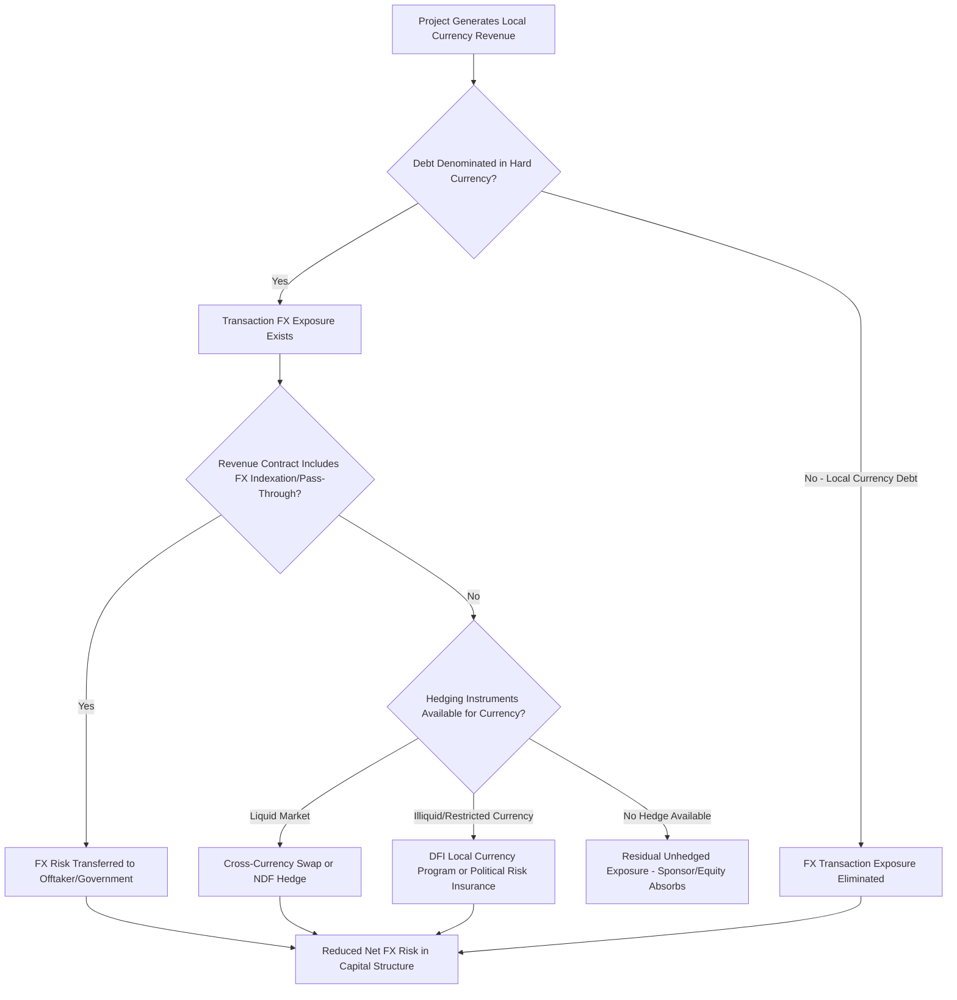

## Foreign Exchange Risk in Cross-Border Syndication

### Overview

Foreign exchange (FX) risk in cross-border syndication arises whenever a syndicated financing involves a mismatch between the currency in which project or asset revenue is generated, the currency in which debt service obligations are denominated, and the currency in which syndicate lenders or investors ultimately hold and report their returns. This risk category is a defining feature of cross-border real estate, project finance, and infrastructure syndication, since lenders and equity investors are frequently domiciled in a different currency zone than the underlying asset, and revenue-generating assets in emerging markets in particular often produce local-currency cash flow while debt service is contractually payable in a hard currency (typically USD or EUR).

### Categories of FX Exposure in Syndicated Transactions

**Transaction Exposure (Cash Flow Mismatch)**

Arises when the project company's revenue is denominated in one currency (typically local/host country currency) while debt service obligations under the syndicated facility are denominated in a different currency (typically USD or EUR, reflecting the syndicate's own funding currency and lender risk preferences). Any depreciation of the revenue currency relative to the debt currency directly increases the local-currency cost of servicing debt, potentially breaching DSCR covenants even if the underlying business performs exactly to plan in local-currency terms.

**Translation Exposure (Reporting/Valuation Mismatch)**

Arises for equity investors and lenders who must translate the value of a foreign-currency-denominated investment or loan back into their home reporting currency for financial statement, NAV, or regulatory capital purposes. Even where cash flow itself is not directly affected, translation exposure creates reported earnings and balance sheet volatility purely from currency movement between reporting periods.

**Economic/Competitive Exposure**

A broader, longer-term exposure category reflecting how currency movements affect a project's underlying competitive position — for example, a toll road or infrastructure asset serving an export-oriented industrial zone may see reduced traffic/usage if local currency appreciation makes the served industry less export-competitive, indirectly affecting project revenue independent of any direct currency-debt mismatch.

### Currency Mismatch Structures in Project and Real Estate Finance

**Matched-Currency Financing (Local Currency Debt)**

The most direct mitigation is structuring debt in the same currency as project revenue, eliminating transaction exposure entirely. However, local-currency debt capacity in many emerging and frontier markets is constrained by:

- Shallow local capital markets lacking sufficient long-tenor lending capacity for large infrastructure or real estate financings
- Higher local-currency interest rates (reflecting local inflation expectations and sovereign risk premium), increasing the nominal cost of borrowing even though it eliminates FX transaction risk
- Limited appetite among international syndicate participants (commercial banks, DFIs, institutional debt funds) to hold local-currency-denominated credit risk directly, given their own home-currency liability base

**Hard-Currency Financing with Revenue Indexation**

A common structural compromise in emerging market project finance: debt remains denominated in USD or EUR, but the project's revenue contract (offtake agreement, concession agreement, tariff structure) includes an indexation or pass-through mechanism linking local-currency tariffs to the hard-currency debt service requirement, effectively transferring FX risk to the offtaker or government counterparty rather than leaving it with the project company.

**Partial Hedged Structures**

Where full currency matching or indexation is unavailable, sponsors and lenders commonly negotiate a **partially hedged capital structure** — combining a hard-currency senior debt tranche, some form of currency hedge (see instruments below) for a defined portion and duration, and equity/sponsor absorption of residual unhedged exposure beyond the hedge tenor or notional.

### FX Hedging Instruments

**FX Forwards and Non-Deliverable Forwards (NDFs)**

A forward contract locks in an exchange rate for a future date, allowing a borrower to fix the local-currency cost of a known future hard-currency debt service payment. For currencies subject to capital controls or limited convertibility (common in many emerging and frontier markets), **Non-Deliverable Forwards** settle the net difference in a convertible currency (typically USD) rather than requiring physical exchange of the restricted local currency, providing a hedging mechanism even where the underlying currency cannot be freely delivered offshore.

**Cross-Currency Swaps**

Analogous to an interest rate swap but exchanging both principal and interest cash flows in two different currencies, commonly used to convert an entire hard-currency loan into an effectively local-currency-denominated obligation (or vice versa) for the life of the swap, addressing both the periodic debt service transaction exposure and, at swap maturity, principal exchange exposure.

$$\text{Cross-Currency Swap Net Effect} = \text{Convert Hard-Currency Principal + Interest} \leftrightarrow \text{Local-Currency Principal + Interest}$$

**FX Options**

Similar in concept to interest rate caps, an FX option provides the right (not obligation) to exchange currency at a specified strike rate, allowing the holder to protect against adverse currency movement beyond the strike while retaining benefit from favorable movement — typically more expensive than forwards/swaps given the option premium, but preserving upside participation.

### Political Risk Insurance and DFI Currency Risk Mitigation

Beyond conventional derivative hedging, cross-border syndication in emerging markets frequently relies on specialized political and currency risk mitigation instruments, particularly where deep FX derivative markets are unavailable for the currency in question:

- **Currency Inconvertibility and Transfer Risk Insurance**: Political risk insurance (from MIGA, private political risk insurers, or bilateral ECAs) covering the specific risk that a host government imposes capital controls or currency restrictions preventing conversion or transfer of local-currency revenue into hard currency for debt service purposes — distinct from ordinary FX rate movement risk, addressing convertibility/transferability itself rather than the exchange rate level
- **DFI Local Currency Lending Programs**: Certain DFIs (notably the IFC and various regional development banks) have developed local currency lending capabilities, either by raising local-currency-denominated funding directly in host country capital markets or through synthetic local currency structures using cross-currency swaps executed by the DFI itself, extending local currency debt capacity to markets where private syndicate participants would not independently develop such capability
- **TCX Fund and Similar Local Currency Risk-Sharing Facilities**: Specialized multilateral or DFI-sponsored vehicles exist specifically to provide local currency and interest rate hedging in frontier market currencies lacking conventional derivative market liquidity, pooling currency risk across a diversified portfolio of DFI-originated transactions [Unverified: the specific structure, currency coverage, and current operational scope of such facilities should be confirmed against current provider documentation, as coverage and terms evolve over time].

### FX Risk Structuring Flow in Cross-Border Project Finance

### Impact on Syndicate Structuring and Inter-Creditor Considerations

**Currency Tranching**

Larger cross-border syndications may structure multiple debt tranches in different currencies simultaneously (e.g., a USD tranche for international commercial banks and DFIs, alongside a local-currency tranche for domestic banks with natural local-currency funding), requiring careful inter-creditor documentation addressing how currency-differentiated tranches share security, rank in payment priority, and coordinate enforcement given their differing currency exposure profiles.

**Covenant Currency Basis**

DSCR, leverage, and other financial covenants in cross-border facilities must specify the currency and, where relevant, the FX rate convention (spot rate at test date, average rate over test period, or a fixed budget rate) used for covenant compliance calculation — a seemingly technical drafting point that can materially affect whether a covenant breach is triggered purely by currency movement rather than underlying operating performance.

**Sponsor/Equity FX Risk Retention**

In many cross-border structures, particularly where hedging costs for a specific currency are prohibitively expensive or unavailable at the required tenor, the equity sponsor is structurally the residual bearer of unhedged FX risk, since equity returns (denominated in the sponsor's home currency for reporting purposes) absorb the full economic impact of currency movement after debt service (in its contractually specified currency) has been paid.

### Key Points

- FX risk in cross-border syndication spans transaction exposure (cash flow currency mismatch), translation exposure (reporting currency conversion), and broader economic/competitive exposure from currency-driven shifts in project competitiveness
- Matched-currency (local currency) financing eliminates transaction exposure but is often constrained by shallow local capital markets and higher local-currency borrowing costs in emerging and frontier markets
- Conventional hedging instruments — FX forwards, non-deliverable forwards, cross-currency swaps, and FX options — mitigate exposure where sufficiently liquid derivative markets exist for the currency in question
- DFI local currency lending programs, political risk insurance for currency inconvertibility, and specialized multilateral risk-sharing facilities provide FX risk mitigation options specifically for frontier market currencies lacking conventional hedging market depth
- Cross-currency tranching and covenant currency-basis drafting are structuring details with direct inter-creditor and covenant compliance implications distinct from the underlying hedging strategy itself

### Related Topics

- Non-Deliverable Forward Pricing and Settlement Mechanics in Restricted Currencies
- MIGA Political Risk Guarantees and Currency Inconvertibility Coverage
- DFI Local Currency Lending Program Structures and Synthetic Local Currency Mechanisms
- Cross-Currency Tranche Inter-Creditor Documentation and Security Sharing
- Covenant Currency Basis Drafting: Spot Rate vs. Budget Rate Conventions
- Revenue Indexation and Tariff Pass-Through Mechanisms in Concession Agreements