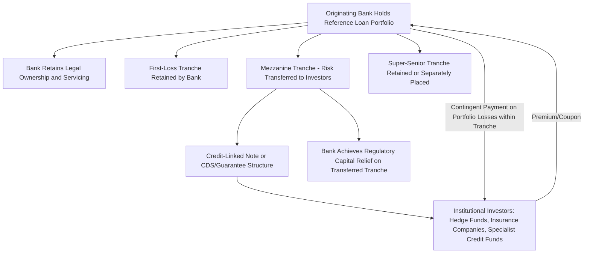

## Credit Derivatives and Synthetic Risk Transfer

### Overview

Credit derivatives and synthetic risk transfer instruments allow a lender or syndicate participant to transfer the credit risk of a loan or bond exposure to a third party without transferring legal ownership of the underlying asset itself. This distinguishes synthetic risk transfer from the "true sale" syndication and secondary loan trading discussed elsewhere in this chapter: rather than assigning or novating the loan, the originating institution retains the asset on its balance sheet (and often the associated funding and servicing relationship with the borrower) while contractually passing the economic credit risk to a counterparty willing to assume it. This distinction is central to why banks, syndicate arrangers, and infrastructure/project finance lenders use synthetic transfer: it can achieve regulatory capital relief and credit risk diversification while preserving client relationships and loan-level confidentiality that a full asset sale would disrupt.

### Core Instrument: Credit Default Swaps (CDS)

**Basic Mechanics**

A credit default swap is a bilateral contract in which a **protection buyer** pays a periodic premium (the CDS spread, quoted in basis points per annum on the notional) to a **protection seller**, in exchange for a contingent payment if a specified **credit event** occurs with respect to a **reference entity** or **reference obligation** (the underlying borrower or specific loan/bond).

- **Credit events** are standardized under documentation published by the International Swaps and Derivatives Association (ISDA), commonly including bankruptcy, failure to pay, and restructuring (with some regional and instrument-specific variation in which events apply)
- Upon a credit event, settlement occurs either via **physical settlement** (protection buyer delivers the defaulted obligation to the seller in exchange for par) or, increasingly standard, **cash settlement** based on an auction-determined recovery value

$$\text{CDS Premium Payment (Annual)} = \text{CDS Spread (bps)} \times \text{Notional Amount}$$

**Single-Name vs. Index CDS**

- **Single-name CDS**: References a specific borrower/issuer, allowing precise hedging of a single syndicate exposure
- **Index CDS** (e.g., CDX for North American names, iTraxx for European names): References a standardized basket of credit names, allowing broad, liquid hedging of portfolio-level or sector-level credit risk, though introducing basis risk relative to any single specific exposure being hedged

### Application to Syndicated Loan Risk Management

**Hedging a Retained Syndication Position**

A lead arranger holding a residual position after syndication (whether by design, as part of a retained hold strategy, or as a consequence of a hung deal as discussed in the prior chapter item) may purchase CDS protection referencing the borrower to hedge default risk on that retained position, without needing to sell the loan itself — preserving the direct lending relationship, ongoing fee income, and confidentiality of the borrower relationship while transferring the tail credit risk to a derivatives counterparty.

**Portfolio-Level Hedging**

Rather than hedging individual loan exposures name-by-name, institutional lenders and infrastructure debt fund managers may use index CDS or bespoke portfolio credit derivatives to hedge aggregate sector or portfolio-level credit risk concentrations — for example, an infrastructure lender with concentrated exposure to a specific sector (e.g., merchant power generation) purchasing sector-correlated index protection to reduce aggregate tail risk without unwinding individual loan positions.

**Basis Risk in Loan-Referencing CDS**

CDS contracts most commonly reference bond obligations or a broader category of "borrowed money" obligations of the reference entity, which may not perfectly track the specific credit and structural terms (security package, covenant protections, seniority) of a specific syndicated loan — creating **basis risk** where the CDS payout may not precisely offset the actual loss experienced on the specific hedged loan position, particularly relevant in project finance where the reference entity may be a special purpose vehicle without actively traded public debt, limiting available and liquidly-priced CDS reference obligations.

### Synthetic Securitization / Significant Risk Transfer (SRT) Structures

**Concept and Purpose**

Beyond single-name or index CDS hedging, banks increasingly use **synthetic securitization** (also termed **Significant Risk Transfer** or **SRT** transactions) to achieve regulatory capital relief on an entire portfolio of loans (which may include syndicated project finance, infrastructure, or commercial real estate loans) without physically selling or transferring the underlying assets.

**Structure**

- The originating bank retains legal ownership and the funding/servicing relationship for a reference portfolio of loans
- The bank purchases credit protection (via a credit-linked note, financial guarantee, or CDS referencing the portfolio) from an investor or group of investors, typically covering a **mezzanine tranche** of expected portfolio losses (i.e., losses beyond a first-loss threshold retained by the bank, up to a defined attachment/detachment point)
- Investors in the mezzanine tranche receive a premium/coupon compensating them for assuming this contingent credit risk, and bear losses if actual portfolio defaults exceed the attachment point, up to the detachment point of their tranche
- The bank retains the first-loss (equity) tranche and any super-senior tranche above the transferred mezzanine layer, meaning the transaction transfers a specific, negotiated slice of the portfolio's loss distribution rather than the full exposure

$$\text{Investor Loss Exposure} = \max\left(0, \min(\text{Portfolio Losses}, \text{Detachment Point}) - \text{Attachment Point}\right)$$

**Regulatory Capital Impact**

Under bank capital regulation (Basel framework, as implemented in each jurisdiction), a properly structured and documented SRT transaction allows the originating bank to reduce risk-weighted assets associated with the reference portfolio, freeing regulatory capital for redeployment into new lending, provided the transaction satisfies specific regulatory criteria for genuine risk transfer (sufficient tranche thickness, absence of implicit recourse back to the originating bank beyond the contractually defined protection, and independent verification that the transfer is not merely a capital arbitrage structure lacking economic substance).

[Unverified: specific SRT regulatory qualification criteria vary by jurisdiction and are subject to ongoing regulatory refinement (e.g., evolving European Banking Authority guidance, U.S. regulatory capital rule interpretation); institutions structuring SRT transactions should confirm current qualifying criteria with regulatory capital specialists and legal counsel at the time of structuring, rather than relying on generalized descriptions.]

### Credit-Linked Notes (CLNs) as a Funded Alternative

A **credit-linked note** is a funded (cash-collateralized) alternative to an unfunded CDS, in which the investor pays the full notional amount upfront to purchase the note, and the note's principal repayment at maturity is contingent on the performance of the reference credit or portfolio — if a credit event occurs, the investor's principal repayment is reduced accordingly. CLNs eliminate the protection buyer's counterparty credit risk on the *protection seller* (since the investor's cash is held/collateralized upfront), making them a common structural choice in synthetic securitization and SRT transactions specifically because they avoid the derivative counterparty risk inherent in an unfunded CDS arrangement with an uncollateralized protection seller.

### Synthetic Risk Transfer Structure Diagram

### Application Specific to Project Finance and Real Estate Syndication

While CDS and SRT structures originated primarily in corporate credit and broadly syndicated leveraged loan markets, their application to project finance and commercial real estate syndication carries specific considerations:

- **Limited reference obligation liquidity**: Single-purpose project finance and real estate borrowers rarely have actively traded public debt, meaning bespoke, privately negotiated credit derivative documentation (rather than standardized, liquidly-traded CDS) is typically required, increasing transaction cost and reducing market depth relative to corporate CDS markets
- **Portfolio granularity considerations for SRT**: SRT transactions generally require a sufficiently large and granular reference portfolio for statistically meaningful loss-tranching; a single large infrastructure or real estate loan is generally unsuitable for standalone SRT treatment, making SRT more relevant to banks and infrastructure debt funds managing large, diversified loan portfolios rather than single-transaction syndication participants
- **Interaction with existing syndicate inter-creditor arrangements**: Since SRT and CDS hedging occur at the balance-sheet level of a specific syndicate participant (rather than at the syndicate/borrower level), these instruments generally do not require borrower consent or disclosure, and do not alter the underlying loan documentation or inter-creditor arrangements among the syndicate — the hedge exists as a separate, bilateral overlay on the hedging institution's specific position

### Key Points

- Synthetic risk transfer instruments (CDS, CLNs, SRT structures) transfer credit risk economically without transferring legal ownership of the underlying loan, distinguishing this risk management approach from true-sale syndication or secondary loan trading
- Single-name CDS can hedge a specific retained syndicate position, while index CDS and portfolio-level SRT structures address broader sector or portfolio credit concentration risk
- SRT/synthetic securitization transactions typically transfer a specific mezzanine loss tranche to investors while the originating bank retains first-loss and senior exposure, achieving regulatory capital relief subject to jurisdiction-specific qualifying criteria
- Credit-linked notes provide a funded alternative to unfunded CDS, eliminating protection-seller counterparty credit risk by requiring upfront investor cash collateralization
- Project finance and real estate syndication applications face specific constraints, including limited reference obligation liquidity for bespoke single-asset borrowers and the need for sufficient portfolio granularity to support SRT structuring specifically

### Related Topics

- ISDA Credit Event Definitions and Auction-Based Cash Settlement Mechanics
- Basel Framework Significant Risk Transfer Qualifying Criteria by Jurisdiction
- Credit-Linked Note Structuring and Collateral Arrangements
- CDX and iTraxx Index Composition and Portfolio Hedging Applications
- Basis Risk Management Between Loan Exposures and CDS Reference Obligations
- True Sale vs. Synthetic Securitization Structuring Trade-Offs