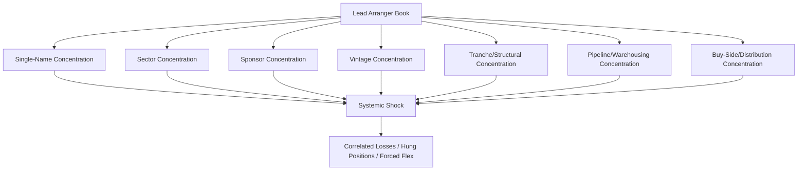

## Portfolio and Concentration Risk for Lead Arrangers

### Overview

Portfolio and concentration risk for lead arrangers refers to the exposure a syndication desk accumulates when originating, underwriting, and holding loans before and during distribution. Unlike a buy-side lender who simply decides whether to participate, the lead arranger carries underwriting risk, pipeline risk, and post-close hold risk simultaneously across a book of deals. Concentration risk arises when losses or mark-downs in that book are correlated — by obligor, industry, sponsor, geography, or structural feature — such that a single macro or idiosyncratic shock impairs a disproportionate share of the arranger's balance sheet and reputation at once.

### Why This Matters Specifically for Lead Arrangers

**Key Points**

- A lead arranger underwrites the full commitment (or a "best efforts" target) before the syndicate is fully formed, creating a temporary balance-sheet exposure known as **underwriting risk** or **hung bridge risk**.
- Fee income is back-loaded and distribution-dependent; if a deal cannot be sold down, the arranger is left holding a "hung" position at a discount, converting an agency-fee business into a principal-risk event.
- Reputational capital is itself a concentration exposure: repeated hung deals, poor allocations, or losses on flagship credits damage the arranger's ability to lead future syndications, which is a slower-moving but equally real form of concentration.
- Concentration is multi-dimensional: single-name, industry/sector, sponsor (in sponsor-driven leveraged finance), geography, currency, tranche/seniority, and vintage (deals originated in the same credit cycle window).

### Sources of Concentration Risk

#### 1. Single-Name / Obligor Concentration

Exposure to one borrower or a group of affiliated borrowers exceeding prudent limits relative to capital or the total book.

#### 2. Industry / Sector Concentration

Overweighting sectors (e.g., oil & gas, commercial real estate, technology) that share common macro drivers, so a sector-wide shock (commodity price collapse, rate-sensitive CRE downturn) hits many positions simultaneously.

#### 3. Sponsor Concentration

In leveraged finance and LBO syndication, arrangers often work repeatedly with the same private equity sponsors. Overreliance on a small set of sponsors creates correlated deal flow, correlated covenant packages, and correlated fee dependency.

#### 4. Vintage / Cohort Concentration

Loans originated in the same period tend to share underwriting standards, leverage multiples, and macro assumptions (e.g., all underwritten at peak-multiple, low-rate conditions). A vintage-level repricing event (rate shock, spread widening) can impair the whole cohort together — this is closely related to what regulators call "underwriting standard drift."

#### 5. Structural/Tranche Concentration

Concentration in a particular position in the capital stack — e.g., holding first-lien term loan B tranches across many deals — means the book is uniformly exposed to the same recovery and covenant dynamics in a downturn.

#### 6. Pipeline / Warehousing Concentration

The forward pipeline of signed-but-undistributed commitments is itself a concentration exposure: if market conditions shift between signing and syndication, several deals can become simultaneously difficult to place.

### Quantitative Framing

#### Herfindahl-Hirschman Index (HHI) for Portfolio Concentration

A standard measure adapted from industrial economics to credit portfolios:

$$HHI = \sum_{i=1}^{n} w_i^2$$

where $w_i$ is obligor $i$'s share of total exposure. A higher HHI indicates greater concentration; a perfectly diversified book of $n$ equal exposures gives $HHI = 1/n$.

#### Single-Name Concentration Limit

Arrangers commonly express limits as a percentage of total capital or of the syndication book:

$$\text{Exposure}_i \leq \kappa \times \text{Capital Base}$$

where $\kappa$ is a house-set concentration ceiling (e.g., 10–15% for a single obligor before syndication, tightening post-close).

#### Granularity Adjustment (Concentration Add-On to Economic Capital)

Regulatory and internal economic-capital frameworks (following the Basel granularity adjustment concept) add a concentration penalty to the baseline Asymptotic Single Risk Factor (ASRF) capital estimate:

$$EC_{adj} = EC_{ASRF} + GA$$

where $GA$ (granularity adjustment) grows with the sum of squared exposure shares, similar in spirit to HHI — undiversified books require more capital per unit of expected loss than granular ones. [Inference: exact GA formulas vary by internal model methodology and are not standardized across institutions.]

#### Correlation-Adjusted Portfolio Loss

For a syndication book, expected concentrated loss under stress can be approximated using a single-factor Gaussian copula framework, the same engine underlying Basel's IRB formula:

$$L = \sum_{i=1}^{n} EAD_i \times LGD_i \times \mathbb{1}[\text{Default}_i]$$

with defaults driven by a common systemic factor $Z$ and idiosyncratic factor $\epsilon_i$:

$$X_i = \sqrt{\rho}\,Z + \sqrt{1-\rho}\,\epsilon_i$$

Higher asset correlation $\rho$ within a concentrated sector/vintage cohort increases the tail loss for a given average default probability, which is precisely why sector and vintage concentration matter more than raw exposure count.

### Lead Arranger-Specific Risk Metrics

**Key Points**

- **Hold Level / Final Take**: the amount the arranger retains after syndication; tracked against internal hold limits by name, sector, and sponsor.
- **Underwriting-to-Distribution Ratio**: total underwritten commitment relative to amount successfully placed within a target window (e.g., 90 days); a persistently low ratio signals distribution risk building into concentration.
- **Flex Utilization**: frequency and magnitude of market flex (pricing/OID/covenant flex) used to clear the book — rising flex usage across a vintage is an early indicator of building concentration/repricing risk.
- **Pipeline-to-Capital Ratio**: total signed, unsyndicated pipeline divided by risk capital allocated to leveraged finance/DCM — used as a leading indicator of warehousing concentration.
- **Sector/Sponsor Heat Maps**: internal dashboards plotting current exposure against historical limits, typically refreshed weekly during active origination periods.

### Risk Management Techniques

#### 1. Underwriting Limits and Hold Caps

Pre-deal committee approval sets maximum underwritten amount and maximum expected final hold, differentiated by credit quality, sector, and sponsor relationship.

#### 2. Market Flex and Flex Language

Contractual flex provisions in the commitment letter allow the arranger to adjust pricing, terms, or structure post-signing but pre-close in response to market conditions, transferring some syndication risk back toward the borrower rather than the arranger's balance sheet.

#### 3. Sub-Underwriting and Club Deals

Sharing underwriting risk with co-arrangers before general syndication ("sub-underwriting") reduces any single institution's concentration in a large deal.

#### 4. Portfolio Hedging

- **Single-Name CDS**: hedges exposure to a specific obligor if a liquid CDS market exists.
- **CDX / Index Tranches**: hedges broad sector or market-wide credit risk when single-name protection is unavailable or illiquid.
- **Total Return Swaps (TRS)**: transfer economic exposure of held loan positions off balance sheet while retaining legal ownership, often used for warehousing risk.

#### 5. Committee Governance and Limit Structures

Deal-level, sector-level, sponsor-level, and firm-wide limits enforced through a capital commitment committee (CCC) or equivalent, with escalation triggers when cumulative pipeline exposure to a sector or sponsor approaches threshold.

#### 6. Distribution Diversification

Actively cultivating a broad and varied investor base (CLOs, mutual funds, insurance companies, hedge funds, retail loan funds) reduces reliance on any single buyer class, which itself is a form of concentration risk — buy-side concentration can leave an arranger unable to place paper if that investor class retreats (e.g., a CLO formation slowdown).

### Example: Concentration Risk Materializing

**Example**

A lead arranger underwrites $500M of first-lien term loan B for a sponsor-backed leveraged buyout in the technology sector, with a target hold of $50M and a plan to syndicate $450M to CLOs within 60 days. Concurrently, the same arranger has three other technology-sector, same-sponsor deals in the pipeline totaling $1.2B. A sudden widening in tech-sector credit spreads (systemic shock) coincides with a slowdown in CLO formation (buyer concentration). Result: all four deals face simultaneous distribution difficulty, forcing the arranger to (a) invoke flex to widen pricing across the cohort, (b) increase actual holds well above target, and (c) mark down hung positions — a textbook realization of correlated sector, sponsor, and buyer-side concentration risk compounding at once.

### Diagram: Concentration Risk Dimensions for a Lead Arranger

### Diagram: Underwriting-to-Distribution Lifecycle and Risk Windows (svg_diagram)

<svg xmlns="http://www.w3.org/2000/svg" viewBox="0 0 800 300">
<text x="400" y="24" text-anchor="middle" font-size="16" font-weight="bold" fill="#1a1a1a">Underwriting-to-Distribution Risk Window (svg_diagram)</text>
<line x1="50" y1="150" x2="750" y2="150" stroke="#333" stroke-width="2" />
<circle cx="100" cy="150" r="6" fill="#2b6cb0" />
<text x="100" y="180" text-anchor="middle" font-size="12">Mandate/Underwrite</text>
<circle cx="300" cy="150" r="6" fill="#d69e2e" />
<text x="300" y="180" text-anchor="middle" font-size="12">Signing/Commitment</text>
<circle cx="500" cy="150" r="6" fill="#d69e2e" />
<text x="500" y="180" text-anchor="middle" font-size="12">Syndication/Marketing</text>
<circle cx="700" cy="150" r="6" fill="#2f855a" />
<text x="700" y="180" text-anchor="middle" font-size="12">Final Allocation/Close</text>
<rect x="100" y="90" width="600" height="30" fill="#fed7d7" opacity="0.6" />
<text x="400" y="80" text-anchor="middle" font-size="12" fill="#742a2a">Balance-Sheet / Hung-Deal Risk Window</text>
<rect x="300" y="200" width="200" height="20" fill="#bee3f8" opacity="0.6" />
<text x="400" y="235" text-anchor="middle" font-size="12" fill="#2a4365">Flex Applied Here if Market Moves</text>
</svg>

### Regulatory and Internal Risk Framework Context

**Key Points**

- Basel-style large exposure rules and internal single-obligor limits inform, but do not fully capture, pipeline concentration risk, since unfunded/unsyndicated commitments require the arranger's own overlay policies.
- Leveraged lending guidance (in jurisdictions where it applies) often addresses leverage-multiple thresholds partly because high-leverage vintages are a proxy for concentration in aggressively underwritten credit.
- Stress testing for arrangers typically combines a market-wide spread-widening scenario with a sector-specific shock and a sponsor-default scenario to test compounding concentration effects rather than testing each dimension in isolation. [Inference: specific stress scenario design varies materially by institution and is not standardized publicly.]

### Common Pitfalls

- Treating "diversification by deal count" as sufficient while ignoring sector or sponsor overlap across those deals.
- Underestimating buy-side concentration — assuming distribution capacity is constant regardless of which investor classes are actually active in the market at syndication time.
- Failing to mark pipeline-stage (pre-close) exposure to market, understating true concentration until a deal is already hung.
- Static limit-setting: concentration limits set once and not revisited as sector or sponsor cycles evolve.

### Next Steps

**Next Steps**

- Loan Syndication Mechanics: Bookrunning, Allocation, and Final Take
- Hung Deal Management and Bridge-to-Bond Structures
- CLO Formation Cycles and Their Effect on Primary Syndication Liquidity
- Leveraged Lending Guidelines and Regulatory Constraints on Underwriting
- Credit Portfolio Stress Testing Methodologies for Underwriting Desks
- Market Flex Mechanics and Original Issue Discount (OID) Adjustments
- Single-Factor Credit Portfolio Models (Vasicek/ASRF) in Practice