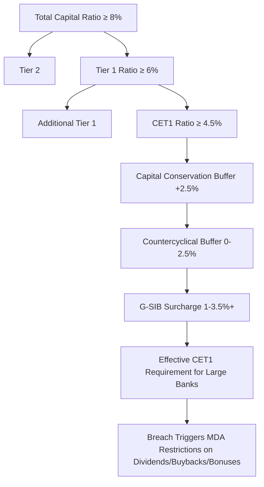

## Basel III and IV Capital Requirements and Bank Lending Capacity

### Overview

The Basel framework, issued by the Basel Committee on Banking Supervision (BCBS), sets minimum capital, liquidity, and leverage standards for internationally active banks. "Basel III" refers to the post-2008 reforms finalized in 2010–2011; "Basel IV" is the market's informal shorthand for the December 2017 finalization of Basel III (often called "Basel III: Finalising post-crisis reforms" by the BCBS itself), which substantially revised how risk-weighted assets (RWAs) are calculated. For capital structuring and syndication, these rules matter directly because bank lending capacity — how much a bank can hold, underwrite, and syndicate — is bounded by capital ratios, leverage ratios, and RWA density, all of which are shaped by Basel rules.

### Core Structure of Basel Capital Requirements

#### Capital Tiers

- **Common Equity Tier 1 (CET1)**: common shares and retained earnings; the highest-quality loss-absorbing capital.
- **Additional Tier 1 (AT1)**: perpetual, contingent-convertible instruments (CoCos) that absorb losses on a going-concern basis.
- **Tier 2 (T2)**: subordinated debt and other instruments absorbing losses on a gone-concern (post-insolvency) basis.

#### Minimum Ratios (Basel III baseline)

$$\text{CET1 Ratio} = \frac{CET1}{RWA} \geq 4.5\%$$

$$\text{Tier 1 Ratio} = \frac{CET1 + AT1}{RWA} \geq 6.0\%$$

$$\text{Total Capital Ratio} = \frac{CET1 + AT1 + T2}{RWA} \geq 8.0\%$$

#### Capital Buffers Layered on Top

- **Capital Conservation Buffer**: 2.5% of RWA in CET1, bringing the effective minimum CET1 ratio to 7%.
- **Countercyclical Buffer**: 0–2.5%, set by national regulators to lean against credit-cycle excesses.
- **G-SIB Surcharge**: additional CET1 requirement (1–3.5%+) for globally systemically important banks, scaled to systemic footprint.

Breaching the buffer (while staying above the bare minimum) does not cause default of the requirement but triggers automatic restrictions on discretionary distributions (dividends, buybacks, bonus payouts) via the **Maximum Distributable Amount (MDA)** mechanism.

### Risk-Weighted Assets: The Core Lending-Capacity Lever

#### Standardized Approach (SA)

Risk weights assigned by regulator-prescribed tables based on exposure type, external ratings (where permitted), and collateral — e.g., unrated corporate exposures historically risk-weighted at 100%, with more granular buckets introduced under Basel III finalization based on revenue and leverage metrics.

#### Internal Ratings-Based (IRB) Approach

Banks with supervisory approval use internal models to estimate:

- **PD** (Probability of Default)
- **LGD** (Loss Given Default)
- **EAD** (Exposure at Default)

feeding into the regulatory capital formula derived from the Asymptotic Single Risk Factor (ASRF) model:

$$K = LGD \times \left[ N\left( \sqrt{\frac{1}{1-R}} \times G(PD) + \sqrt{\frac{R}{1-R}} \times G(0.999) \right) - PD \right] \times MA$$

where $N(\cdot)$ is the standard normal CDF, $G(\cdot)$ its inverse, $R$ the asset correlation, and $MA$ a maturity adjustment. $RWA = K \times 12.5 \times EAD$.

#### Why This Matters for a Lead Arranger

A loan's RWA consumption directly determines the capital a bank must hold against it, which determines the **return on risk-weighted assets (RoRWA)** the desk earns from originating and (if not fully syndicated) holding that loan. Higher RWA density on a credit makes it more capital-expensive to hold, increasing the arranger's incentive to syndicate down to target hold levels quickly.

### What Changed Under Basel IV (Basel III Finalization, effective phase-in from 2023, varying by jurisdiction)

**Key Points**

- **Output Floor**: banks using IRB models must calculate RWA under the Standardized Approach as well, and their IRB-based RWA cannot fall below 72.5% of the standardized figure, phased in gradually. This caps the capital benefit of internal models, narrowing the historical RWA advantage of large IRB banks.
- **Revised Standardized Approach for Credit Risk**: more granular risk weights for corporate, retail, real estate (including specialized lending categories relevant to project and leveraged finance), and bank exposures, replacing blunt flat weights with metrics like loan-to-value and borrower revenue.
- **Constraints on IRB Use**: the Advanced IRB approach is removed for certain low-default portfolios (e.g., large corporates, banks, and equity exposures), forcing greater reliance on Foundation IRB or Standardized Approach for those books.
- **Revised Credit Valuation Adjustment (CVA) Framework**: recalibrated capital charges for counterparty credit risk on derivatives, affecting hedging costs for syndication desks that hedge portfolio exposures.
- **Operational Risk**: a single standardized approach replaces the previous three (Basic Indicator, Standardized, Advanced Measurement Approaches), based on a Business Indicator Component and internal loss multiplier.
- **Leverage Ratio Buffer for G-SIBs**: an additional leverage-ratio buffer on top of the base 3% minimum, specifically for globally systemically important banks. [Unverified: exact buffer calibration and jurisdictional adoption timelines vary and should be checked against current national implementation, since transposition dates differ by jurisdiction (e.g., EU's CRR3/CRD6, US Basel III Endgame proposals, UK PRA rules).]

### Leverage Ratio: A Non-Risk-Based Constraint on Lending Capacity

$$\text{Leverage Ratio} = \frac{\text{Tier 1 Capital}}{\text{Total Exposure Measure}} \geq 3\%$$

The leverage ratio is deliberately not risk-weighted — it uses total on- and off-balance-sheet exposure, including undrawn commitments at a credit conversion factor. This matters for syndication because **unfunded commitment letters and revolving credit facility commitments consume leverage-ratio capacity even before funding**, so a bank's total pipeline of underwritten-but-undrawn commitments can bind against the leverage ratio independently of RWA-based constraints.

### Liquidity Requirements Interacting with Lending Capacity

#### Liquidity Coverage Ratio (LCR)

$$LCR = \frac{\text{High-Quality Liquid Assets (HQLA)}}{\text{Total Net Cash Outflows over 30 days}} \geq 100\%$$

Undrawn revolver and term-loan commitments carry outflow assumptions in LCR stress calculations, meaning a bank's appetite to underwrite large revolving facilities is partly constrained by the liquidity, not just capital, impact.

#### Net Stable Funding Ratio (NSFR)

$$NSFR = \frac{\text{Available Stable Funding}}{\text{Required Stable Funding}} \geq 100\%$$

Longer-tenor loans (typical in term loan B and infrastructure/project finance syndications) require more stable funding support, making NSFR a structural constraint on how much long-dated paper a bank can originate and hold relative to its funding base.

### Direct Effects on Bank Lending Capacity and Syndication Behavior

**Key Points**

- **RWA-Optimized Origination**: banks favor originating loans that can be quickly syndicated ("distribute" model) over those they intend to hold, since holding consumes capital continuously while fee income from arranging is capital-light.
- **Underwriting Limits Tightening**: as output floors compress the capital benefit of favorable internal models, banks recalibrate underwriting limits and target hold levels for capital-intensive sectors (e.g., specialized lending, project finance, high-leverage LBOs).
- **Growth of Non-Bank/Private Credit**: capital-constrained banks increasingly originate-to-distribute to private credit funds, insurance companies, and CLOs that are not subject to Basel capital rules, shifting hold risk off regulated balance sheets — a widely observed structural effect of tightening bank capital rules. [Inference: the precise magnitude of this shift attributable to Basel IV specifically, versus other factors, is debated among market participants and researchers.]
- **Pricing Pass-Through**: higher capital requirements on certain exposure classes tend to be reflected in wider spreads or fees on those exposures to preserve RoRWA targets, though actual pass-through depends on competitive dynamics in the syndication market.
- **Revolver Economics**: because undrawn revolving commitments consume leverage-ratio and LCR capacity disproportionately relative to their fee income, arrangers often price revolvers with unused-line fees and structure ancillary business (cash management, hedging) to justify the capital cost.

### Example: Basel Constraints Shaping a Syndication Decision

**Example**

A bank is asked to underwrite a $1B unitranche-style term loan for a sponsor-backed acquisition in a specialized lending category (e.g., project finance-adjacent infrastructure credit) that under the revised Basel IV standardized approach now attracts a higher risk weight than under the prior framework. The bank's IRB model would normally assign a lower RWA, but the 72.5% output floor limits how far below the standardized RWA the bank's internal-model result can fall. The effective capital charge is higher than the desk's historical pricing models assumed. In response, the arranger (a) reduces its target final hold from 15% to 5% of the facility, (b) increases the target syndication speed, (c) invites private credit co-lenders (not subject to the same capital rules) to take a larger share, and (d) adjusts pricing/OID assumptions in the flex language to reflect the higher capital cost of any residual hold.

### Diagram: Basel Capital Stack and Buffers

### Diagram: How Basel Rules Constrain the Syndication Pipeline (svg_diagram)

<svg xmlns="http://www.w3.org/2000/svg" viewBox="0 0 800 380">
<text x="400" y="24" text-anchor="middle" font-size="16" font-weight="bold" fill="#1a1a1a">Basel Constraints on Lending Capacity (svg_diagram)</text>
<rect x="40" y="60" width="200" height="70" rx="6" fill="#bee3f8" stroke="#2b6cb0" />
<text x="140" y="90" text-anchor="middle" font-size="13" fill="#1a365d">RWA / Capital Ratios</text>
<text x="140" y="110" text-anchor="middle" font-size="11" fill="#1a365d">CET1, Tier 1, Total</text>
<rect x="300" y="60" width="200" height="70" rx="6" fill="#fed7d7" stroke="#c53030" />
<text x="400" y="90" text-anchor="middle" font-size="13" fill="#742a2a">Leverage Ratio</text>
<text x="400" y="110" text-anchor="middle" font-size="11" fill="#742a2a">Non-risk-weighted, incl. undrawn</text>
<rect x="560" y="60" width="200" height="70" rx="6" fill="#c6f6d5" stroke="#2f855a" />
<text x="660" y="90" text-anchor="middle" font-size="13" fill="#22543d">LCR / NSFR</text>
<text x="660" y="110" text-anchor="middle" font-size="11" fill="#22543d">Funding &amp; liquidity limits</text>
<line x1="140" y1="130" x2="400" y2="200" stroke="#333" stroke-width="1.5" />
<line x1="400" y1="130" x2="400" y2="200" stroke="#333" stroke-width="1.5" />
<line x1="660" y1="130" x2="400" y2="200" stroke="#333" stroke-width="1.5" />
<rect x="280" y="200" width="240" height="60" rx="6" fill="#faf089" stroke="#b7791f" />
<text x="400" y="225" text-anchor="middle" font-size="13" fill="#744210">Bank Lending Capacity</text>
<text x="400" y="245" text-anchor="middle" font-size="11" fill="#744210">Underwrite / Hold / Distribute Decision</text>
<line x1="400" y1="260" x2="400" y2="300" stroke="#333" stroke-width="1.5" />
<rect x="240" y="300" width="320" height="60" rx="6" fill="#e9d8fd" stroke="#6b46c1" />
<text x="400" y="325" text-anchor="middle" font-size="13" fill="#44337a">Syndication Strategy</text>
<text x="400" y="345" text-anchor="middle" font-size="11" fill="#44337a">Hold %, Pricing, Non-Bank Co-Lenders</text>
</svg>

### Jurisdictional Implementation Notes

**Key Points**

- Basel standards are minimums agreed by the BCBS; actual binding rules come from national/regional transposition (e.g., the EU's Capital Requirements Regulation/Directive — CRR3/CRD6, the UK PRA rulebook, and the US banking agencies' rulemaking often referred to as the "Basel III Endgame").
- Implementation timelines, exact calibrations, and even some substantive elements (such as the treatment of certain equity and operational risk components) have diverged across jurisdictions during finalization. [Unverified: current status should be checked against the relevant national regulator, since proposals have been revised multiple times, including notable recalibration of the original US Basel III Endgame proposal.]
- For cross-border syndications, arrangers must consider that co-lending banks from different jurisdictions may face different effective capital costs for the same exposure, which can affect syndicate composition and pricing negotiations.

### Common Pitfalls

- Conflating "Basel III" and "Basel IV" as fully settled global rules rather than a framework still undergoing jurisdiction-specific finalization and calibration.
- Ignoring the leverage ratio and liquidity ratios (LCR/NSFR) when analyzing lending capacity, focusing only on RWA-based capital ratios.
- Assuming IRB banks retain their full historical capital advantage without accounting for the output floor's compressing effect.
- Overlooking that undrawn revolver commitments consume capital and liquidity capacity well before any drawdown occurs.

### Related Topics

**Related Topics**

- Return on Risk-Weighted Assets (RoRWA) as a Syndication Pricing Framework
- Specialized Lending Risk Weights (Project Finance, Object Finance, Commodities Finance)
- Private Credit and Non-Bank Lending Growth as a Basel Spillover Effect
- Credit Conversion Factors and Off-Balance-Sheet Commitment Capital Treatment
- G-SIB Surcharge Methodology and Its Effect on Large-Bank Syndicate Participation
- Basel III Endgame (US), CRR3/CRD6 (EU), and PRA Basel 3.1 (UK): Comparative Implementation