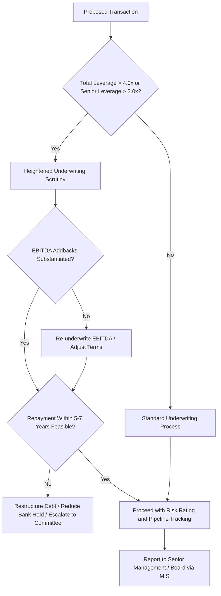

## Leveraged Lending Guidance and Supervisory Expectations

### Overview

Leveraged lending guidance refers to the supervisory frameworks issued by banking regulators to constrain the risk profile of loans extended to highly-leveraged borrowers, typically in the context of buyouts, recapitalizations, and acquisition financing. The most influential reference point is the U.S. interagency **Leveraged Lending Guidance (2013)**, issued jointly by the Federal Reserve, OCC, and FDIC, which set qualitative and quantitative expectations for how banks underwrite, monitor, and stress-test leveraged credits. Comparable supervisory expectations exist in other jurisdictions (e.g., ECB guidance in the EU, PRA expectations in the UK), generally converging on similar themes even where formal thresholds differ.

### Definition of "Leveraged Lending" Under Supervisory Frameworks

**Key Points**

- Regulatory guidance generally defines a leveraged loan by reference to leverage multiples, typically flagging transactions where **total debt to EBITDA exceeds 4.0x** or **senior debt to EBITDA exceeds 3.0x**, though exact thresholds and their status (guidance vs. hard rule) vary and have been subject to revision and debate.
- Purpose-based definitions also apply: loans used for buyouts, acquisitions, or recapitalizations by borrowers already carrying elevated leverage, or where the borrower is majority-owned by a private equity sponsor, are commonly captured regardless of the exact multiple, if the transaction materially increases leverage.
- The guidance applies principles-based supervisory expectations rather than a bright-line regulatory capital charge, meaning enforcement occurs through examination findings, matters requiring attention (MRAs), and supervisory ratings rather than automatic penalties. [Unverified: enforcement intensity and interpretation have varied over time and across administrations, and institutions should confirm current supervisory posture directly with examiners.]

### Core Elements of the 2013 U.S. Interagency Guidance

#### 1. Sound Underwriting Standards

- Borrowers should demonstrate the ability to **repay all senior secured debt or the majority of total debt within 5–7 years**, and to **de-lever to a sustainable level within a reasonable timeframe** — commonly referenced as the ability to amortize senior debt or reduce leverage over that horizon.
- Cash flow underwriting should be based on realistic, sustainable projections, not aggressive EBITDA addbacks that assume unproven synergies or cost savings without a credible execution plan.
- Enterprise valuations used to support leverage levels should be well-supported and stress-tested against a decline in valuation multiples, not solely reliant on recent comparable transaction multiples.

#### 2. Risk Rating and Classification Framework

Institutions are expected to accurately risk-rate leveraged loans reflecting the borrower's repayment capacity under both base-case and stressed scenarios, rather than relying purely on par-value carrying assumptions or recent trading levels.

#### 3. Pipeline Management and Distribution Risk

Banks are expected to have management information systems (MIS) tracking the aggregate pipeline of underwritten-but-undistributed leveraged commitments, with limits and escalation procedures analogous to those discussed under concentration risk, so that a market downturn does not leave the institution unknowingly overexposed to hung deals.

#### 4. Stress Testing

Institutions should stress-test the leveraged loan portfolio (including pipeline exposure) under adverse economic scenarios — spread widening, EBITDA decline, refinancing risk — to estimate potential credit losses and capital impact, feeding into broader enterprise stress testing (e.g., CCAR/DFAST in the U.S. context).

#### 5. Reporting to Senior Management and the Board

Aggregate leveraged lending exposure, pipeline size, covenant quality trends (e.g., growth in covenant-lite volume), and risk rating migration should be reported regularly to senior management and, at material levels, to the board.

### Quantitative Reference Points

#### Total Leverage Test

$$\text{Total Leverage} = \frac{\text{Total Debt}}{\text{EBITDA}}$$

Guidance flags $\text{Total Leverage} > 4.0x$ as a level warranting heightened scrutiny.

#### Senior Leverage Test

$$\text{Senior Leverage} = \frac{\text{Senior Secured Debt}}{\text{EBITDA}}$$

Guidance flags $\text{Senior Leverage} > 3.0x$ similarly.

#### Repayment Capacity Test

A qualitative-quantitative hybrid: can the borrower's projected free cash flow repay senior debt (or a majority of total debt) within a 5–7 year horizon under a base-case scenario that does not rely on refinancing or asset sales as the primary repayment source?

$$\text{Years to Repay} = \frac{\text{Senior Debt}}{\text{Sustainable Annual FCF}}$$

Values materially exceeding the 5–7 year benchmark are a supervisory concern.

### Interaction With Deal Structuring and Syndication Practice

**Key Points**

- **EBITDA Addback Scrutiny**: examiners specifically look for aggressive, unsubstantiated addbacks (projected synergies, one-time cost saves not yet realized) that inflate the EBITDA denominator and understate true leverage — a frequent point of tension between sponsor-driven deal terms and bank underwriting standards.
- **Covenant-Lite Trend**: the guidance predates and does not directly prohibit covenant-lite structures, but examiners have periodically flagged the growth of cov-lite volume as a market-wide risk trend worth monitoring in aggregate, even though individual banks may accept cov-lite terms to remain competitive. [Inference: the precise current supervisory stance on cov-lite prevalence should be checked against the latest interagency or examiner commentary, as market practice has evolved substantially since 2013.]
- **Second-Lien and Unitranche Structures**: guidance principles extend to these structures; total leverage tests apply across the full capital stack, not just the senior tranche, so unitranche facilities that blend senior/junior economics are still evaluated on a total-leverage basis.
- **Non-Bank Migration**: because supervisory guidance binds regulated banks but not private credit funds, insurance companies, or other non-bank lenders, aggressive leverage structures that a bank would flag internally can still be financed by non-bank participants — a widely discussed structural effect similar to the Basel-driven migration described in bank capital contexts.

### Example: Guidance Applied to a Deal Structuring Decision

**Example**

A sponsor proposes a buyout financed with $600M of debt against $120M of pro forma adjusted EBITDA (5.0x total leverage), where $40M of the EBITDA addback reflects unexecuted cost synergies. The lead arranger's credit committee, informed by leveraged lending guidance principles, requires: (a) re-underwriting EBITDA using only substantiated, already-realized synergies (reducing EBITDA to $95M and raising effective leverage to approximately 6.3x), (b) documenting a credible base-case repayment plan showing senior debt reduction to a sustainable level within 6 years, and (c) escalating the deal to a specialized leveraged-lending risk committee given it exceeds the 4.0x total leverage threshold. If the sponsor is unwilling to adjust terms, the bank may reduce its underwritten commitment and bring in non-bank co-lenders for the incremental leverage the bank is unwilling to hold.

### Diagram: Leveraged Lending Guidance Decision Flow

### Supervisory Tools and Consequences

**Key Points**

- **Matters Requiring Attention (MRA)** and **Matters Requiring Immediate Attention (MRIA)**: formal examiner findings requiring remediation, used when a bank's leveraged lending practices deviate materially from guidance.
- **Shared National Credit (SNC) Program**: a U.S. interagency program that reviews large syndicated loans held by multiple regulated institutions, providing a cross-institution view of leveraged loan quality, classification consistency, and emerging structural weaknesses across the market.
- **Examination Ratings Impact**: persistent weaknesses in leveraged lending risk management can affect a bank's overall supervisory rating (e.g., components of the CAMELS rating in the U.S. context), with knock-on effects for capital planning and growth approvals.
- Unlike a capital rule, there is no automatic capital penalty purely for exceeding the leverage thresholds — the consequence flows through the supervisory examination and enforcement process, which gives institutions latitude to justify higher-leverage transactions with strong compensating factors (e.g., robust sponsor support, defensive industry characteristics, strong asset coverage). [Inference: the degree of latitude in practice depends on the specific examiner team, institution's overall risk profile, and prevailing supervisory priorities at the time.]

### International Comparisons

**Key Points**

- **European Central Bank (ECB) Leveraged Transactions Guidance**: applies a similar total-leverage threshold concept (commonly referenced around 4.0x for defining a "leveraged transaction") to banks under its direct supervision within the Single Supervisory Mechanism.
- **UK Prudential Regulation Authority (PRA)**: incorporates leveraged lending risk considerations into broader prudential supervision and stress testing rather than a single standalone leveraged lending guidance document equivalent to the U.S. framework.
- Cross-border syndicates should note that the same transaction may be viewed differently by examiners in different jurisdictions depending on local guidance emphasis, potentially affecting which banks are willing to lead or participate at a given leverage level. [Unverified: specific comparative regulatory stringency across jurisdictions changes over time and should be verified against current publications from each regulator.]

### Common Pitfalls

- Treating the leverage thresholds (4.0x/3.0x) as hard regulatory limits rather than supervisory reference points subject to qualitative override with compensating factors.
- Underestimating how EBITDA addback scrutiny can materially change the effective leverage calculation used internally versus the sponsor's presented figures.
- Failing to aggregate leveraged exposure across the pipeline (not just closed positions) when assessing compliance with internal risk appetite tied to the guidance.
- Assuming non-bank lenders face equivalent constraints, leading to mispriced competitive assumptions when non-banks aggressively bid for the same leveraged tranches.

### Related Topics

**Related Topics**

- EBITDA Addback Diligence and Quality-of-Earnings Analysis in Leveraged Deals
- Covenant-Lite Structures and Their Effect on Lender Remedies
- Shared National Credit (SNC) Program Mechanics and Cross-Bank Loan Review
- Private Credit Direct Lending as a Substitute for Bank-Regulated Leveraged Loans
- Stress Testing Methodologies for Leveraged Loan Portfolios
- Second-Lien and Unitranche Structuring in the Context of Total Leverage Tests