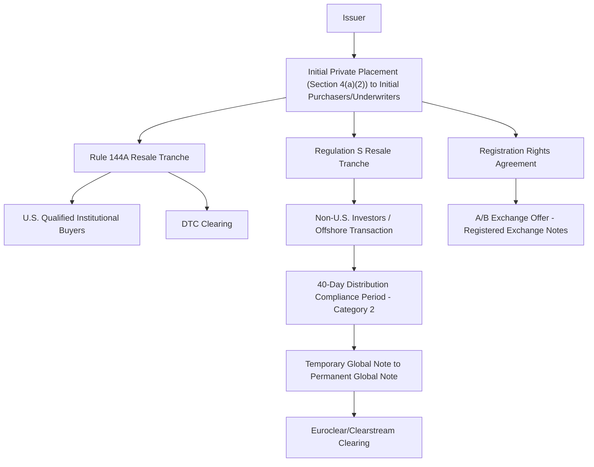

## Securities Law Framework: Regulation D, Regulation S, and Rule 144A

### Overview

Capital markets transactions structured as securities (as opposed to bilateral bank loans) must either register with the SEC under the Securities Act of 1933 or qualify for an exemption. Regulation D, Regulation S, and Rule 144A are the three primary exemption frameworks used in syndicated debt and private capital markets transactions — including private placements, high-yield bonds, and cross-border offerings — allowing issuers to raise capital without a full public registration process. Understanding which exemption applies, and how they interact, is foundational to structuring a syndicated offering's legal documentation, investor eligibility, and resale restrictions.

### Why Registration Exemptions Matter in Syndication

**Key Points**

- Section 5 of the Securities Act requires registration of any offer or sale of securities unless an exemption applies; syndicated bond deals and private placements are almost always structured to fit within an exemption rather than undergo full SEC registration, primarily for speed and reduced disclosure burden.
- The choice of exemption determines the eligible investor universe, the required offering document (private placement memorandum vs. registered prospectus), and the resale restrictions attached to the securities once issued.
- Many high-yield bond and leveraged loan-adjacent securities offerings use a **combined 144A/Reg S structure** to reach both U.S. qualified institutional buyers and non-U.S. investors in a single, coordinated offering.

### Regulation D

#### Purpose

Provides exemptions for private placements of securities to a limited set of investors without SEC registration, primarily under **Rule 506(b)** and **Rule 506(c)**.

#### Rule 506(b)

- Permits sales to an **unlimited number of accredited investors** plus up to **35 non-accredited but sophisticated investors**.
- **No general solicitation or advertising** is permitted; the issuer must have a pre-existing relationship with prospective investors.
- No specific disclosure document is mandated by the rule itself if all purchasers are accredited, though market practice typically still uses a private placement memorandum (PPM) for liability protection.

#### Rule 506(c)

- Permits **general solicitation and advertising**, but sales must be made **exclusively to accredited investors**.
- The issuer must take **reasonable steps to verify** accredited investor status (e.g., reviewing tax returns, brokerage statements, or third-party verification letters), a materially higher diligence burden than 506(b)'s self-certification practice.

#### Accredited Investor Definition (Key Categories)

- Natural persons with net worth exceeding $1 million (excluding primary residence) or income exceeding $200,000 individually ($300,000 joint) in each of the prior two years with a reasonable expectation of the same in the current year.
- Entities meeting specified asset thresholds, and certain professional certifications/licenses (e.g., holders of Series 7, 65, or 82 licenses) added under later SEC amendments expanding the definition.

#### Filing Requirement

Issuers must file a **Form D** with the SEC within 15 days of the first sale, a notice filing rather than a registration statement, disclosing basic information about the issuer and the offering.

### Regulation S

#### Purpose

Provides a safe harbor exempting offers and sales of securities made **outside the United States** to **non-U.S. persons** from Securities Act registration, on the theory that such offshore transactions do not implicate the jurisdictional purpose of U.S. securities registration.

#### Core Conditions

1. The offer or sale must be made in an **"offshore transaction"** (no offer made to a person in the United States).
2. **No directed selling efforts** in the United States by the issuer, distributor, or their affiliates.

#### Category Classification and Distribution Compliance Periods

Regulation S imposes different restrictions depending on issuer type and the degree of U.S. market interest:

- **Category 1**: minimal restrictions, generally for foreign issuers with no substantial U.S. market interest.
- **Category 2**: a **40-day distribution compliance period** during which resales into the U.S. are restricted, typically applicable to reporting foreign issuers and foreign private issuers of debt.
- **Category 3**: the most restrictive tier, often involving a distribution compliance period and additional certification/legending requirements, typically for issuers with closer U.S. nexus.

[Inference: exact categorization and compliance period lengths depend on specific issuer facts (foreign private issuer status, reporting status, and security type); practitioners should confirm classification against current SEC rule text for a specific transaction.]

### Rule 144A

#### Purpose

Provides a safe harbor allowing **resales** of restricted securities to **Qualified Institutional Buyers (QIBs)** without registration, effectively creating a liquid institutional secondary market for privately placed securities — this is the dominant mechanism for U.S. high-yield bond and many private note offerings.

#### Qualified Institutional Buyer (QIB) Definition

Generally, an institution that owns and invests on a discretionary basis **at least $100 million** in securities of unaffiliated issuers (a lower $10 million threshold applies to registered broker-dealers acting as principal in certain contexts).

#### Key Mechanics

- Rule 144A applies to **resales**, not the initial issuance — the standard structure involves an **initial private placement** (often relying on Section 4(a)(2) of the Securities Act, the statutory private placement exemption) to initial purchasers (typically the underwriting banks acting as principal), who then immediately resell the securities to QIBs under Rule 144A.
- Securities sold under Rule 144A are **"restricted securities"** and carry resale limitations until they satisfy applicable holding periods or are otherwise registered/exchanged.
- Many 144A high-yield bond issuances include a subsequent **"A/B exchange offer"**, where the issuer registers a nearly identical series of exchange notes with the SEC, allowing 144A bondholders to exchange restricted notes for freely tradable registered notes — providing liquidity without the issuer initially bearing full registration costs and timelines.

### Combined 144A/Regulation S Offerings

**Key Points**

- A single bond or note offering is frequently structured with **two tranches**: a Rule 144A tranche sold to U.S. QIBs, and a Regulation S tranche sold to non-U.S. investors in offshore transactions, under a single offering memorandum with tranche-specific legending and settlement procedures.
- **Temporary Global Notes and Permanent Global Notes**: the Reg S tranche is often initially represented by a temporary global note that cannot be exchanged for a permanent global note or sold into the U.S. until the Regulation S distribution compliance period expires and non-U.S. beneficial ownership is certified.
- Clearing and settlement typically route through **DTC** for the 144A tranche and **Euroclear/Clearstream** for the Reg S tranche, with the global note structure reflecting these differing eligibility rules.

### Comparative Summary Table

| Feature | Regulation D | Regulation S | Rule 144A |
| --- | --- | --- | --- |
| Applies to | Initial issuance | Initial issuance/resale offshore | Resale (post-initial private placement) |
| Investor Universe | Accredited (+ limited sophisticated) investors | Non-U.S. persons | Qualified Institutional Buyers |
| Geographic Scope | Primarily U.S. | Outside the United States | U.S. institutional market |
| General Solicitation | Prohibited (506(b)) / Permitted with verification (506(c)) | Prohibited (no directed selling efforts in the U.S.) | Permitted to QIBs under certain conditions post-JOBS Act amendments |
| SEC Filing | Form D notice filing | None required | None (private resale exemption) |
| Typical Use Case | Direct private placements, smaller note issuances | Offshore tranche of international offerings | U.S. high-yield bonds, large private notes |

### Example: Structuring a Syndicated High-Yield Bond Offering

**Example**

A sponsor-backed issuer seeks to raise $750M via senior unsecured notes to partially fund an LBO, alongside a syndicated term loan. The lead bookrunners structure the notes as an initial private placement under Section 4(a)(2) to the underwriting banks as initial purchasers, who simultaneously resell $600M to U.S. QIBs under Rule 144A and $150M to non-U.S. investors under Regulation S (Category 2, with a 40-day distribution compliance period on the Reg S tranche). The offering memorandum includes registration rights requiring the issuer to file an exchange offer registration statement within a specified period post-closing, enabling an A/B exchange into freely tradable notes. This structure allows the deal to close on an accelerated timeline (days, not the months required for full SEC registration) while preserving a path to eventual liquidity for bondholders.

### Diagram: 144A/Reg S Combined Offering Structure

### Diagram: Exemption Decision Framework (svg_diagram)

<svg xmlns="http://www.w3.org/2000/svg" viewBox="0 0 800 340">
<text x="400" y="24" text-anchor="middle" font-size="16" font-weight="bold" fill="#1a1a1a">Securities Exemption Selection (svg_diagram)</text>
<rect x="320" y="50" width="160" height="50" rx="6" fill="#e2e8f0" stroke="#4a5568" />
<text x="400" y="80" text-anchor="middle" font-size="12" fill="#1a202c">Offering Type?</text>
<rect x="60" y="140" width="200" height="60" rx="6" fill="#bee3f8" stroke="#2b6cb0" />
<text x="160" y="165" text-anchor="middle" font-size="12" fill="#1a365d">Direct Private Placement</text>
<text x="160" y="182" text-anchor="middle" font-size="11" fill="#1a365d">Use Regulation D (506b/506c)</text>
<rect x="300" y="140" width="200" height="60" rx="6" fill="#c6f6d5" stroke="#2f855a" />
<text x="400" y="165" text-anchor="middle" font-size="12" fill="#22543d">Offshore Investor Reach</text>
<text x="400" y="182" text-anchor="middle" font-size="11" fill="#22543d">Use Regulation S</text>
<rect x="540" y="140" width="200" height="60" rx="6" fill="#fed7d7" stroke="#c53030" />
<text x="640" y="165" text-anchor="middle" font-size="12" fill="#742a2a">Large U.S. Institutional Bond</text>
<text x="640" y="182" text-anchor="middle" font-size="11" fill="#742a2a">Use Rule 144A</text>
<line x1="400" y1="100" x2="160" y2="140" stroke="#333" stroke-width="1.5" />
<line x1="400" y1="100" x2="400" y2="140" stroke="#333" stroke-width="1.5" />
<line x1="400" y1="100" x2="640" y2="140" stroke="#333" stroke-width="1.5" />
<rect x="300" y="250" width="200" height="60" rx="6" fill="#faf089" stroke="#b7791f" />
<text x="400" y="275" text-anchor="middle" font-size="12" fill="#744210">Global Institutional Reach</text>
<text x="400" y="292" text-anchor="middle" font-size="11" fill="#744210">Combine 144A + Reg S Tranches</text>
<line x1="400" y1="200" x2="400" y2="250" stroke="#333" stroke-width="1.5" stroke-dasharray="4" />
<line x1="640" y1="200" x2="400" y2="250" stroke="#333" stroke-width="1.5" stroke-dasharray="4" />
</svg>

### Common Pitfalls

- Assuming Rule 144A exempts the **initial issuance**; it only exempts the **resale** step, so the initial private placement leg (typically under Section 4(a)(2)) must be independently exempt.
- Conducting general solicitation in a Rule 506(b) offering, which invalidates the exemption for the entire offering, not just the improperly solicited investors.
- Miscounting or failing to verify QIB status rigorously, which can taint the Rule 144A resale exemption for the whole tranche.
- Allowing U.S. persons to acquire Regulation S securities before the applicable distribution compliance period expires, risking "flowback" that undermines the offshore exemption.
- Treating Form D as a mere formality; late or inaccurate Form D filings can create state "blue sky" law complications and, in some circumstances, jeopardize reliance on the exemption in certain states.

### Related Topics

**Related Topics**

- Section 4(a)(2) Statutory Private Placement Exemption and Its Interaction with Rule 144A
- Registration Rights Agreements and A/B Exchange Offer Mechanics
- Blue Sky Laws and State-Level Securities Registration Coordination
- Qualified Institutional Buyer Verification Procedures in Practice
- High-Yield Bond Covenant Packages Compared to Syndicated Loan Covenants
- Cross-Border Offering Structuring: Multi-Jurisdictional Disclosure Coordination