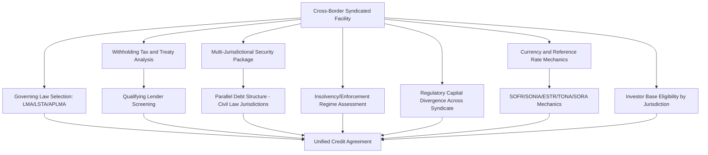

## Cross-Border Syndication and Multi-Jurisdictional Compliance

### Overview

Cross-border syndication involves arranging and distributing a loan or securities facility across lenders and investors domiciled in multiple jurisdictions, requiring the arranger to coordinate divergent securities laws, banking regulations, tax regimes, and enforcement/insolvency frameworks within a single, coherent transaction. Unlike a domestic syndication, cross-border deals must reconcile which jurisdiction's law governs the credit agreement, how withholding tax applies to interest payments to lenders in different countries, how security/collateral is perfected across borders, and how regulatory capital and conduct rules differ for each participating institution.

### Core Dimensions of Multi-Jurisdictional Complexity

#### 1. Governing Law and Documentation Standard

Most cross-border syndicated loans are documented under a small number of dominant legal standards to maximize familiarity and enforceability across a diverse lender base:

- **Loan Market Association (LMA)** documentation, governed by English law, dominant in EMEA, and widely used in APAC and emerging markets syndications.
- **Loan Syndications and Trading Association (LSTA)** documentation, governed by New York law, dominant in the U.S. market.
- **Asia Pacific Loan Market Association (APLMA)** documentation, often closely modeled on LMA templates with regional adaptations.

Choice of governing law affects concepts like the enforceability of certain default remedies, the treatment of set-off, and the interpretation of representations and covenants — meaningfully shaping negotiation dynamics when lenders from multiple legal traditions participate.

#### 2. Withholding Tax on Cross-Border Interest Payments

- Interest paid by a borrower to a foreign lender may be subject to **withholding tax** under the borrower's domestic tax law, which syndicated credit agreements typically address through **gross-up clauses** requiring the borrower to pay additional amounts so the lender receives the same net amount as if no withholding applied.
- **Double Taxation Treaties (DTTs)** between the borrower's and lender's jurisdictions can reduce or eliminate withholding tax, but lenders often must satisfy procedural requirements (e.g., providing tax residency certificates, beneficial ownership declarations) to claim treaty benefits.
- **Qualifying Lender** provisions in LMA-style documentation define which lenders are treated as tax-efficient recipients of interest, and syndication desks screen prospective lenders' tax status before allocation to avoid unexpected gross-up costs falling on the borrower (and thus reducing the deal's effective economics).

#### 3. Security and Collateral Perfection Across Borders

- Perfecting a security interest often requires jurisdiction-specific filings, registrations, or possession/control requirements that differ substantially by legal system (e.g., UCC filings in the U.S., charge registrations at Companies House in the UK, notarial requirements in various civil law jurisdictions).
- **Parallel Debt structures** are commonly used in civil law jurisdictions (which often do not recognize the common law concept of a security trustee holding security "for the benefit of" a syndicate) to create a direct debt obligation owed to the security agent, enabling that agent to hold and enforce security on behalf of the syndicate under local law.
- Cross-border deals frequently require multiple local law security documents (a "security package") layered under one master credit agreement, each governed by the law of the jurisdiction where the relevant collateral is located.

#### 4. Insolvency and Enforcement Regime Divergence

- Recovery outcomes for lenders depend heavily on the borrower's (or guarantor's) jurisdiction of incorporation/principal assets, since insolvency proceedings (e.g., U.S. Chapter 11, UK administration/restructuring plan, EU pre-insolvency frameworks) differ in creditor priority treatment, moratorium/stay provisions, and cram-down mechanics.
- Syndication desks assess **jurisdictional enforcement risk** as part of credit analysis — a facility secured against assets in a jurisdiction with weak or slow enforcement mechanisms may command different pricing or structuring (e.g., additional guarantees, alternative collateral) than an equivalent domestic facility.

#### 5. Regulatory Capital and Conduct Divergence Across Syndicate Members

- As discussed under Basel implementation, banks from different jurisdictions may face different effective capital costs for holding the same exposure due to divergent national transposition of Basel rules, affecting which banks are willing to participate and at what pricing.
- Conduct-of-business and marketing rules differ by jurisdiction — for example, EU/UK rules under frameworks analogous to MiFID II impose specific investor categorization and disclosure requirements that can affect how a facility or associated notes are marketed to European investors.

### Currency and FX Considerations

**Key Points**

- Multi-currency facilities (allowing drawdowns in USD, EUR, GBP, JPY, etc.) require mechanisms for currency conversion, screen-rate determination, and often an **FX indemnity** protecting the lender against loss from currency fluctuation between default and judgment/payment.
- **Currency Option/Optional Currency** provisions allow borrowers flexibility, but arrangers must ensure sufficient lender commitment and market capacity exists to fund draws in the requested currency, particularly for less liquid currencies.
- Following the transition away from LIBOR, reference rate selection now varies by currency — e.g., **SOFR** for USD, **SONIA** for GBP, **€STR** for EUR, **TONA** for JPY — with different compounding conventions and lookback periods per currency, requiring the credit agreement's interest provisions to accommodate multiple, non-uniform reference rate mechanics simultaneously.

### Investor Base Coordination

**Key Points**

- A cross-border syndicate typically spans bank lenders across regions, regional development banks/export credit agencies (in project and trade finance contexts), and non-bank institutional investors (CLOs, insurance companies, pension funds) with differing regulatory eligibility and documentation preferences by jurisdiction.
- Allocation strategy must account for jurisdiction-specific investor appetite; for instance, certain Asian institutional lenders may have internal restrictions on covenant-lite structures or specific industry sectors that differ from typical European or U.S. institutional appetite. [Inference: specific investor-base preferences shift over time with market conditions and should be validated with current syndicate desk intelligence rather than treated as fixed.]
- Information barriers and confidentiality regimes (e.g., market soundings rules under frameworks like EU Market Abuse Regulation) can constrain how and when non-public deal information is shared with prospective cross-border investors, particularly where the facility is linked to a publicly listed borrower or guarantor.

### Example: Structuring a Cross-Border Syndicated Facility

**Example**

A European industrial group with subsidiaries in Germany, the U.S., and Singapore seeks a $1.5B multi-currency revolving credit facility to refinance existing debt and fund working capital across all three regions. The lead arrangers structure the facility under LMA documentation governed by English law (the group's parent is UK-incorporated), with tranches available in USD, EUR, and SGD referencing SOFR, €STR, and SORA respectively. Because German subsidiaries provide guarantees and security, the security package includes a parallel debt structure to permit the English-law security agent to hold German-law share pledges enforceable under German civil law. Withholding tax analysis confirms most syndicate lenders qualify for treaty relief on interest from the German borrower, but the syndication desk screens out several prospective non-treaty lenders from that tranche to avoid triggering gross-up costs. The Singapore subsidiary's borrowings are guaranteed by the parent but structured to respect Singapore financial assistance rules restricting subsidiary guarantees of parent-level debt.

### Diagram: Cross-Border Syndication Compliance Layers

### Diagram: Security Perfection Across Jurisdictions (svg_diagram)

<svg xmlns="http://www.w3.org/2000/svg" viewBox="0 0 800 320">
<text x="400" y="24" text-anchor="middle" font-size="16" font-weight="bold" fill="#1a1a1a">Cross-Border Security Package Structure (svg_diagram)</text>
<rect x="300" y="50" width="200" height="55" rx="6" fill="#e2e8f0" stroke="#4a5568" />
<text x="400" y="82" text-anchor="middle" font-size="13" fill="#1a202c">Master Credit Agreement</text>
<rect x="60" y="150" width="200" height="60" rx="6" fill="#bee3f8" stroke="#2b6cb0" />
<text x="160" y="175" text-anchor="middle" font-size="12" fill="#1a365d">Common Law Jurisdiction</text>
<text x="160" y="193" text-anchor="middle" font-size="11" fill="#1a365d">Security Trust for Syndicate</text>
<rect x="300" y="150" width="200" height="60" rx="6" fill="#fed7d7" stroke="#c53030" />
<text x="400" y="175" text-anchor="middle" font-size="12" fill="#742a2a">Civil Law Jurisdiction</text>
<text x="400" y="193" text-anchor="middle" font-size="11" fill="#742a2a">Parallel Debt to Security Agent</text>
<rect x="540" y="150" width="200" height="60" rx="6" fill="#c6f6d5" stroke="#2f855a" />
<text x="640" y="175" text-anchor="middle" font-size="12" fill="#22543d">Local Filing Jurisdiction</text>
<text x="640" y="193" text-anchor="middle" font-size="11" fill="#22543d">Registry-Based Perfection</text>
<line x1="400" y1="105" x2="160" y2="150" stroke="#333" stroke-width="1.5" />
<line x1="400" y1="105" x2="400" y2="150" stroke="#333" stroke-width="1.5" />
<line x1="400" y1="105" x2="640" y2="150" stroke="#333" stroke-width="1.5" />
<rect x="240" y="250" width="320" height="50" rx="6" fill="#faf089" stroke="#b7791f" />
<text x="400" y="280" text-anchor="middle" font-size="12" fill="#744210">Unified Security Package Across Syndicate</text>
<line x1="160" y1="210" x2="400" y2="250" stroke="#333" stroke-width="1.5" stroke-dasharray="4" />
<line x1="400" y1="210" x2="400" y2="250" stroke="#333" stroke-width="1.5" stroke-dasharray="4" />
<line x1="640" y1="210" x2="400" y2="250" stroke="#333" stroke-width="1.5" stroke-dasharray="4" />
</svg>

### Common Pitfalls

- Assuming a single governing law and security structure can be mechanically extended across all jurisdictions without local law security instruments and, where relevant, parallel debt mechanics.
- Overlooking withholding tax treaty qualification during syndication and allocation, leading to unexpected gross-up costs that erode deal economics after allocation is finalized.
- Failing to account for financial assistance or corporate benefit restrictions in certain jurisdictions (e.g., limits on subsidiaries guaranteeing parent-level debt) when designing the guarantee structure.
- Underestimating how differing national implementation of Basel and conduct rules affects which syndicate members can competitively price or even participate in certain tranches.
- Treating reference rate mechanics as uniform across currencies post-LIBOR transition, when compounding conventions and lookback periods genuinely differ by currency and rate.

### Related Topics

**Related Topics**

- Parallel Debt Structures and Security Trustee Mechanics in Civil Law Jurisdictions
- LMA vs. LSTA Documentation: Key Structural and Covenant Differences
- Withholding Tax Gross-Up Clauses and Qualifying Lender Provisions
- Post-LIBOR Reference Rate Mechanics: SOFR, SONIA, €STR, TONA, and SORA Compared
- Cross-Border Insolvency Recognition Frameworks (UNCITRAL Model Law, EU Insolvency Regulation)
- Export Credit Agency and Multilateral Development Bank Participation in Syndicated Facilities