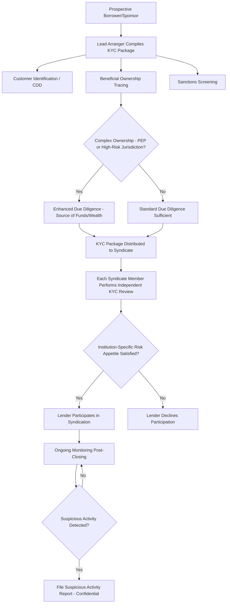

## Anti-Money Laundering and Know-Your-Customer Requirements in Syndication

### Overview

Anti-Money Laundering (AML) and Know-Your-Customer (KYC) requirements impose a compliance layer on syndicated lending that is distinct from credit risk analysis: arrangers and lenders must verify borrower and guarantor identity, understand beneficial ownership, screen against sanctions lists, and monitor for suspicious activity before and during the life of a facility. In syndication specifically, these obligations are complicated by the multi-lender structure — each participating institution generally bears independent regulatory responsibility for its own AML/KYC compliance, even though the lead arranger typically coordinates a shared diligence package to avoid duplicative borrower burden.

### Regulatory Foundations

**Key Points**

- In the U.S., the **Bank Secrecy Act (BSA)** as amended by the **USA PATRIOT Act** and the **Anti-Money Laundering Act of 2020** establishes core AML obligations, including customer identification and beneficial ownership rules administered by **FinCEN** (Financial Crimes Enforcement Network).
- In the EU, the **Anti-Money Laundering Directives (AMLD)**, currently in a multi-generation series (with a transition toward a unified EU AML regulation and a new EU AML Authority — AMLA — underway), set harmonized minimum standards that member states transpose into national law.
- The **Financial Action Task Force (FATF)** sets international standards (the "FATF Recommendations") that most national AML frameworks are built to align with, and FATF's list of jurisdictions with strategic AML deficiencies affects due diligence intensity for counterparties connected to those jurisdictions.
- [Unverified: specific regulatory citations, thresholds, and the EU AMLA's implementation timeline are subject to ongoing legislative and rulemaking change; practitioners should confirm current text against the applicable jurisdiction's regulator.]

### Core Components of AML/KYC in a Syndicated Transaction

#### 1. Customer Identification Program (CIP) / Customer Due Diligence (CDD)

Each lending institution must verify the identity of the borrower entity (and often key guarantors) using reliable, independent documentation — certificates of incorporation, government-issued identification for authorized signatories, and registered address verification.

#### 2. Beneficial Ownership Identification

- Regulations generally require identifying **natural persons who own or control 25% or more** of a legal entity customer (thresholds vary by jurisdiction), plus at least one individual with significant managerial control, even where that person holds no direct ownership stake.
- This is particularly complex in **sponsor-owned borrowers**, where multiple layers of holding companies, fund vehicles, and general partner/limited partner structures sit between the operating borrower and the ultimate natural-person beneficial owners, often requiring the arranger to trace ownership through fund structures to identify controlling persons at the sponsor level.
- Increasingly, **beneficial ownership registries** (e.g., the UK's Persons with Significant Control register, the EU's national beneficial ownership registers, and the U.S. FinCEN beneficial ownership reporting regime under the Corporate Transparency Act) provide a data source, though registry completeness and reliability vary by jurisdiction. [Inference: the operative status and reporting scope of newer registries, such as the U.S. Corporate Transparency Act regime, has been subject to legal challenges and regulatory adjustments, so current applicability should be verified.]

#### 3. Sanctions Screening

- Borrowers, guarantors, beneficial owners, and (in some structures) key counterparties must be screened against applicable sanctions lists — e.g., **OFAC's Specially Designated Nationals (SDN) List** in the U.S., **EU/UK consolidated sanctions lists**, and relevant UN Security Council sanctions.
- Syndicated credit agreements typically include **sanctions representations and covenants**, obligating the borrower to represent it is not a sanctioned person and covenant that loan proceeds will not be used in violation of applicable sanctions laws (including, in cross-border deals, addressing potentially divergent sanctions regimes across lender jurisdictions — a point of real negotiating friction, for example, where U.S. and EU sanctions programs diverge on a specific country or sector).
- Ongoing screening (not just at closing) is generally expected, since sanctions designations can be added at any time during a facility's multi-year life.

#### 4. Enhanced Due Diligence (EDD)

Higher-risk borrower profiles — those involving **Politically Exposed Persons (PEPs)**, complex offshore ownership structures, operations in high-risk jurisdictions, or cash-intensive industries — trigger enhanced diligence procedures beyond standard CDD, potentially including source-of-wealth and source-of-funds verification for key beneficial owners.

#### 5. Ongoing Monitoring and Suspicious Activity Reporting

Institutions are expected to monitor account activity and drawdowns for patterns inconsistent with the stated purpose of the facility, with obligations to file **Suspicious Activity Reports (SARs)** (U.S. terminology; comparable regimes exist elsewhere, e.g., Suspicious Transaction Reports) where warranted, generally under strict confidentiality ("tipping-off" prohibition) rules preventing disclosure of a filed report to the subject.

### Coordination Challenges Specific to Syndication

**Key Points**

- **Reliance vs. Independent Diligence**: while the lead arranger typically compiles a KYC information package (corporate documents, beneficial ownership charts, sanctions screening results) for syndicate members' convenience, most regulatory frameworks do not permit a participating lender to fully outsource its own AML/KYC obligation to the arranger — each institution generally remains independently responsible for satisfying its own regulator's requirements, though the extent of permissible reliance on another institution's diligence varies by jurisdiction and internal policy. [Inference: the specific degree of permissible reliance is governed by jurisdiction-specific rules and each institution's internal compliance policy, and is not uniform across the market.]
- **Timing Friction**: syndicate members joining post-signing (in an assignment or trading context) must complete their own KYC before funding or taking assignment, which can slow secondary trading of syndicated positions if the borrower's KYC file is incomplete or outdated — a recurring operational friction point the LSTA and LMA have both addressed through standardized KYC information-sharing protocols.
- **Confidentiality Tension**: sharing detailed beneficial ownership and diligence information across a large syndicate must be balanced against the borrower's confidentiality interests, typically managed through confidentiality agreements and controlled information-sharing platforms.
- **New Money vs. Amendments**: even amendments, extensions, or repricings of an existing facility can trigger a fresh KYC refresh requirement under a "periodic review" or "trigger event" policy, particularly if there has been a change in beneficial ownership or a significant time lapse since the last review.

### Example: AML/KYC Diligence in a Sponsor-Led Syndication

**Example**

A private equity sponsor based in a jurisdiction with a well-established regulatory regime is acquiring a target company through a newly formed holding company structure involving a Cayman Islands fund vehicle, a Luxembourg intermediate holding company, and an operating company borrower. The lead arranger's compliance team must trace beneficial ownership through the fund's general partner to identify the natural persons with ultimate control (commonly the fund's senior investment professionals with decision-making authority), verify the fund's institutional limited partners are not subject to sanctions, and confirm the Luxembourg entity's registered beneficial ownership filing is current. Given the multi-layered offshore structure, the transaction is flagged for enhanced due diligence, requiring source-of-funds documentation for the equity contribution before the arranger will finalize the KYC package it distributes to prospective syndicate lenders. Several prospective lenders with more conservative internal risk appetites decline to participate specifically due to the offshore structure complexity, despite no adverse findings, illustrating how AML/KYC friction can independently affect syndication outcomes apart from credit quality.

### Diagram: AML/KYC Workflow in Syndication

### Diagram: Beneficial Ownership Tracing Through a Fund Structure (svg_diagram)

<svg xmlns="http://www.w3.org/2000/svg" viewBox="0 0 800 340">
<text x="400" y="24" text-anchor="middle" font-size="16" font-weight="bold" fill="#1a1a1a">Beneficial Ownership Tracing (svg_diagram)</text>
<rect x="320" y="50" width="160" height="50" rx="6" fill="#e2e8f0" stroke="#4a5568" />
<text x="400" y="80" text-anchor="middle" font-size="12" fill="#1a202c">Operating Borrower</text>
<line x1="400" y1="100" x2="400" y2="140" stroke="#333" stroke-width="1.5" />
<rect x="320" y="140" width="160" height="50" rx="6" fill="#bee3f8" stroke="#2b6cb0" />
<text x="400" y="170" text-anchor="middle" font-size="12" fill="#1a365d">Intermediate Holdco</text>
<line x1="400" y1="190" x2="400" y2="230" stroke="#333" stroke-width="1.5" />
<rect x="320" y="230" width="160" height="50" rx="6" fill="#fed7d7" stroke="#c53030" />
<text x="400" y="260" text-anchor="middle" font-size="12" fill="#742a2a">Fund Vehicle (LP)</text>
<line x1="400" y1="280" x2="250" y2="310" stroke="#333" stroke-width="1.5" />
<line x1="400" y1="280" x2="550" y2="310" stroke="#333" stroke-width="1.5" />
<rect x="150" y="310" width="200" height="25" rx="4" fill="#c6f6d5" stroke="#2f855a" />
<text x="250" y="327" text-anchor="middle" font-size="11" fill="#22543d">General Partner - Natural Persons</text>
<rect x="450" y="310" width="200" height="25" rx="4" fill="#faf089" stroke="#b7791f" />
<text x="550" y="327" text-anchor="middle" font-size="11" fill="#744210">Limited Partners - Sanctions Screen</text>
</svg>

### Documentation Provisions Reflecting AML/KYC Requirements

**Key Points**

- **"Know Your Customer" Information Undertaking**: many LMA/LSTA-style credit agreements include an express borrower covenant to provide reasonably requested KYC information to any lender or prospective assignee, facilitating secondary market liquidity.
- **Sanctions Representations, Warranties, and Undertakings**: standard clauses covering the borrower's, its subsidiaries', and (in some forms) its directors' sanctioned-person status, and restrictions on use of proceeds in sanctioned jurisdictions or with sanctioned counterparties.
- **Anti-Corruption Representations**: increasingly paired with AML provisions, addressing compliance with anti-bribery laws such as the U.S. Foreign Corrupt Practices Act (FCPA) and the UK Bribery Act, particularly relevant for borrowers with cross-border operations in higher-corruption-risk markets.
- **Assignment/Transfer KYC Conditions**: credit agreements typically condition a proposed assignment or transfer on the new lender's ability to satisfy KYC requirements, sometimes with a defined cure period, to avoid indefinitely blocking secondary trading over documentation delays.

### Common Pitfalls

- Assuming the lead arranger's KYC diligence satisfies a participating lender's independent regulatory obligation without confirming the applicable reliance framework permits this.
- Underestimating the time required to trace beneficial ownership through multi-layered fund and holding structures, causing syndication timeline delays late in the process.
- Treating sanctions screening as a one-time, closing-date exercise rather than an ongoing obligation across the life of the facility.
- Overlooking divergence between sanctions regimes (e.g., U.S. vs. EU/UK) in cross-border syndicates, leading to drafting gaps in sanctions covenants that do not adequately address all participating lenders' regulatory exposure.
- Failing to build KYC refresh triggers into amendment and extension processes, treating them as purely commercial/legal exercises without a compliance re-check.

### Related Topics

**Related Topics**

- Sanctions Compliance Programs and OFAC Screening Methodologies
- Beneficial Ownership Rules for Private Equity Fund Structures
- LSTA/LMA Standardized KYC Utility and Information-Sharing Protocols
- Anti-Corruption Due Diligence (FCPA, UK Bribery Act) in Cross-Border Lending
- Secondary Loan Trading Settlement and KYC-Related Assignment Delays
- Politically Exposed Persons (PEP) Screening and Enhanced Due Diligence Triggers