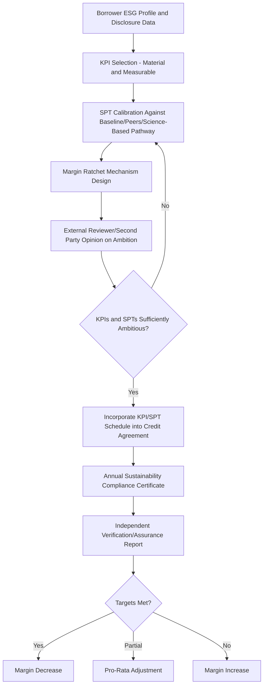

## Climate and ESG Disclosure Requirements in Loan Documentation

### Overview

Climate and ESG (Environmental, Social, and Governance) disclosure requirements in loan documentation refer to the growing set of reporting obligations, covenants, and pricing mechanisms embedded in syndicated credit agreements that link a borrower's environmental and sustainability performance to disclosure duties and, in many cases, to the cost of credit itself. This area sits at the intersection of financial regulation (mandatory corporate climate disclosure regimes), voluntary market standards (loan market association principles), and contractual innovation (sustainability-linked pricing mechanisms), and it has become a standard consideration in structuring large syndicated facilities, particularly for borrowers with material environmental exposure or public ESG commitments.

### Regulatory Disclosure Regimes Feeding Into Loan Documentation

**Key Points**

- **EU Corporate Sustainability Reporting Directive (CSRD)**: requires in-scope EU (and certain non-EU) companies to report under the **European Sustainability Reporting Standards (ESRS)**, covering environmental, social, and governance metrics in far greater detail than prior frameworks, with phased-in application by company size and listing status.
- **EU Taxonomy Regulation**: establishes a classification system for environmentally sustainable economic activities, increasingly referenced in sustainability-linked loan structures to define what counts as a "green" or "taxonomy-aligned" use of proceeds or activity.
- **U.S. SEC Climate Disclosure Rules**: SEC rulemaking on climate-related disclosure for public companies has proceeded through a contested and evolving process, including litigation and subsequent regulatory reconsideration. [Unverified: the current status, scope, and enforcement posture of SEC climate disclosure requirements should be confirmed directly against the SEC's latest public statements, given the rule's litigation history and potential for further change.]
- **Task Force on Climate-related Financial Disclosures (TCFD)** framework: though the TCFD body itself has been formally disbanded with its monitoring role transferred, its four-pillar framework (governance, strategy, risk management, metrics and targets) remains the structural template embedded in many current disclosure regimes, including aspects of CSRD/ESRS.
- Divergence across these regimes means a multinational borrower's disclosure obligations, and therefore the baseline data available to support loan-level ESG covenants, can differ substantially depending on where the borrower is headquartered, listed, or operates. [Inference: given the pace of regulatory change in this area, practitioners should verify the current status of any specific regime cited here before relying on it in transaction documentation.]

### Loan Market Association Principles for Sustainable Lending

#### Sustainability-Linked Loan Principles (SLLP)

Jointly developed by the LMA, LSTA, and APLMA, these principles establish a voluntary framework built around five core components:

1. **Selection of Key Performance Indicators (KPIs)**: material, core, and measurable ESG metrics relevant to the borrower's business (e.g., greenhouse gas emissions intensity, renewable energy usage, diversity metrics).
2. **Calibration of Sustainability Performance Targets (SPTs)**: ambitious, meaningful targets benchmarked against the borrower's historical performance, industry peers, or science-based pathways.
3. **Loan Characteristics**: the margin/pricing mechanism linking KPI performance to interest rate adjustment.
4. **Reporting**: borrower obligations to report KPI performance at least annually.
5. **Verification**: independent external verification of the borrower's performance against SPTs, typically at least annually.

#### Green Loan Principles (GLP) and Social Loan Principles (SLP)

Distinguished from sustainability-linked loans by focusing on **use of proceeds**: a Green Loan or Social Loan's proceeds must be exclusively applied to specified eligible green or social projects, with the loan agreement typically incorporating four components analogous to the Green Bond Principles: use of proceeds, process for project evaluation and selection, management of proceeds, and reporting.

### Contractual Mechanics: Sustainability-Linked Pricing

#### Margin Ratchet Formula

$$\text{Applicable Margin} = \text{Base Margin} \pm \Delta_{ESG}$$

where $\Delta_{ESG}$ is a margin adjustment (commonly in the range of a few basis points per KPI, though exact calibration varies widely by deal) applied based on whether the borrower meets, exceeds, or misses its Sustainability Performance Targets, measured against an annual test date.

#### Multi-KPI Weighted Structures

For facilities with multiple KPIs, the aggregate adjustment is often a weighted sum:

$$\Delta_{ESG} = \sum_{i=1}^{n} w_i \times \delta_i$$

where $w_i$ is the weight assigned to KPI $i$ and $\delta_i$ is the margin adjustment triggered by performance against that specific KPI's target, subject to a specified cap on the total possible adjustment in either direction.

### Documentation Provisions

**Key Points**

- **KPI and SPT Schedule**: a dedicated schedule to the credit agreement defining each KPI's calculation methodology, baseline, and annual targets through the facility's tenor.
- **Sustainability Compliance Certificate**: delivered alongside (or as an addition to) the standard compliance certificate, certifying KPI performance for the relevant test period, often accompanied by the external verifier's assurance report.
- **Verification/Assurance Provisions**: specify the required standard of assurance (e.g., limited assurance under ISAE 3000) and the consequence of a borrower's failure to obtain timely verification — commonly resulting in the margin defaulting to the "no adjustment" or a specified "penalty" position for that period rather than triggering an event of default.
- **Restatement and Recalibration Mechanics**: provisions addressing what happens if a KPI's underlying methodology changes (e.g., due to accounting standard changes) or if SPTs need recalibration following a material acquisition or divestiture that changes the borrower's baseline.
- **"Sleeping" or Optional SLL Features**: some facilities are structured to allow ESG-linked pricing features to be added post-signing via an amendment mechanism, rather than negotiating full KPI/SPT frameworks before closing, to avoid delaying the underwriting timeline.

### Greenwashing Risk and Market Integrity Concerns

**Key Points**

- **Greenwashing risk** — the concern that a sustainability-linked or green loan label overstates genuine environmental benefit — has drawn increasing regulatory and market scrutiny, and has influenced tightening of KPI materiality and ambition standards under successive updates to the LMA/LSTA/APLMA principles.
- Regulators and market participants have raised concerns about **immaterial or already-achieved KPIs** being used to obtain a favorable "sustainability-linked" label without meaningful behavioral change, prompting external reviewers and lenders to scrutinize target ambition more closely during structuring.
- Litigation and reputational risk associated with overstated sustainability claims (in lending and more broadly in ESG-labeled finance) is a live and evolving area; specific case outcomes and regulatory enforcement actions should be checked against current sources given the fast-moving nature of this risk. [Unverified: greenwashing-related enforcement and litigation trends change frequently and should be verified against current reporting rather than assumed static.]

### Example: Structuring an ESG-Linked Margin Ratchet

**Example**

A manufacturing borrower negotiates a $800M revolving credit facility with a sustainability-linked margin mechanism tied to two KPIs: (1) Scope 1 and 2 greenhouse gas emissions intensity per unit of production, weighted 60%, and (2) percentage of suppliers audited under a responsible sourcing program, weighted 40%. The credit agreement specifies annual SPTs declining emissions intensity by a defined percentage each year through maturity, verified by an independent third-party assurance provider under a limited assurance standard. Meeting both targets in a given year reduces the margin by 5 basis points; missing both increases it by 5 basis points; partial achievement results in a pro-rata adjustment within a capped ±7.5 basis point band. The lead arranger's ESG diligence team reviews the KPI calibration against the borrower's historical emissions trajectory and industry decarbonization pathways before syndication to mitigate greenwashing risk that could affect the deal's marketability to ESG-mandated institutional lenders.

### Diagram: Sustainability-Linked Loan Structuring Process

### Diagram: Regulatory Disclosure Regimes Feeding Loan-Level ESG Data (svg_diagram)

<svg xmlns="http://www.w3.org/2000/svg" viewBox="0 0 800 300">
<text x="400" y="24" text-anchor="middle" font-size="16" font-weight="bold" fill="#1a1a1a">ESG Disclosure Data Flow into Loan Terms (svg_diagram)</text>
<rect x="40" y="60" width="200" height="60" rx="6" fill="#bee3f8" stroke="#2b6cb0" />
<text x="140" y="85" text-anchor="middle" font-size="12" fill="#1a365d">EU CSRD/ESRS Reporting</text>
<text x="140" y="103" text-anchor="middle" font-size="11" fill="#1a365d">Corporate-Level Disclosure</text>
<rect x="300" y="60" width="200" height="60" rx="6" fill="#fed7d7" stroke="#c53030" />
<text x="400" y="85" text-anchor="middle" font-size="12" fill="#742a2a">EU Taxonomy Alignment</text>
<text x="400" y="103" text-anchor="middle" font-size="11" fill="#742a2a">Activity Classification</text>
<rect x="560" y="60" width="200" height="60" rx="6" fill="#c6f6d5" stroke="#2f855a" />
<text x="660" y="85" text-anchor="middle" font-size="12" fill="#22543d">National/SEC Climate Rules</text>
<text x="660" y="103" text-anchor="middle" font-size="11" fill="#22543d">Jurisdiction-Specific</text>
<line x1="140" y1="120" x2="400" y2="180" stroke="#333" stroke-width="1.5" />
<line x1="400" y1="120" x2="400" y2="180" stroke="#333" stroke-width="1.5" />
<line x1="660" y1="120" x2="400" y2="180" stroke="#333" stroke-width="1.5" />
<rect x="280" y="180" width="240" height="60" rx="6" fill="#faf089" stroke="#b7791f" />
<text x="400" y="205" text-anchor="middle" font-size="12" fill="#744210">Loan-Level KPI Selection</text>
<text x="400" y="223" text-anchor="middle" font-size="11" fill="#744210">and SPT Calibration</text>
<line x1="400" y1="240" x2="400" y2="260" stroke="#333" stroke-width="1.5" />
<text x="400" y="278" text-anchor="middle" font-size="12" fill="#1a1a1a">Credit Agreement ESG Schedule</text>
</svg>

### Interaction With Syndication Strategy

**Key Points**

- ESG-mandated institutional lenders (certain pension funds, insurance companies, and dedicated sustainable finance funds) may have investment mandates requiring a minimum proportion of green, social, or sustainability-linked assets, making a credible ESG structure a genuine driver of demand and pricing tension in syndication, not merely a compliance add-on.
- Conversely, poorly calibrated or perceived "greenwashed" KPIs can deter ESG-focused lenders from participating, or invite reputational scrutiny of the arranger's own sustainable finance credentials, creating a market-integrity incentive for rigorous KPI design independent of regulatory mandate.
- Documentation must reconcile potentially differing ESG data standards or reporting calendars used by lenders headquartered in different jurisdictions, particularly in cross-border syndicates spanning EU (CSRD-driven) and non-EU lenders with different disclosure baselines.

### Common Pitfalls

- Selecting KPIs that are immaterial to the borrower's core business or already substantially achieved at signing, exposing the deal to greenwashing criticism.
- Failing to specify a clear methodology and fallback (e.g., defaulting to "no adjustment") if a borrower fails to deliver timely third-party verification.
- Treating regulatory disclosure regimes (e.g., CSRD, SEC rules) as static; several are subject to phased implementation, legal challenge, or political revision, and structuring should not assume permanence of the current rule text without verification.
- Overlooking recalibration mechanics for SPTs following a material M&A event that changes the borrower's emissions or operational baseline, leaving targets either trivially easy or unachievable.
- Assuming use-of-proceeds green loan structures and margin-ratchet sustainability-linked loans are interchangeable; they serve different purposes and carry different reporting/verification architectures.

### Related Topics

**Related Topics**

- Green Bond Principles and Their Relationship to Green Loan Structures
- Second Party Opinion Providers and External Review Standards for Sustainable Finance
- EU Taxonomy Technical Screening Criteria and Its Application to Corporate Lending
- Science-Based Targets initiative (SBTi) Methodology for Calibrating Emissions KPIs
- Greenwashing Litigation and Regulatory Enforcement Trends in Sustainable Finance
- ESG Data Standardization Challenges Across Cross-Border Syndicates